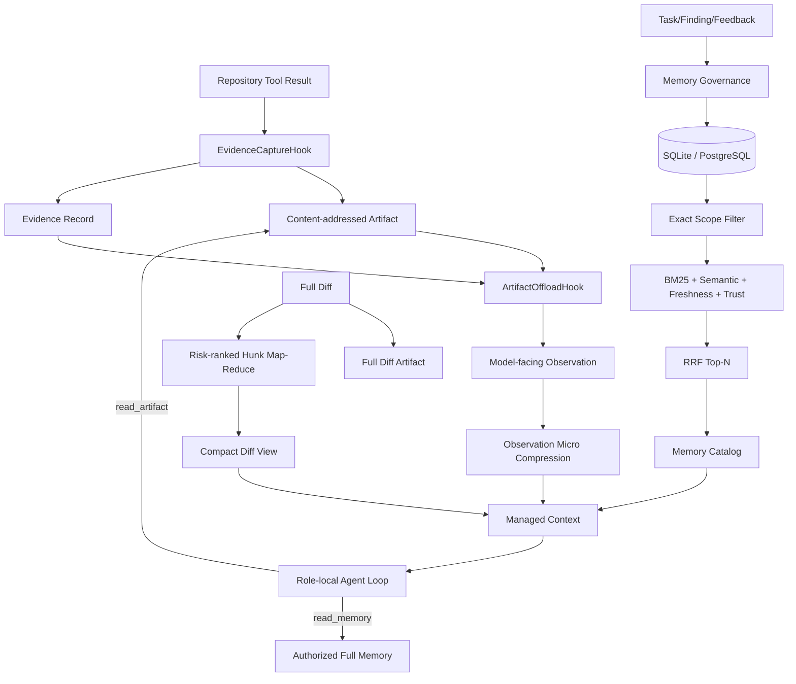

# EvoAgent 上下文压缩与 Memory 管理优化后完整说明

> 优化方向：四方向计划中的第二项——上下文压缩与 Memory 管理  
> 实施状态：已实现、已测试、已完成 SQLite/PostgreSQL 迁移验证  
> 完成日期：2026-08-30  
> 适用版本：Runtime Harness v2 + Context/Memory v2

## 1. 优化结论

本次改造没有把 Context 压缩简单理解为“截断字符串”，也没有把 Memory 简化为“把历史对话存入数据库”。优化后的链路把三类数据明确分开：

- **Artifact** 保存不可损的大结果和原始内容；
- **Evidence** 保存路径、Added Line、哈希、工具和来源等事实引用；
- **Context** 只负责为当前模型调用组织有预算的视图；
- **Memory** 只保存可治理、可验证、可淘汰的跨步骤或跨任务经验。

已经完成以下能力：

1. Tool Result 在模型可见的截断或摘要之前持久化为内容寻址 Artifact，并生成结构化 Evidence Record。
2. 建立“Artifact 卸载 → 风险确定性裁剪 → Observation 微压缩 → 可选模型摘要”的四级压缩顺序。
3. Evidence ID、Artifact URI、SHA-256、路径和 Added Line 在压缩过程中不可被自然语言摘要替换。
4. Memory 增加状态、版本、来源证据、冲突、替代关系、正负反馈、使用次数和过期信息。
5. Memory 检索升级为租户/仓库精确过滤后的 BM25、语义重合、重要度、时效、反馈可信度与 RRF 融合排序。
6. 默认只向 Agent 注入 Memory Catalog；Agent 明确调用 `read_memory` 或 `read_artifact` 时才读取全文。
7. 增加 Full/Compact Context 成对评测与 Memory 检索评测脚本，输出可复现 JSON 报告。

## 2. 改造前的问题

原项目已经具备风险排序 Diff Map-Reduce、旧 Observation 摘要、Working/Episodic/Semantic/Procedural 四种 scope 和租户/仓库隔离，但仍有以下工程缺口：

| 问题 | 原有表现 | 风险 |
|---|---|---|
| Evidence 与自然语言结果未完全分层 | Observation 摘要保留 `evidence_id`，但没有统一 Artifact、路径和哈希记录 | 摘要后无法独立证明原始工具结果没有变化 |
| Memory 没有生命周期 | 记录写入后主要依赖 importance 和 TTL | 错误反馈、冲突知识和过时知识可能继续参与召回 |
| 检索策略单一 | 关键词覆盖率、特异度、重要度加权 | 对路径、CWE、规则名和自然语言混合查询的稳定性不足 |
| 注入粒度偏大 | 默认向上下文注入最多 1200 字符 Memory 内容 | 召回条目较多时占用 Token，且缺少按需读取 |
| 压缩效果缺少独立门禁 | 有单元测试，但没有 Full/Compact 成对报告 | 无法回答 Token 降幅、关键证据保真和本地耗时 |
| 存储并发控制不足 | Memory 记录没有显式 version | 并发审批、反馈和晋升时可能覆盖新状态 |

## 3. 优化后架构



关键原则：

- 原始证据先保存，后压缩；
- 摘要可以丢弃表述，不能丢弃 Evidence/Artifact 引用；
- Memory 是不可信历史数据，不能改变系统权限；
- 检索先做 tenant、repository、scope、status 精确过滤，再做相关性排序；
- 终态 Memory 不参与召回；
- 模型摘要是最后一级且默认关闭，只允许处理对话性 prose。

## 4. Evidence 不可损层

### 4.1 Evidence Record

新增 `evoagent/runtime/evidence.py`，每条可作为事实依据的 Tool Result 都可以形成以下记录：

```json
{
  "evidence_id": "ev-4c9c...",
  "artifact_ref": "artifact://9e12...",
  "artifact_sha256": "...",
  "path": "src/auth.py",
  "added_lines": [72, 79],
  "excerpt_hash": "...",
  "tool": "changed_line",
  "created_by": "security",
  "verified_by": [],
  "source_evidence_id": "changed_line:legacy-id",
  "integrity": "content-addressed"
}
```

字段职责：

- `artifact_ref` 指向不可损原始工具输入和结果；
- `artifact_sha256` 用于验证 Artifact 内容完整性；
- `excerpt_hash` 验证工具输出没有被重写；
- `path` 和 `added_lines` 用于与当前 Diff 重新匹配；
- `source_evidence_id` 保留升级前工具生成的 Evidence ID，便于兼容追踪；
- `created_by` 和 `verified_by` 区分证据生产者与验证者。

### 4.2 Hook 顺序

Runtime 的 `TOOL_AFTER` Hook 顺序为：

```text
Tool Handler
  → EvidenceCaptureHook（priority 150）
  → ArtifactOffloadHook（priority 200）
  → Agent Observation
```

这保证长结果在被替换成 Preview/Handle 之前已经保存原文。`EvidenceCaptureHook` 仅处理带 `evidence_id` 的事实型 Tool Result；`read_memory` 和 `read_artifact` 不会再次递归生成 Evidence Artifact。

### 4.3 Evidence 验证

`EvidenceStore.verify()` 执行三类检查：

1. Artifact Store 中的 SHA-256 与 Evidence Record 一致；
2. 重新读取的原始 Tool Result 与 `excerpt_hash` 一致；
3. 当 Evidence 包含路径和 Added Line 时，重新解析当前 Diff 并检查位置仍然合法。

Goal Gate 对新式 Evidence Ref 额外检查 Artifact URI、SHA-256、excerpt hash 和 Finding 位置一致性。旧式 Local Rule Evidence 继续兼容，但不会伪装成新式不可损 Evidence。

## 5. 四级上下文压缩

### 5.1 第一级：Artifact 卸载

以下内容超过阈值时只向模型返回 Preview、URI、SHA-256 和大小：

- Tool Result；
- 测试日志；
- 大型检索结果；
- Full Diff。

默认阈值由以下环境变量控制：

```dotenv
EVOAGENT_RUNTIME_ARTIFACT_THRESHOLD_BYTES=32768
```

同一任务、同一内容的 Artifact ID 由内容哈希确定，重复压缩不会生成不同副本。

### 5.2 第二级：确定性风险裁剪

保留原有 Hunk Map-Reduce，并增强为 Artifact 可回读的 `semantic-diff-v1`：

- 对敏感路径、角色关注文件、危险 API、认证、密钥、注入、并发、异常和依赖变更进行评分；
- 高风险 Hunk 优先保留完整内容；
- 超大 Hunk 保留危险 Added Line 及附近上下文；
- 未入选 Hunk 只保留结构化摘要；
- `source_sha256` 和 Full Diff Artifact 允许后续复核原文。

### 5.3 第三级：Observation 微压缩

压缩旧 Observation 时保留：

- step、tool、执行结果和错误；
- `evidence_id`；
- 完整 Evidence Ref 列表；
- Artifact Ref、SHA-256、大小和 Preview；
- 输出对象的 shape 和少量 salient text。

最近 Observation 优先保留；只有所有 Observation 都已摘要后仍超预算，才从最旧记录开始丢弃。即使记录被丢弃，Rollup 也明确记录丢弃数量。

### 5.4 第四级：可选模型摘要

当前三层仍无法满足输入预算，且显式启用以下配置时，Context Manager 才调用模型摘要：

```dotenv
EVOAGENT_CONTEXT_MODEL_SUMMARY_ENABLED=false
```

默认关闭，原因是模型摘要会增加一次模型调用、费用和延迟。启用后也只向摘要模型发送 `conversation`、`instruction`、`objective`、`lead_feedback`、`summary` 等对话性文本。以下内容不会发送给摘要模型：

- Diff 与代码；
- Evidence/Artifact；
- 路径和行号；
- Finding、CWE、规则和 Gate 结果；
- 工具权限和系统规则。

摘要结果会与确定性的结构 Manifest、Evidence/Artifact 引用重新组合；模型不能生成或修改事实引用。

### 5.5 Token 预算

模型可见的 Context Policy 显式记录预算建议：

| 分类 | 默认比例 |
|---|---:|
| 系统规则 | 15% |
| 任务与 Diff | 45% |
| Tool Observation | 20% |
| Memory | 10% |
| 输出预留 | 10% |

实际硬限制仍由 `EVOAGENT_AGENT_CONTEXT_INPUT_TOKENS`、Diff Budget、Observation Budget 和模型窗口共同决定，不允许比例之和突破上下文窗口。

## 6. Memory 生命周期治理

### 6.1 状态机

```text
PROVISIONAL
  ├─→ VERIFIED ─→ PROMOTED
  ├─→ REJECTED      ├─→ REJECTED
  └─→ EXPIRED       ├─→ SUPERSEDED
                    └─→ EXPIRED

VERIFIED ─→ REJECTED / SUPERSEDED / EXPIRED
REJECTED / SUPERSEDED / EXPIRED 为终态
```

含义：

- `PROVISIONAL`：刚写入的 Working Observation 或人工反馈候选；
- `VERIFIED`：已由 Gate、规则或人工确认，可以参与普通召回；
- `PROMOTED`：多次独立成功且有来源证据的稳定经验；
- `REJECTED`：被反证或审查拒绝；
- `SUPERSEDED`：被更新记录替代；
- `EXPIRED`：超过生命周期。

Working Memory 到期后物理清理；非 Working Memory 到期后保留记录并进入 `EXPIRED`，便于审计。

### 6.2 晋升门禁

从 `VERIFIED` 晋升为 `PROMOTED` 必须同时满足：

- 至少两次成功使用；
- 负反馈计数为 0；
- 存在 `source_evidence`，或元数据包含明确的人工验证；
- 使用调用者提供的 `expected_version` 通过乐观锁。

一次明确反证可直接将 `VERIFIED` 或 `PROMOTED` 记录冻结为 `REJECTED`。状态变化保存 actor、reason 和最近 50 条 lifecycle history。

### 6.3 冲突与替代

冲突记录不覆盖旧内容，而是使用：

- `conflicts_with`：记录互相冲突的 Memory ID；
- `supersedes`：记录当前 Memory 替代的旧版本；
- `version`：每次状态或治理字段更新递增；
- `content_sha256`：证明内容没有在状态变更时被隐式改写。

跨 tenant 或 repository 的 Memory 禁止建立冲突或替代关系。

### 6.4 数据库字段

SQLite 和 PostgreSQL 的 `agent_memories` 均已增加：

```text
status
version
content_sha256
source_evidence_json
supersedes
conflicts_json
success_count
failure_count
use_count
last_used_at
updated_at
```

旧数据库启动时自动执行兼容迁移；旧 Memory 默认解释为 `VERIFIED`，不会因升级突然消失。

## 7. 混合检索与渐进披露

### 7.1 检索步骤

```text
tenant + repository + scope 精确过滤
        ↓
排除 REJECTED / SUPERSEDED / EXPIRED
        ↓
BM25：路径、CWE、规则名、错误字符串
        +
Token overlap + importance + freshness
        +
Memory status + 成功/失败反馈可信度
        ↓
RRF 融合
        ↓
Top-N Memory Catalog
```

Embedding Scorer 作为可插拔接口存在，但第一阶段没有引入 Milvus 或独立向量数据库。当前默认方案零新增运行依赖，适合项目规模，也便于确定性测试。

### 7.2 渐进披露

默认 Context 只包含：

```json
{
  "memory_id": "...",
  "memory_ref": "memory://...",
  "scope": "semantic",
  "kind": "confirmed_rule",
  "status": "PROMOTED",
  "content": "320 字符以内预览",
  "content_sha256": "...",
  "source_evidence": ["ev-..."],
  "recall_score": 0.03
}
```

角色 Tool Registry 动态增加两个只读工具：

- `read_memory(memory_id)`：只允许读取当前 task 所属 tenant/repository 的完整 Memory；
- `read_artifact(artifact_ref)`：只允许读取当前 tenant 的完整 Artifact，并验证 SHA-256。

这两个工具的权限由闭包绑定到当前任务，模型不能通过参数切换 tenant 或 repository。

## 8. 可观测指标

新增 Prometheus 计数或耗时项：

```text
evoagent_evidence_records_captured_total
evoagent_context_compression_calls_total
evoagent_context_input_estimated_tokens_total
evoagent_context_compact_estimated_tokens_total
evoagent_context_estimated_tokens_saved_total
evoagent_context_full_diff_artifacts_total
evoagent_context_observations_summarized_total
evoagent_context_observations_dropped_total
evoagent_memory_retrieval_calls_total
evoagent_memory_retrieval_candidates_total
evoagent_memory_retrieval_results_total
evoagent_memory_retrieval_seconds_sum
evoagent_memory_retrieval_seconds_count
```

任务报告中的 `context_management` 同时记录压缩调用、估算 Token、降幅、Artifact 卸载次数和 Memory recall 摘要。

## 9. 测试与量化结果

### 9.1 测试结果

执行命令：

```powershell
python -m unittest discover -s tests -v
```

结果：

```text
Ran 76 tests in 11.019s
OK
```

其中新增 4 项 Context/Memory v2 专项测试：

1. Evidence Artifact 完整性、Diff 位置验证和跨租户拒绝；
2. 四级压缩、Full Diff 卸载与 Evidence 引用保真；
3. Memory 晋升门禁、乐观锁、反证冻结、渐进披露和跨租户冲突阻断；
4. Full/Compact 成对 Token、路径召回、Evidence 召回与延迟门禁。

### 9.2 PostgreSQL 与 Docker 验证

在 Docker Compose 的 PostgreSQL 环境执行了真实迁移和 CRUD：

```text
memory_columns_ok = True
memory_column_count = 24
postgres_memory_crud_ok = True
```

服务状态：

```text
EvoAgent   Up
PostgreSQL healthy
Redis      healthy
GET /      200
```

### 9.3 受控长上下文压力基准

执行命令：

```powershell
python scripts/benchmarks/benchmark_context_memory.py
```

原始报告：[context_memory_benchmark.json](<../benchmarks/context_memory_benchmark.json>)

基准使用 `data/benchmarks/pr_diff_100.jsonl`，数据集 SHA-256：

```text
e3cf61546e0f554c045a79949202532046f7e936d8bbb1e2f5d0de2b79634d74
```

方法：从受控风险样本中选择 20 个目标 PR，每个目标与 11 个干净 Diff 组合成长上下文压力样例，并加入 4 条大型 Tool Observation；每个样例重复 5 次。该方法用于测试 Context 预算与证据保真，不代表真实生产 PR 分布。

| 指标 | 实测结果 | 门禁 | 结论 |
|---|---:|---:|---|
| Full Context 估算 Token | 562,312 | 记录值 | - |
| Compact Context 估算 Token | 30,313 | 记录值 | - |
| Token 降幅 | **94.61%** | ≥30% | 通过 |
| 必需风险路径召回 | **100%** | 100% | 通过 |
| Evidence/Artifact 引用保留 | **100%** | 100% | 通过 |
| Compact 平均耗时 | **7.189 ms/样例** | 记录值 | 通过 |
| Compact P50 | **7.183 ms/样例** | 记录值 | 通过 |
| Compact 最大耗时 | **7.443 ms/样例** | 记录值 | 通过 |

94.61% 是刻意构造的长日志/大 Diff 压力场景结果，不能直接表述为所有真实 PR 都能节省 94.61% Token。小 Diff 不需要强制压缩，实际收益会随 Diff、日志长度和模型窗口变化。

### 9.4 Memory 检索基准

使用同一数据集构建 40 条受控 Memory，并对 20 个目标执行 5 轮、共 100 次查询，同时加入 exact-match 的 REJECTED 干扰项和跨租户 PROMOTED 干扰项。

| 指标 | 实测结果 | 门禁 | 结论 |
|---|---:|---:|---|
| Top-1 Accuracy | **100%** | ≥95% | 通过 |
| MRR@3 | **1.0000** | ≥0.95 | 通过 |
| 跨租户或终态泄漏 | **0** | 0 | 通过 |
| 平均检索耗时 | **5.918 ms/查询** | 记录值 | 通过 |
| P95 检索耗时 | **6.557 ms/查询** | 记录值 | 通过 |

该结果证明受控路径/CWE/规则查询和隔离门禁正常，不代表开放式自然语言生产查询已经达到 100% 准确率。真实效果仍需公共 PR 或线上反馈集验证。

## 10. 文件改造清单

| 文件 | 改造内容 |
|---|---|
| `evoagent/runtime/evidence.py` | Evidence Record、Artifact 捕获、完整性与 Diff 位置验证 |
| `evoagent/memory/context_manager.py` | 四级压缩、Full Diff Artifact、Evidence 引用保真、预算与指标 |
| `evoagent/memory/memory.py` | 生命周期字段、混合召回、渐进读取和治理入口 |
| `evoagent/memory/memory_governance.py` | 状态机、晋升门禁、反证冻结、冲突与乐观锁 |
| `evoagent/memory/memory_retrieval.py` | BM25、相关度/时效/可信度、RRF 和可选 Embedding 接口 |
| `evoagent/evaluation/compression_eval.py` | Full/Compact 成对效果与速度评测 |
| `evoagent/storage/store.py` | SQLite Memory v2 迁移、CRUD、版本更新和过期治理 |
| `evoagent/storage/postgres_store.py` | PostgreSQL 对等迁移与接口 |
| `evoagent/runtime/runtime.py` | Runtime Journal 记录 Evidence 元数据 |
| `evoagent/runtime/harness.py` | Evidence Hook 与 Artifact Store 共享 |
| `evoagent/agents/agentic_core.py` | Evidence Ref、tenant-scoped `read_memory/read_artifact` 工具 |
| `evoagent/runtime/goal_gate.py` | 新式 Evidence 的不可变字段与位置一致性校验 |
| `evoagent/core/config.py` | 可选第四级模型摘要开关 |
| `evoagent/application/service.py` | Artifact、Context、Memory 和可选摘要器装配 |
| `tests/memory/test_context_memory_v2.py` | Context/Memory v2 专项测试 |
| `scripts/benchmarks/benchmark_context_memory.py` | 可复现压力和检索基准 |

## 11. 兼容性与迁移

- 原有 `MemoryManager.remember()`、`recall()` 和 `recall_working()` 调用保持兼容；
- 旧 Memory 迁移后默认状态为 `VERIFIED`；
- 原有 Evidence ID 保存在 `source_evidence_id`；
- Local Rule 的旧式结构化 Evidence 继续由 Goal Gate 接受；
- Runtime Harness v2 的 Hook、Journal、Checkpoint、Approval、Effect Ledger 和 Goal Gate 测试全部保持通过；
- SQLite 与 PostgreSQL 使用相同逻辑字段和公开方法；
- 没有新增第三方运行依赖，也没有引入 Milvus。

## 12. 使用与验证

### 12.1 本地测试

```powershell
cd D:\PythonProject\EvoAgent
python -m unittest tests.memory.test_context_memory_v2 -v
python -m unittest discover -s tests -v
python scripts/benchmarks/benchmark_context_memory.py
```

### 12.2 Docker 启动

```powershell
docker compose up -d --no-build
docker compose ps
docker compose logs --tail 100 evoagent
```

只修改挂载的 Python/Web/Skill 文件时执行：

```powershell
docker compose restart evoagent
```

修改依赖或 Dockerfile 后才需要重新构建。

## 13. 已知边界

1. `estimate_tokens()` 是无依赖的保守估算，不是百炼/Qwen 或其他供应商的精确 tokenizer。
2. 当前受控基准验证的是压缩保真、隔离和本地开销，不是生产风险检测质量结论。
3. 默认混合检索未启用 Embedding；只有关键词覆盖不足并有真实评测收益时才建议接入。
4. 模型摘要默认关闭；启用后会增加调用、费用和延迟，必须结合固定模型重新评测。
5. Memory 正负结果可以通过治理接口记录，但“根据线上结果自动给 Memory 加成功/失败分”仍应在后续自进化治理阶段接入人工反馈和评测门禁。
6. `read_memory` 和 `read_artifact` 已完成任务级授权，但管理台尚未提供完整的 Memory 审批、冲突解决和晋升页面。
7. 受控检索集中的查询由规则名、CWE 和路径组成；开放式自然语言检索需要额外真实数据评测。

## 14. 验收矩阵

| 需求 | 证据 | 状态 |
|---|---|---|
| 大结果句柄化 | Artifact Store + Full Diff/Tool Result offload 测试 | 已完成 |
| Evidence 不可损 | Artifact SHA、excerpt hash、路径/Added Line 验证 | 已完成 |
| 四级压缩 | 三层确定性压缩 + 可选 prose-only 模型摘要 | 已完成 |
| Memory 生命周期 | 六状态、合法迁移、反证冻结、过期处理 | 已完成 |
| 来源与版本 | content SHA、source evidence、version、history | 已完成 |
| 冲突与淘汰 | conflicts/supersedes、终态过滤、Working 清理 | 已完成 |
| 混合检索 | BM25 + semantic/freshness/trust + RRF | 已完成 |
| 渐进披露 | Catalog Preview + read_memory/read_artifact | 已完成 |
| 租户与仓库隔离 | Store filter、工具闭包、跨租户专项测试 | 已完成 |
| 效果量化 | 20 Case Context 基准 + 100 Query Memory 基准 | 已完成 |
| SQLite/PostgreSQL 对等 | 单元测试 + Docker PostgreSQL schema/CRUD | 已完成 |
| 全量回归 | 76/76 tests passed | 已完成 |

## 15. 后续方向

本项完成后，下一项可以进入“自进化治理”。届时 FailureSignal、候选 Prompt/Skill 和 Shadow 评测可以直接引用本次新增的：

- 不可损 Evidence；
- Memory lifecycle 与 source evidence；
- 版本与乐观锁；
- 检索命中和使用反馈；
- Context Token/延迟指标；
- Full/Compact 成对评测框架。

这样自进化生成器只能基于经过治理的数据形成候选，而不能把一次未验证的 Observation 直接晋升为长期规则。
