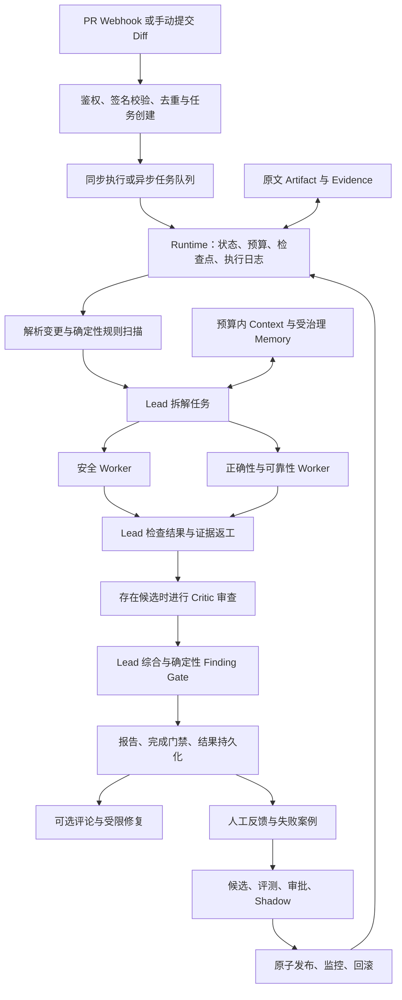

# EvoAgent 面试准备手册：从简历出发讲清设计、实验与边界

编写日期：2026-09-26；最近补充：2026-09-28。面向用户提供的简历截图，结合当前项目源码、优化文档、历史测试记录、本地基准报告及《通用_项目面试提问框架与准备指南》编写。

## 阅读方法与事实口径

这份材料按面试官看简历的顺序组织，不按源码目录讲课。正文回答使用口语和专业名词，不要求背代码变量、函数名或接口路径。文末的证据索引供复习核查，不属于现场口述。

建议分三次练习：先练四分钟总述和四条三分钟贡献，再练各个一分钟卡片，最后由同伴连续追问三轮。每轮回答遵循“先给结论，再解释机制，举一个例子，最后交代验证边界”。问什么就答什么，不一次性倾倒整章内容。

时长按每分钟约 200—260 个汉字、穿插专业名词和自然停顿估算，并非计时实测。长稿可按段落停顿，卡片的追问不计入一分钟主答。正式面试前应录音，根据自己的语速删减。

全书可按标题导航：第一章四分钟总述，第二章架构，第三至六章四条贡献，第七章项目简介逐句解释，第八章参数，第九章评测消融，第十章开发问题，第十一章技术栈，第十二章延伸基础，第十三章数据与功能，第十四章高压追问，第十五章速记。第十六章按真实面试流程补齐全貌、选型、异常与工程化，第十七章提供项目难点与复盘长话术，第十八章提供继续优化与两周计划，第十九章提供完整追问树。附录 A—D 提供逐句覆盖、证据索引、通用框架映射及十二题速答；附录 E—F 收录项目文档第二十、二十一部分的全部 69 组 QA；附录 E 第 29 题补充完整请求链路的长版、速答与三轮追问。

**评测专题重点阅读：** 第 9.5—9.8 节详细解释评测集制作、样本组成、分区和计分；第 9.9—9.11 节逐项解释当前简历的 200 次重放、84.2%→94.7% 和引用保留率 100%；第 9.12—9.18 节补充压缩、F1、Memory、自进化、性能与复现口径。每节提供可直接口述的完整段落。

**项目身份已由本人确认：这是个人独立完成项目。** 本文统一采用“我设计、我实现、我验证”的口吻，覆盖需求定义、架构、后端、管理台、测试、评测与部署；不再假设存在团队分工或只负责局部模块。早期版本与后续优化都属于同一项目的个人迭代。个人独立完成描述的是工作责任，不意味着 Python、数据库或通用 Agent 方法由本人原创。

项目完成方式和项目成熟度分别说明：这是独立开发、已有工程实现与本地验证的项目，不因此自动成为企业生产项目。截图时间为 2026.04—2026.07，而文档还有 8—9 月的迭代记录，现场应区分初版周期与后续优化，或将简历日期据实覆盖完整迭代周期。

新增话术分为三种：已有实施记录的问题，整理成第一人称复盘；当前代码暴露的工程风险，表述为设计审视；尚未发生的规模和故障场景，表述为“如果遇到，我会怎样处理”。这样既能回答“遇到什么问题”，也能回答“以后怎么优化”，不会把计划中的方案误说成已经上线的成果。

### 本次简历的四条主线

| 简历贡献 | 面试官真正要核实的事 | 首要证据 | 不能扩大的结论 |
|---|---|---|---|
| Runtime Harness：有界循环、恢复、追踪、幂等 | 模型出错、进程崩溃、重复投递时系统是否可控 | 本地副作用重放报告、恢复与审批测试 | 本地零重复不等于所有远端写入严格只执行一次 |
| 自进化：诊断、候选、评测、审批、Shadow、回滚 | 是否有可靠评价信号，能否防止越改越差 | 治理实现、状态迁移与双库专项记录 | 不等于训练模型权重，也不等于真实生产收益已验证 |
| 多 Agent：Lead、双 Worker、返工、Critic | 每个角色为什么存在，增益能否归因 | 协作测试、当前有无 Critic 的消融实现 | 84.2%→94.7% 不能单独证明多 Agent 的因果收益 |
| Context/Memory：压缩、证据、WES、检索 | 降低成本时如何防漏证据、错误经验和越权 | 20 个压力样例、100 次受控记忆查询 | 100% 引用保留不等于 100% 检测准确率 |

### 开口前必须统一的六个事实

1. 100 条 PR Diff 是受控样本，包含 40 个风险样本、60 个干净样本，不是 100 个企业真实线上 PR。
2. 高风险召回的历史结果对应 19 个高风险真值，16 个命中到 18 个命中，即约 84.2% 到 94.7%，增加约 10.5 个百分点；小分母使比例变化明显。
3. 当前真实角色消融是“Lead＋双 Worker”对照“Lead＋双 Worker＋Critic”，两组共享 14 条确定性规则。旧四臂方案属于历史材料或后续实验设计。
4. 自进化治理已实现大量机制，但真实标注集、独立 Shadow 效果、完整经验晋升仍有待验收，不能说已经在生产中持续自动变强。
5. 截图用 WES 简写工作、情景、语义三类记忆；实现还保留程序性记忆。四类可以解释，但不能把完整自动晋升链说成已落地。
6. 本文依据源码核对和历史报告；补充时另做了本地确定性规则计分复核，范围和结果见第九章及核算报告。这不等于重新运行全量测试、真实模型评测或生产发布。

## 一、四分钟项目介绍

**记忆线：场景 → 四个问题 → 四项设计 → 证据与边界。**

> EvoAgent 是我个人独立完成的、面向 Pull Request 的研发风险审查项目。输入主要是代码变更，输出是定位到新增行的风险、证据、修复建议和验证建议。它还支持受限的修复流程，以及基于反馈改进 Prompt 和 Skill。项目的重点，是让模型分析能放进一个可恢复、可验证、可回滚的工程流程。
>
> 这个场景主要有四个问题。第一，模型和工具调用可能失败，任务重试后容易重复执行。第二，单次分析容易遗漏风险，多个角色又可能重复报告或者互相附和。第三，Diff 和工具日志很长，直接塞进上下文成本高，简单截断又容易丢证据。第四，收到误报、漏报反馈以后，如果直接修改提示词并上线，很难知道其他场景是否退化。
>
> 我的工作围绕这四个问题展开。首先是 Runtime Harness。我把固定的任务流程和角色内部推理解耦，外层负责状态、预算、检查点和完成门禁，内部角色根据观察选择工具。检查点记录从哪里继续，执行日志记录发生过什么，幂等账本记录哪些副作用已经完成。这样恢复时可以复用已提交结果，危险操作也能先暂停审批。
>
> 第二是多 Agent 协作。Lead 负责拆解任务和最后汇总，两类 Worker 分别关注安全，以及正确性和可靠性。初审可以并行，缺证据时由 Lead 提出具体返工要求，再由 Critic 对候选问题做去来源审查。最后还要经过确定性的路径、行号和证据检查，避免只凭模型之间达成一致就发布结论。
>
> 第三是上下文和记忆。我把原始材料、证据引用、当前上下文和历史经验分开。大日志先保存原文，再按风险保留 Diff，压缩旧观察，必要时才启用文本摘要。历史经验先给简短目录，需要时再读取，并在读取前检查租户、仓库和状态。这样既控制上下文，也保留回查证据的能力。
>
> 第四是受控自进化。失败反馈先核对证据和原因，再形成少量 Prompt 或 Skill 差量候选。候选依次经过验证集、隐藏保留集、人工审批和独立 Shadow，才能发布。发布时保留版本和审计，后续负反馈达到条件时支持回滚。
>
> 工程部署上，本地可以使用 SQLite，多个服务共享状态时使用 PostgreSQL，异步任务通过 Redis Streams 投递，并用 Docker 组织运行环境。这里队列负责交付，数据库保存事实，角色负责分析，职责分开以后，故障发生时也更容易判断该恢复哪一层。
>
> 验证方面，我会分清工程机制和模型效果。本地 200 次同一副作用重放中，实际处理只发生一次；受控长上下文实验中，证据引用保留率为 100%。项目也保留了 100 条受控 Diff 的评测，历史高风险召回从约 84.2% 到 94.7%。但这个提升包含规则和流程变化，不能全部归因于多 Agent。真实模型上的角色净收益，还需要固定模型、数据和预算做消融。我认为项目最有价值的地方，是把这些能力的执行边界和验证方法一起做出来。

**可能的第一轮打断：**“你具体负责什么？”回答：“这是个人独立项目，需求、架构、实现、测试和本地部署由我完整负责。如果展开技术贡献，我会重点讲执行恢复、证据管理和受控自进化这三部分。”先回答完整责任，再选择最有区分度的模块深入，不需要虚构团队分工。

## 二、画得出来、讲得清楚的项目框架

### 2.1 白板版架构



图中的回流属于后台治理路径，不表示每个 PR 都会自动启动完整自进化。图中的 Critic 是模型角色，Finding Gate 和完成门禁是确定性检查。修复是独立的受限能力，不是审查完成就自动合并代码。

### 2.2 一次 PR 的运行过程：口述版

> PR 事件到达以后，先验证来源并做重复投递检查，然后保存任务。执行时先解析变更，确定哪些是新增行，再跑确定性规则。Lead 根据变更和风险分配审查任务，两个领域 Worker 获取各自需要的上下文和工具。返回结果以后，Lead 检查证据是否够用，必要时要求补查。存在候选风险时再进入 Critic 审查，最后由 Lead 综合。模型结论还要经过机器校验，确认位置、证据和高风险问题的修复建议符合要求，才能形成最终报告。中间每个可恢复阶段都有持久化记录。任务完成后的反馈再进入自进化治理，不直接改变正在运行的任务版本。

### 2.3 模块为什么这样拆

| 模块 | 负责什么 | 为什么单独拆 | 面试中的边界 |
|---|---|---|---|
| 接入与身份 | Webhook、登录、租户、仓库、投递去重 | 接入可信性必须先于模型分析 | 签名正确不等于用户有任意仓库权限 |
| 队列 | 接收长任务、分发、确认、异常接管和死信 | HTTP 不适合一直等待复杂审查 | 重投递是预期行为，业务仍须幂等 |
| Runtime | 状态、预算、恢复、工具边界、完成判断 | 把不可绕过的工程约束移出提示词 | 当前是轻量实现，不等于通用分布式工作流平台 |
| Agent 协作 | 拆任务、分析、补证据、质疑、汇总 | 不同职责使用不同目标和上下文 | 角色不同不保证错误独立 |
| 工具和 Skill | 提供能力、检查流程和权限限制 | 能力执行与分析经验分别治理 | Skill 不能给角色增加越界权限 |
| 证据与上下文 | 保存原文、追踪来源、构建有限视图 | “保存了事实”和“模型看到了事实”是两件事 | 引用保留不能自动证明推理正确 |
| Memory | 存储、筛选、检索跨任务经验 | 历史信息可能错误、过期或冲突 | 检索到不等于实际使用，使用不等于因果贡献 |
| 评测与发布 | 数据隔离、比较候选、审批、发布、回滚 | 生成者不能自行宣布改进有效 | 当前真实效果验收仍有未完成部分 |
| 数据与观测 | 数据库事务、审计、指标、调用轨迹 | 持久化承担正确性，观测支持解释 | 日志不是数据库事务，Trace 不是完整恢复状态 |

### 2.4 从简历容易引出的四组选择题

**为什么不直接用一个大模型读完 Diff？** 可以作为基线，尤其适合小变更。拆角色的动机是降低单次关注范围和明确复核职责，但会增加费用与延迟，所以要用消融判断是否值得，不能以架构复杂度证明先进。

**为什么不完全用固定工作流？** 哪些节点必须执行可以固定，具体补查哪一段代码则需要适应当前风险。因此外层工作流确定，内层工具选择开放。

**为什么自研轻量 Harness？** 项目的流程规模可控，已有数据库和任务模型，自己实现可以明确恢复、审计和权限边界，也减少引入新框架的迁移成本。代价是复杂调度、长期工作流、全局资源协调仍需自己维护；如果规模显著增加，应重新评估成熟框架，而不是坚持所有能力都自研。

**为什么不直接训练模型？** 当前主要问题是证据、流程和领域检查要求，Prompt/Skill 的差量更容易审查、评测和回滚。训练需要更大的高质量数据集和训练资源，不是当前已完成工作。

## 三、贡献一：Agent Runtime Harness

### 3.1 三分钟贡献讲解

**记忆线：会失败 → 三类记录 → 恢复顺序 → 硬边界 → 测试范围。**

> 这部分我主要解决长任务失败后怎么继续，以及重复请求会不会产生重复副作用。一次 PR 审查会经历模型、工具和数据库调用，如果只在最外层做重试，前面已经完成的步骤就可能重新执行。对于纯分析，代价主要是时间和费用；对于评论或者其他写操作，还可能造成外部状态重复变化。
>
> 我把它拆成三类记录。检查点保存已经完成阶段的结果，恢复时知道从哪里继续；执行日志追加记录事件，方便解释某一步为什么执行、重试或者被拦截；幂等账本则专门记录副作用的执行意图和已提交结果。这三类记录各司其职，不能只留日志就认为任务可以恢复。
>
> 恢复时先确认任务有没有最终结果，再读取已经完成的检查点。角色协作内部也保存分派和已完成结果，避免整个执行阶段重来。遇到副作用时，会根据任务、动作、参数和版本生成稳定标识，在数据库中原子认领。已提交的结果直接复用，正在执行的操作不能被另一个请求直接重复执行。
>
> 我同时加了运行边界。角色循环有步骤、时间和 Token 限制，工具调用前检查权限和参数，危险操作可以暂停等待审批。角色停止以后还要通过独立完成门禁，检查关键阶段和最终报告的证据，而不是把模型说“完成了”作为成功条件。
>
> 验证上，本地对同一语义副作用执行了 200 次重放，实际处理函数只执行一次，重复执行次数为零。另外通过恢复、审批和非法工具调用的专项测试检查流程约束。这里我不会把本地结果扩展成所有外部接口严格只执行一次，因为远端成功但本地来不及记账仍然存在窗口，需要远端幂等标识或者查询对账配合。
>
> 代价是多了数据库写入和状态复杂度。本地框架基准中，三个节点的平均耗时从约 11.5 毫秒增加到约 59.1 毫秒，不含模型和网络时间。我接受这个代价，是为了换取可恢复和可解释的行为，但仍需要关注高并发下的数据库开销。

### 3.2 R1｜“构建有界 Agent Loop”：一分钟主答

> 有界的意思是模型可以自主选择下一步，但不能无限调用工具或者一直思考。我给每次角色执行设置步骤、时间和 Token 约束，循环里由模型选择调用工具或提交结果，工具结果再成为下一轮观察。这样既保留根据证据调整分析路径的能力，也能限制失控成本。当前单次角色循环默认最多四步，外层任务还有自己的预算。两个预算管理的是不同层次，不能混成一个数字。时间检查主要发生在调用边界，已经发出的远端请求不一定能立即中止；Token 统计也依赖供应商返回的使用量，所以我把它描述为有边界的执行控制，不把它说成严格的全局计费上限。

**一追：四步怎么定的？** 它是当前工程默认值，适合短链路审查，不是经过大规模实验得到的最优值。下一步应对比二、四、六步下的覆盖、失败率、成本和延迟。

**二追：四步不够怎么办？** 角色应暴露证据不足，或由 Lead 在剩余返工额度内发起更聚焦的任务；不能靠悄悄无限续跑掩盖预算耗尽。

**三追：一次请求就超过预算呢？** 当前调用前检查和输出限制不能完全约束已经提交的输入费用。更严格的实现需要精确分词、调用前费用预留、共享预算和调用后结算，这是应改进的方向。

### 3.3 R2｜“结合 Checkpoint 实现断点恢复”：一分钟主答

> Checkpoint 是阶段性保存的执行状态。比如两个 Worker 已经完成，而 Critic 之前进程中断，恢复时应该保留已完成的初审结果，从后续阶段继续。项目既保存外层节点结果，也保存内部协作阶段，所以恢复粒度比整条任务重新运行更细。写检查点的前提是对应结果已经形成并持久化；不能先标完成再去做实际工作。任务还要沿用原先固定的版本，避免恢复后把新旧提示词混在同一份报告里。它的边界是尚未提交的阶段可能重算，不能恢复模型服务内部的思考过程，也不意味着任意一条指令都能精确续跑。

**一追：为什么不每一步都保存？** 越细越省重算，但写入频率、状态格式和兼容成本也更高，当前选节点及协作阶段作为主要恢复边界。

**二追：检查点保存后代码升级了呢？** 需要版本化状态和兼容读取。当前有旧检查点兼容，但不能据此承诺所有未来代码变更都能自动恢复旧任务。

**三追：检查点与外部操作怎么原子提交？** 本地数据库事务可以覆盖本地状态，跨外部系统通常不在同一事务中，所以还需要副作用账本与外部幂等机制。

### 3.4 R3｜“执行日志实现链路追踪”：一分钟主答

> 执行日志用于解释任务发生过什么，比如某个角色什么时候启动、调用了什么工具、为什么返工、哪个门禁拒绝了结果。它采用追加事件的方式保留过程，和检查点的快照职责不同。检查点解决快速恢复，日志解决审计和排障，Trace 则把调用耗时和上下游关系组织起来。面试中我会强调三者不能互相替代：最后一条成功日志不一定代表所有结果已经提交，漂亮的链路图也不是完整恢复状态。通过把任务、阶段、角色和版本关联起来，可以定位失败属于模型分析、工具执行还是发布治理，再决定是修代码还是调整提示词。

**一追：日志能保证不能被改吗？** 应用层采用追加接口，部分治理审计由数据库触发器保护；有数据库最高权限的人仍可能破坏记录，不能称为不可攻破的防篡改系统。

**二追：并发事件顺序怎么理解？** 持久化顺序表示落库次序，不一定代表所有远端动作的真实先后；分析时还要看阶段、因果关系和时间。

**三追：日志会不会泄露源码和凭据？** 应限制记录内容、用摘要或原文引用，分离业务数据访问权限；目前不能宣称已经完成所有日志的敏感信息治理。

### 3.5 R4｜“幂等账本避免重试导致重复执行”：一分钟主答

> 幂等账本解决的是同一个逻辑动作被重试时如何复用结果。标识不能包含每次都变化的重试次数，而应来自任务、动作、规范化参数和行为版本。执行前先在数据库中认领，执行成功后保存结果；后续相同动作如果已经提交，就直接返回原结果。这样不同进程也能协调，不能只靠进程内集合去重。对于还在执行的动作，其他请求需要等待或拒绝；超时接管要考虑旧执行者晚到的问题。最关键的限制是，远端写入和本地记账之间通常没有统一事务，因此仍然需要远端的更新标记、幂等键或查询确认来缩小重复窗口。

**一追：正常第二次操作会不会被误判重复？** 应定义业务动作边界。新任务、新输入或新行为版本应生成新标识；同一任务内确实需要重复写入的动作也要显式区别。

**二追：数据库唯一约束有什么价值？** 它把“检查再写入”的竞争变成原子冲突处理，避免两个进程同时认为自己是第一次。

**三追：租约过期后旧进程回来了呢？** 理想方案是所有提交都校验持有者令牌。当前自进化评测有这类校验，不能把它无条件推广成所有副作用路径都已具备同等级 fencing 保护。

### 3.6 R5｜“200 次重放，重复调用为零”：一分钟主答

> 这个数字来自本地框架基准。测试先成功执行一次副作用，再对同一个语义动作重放二百次，后续请求复用账本保存的结果。也就是说，一次初始化加二百次重放，实际处理函数合计执行一次，重复处理次数为零，验证的是已提交副作用的重放去重。它不包含真实 GitHub 网络故障，也不是二百个不同业务动作，更不是二百个并发进程。这样的实验能直接验证最基本的幂等契约，但不能证明所有失败时刻都没有重复。其他故障窗口要单独做故障注入和并发接管测试，并明确远端系统是否配合幂等。

**一追：二百次为什么足够？** 不足以证明全局可靠性；它是机制回归样本，重点是稳定复用结果，而不是估计极低事故概率。

**二追：还需要补哪些故障？** 认领后崩溃、外部成功后本地未提交、提交后响应丢失、租约过期后旧结果返回、多个执行者竞争。

**三追：如果远端没有幂等能力？** 先尝试查询对账或设计可识别的业务标记；无法判定时应暴露不确定状态并转人工处理，不能盲目重试后保证零重复。

## 四、贡献二：Agent 自进化

### 4.1 三分钟贡献讲解

**记忆线：失败不是训练数据 → 小候选 → 三层验证 → 人工发布 → 版本回滚。**

> 我这里的自进化，主要是让 Prompt 和 Skill 根据经过核实的失败案例迭代，不涉及模型权重训练。最初的问题是，收到一次误报或者漏报以后，很容易直接补一句提示词，但这可能只是针对一个样本过拟合，还可能影响其他类型的问题。
>
> 因此我先做失败诊断。把任务输入、原来的结果、反馈和证据放在一起，判断是分析遗漏、工具能力不足、流程错误，还是标注本身有问题。只有适合通过 Prompt 或 Skill 修复的失败，才进入候选生成；某个仓库独有的经验更适合进入 Memory，而不是升级成全局规则。
>
> 候选采用小范围差量，并限制数量。这样人工能看清改了什么，评测成本也可控。候选先做静态检查，再用相同数据比较基线与候选。验证集用来选择方案，隐藏保留集用来检查泛化，人工审批后还有独立 Shadow 回放。每一步都由持久化状态控制，旧的直接激活入口不能绕过这些阶段。
>
> 门禁也不只看 F1。还要看高风险召回、干净样本误报、证据定位和执行成功率，以及 Token、延迟、费用和工具调用。缺失的测量不能当成零成本，保护指标也不能因为总体分数提高就被忽略。Skill 还需要同条件的有无该 Skill 对比，避免增加了一段很长的说明却没有独立收益。
>
> 工程上，我重点处理了并发评测和发布一致性。相同候选用数据库租约认领，过期接管后旧执行者不能提交结果；版本更新用并发校验，发布时把候选状态、活动版本和审计放在同一个事务里。已经运行的任务固定版本，新任务才读取新发布头，出现持续退化时可以回滚。
>
> 当前这些治理机制已经有专项验证，包括双数据库并发、阶段恢复和回滚。但完整经验晋升、真实标注数据收益以及独立 Shadow 的效果验收还没有全部完成。所以我会把贡献讲成建立了可控的迭代与发布流程，而不是说系统已经在真实业务中无人值守地持续自我提升。

### 4.2 E1｜“建立失败诊断”：一分钟主答

> 失败诊断的目标是先判断应该改哪里。比如漏掉鉴权风险，可能是提示词没有强调检查入口，也可能是工具根本没有拿到调用链，或者真值标注有误。如果不区分原因，所有问题都通过加提示词解决，最后提示词会越来越长，真正的能力缺口却还在。我会结合原始 Diff、任务轨迹、证据和人工反馈核实问题，区分可通过 Prompt 或 Skill 修复的分析遗漏、应当进入仓库记忆的局部经验，以及需要修改工具或流程的问题。证据不足时保留待核实状态，而不是让模型猜一个根因就进入发布。

**一追：谁判断根因，另一个模型吗？** 可以辅助，但可信输入和可执行约束由服务控制，模型的诊断仍要依赖原任务证据，不能自行创造失败事实。

**二追：用户反馈错了呢？** 保留来源和版本，允许反证与冲突，不把一次反馈直接等同于真值，更不立即晋升为全局规则。

**三追：系统如何证明找对根因？** 针对诊断做最小变更回放，检查是否修复同类失败且不伤害保护集；没有改善就推翻诊断，而不是继续叠加提示。

### 4.3 E2｜“Prompt/Skill 差量生成”：一分钟主答

> 差量生成就是保留稳定基线，只改与已确认问题相关的小部分。Prompt 更适合调整分析目标、证据要求和输出约束，Skill 更适合固化某类风险的检查步骤及相关资源。相比整份重写，小改动更容易比较、审批和回滚，也能减少其他行为被无意改变的概率。项目限制候选池最多三个，先过滤结构不合法、资源越界和不符合规则的内容，再比较质量与成本。候选少并不代表搜索一定最优，它是当前控制评测开销和人工审查负担的选择；是否需要更大的搜索空间，需要用真实失败分布来判断。

**一追：为什么是三个？** 当前工程上限，控制成本与候选膨胀，不是理论最优；可以在固定总预算下实验比较一、二、三个候选的通过率。

**二追：Prompt 和 Skill 同时变了怎么归因？** 应优先分开实验，或者做组合对照；同时改变后只能证明组合效果，不能分别认领收益。

**三追：动态 Skill 会不会执行恶意内容？** 先做格式、路径、资源和权限校验；角色工具白名单仍是最终边界。声明式 Skill 与任意可执行插件不是同一个安全模型。

### 4.4 E3｜“回放历史失败案例验证效果”：一分钟主答

> 回放是把保存的输入和预期结果重新交给基线与候选，在尽量相同的模型、规则、预算和数据上比较。它既看原来的失败是否修好，也看其他风险有没有退化。一个 Finding 要和真值按路径、行号范围以及风险类型匹配，同一真值只能匹配一次，重复报错不能刷出多个正确命中。对于 Skill，还要检查角色是否实际使用，再做有无 Skill 的对照。回放比凭几个聊天示例判断可靠，但仍然受到数据覆盖和标注质量影响；受控模型适配器可以验证流程，不等于真实模型已经产生相同收益。

**一追：候选只记住这几条失败呢？** 生成输入和保护集隔离，并按仓库划分，另外检查 Diff 重复，不能只改样本名字就跨集合使用。

**二追：模型输出有随机性呢？** 固定运行身份并成对比较，严谨效果实验还应多次运行，报告均值和波动，不能只挑最好的一次。

**三追：指标高了但误报增加呢？** 保护指标分别设门禁，高风险召回、干净样本准确率和无效评论要一起看，综合分不能抵消不可接受的退化。

### 4.5 E4｜“Holdout 非退化验证”：一分钟主答

> Holdout 是不参与候选生成和日常选择的保留数据。验证集告诉我候选在已知优化方向上有没有进步，保留集检查这种进步是否以其他场景退化为代价。项目对高风险召回、F1、干净样本表现、证据和成功率设置保护，候选需要按顺序过关。数据不仅看样本编号，还要看仓库和内容是否重合。这里有一个容易忽略的问题：即使不把保留集原文给生成器，反复根据它的通过与否调整候选，也会产生间接过拟合。所以实际长期迭代还需要限制探测频率、补充新的冻结测试集和人工复核。

**一追：不退化为什么还不能上线？** 还要考虑最小提升、成本、数据真实性、审批和 Shadow；不变差不代表值得替换。

**二追：保留集只有两条也能通过？** 两条是程序默认最低数量门槛之一，不是生产统计充分性。生产来源检查另有至少 300 条核心数据等条件，仍不自动保证样本充分。

**三追：置信区间跨零怎么办？** 不能声称收益明确。可以保留基线、补样本或降低结论强度；治理中的不退化区间与 Critic 消融中的正向收益区间也不是同一门禁。

### 4.6 E5｜“人工审批及 Shadow 后发布”：一分钟主答

> 人工审批负责判断候选差量是否符合预期，尤其是自动指标看不到的风险；Shadow 负责在独立样本上旁路比较，避免批准就直接影响正式结果。项目把它们放在同一候选状态机里，只有前一阶段成功才能进入后一阶段，调用方不能提交一份伪造的评测报告跳过流程。当前这里的 Shadow 主要是独立数据回放，不能描述成已经接入了大规模线上实时镜像流量。最终发布还要检查候选基线是否过时、数据是否就绪，并明确记录是谁基于什么证据批准的。

**一追：都评测了为什么还要人？** 自动指标覆盖有限，人可以识别权限扩大、规则意图改变和数据异常；但人工也不能替代机器门禁。

**二追：审批之后基线变了怎么办？** 旧候选不能直接覆盖新发布头，需要识别版本冲突，重新基于最新状态评测或处理。

**三追：Shadow 与灰度的区别？** Shadow 旁路执行，原则上不影响正式结果；灰度让一部分真实任务使用新版本，直接影响输出，需要更强监控与回滚准备。

### 4.7 E6｜“版本追溯与退化回滚”：一分钟主答

> 我把每个发布版本关联到基线、候选差量、数据指纹、模型身份、评测报告和审批记录。任务启动时固定所用版本，避免任务中途切换；发布时在同一个事务里更新活动指针、候选状态和审计。回滚也是一次受控发布，要核对当前版本，不能用很久以前的反馈撤销后来已经稳定的新版本。监控对重复反馈做去重，负反馈优先，并区分执行失败和人工评价。当前默认至少十个样本、失败率严格超过百分之二十才尝试触发回滚；这是一组可解释的保护阈值，不是已经通过线上统计优化得到的最佳值。

**一追：首个版本没有旧候选怎么回滚？** 首次发布前归档实际基线配置，回滚可以恢复它，不必假设之前一定存在一个候选版本。

**二追：已经产生的评论能撤销吗？** 配置回滚主要影响后续任务，不自动抵消所有外部历史副作用；业务补偿应单独设计。

**三追：多人同时回滚或发布？** 同时校验候选修订和发布头代次，通过数据库事务保证只接受基于当前状态的变更，其余请求返回冲突后重新读取。

## 五、贡献三：多 Agent 协作

### 5.1 三分钟贡献讲解

**记忆线：职责分离 → 并行初审 → 具体返工 → 去来源质疑 → 归因克制。**

> 多 Agent 部分主要解决审查关注点过多和结果缺少复核的问题。一个角色同时做安全、异常、并发和最终整理，很容易把注意力集中在明显的危险调用上，忽略状态和资源处理。所以项目把协调与领域分析分开：Lead 负责拆解任务和综合，安全 Worker 关注输入、权限和敏感调用，正确性与可靠性 Worker 关注异常、并发、资源和兼容性。
>
> 两类 Worker 初审可以并行，但不会直接共享一段不断增长的自由聊天记录。Lead 给出检查目标、关注文件、风险方向和证据要求，每个 Worker 返回结构化结果。这样可以明确某个问题由谁检查过、缺了什么证据，也便于恢复已经完成的部分。
>
> 我认为比较关键的设计是证据驱动返工。Lead 不只是说“再检查一下”，而是要求补充具体证据，比如输入能否到达危险调用、异常路径有没有释放资源。返工最多两轮，避免形成没有新证据的循环。如果仍然不足，就保留限制或者拒绝发布，不靠反复讨论制造确定感。
>
> Critic 的作用是挑战候选问题。给它的内容去掉提出者身份，尽量避免因为是某个专家说的就直接认可。它提出异议并补充证据，Lead 再综合决定保留哪些结论。之后还有确定性的门禁检查位置和证据，所以多个模型同意也不是充分条件。这里的盲审只是弱化来源偏置，不能保证相同模型之间没有共同错误。
>
> 成本上，多角色会增加调用。没有工具调用和返工的简单路径，Lead 本身也会经历分派、检查和综合，所以不是四个角色只调用四次模型。项目记录实际 Token、次数和延迟，并提供有无 Critic 的真实角色消融，两组共享相同规则与模型。
>
> 简历里高风险召回从约 84.2% 到 94.7%，是历史受控评测的整体结果，对应十九个高风险样本从十六个命中到十八个命中。这不能单独说明多 Agent 比单 Agent 更好，因为规则和流程变化也会贡献提升。我能明确说明协作机制如何实现、如何验证，但 Critic 和多角色的净效果需要独立对照，不能把整体提升全部归给角色数量。

### 5.2 M1｜“Lead 主导的任务拆解”：一分钟主答

> Lead 的价值是把宽泛的“审查这个 PR”变成有目标和范围的任务。它会根据变更文件和风险方向，给 Worker 指定关注点和所需证据，再负责检查返回结果是否覆盖任务。这样分工不是简单复制同一份提示词，而是把安全问题和状态、并发等问题交给不同目标的角色。当前任务计划是动态的，但角色集合仍主要固定为两类 Worker，并不是已经完成按风险自由伸缩的团队调度。系统还会校验分派是否指向合法角色，避免模型生成不存在的成员或者任意改变执行拓扑。

**一追：Lead 分错了怎么办？** 基础规则和角色覆盖提供一定兜底，后续评估可要求返工，但仍可能遗漏，不能把 Lead 当作完美调度器。

**二追：为什么不规则直接分派？** 规则适合明确风险特征，模型适合解释复杂变更目标。后续可以先规则分级再模型细化，当前不要把完整动态路由说成已实现。

**三追：分派本身怎么评估？** 看风险覆盖、重复检查比例、无效工具调用及最终成本，而不是只看计划写得是否详细；必要时和固定分派做对照。

### 5.3 M2｜“双 Worker 并行审查”：一分钟主答

> 两类 Worker 的分工来自风险语义：安全侧检查权限、输入和危险调用，正确性与可靠性侧检查状态变化、异常、并发和资源。两类初审没有强依赖，所以可以并行，用等待外部模型的时间换取更短的阶段耗时。各自维护上下文，通过结构化结果汇总，避免共享可变对话带来互相污染。这里的双 Worker 指两类职责，Lead 可能产生多个具体任务，不保证整条流程始终只有两个模型调用。并行减少的是独立任务的等待时间，Token 总量一般不会自动减少，服务限流严重时甚至可能拖慢整体。

**一追：为什么选线程？** 主要等待模型和工具 I/O，线程实现简单；它不是为了在常规 Python 解释器中加速大量纯计算。

**二追：一个 Worker 超时了呢？** 保留已完成结果和失败记录，根据任务约束决定是否重试或终止，不能默默把缺失的角色当作完成。

**三追：并行会不会把预算翻倍？** 会增加累计资源需求。当前每次角色执行有预算，但严格跨角色共享总账仍应加强；实验还必须报告实际消耗。

### 5.4 M3｜“证据反馈驱动返工”：一分钟主答

> 返工要产生新的信息，而不是让模型重复表态。比如 Worker 认为某个接口可能绕过鉴权，Lead 应要求补充调用入口、鉴权分支或具体新增行，而不是只说“再想一遍”。Worker 根据明确的缺口选择工具，返回新的证据或撤回原判断。当前最多两轮返工，避免反思循环无限消耗预算。结果和返工阶段会被记录，恢复时尽量复用已完成的工作。这个机制能让争论可检查，但不能保证每个缺口都能补齐；仓库上下文缺失或者工具能力不足时，应降低结论强度，而不是把猜测包装成事实。

**一追：两轮后还不一致呢？** 由证据门禁和 Lead 综合决定是否发布；没有足够依据就不应给确定性风险结论。

**二追：模型会不会编造证据？** 引用必须来自授权工具的观察，并和路径、新增行及证据记录对应；自然语言自称“我验证了”不够。

**三追：有没有证明返工值得？** 当前有流程验证，净收益应另做零轮、一轮、两轮对照，并同时看新增正确发现、撤销误报和额外成本。

### 5.5 M4｜“Critic 盲审与 Lead 综合裁决”：一分钟主答

> Critic 看到的是候选问题和证据，隐藏了提出者的身份，目的是减少来源权威对判断的影响。它会检查结论能否被证据支持、有没有反例，并把异议反馈给 Lead。Lead 最后综合候选和异议，选择发布内容；Critic 不是独立替代所有规则的法官。之后还有确定性的 Finding Gate，检查结论位置、证据和高风险建议是否完整。这样分别利用模型的语义质疑能力和程序的硬约束。盲审不等于完全独立，相同模型和相近上下文仍可能共享偏差，因此必须用去掉 Critic 的对照实验判断它是否值得保留。

**一追：Lead 能否无视 Critic？** Lead 有综合职责，不能把“有人反对”机械等同于删除；但最终仍必须通过确定性门禁，不能绕过位置和证据要求。

**二追：没有候选时为什么不调用 Critic？** 当前它主要审查候选，空候选时跳过能节省调用；代价是它不会自动承担一次独立的全量漏报扫描。

**三追：如何减少共同偏差？** 可以实验不同模型、不同证据视图和独立工具复核，但要控制预算，并且这是可评估方向，不是当前已验证收益。

### 5.6 M5｜“高风险召回率 84.2%→94.7%”：一分钟主答

> 这个数字需要和分母一起讲。历史受控数据有十九个高风险真值，基线命中十六个，后续方案命中十八个，所以大约是百分之八十四点二到百分之九十四点七，增加约十点五个百分点。它表示该受控数据上的高风险覆盖改善，不是整体准确率，也不是所有真实 PR 的召回保证。更重要的是，对比中包含规则能力和流程的变化，所以不能直接说这两个新增命中都是多 Agent 带来的。我会主动交代归因限制，再介绍当前如何通过共享规则、模型和样本的有无 Critic 实验去测角色增益。

**一追：是不是只多识别了两个样本？** 是，所以应该同时报告绝对数量，不能只用看起来很大的百分比。

**二追：为什么还写在多 Agent 条目里？** 这个位置容易让人误解因果，建议将其移到项目评测描述，或明确是整体系统受控结果；口述时不能隐藏这个限制。

**三追：更有说服力的实验是什么？** 用真实标注、跨仓库且冻结的保留集，固定模型和规则，对角色做成对消融、多次运行，报告指标差值、置信区间和成本。

## 六、贡献四：上下文压缩与 Memory 管理

### 6.1 三分钟贡献讲解

**记忆线：原文与视图分离 → 四级压缩 → 证据保真 → 记忆治理 → 结果口径。**

> 这部分主要解决长 Diff、工具日志和历史经验都要进入模型，但上下文窗口和费用有限的问题。直接截断可能丢掉关键风险，全部摘要又可能改写行号或者证据。所以我先把数据分成原始材料、事实证据、当前上下文和长期经验四层。
>
> 原始材料先持久化，大工具结果只向模型返回预览和可回读引用。证据记录保留路径、新增行、来源和哈希，避免自然语言摘要替代事实。当前上下文则是根据预算组织出来的视图，不要求把全部历史原文都塞进每次调用。
>
> 压缩分四级。先卸载大结果，再按风险给 Diff 分块排序，优先保留敏感路径和危险新增行；然后压缩较旧的工具观察，保留关键引用；最后才考虑模型摘要，而且默认关闭，只用于对话性内容。代码、路径和证据标识不能交给摘要模型自由改写。这样尽量把需要精确保真的内容和可以压缩的叙述分开。
>
> Memory 则解决跨任务经验复用。工作记忆记录当前过程，情景记忆保存具体案例，语义记忆保存经过核实的规则，实现中还保留程序性经验。检索前先检查租户、仓库和状态，再通过 BM25、关键词重合、时效及可信度做融合。默认给短目录，需要时再读全文，避免召回越多上下文越乱。
>
> 我还处理了经验反馈的可信性。单纯检索到一条记忆不能算成功使用，只有实际读取后才关联任务反馈；同一任务的重复反馈要去重，有冲突或负反馈的记忆不能直接晋升。当前完整的经验到 Skill 自动晋升仍待验收，所以我不会说系统已经能自动沉淀所有正确经验。
>
> 验证上，二十个受控长上下文压力样例的估算 Token 降幅约百分之九十四点六一，证据引用和必需风险路径保留率都是百分之百。这里的压力样例刻意加入长日志，并且指定了关注路径，因此它证明的是压缩和引用管理机制，不是开放场景下零漏报。记忆检索也有一百次受控查询验证，但不能当作真实自然语言检索准确率承诺。

### 6.2 C1｜“按风险优先级动态组织信息”：一分钟主答

> 不同代码片段的审查价值不同。权限、输入处理、危险调用、并发和异常路径通常比普通日志或格式变化更值得优先查看，所以我先把 Diff 分成带位置的信息块，再根据风险特征和角色关注方向排序，在预算内保留高价值内容。这样比按文件顺序截断更符合审查目标，但风险打分仍然是启发式，不能保证低分片段没有风险。未完整展示的部分应该保留结构摘要和原文回读能力，让角色在发现跨文件线索时继续补查。风险排序是一种信息分配策略，不是最终判定代码有无问题的分类器。

**一追：风险权重怎么来的？** 来自场景规则和工程判断，当前没有证据证明经过大规模学习优化；应通过遗漏案例和分层评测调整。

**二追：低风险文件恰好有漏洞呢？** 这是裁剪风险，需要保留目录和原文入口，加入低分但高危的对抗样例，不能只评测容易被规则选中的风险。

**三追：工具继续读取会不会又超预算？** 新结果仍走卸载和压缩，并消耗角色预算；需要在继续补查和按时结束之间做取舍。

### 6.3 C2｜“在 Token 预算内迭代式压缩”：一分钟主答

> 迭代压缩是每次模型调用前重新组织上下文，而不是任务开始时压一次就结束。随着工具观察增多，先把大结果替换为预览和引用，再保留高风险 Diff，压缩旧观察，给最近观察和输出留空间。只有确定性方法不够且显式开启时，才用模型摘要处理对话性文字。这样可以减少额外摘要调用，也避免让摘要模型改写证据。当前 Token 使用的是保守估算，与供应商精确分词可能有差异，因此需要预留余量；输入窗口预算和整个任务的累计计费预算也要分开理解。

**一追：为什么不直接截断最早消息？** 最早消息可能包含关键权限或证据，应该按信息类型处理，不能只按时间切。

**二追：为什么模型摘要默认关？** 它增加费用、延迟和语义变化风险，确定性方式已经覆盖不少大结果场景，只有有收益时才启用。

**三追：预算小到证据放不下呢？** 应减少任务范围、分批审查或明确证据不足，而不是强行压到无法验证还宣布审查完整。

### 6.4 C3｜“在压缩冗余时保留证据”：一分钟主答

> 我把证据理解为可回查的事实引用，而不是一段看起来可信的总结。工具结果在压缩前先保存原文，再记录来源、位置和内容哈希。模型可以只看到摘要和证据引用，需要细节时再授权读取原文。这样能减少模型可见文本，同时保留核对原始结果的途径。哈希能检查读回的内容是否变化，但不能证明原始内容本身是真的；路径和新增行匹配也只能验证位置，不能自动证明漏洞成立。所以还需要分析输入是否可达、风险条件是否满足，以及工具结果能否支撑结论。

**一追：原文都在数据库里，为什么还要哈希？** 引用和内容需要可验证地绑定，方便识别错误指向或意外修改，而不只依赖一段自由文本。

**二追：知道引用能否读到其他租户证据？** 引用不是授权凭证，读取时仍要检查任务绑定的身份和权限范围。

**三追：删了旧原文以后怎么办？** 需要明确保留期和引用生命周期，不能让仍在使用的报告指向已删除证据；完整生命周期策略是进一步工程化的课题。

### 6.5 C4｜“证据引用保留率为 100%”：一分钟主答

> 这个指标比较的是压缩前后的证据标识和原文引用集合，检查应该保留的引用有没有丢失。受控压力测试共有二十个目标样例，每个混入其他干净 Diff 和大型工具观察，重复运行后得到引用保留率百分之百。它说明该测试覆盖下，压缩没有把这些引用丢掉，但不等于模型真的读到了全部原文，也不等于风险判断没有退化。测试还把必需路径作为关注信息传给压缩器，所以路径保留结果包含这个前提。要证明审查质量保持，还需要在不泄漏风险位置的真实 PR 上比较压缩前后的最终检测结果。

**一追：有引用但模型没读，算不算保真？** 算引用层保留，不算模型使用层完整；需要另看实际读取和最终决策。

**二追：94.61% 为什么这么高？** 测试刻意构造长日志和较多无关 Diff，冗余很大；小 PR 上不应期待同等降幅。

**三追：怎么证明压缩没有降低召回？** 固定模型、预算与样本，成对比较最终 Finding，尤其看高风险漏报；目前引用基准不能替代这项实验。

### 6.6 C5｜“WES 分层记忆”：一分钟主答

> WES 是工作、情景和语义记忆的简写。工作记忆服务当前任务，保存最近观察；情景记忆保留某次成功或失败案例，方便遇到类似问题时回看；语义记忆保留更稳定、经过核实的规则。实现里还包含程序性记忆，用来表达可复用的操作经验。分层的原因是不同信息的有效期、可信度和使用方式不同，不能把一次失败对话当成永久正确规则。记忆还要有待核实、已验证、已晋升、拒绝、替代和过期等状态。分层回答“记的是什么”，状态回答“现在还能不能信”，这两套维度不能混为一谈。

**一追：工作记忆和上下文有什么区别？** 工作记忆是任务过程中的信息存储，当前上下文是某次模型调用实际看到的有限视图，前者不一定全部注入后者。

**二追：情景怎么变成语义？** 需要重复出现、核实、消除冲突并证明跨任务有用；当前完整回放晋升链仍待验收。

**三追：记忆越多是不是越聪明？** 不一定，过期、冲突和错误经验会增加干扰，所以要控制召回、读取和晋升，必要时淘汰。

### 6.7 C6｜“支持记忆按需检索”：一分钟主答

> 检索先做身份和状态过滤，再做相关性排序。项目中的查询经常包含路径、规则名和 CWE，这些精确词很重要，所以采用 BM25，再结合关键词重合、重要度、时效和反馈可信度，通过 RRF 融合不同排序。默认没有部署向量数据库，也不能把这里的语义相关度直接说成深度向量语义理解。返回时先给简短目录和预览，模型确认需要后再读取全文。这样把是否相关和是否值得占用上下文分开。实际读取还会记录对应版本，后续反馈才能关联到真正用过的内容，而不是给所有被召回的记忆都加成功分。

**一追：为什么不用向量检索？** 当前数据小且精确术语重要，轻量方案便于解释和测试；若同义表达导致召回不足，再用真实查询集评估向量增益。

**二追：RRF 为什么不直接加分数？** BM25、时效等分数尺度不同，融合排名能减少量纲影响，但会损失原始分数差距，需要实验验证。

**三追：读过以后任务成功就奖励吗？** 不直接奖励。执行成功不证明建议正确，当前关联实际读取与人工反馈，去重且负反馈优先，也不把相关性当因果贡献。

## 七、项目简介里的每个承诺，也要能展开

### 7.1 P1｜“面向 PR 研发风险治理”：一分钟主答

> 项目的使用场景是开发者提交代码变更以后，辅助识别这次变更引入的风险。它以 unified diff 为核心输入，结论尽量定位到新增行，避免把仓库里所有历史问题都混进本次审查。相比单纯扫描危险字符串，项目还会组织角色获取上下文和证据，并输出修复与测试建议。它的定位是审查辅助，不能代替代码所有者理解业务，也不能保证跨文件、跨服务风险全部覆盖。特别是只有 Diff、没有完整仓库时，能够确认的调用关系有限，这种情况下应明确证据范围，不能假装完成了完整仓库分析。

**一追：为什么只定位新增行？** 便于回答“本次 PR 引入了什么”，同时符合评论定位要求；旧代码可以作为上下文，但不应无差别报告历史债务。

**二追：删代码也可能导致风险，怎么办？** 确实可能。当前以新增行为主要证据位置，对纯删除或跨文件行为需要额外设计；不能声称已经完整覆盖所有变更形式。

**三追：与静态扫描器差异在哪？** 扫描器擅长确定规则，模型可以结合语义和上下文；组合价值必须和同等规则的基线比较，不能把新增规则收益算成模型收益。

### 7.2 P2｜“风险发现与证据复核”：一分钟主答

> 风险发现是提出可能的问题，证据复核是验证这个问题有没有足够支持。比如看到危险调用，还需要确认它是否使用了可控输入、是否存在防护、结论指向的行是否属于本次变更。项目会结合新增行、工具观察、语法结构或调用链检查结果，高风险问题还要求更强的工具证据和修复测试建议。这样可以过滤一部分位置错、证据空或建议不完整的结论。它仍然不是形式化证明：结构正确的证据可能不够完整，模型也可能误解业务，所以需要把不确定性表达出来，并通过后续评测和人工反馈持续校准。

**一追：有 CWE 就算有证据吗？** 不算，CWE 是弱点类型分类，证据要落到当前代码和可达条件上。

**二追：置信度高就可以发布吗？** 不可以，当前分数阈值只是一个过滤条件，不能代替位置和工具证据。

**三追：置信度是否等于正确概率？** 目前没有足够的校准实验支持，不能把 0.8 解释成八成正确；可后续用人工标注做校准曲线。

### 7.3 P3｜“安全修复”：一分钟主答

> 修复的核心不是让模型直接改完代码就提交，而是限制改动范围并验证结果。模型补丁路径会检查补丁结构、变更位置和语法，并在临时仓库副本中比较修改前后的测试。只有具备相应验证证据，才继续生成独立分支和 Draft PR，保留人工复核。项目还存在确定性规则修复路径，它的适用范围和测试要求与模型补丁路径不完全相同，不能把所有修复都描述为已经执行相同强度的前后回归。测试通过也只说明覆盖到的行为未发现问题，不能证明所有业务行为保持不变，更不意味着可以自动合并。

**一追：为什么要先跑原来的测试？** 先建立基线，区分原本就失败和补丁新增的失败，避免把历史失败误归因于修复。

**二追：没有配置测试命令呢？** 模型补丁路径缺少前后测试证据会阻断通过；确定性修复路径必须单独说明能力边界，不能把语法通过说成回归验证完成。

**三追：临时目录是不是安全沙箱？** 它隔离工作副本和部分环境，但不是完整的内核安全边界；执行不可信仓库测试还需要容器、网络和资源隔离等额外措施。

### 7.4 P4｜“100 个受控 PR Diff 评测集”：一分钟主答

> 这套数据是为开发和回归构造的，规模为一百条，其中四十条包含风险、六十条是干净变更。它们分布在十个构造仓库中，前八个仓库用于验证、后两个用于保留集，因此对应八十条和二十条。数据带有预期风险类型和位置，评测通过一对一匹配计算指标。它的优点是容易复现和解释，能够验证计分、匹配和门禁逻辑；缺点是模式覆盖有限，和真实 PR 的复杂度存在差距。尤其这套旧受控数据只有验证和保留分区，不能直接冒充当前自进化要求的训练、验证、保留和独立 Shadow 全套真实数据。

**一追：为什么要有六十条干净样本？** 只看风险样本会鼓励多报问题，干净样本用来观察无效打扰和误报。

**二追：按仓库划分就没有泄漏了吗？** 不能保证。构造模板可能仍相似，还要检查重复 Diff 和相近样例，真实实验需更严格去重。

**三追：数据少怎么办？** 扩充真实标注，分层看语言和风险类型，报告不确定性，不用人为重复样本制造大样本量。

## 八、参数怎么背，为什么这样设置

参数分为源码默认、历史基准设置和待验证建议。以下数值不代表当前部署环境实际值，本次没有读取用户密钥文件，也不把配置默认当成实测最优。

### 8.1 运行与协作参数

| 参数含义 | 当前源码默认或固定限制 | 面试口述理由 | 需要承认的边界 |
|---|---:|---|---|
| 单次提交 Diff 上限 | 1 MiB | 避免异常大输入直接压垮服务 | 大仓库需分片或分任务处理 |
| 外层任务步骤预算 | 8 | 容纳固定阶段与有限尝试 | 不是全部模型调用次数；完成门禁不占该步骤预算 |
| 外层任务时间预算 | 120 秒 | 防止任务长期占用资源 | 边界检查，不保证强制中断所有阻塞调用 |
| 单次角色循环步数 | 4 | 给有限取证和最终输出留空间 | 不是整个 PR 只能调用四次 |
| 单次角色默认 Token 预算 | 8,000 | 在短审查中控制累计调用消耗 | 后续角色阶段可重新开始计量，不是全任务硬上限 |
| 单次角色默认时间预算 | 60 秒 | 限制角色等待与工具循环 | 与外层任务预算不是简单相加关系 |
| 角色 JSON 客户端采样温度 | 0 | 减少采样变化，便于比较结果 | 不保证远端服务多次输出逐字一致；具体模型要记录版本 |
| Lead 返工轮数 | 最多 2 轮 | 防止无新证据的重复讨论 | 最优轮数尚需效果和成本实验 |
| 分派任务数量上限 | 12 | 防止模型生成无限任务 | 双 Worker 是两类角色，不必然只有两个分派任务 |
| Finding 置信度过滤线 | 0.55 | 拦截较弱候选，配合证据检查 | 没有概率校准，不能解释为正确率 55% |
| 异步工作线程默认数 | 2 | 适合本地轻量并发验证 | 没有据此证明大规模吞吐能力 |
| 队列最大尝试次数 | 3 | 限制反复失败任务 | 永久错误与等待审批不能盲目重试 |
| 队列闲置接管时间 | 60 秒 | 回收失联消费者的未确认任务 | 当前缺少完善的长任务续租，应警惕健康慢任务被重复领取 |
| 副作用认领租期 | 120 秒 | 避免一次认领永久阻塞 | 不等于远端调用可以撤销或自动 exactly-once |

**参数三连问。**

**一追：为什么选 8,000，而不是 16,000？** 当前是资源控制的工程起点，还没有充分证据说它最好。应按 PR 复杂度分层测覆盖、超预算率、成本和延迟。

**二追：怎么避免只靠增加预算刷效果？** 同模型、同数据下同时报告预算和实际消耗；最好分别做固定预算质量对比、固定质量成本对比。

**三追：严格总预算如何实现？** 任务级共享账本，调用前预留估算资源，调用后按实际用量结算，并发申请需原子化；当前局部预算不应被描述成已完成这套全局控制。

### 8.2 上下文和记忆参数

| 参数含义 | 默认值 | 设计解释 |
|---|---:|---|
| 目标上下文窗口 | 32,768 Token | 构建视图时的窗口配置，不表示所有供应商模型窗口都相同 |
| 输入预算 | 20,000 Token | 为系统提示、工具描述、输出和估算误差留空间 |
| Diff 预算 | 12,000 Token | 主要信息是代码变更，优先分配给它 |
| 工具观察预算 | 4,000 Token | 避免日志占据绝大部分输入 |
| 最近优先保留的观察 | 2 条 | 保留近期反馈，旧观察先摘要；不是绝对永不压缩 |
| Diff 分块目标 | 3,000 Token | 控制单块大小，方便风险排序和局部处理 |
| 大结果卸载阈值 | 32 KiB | 超过阈值转预览与可回读原文引用 |
| 模型摘要 | 默认关闭 | 避免额外调用和事实改写风险 |
| 记忆召回数量 | 6 条 | 控制目录长度，不把所有历史经验塞入上下文 |
| 工作记忆有效期 | 24 小时 | 当前任务信息短期有用，不应无限保留 |
| RRF 平滑常数 | 60 | 减弱第一名对其他排名的压倒性优势，当前工程默认 |
| BM25 词频饱和系数 | 1.5 | 词频增加有边际递减，避免重复词主导 |
| BM25 长度归一化系数 | 0.75 | 减少长记忆天然包含更多词带来的偏差 |
| 相关性组合 | 重合 0.7、重要度 0.2、时效 0.1 | 当前启发式权重，不应称为训练得到的最优排序器 |
| 晋升的成功使用数量门槛 | 至少 2 次，并满足其他条件 | 还要无负反馈、无冲突且有来源证据或人工核实，次数不充分 |

**参数三连问。**

**一追：12,000 加 4,000 为什么不等于 20,000？** 还有任务描述、工具目录和其他结构信息；各项是组成限制，最终输入仍要整体检查。

**二追：六条记忆可能不够怎么办？** 可以先提高召回候选范围，再保持小目录或重排后读取；先测覆盖与干扰，而不是把更多内容直接注入。

**三追：权重为什么可信？** 目前可信的是可解释和可测试，不是最优性。应在独立真实查询集上比较关键词、BM25、融合和向量方案，并检查隔离与过期状态。

### 8.3 自进化、统计与回滚参数

| 参数含义 | 默认值或要求 | 面试解释 |
|---|---:|---|
| 候选池大小 | 最多 3 个 | 限制生成与评测成本，保留非支配候选 |
| 验证集 F1 最小提升 | 0.01，即 1 个百分点 | 区分最小效果和不退化，不代表生产最优阈值 |
| 保护指标最大允许退化 | 默认 0 | 不能用平均收益掩盖关键指标受损 |
| Token、费用、延迟、工具调用增幅 | 各自默认不超过 10% | 当前直接实现是硬门禁，不应说人工审批能随意绕过超限 |
| 最低阶段样本 | 验证 3、保留 2、Shadow 3 | 只是结构性下限，绝不是充分统计样本量 |
| 生产来源核心数据检查 | 至少 300 条，并满足分区、标注和来源条件 | 声明真实来源不等于程序能够认证真实性 |
| 自进化成对 Bootstrap | 1,000 次，固定种子 20260918 | 对每个案例的效用差值重采样，不是直接重采样总体 F1 |
| Critic 消融 Bootstrap | 默认 2,000 次，固定种子 20260819 | 对案例成对抽样并重新聚合 F1、Precision、Recall 等指标 |
| 自进化评测租约 | 60 秒，约每 20 秒续租 | 数据库时间认领，结果提交还核对所有权 |
| 回滚最少样本 | 10 | 降低极小样本触发抖动的风险 |
| 回滚失败率阈值 | 严格大于 20% | 10 个样本中 2 个失败不触发，3 个失败才超过阈值 |

**参数三连问。**

**一追：10% 成本增长有什么理论依据？** 当前是工程风险偏好的默认保护线，没有证据说所有业务都适用。应根据漏报损失与预算重新设定并评测。

**二追：基线成本为零怎么办？** 当前按倍数比较可能拒绝任何正成本；首先核实是否漏填模型单价，不能把零计价当成免费运行。策略可以改，但需要显式评审而非绕门禁。

**三追：为什么用两种 Bootstrap？** 两套评测回答不同问题。自进化治理比较案例效用不退化；角色消融比较聚合检测指标差值。复述时必须说清统计量，不能混称为统一 F1 区间。

## 九、评测和消融：面试里最需要讲清的因果关系

### 9.1 六个指标的直观解释

| 指标 | 口语定义 | 项目例子与容易混淆之处 |
|---|---|---|
| Precision | 报出的问题里有多少是真的 | 大量猜测会拉低它 |
| Recall | 真正存在的问题里找出了多少 | 少报误报不等于高召回 |
| F1 | 精确率和召回率的调和平均 | 不能只看 F1 忽略高危漏报 |
| 高风险召回 | 高或严重级别真值被命中的比例 | 需要同时报告高风险真值数量 |
| 干净 PR 准确率 | 无问题 PR 中完全没有误报的比例 | 和按 Finding 计算的 Precision 分母不同 |
| 执行成功率 | 评测任务能否正常完成 | 正常返回错误结论仍可能算执行成功 |

计算时，Precision＝正确命中÷全部报告，Recall＝正确命中÷全部真值，F1＝两倍精确率乘召回率÷二者之和。一条真值只匹配一个预测，多报同一个问题不能重复增加正确命中。行号容差必须固定，并单独区分“允许范围内命中”和“精确行命中”。

**三轮追问：评测器会不会骗自己？**

**一追：如果模型输出很像标签就算正确？** 不只看语义相似，需要位置、风险类型及匹配规则，标签也必须可复核。

**二追：证据准确率是否证明漏洞成立？** 不能笼统这么说。部分当前指标检查的是匹配结果是否附带证据、调用链或引用，并不等价于人工验证全部因果链；指标名称不能替代实现口径。

**三追：评测器错误怎么办？** 用人工抽样复核、争议案例复审和反例测试校准，保留误配样例；LLM Judge 不能作为唯一裁判。

### 9.2 已有数字及使用范围

| 数字 | 来自什么 | 可以支持什么 | 不能支持什么 |
|---|---|---|---|
| 200 次重放、实际执行 1 次、重复 0 次 | 本地 SQLite 框架报告 | 同一已提交副作用的结果复用 | 跨网络、并发、所有故障点严格一次 |
| 高风险召回 16/19→18/19 | 历史受控结果；本次纯规则复核同样复现 | 扩展规则足以复现该受控覆盖变化 | 多 Agent 独立贡献、生产泛化；Holdout 高危仍为 2/3 |
| 历史 F1 71.4%→82.5% | 历史回放摘要及本次规则计数复核 | 六条到十四条规则的覆盖变化 | 公平条件下角色净收益；文档公平基线也为 82.5% |
| 引用保留 100% | 20 个受控长上下文样例 | 测试范围内引用未丢失 | 所有证据语义完整、最终召回不退化 |
| 估算 Token 降幅 94.61% | 562,312→30,313 的聚合估算 | 冗余很大的压力场景压缩有效 | 真实 Token 账单普遍下降同样比例 |
| 记忆 Top-1 为 100%、MRR@3 为 1 | 40 条记忆、100 次受控查询 | 指定术语与路径查询下的检索和隔离检查 | 开放自然语言检索无误差 |
| 130 项：118 通过、12 环境跳过 | 9 月 19 日历史全量回归 | 该次本地回归状态 | 本次新跑测试或 130 项一次全部通过 |
| 12 项 PostgreSQL 专项单独通过 | 9 月 19 日 Docker 数据库记录 | 对应双库治理场景验证 | 整个系统生产可靠性证明 |

### 9.3 当前已实现的 Critic 消融

| 实验组 | 模型角色 | 控制条件 |
|---|---|---|
| 对照组 | Lead＋安全 Worker＋正确性与可靠性 Worker | 同模型、同标注 PR、同 14 条规则 |
| 实验组 | 在对照组上增加 Critic | 同上，存在候选时调用 Critic |

默认脚本给定名义总 Token 预算 12,000、名义时间预算 240 秒，再按角色数量分摊；模型请求超时参数为 120 秒。这里必须承认：当前分摊是配置层面公平，并不是共享任务钱包意义上的严格总量约束。Lead 多阶段与返工会使实际调用数变化，必须查看实际 Token、费用和延迟。

消融在隐藏保留集上计算成对指标差值。保留 Critic 的当前门禁要求数据就绪、无效评论不增加、召回下降不超过 1 个百分点，并且 F1 差值区间下界大于零，或者 Precision 差值区间下界大于零且召回约束满足。没有通过应表述为“Critic 的收益尚未得到证明”，不是宣判它在所有场景没有价值。

**一追：只比较有无 Critic，能证明多 Agent 更好吗？** 不能，它只回答 Critic 的边际贡献。证明整体多角色需要再加同规则、同预算的单角色基线。

**二追：固定总预算和固定每角色预算哪个公平？** 固定总预算适合比较资源效率；固定每角色预算适合观察能力上限，但资源不等。最好分别报告，不能把两种问题混起来。

**三追：Bootstrap 有正区间就能上线？** 仍不够，还需要真实数据、效果量、成本和发布门禁。区间只反映该样本和抽样假设下的不确定性。

### 9.4 建议补充的实验矩阵：以下是方案，不是已有成绩

| 要回答的问题 | 对照方法 | 首要指标 | 必须控制的因素 |
|---|---|---|---|
| 多角色是否比单角色值得 | 同规则单角色 vs Lead＋双 Worker | F1、高风险召回、实际成本 | 同模型、同数据、严格总预算或明确预算差异 |
| Critic 是否减少误报 | 当前有无 Critic 两臂 | 无效评论、Precision、Recall | 候选输入、共享规则、独立 Holdout |
| 返工是否提供新信息 | 0/1/2 轮返工 | 新增正确发现、撤销误报、增量费用 | 同一批难例、同种停止规则 |
| 风险裁剪是否漏掉重要内容 | 完整输入 vs 风险裁剪 | 最终高危召回、Token、引用保真 | 不把真值路径作为模型额外提示 |
| 四级压缩各自贡献 | 逐步增加卸载、裁剪、观察压缩、摘要 | 边际节省、延迟和漏报 | 同输入、同模型，多次运行 |
| Memory 是否真的帮助 | 无 Memory vs 仅检索 vs 按需读取 | 跨任务质量、负迁移、实际读取率 | 时间顺序隔离，不把测试答案写进记忆 |
| 检索策略如何选 | 关键词、BM25、融合、可选向量 | Top-k、MRR、干扰项及隔离泄漏 | 冻结查询与标签，包含同义表达和冲突记忆 |
| Skill 是否有独立价值 | 相同候选有无该 Skill | 目标风险改善、其他风险非退化 | 确认角色实际选用，记录额外 Token |
| 自进化是否泛化 | 基线 vs 候选在未来冻结数据上 | 泛化差值、持续退化、成本 | 不反复利用同一 Holdout 调参 |

复现报告至少保留数据指纹、来源、分区和样本数，模型与版本、提示词和 Skill 版本，规则集合、预算、实际资源用量、随机种子、失败样例和逐案例结果。涉及隐私的真实 PR 不应随简历材料公开。

### 9.5 “你的评测集到底怎么做的，为什么这样做？”——完整口述回答

本节至 9.18 是详细回答库，不要求每次全部背完。面试官问“怎么测”时，应从目标、样本、实验步骤、计算和边界完整回答，而不是只报公式。具体问题的三轮追问放在对应段落后。

> 我先区分评测对象，再构造数据。项目至少有三类验证：第一类测风险发现和误报，用一百条带预期结果的受控 PR Diff；第二类测上下文压缩，用其中的风险样本加干净变更和长日志构造压力输入；第三类测运行可靠性，用临时数据库和可计数的副作用验证重复执行。它们的样本单位不同，所以不能把两百次重放当成两百个 PR，也不能把一百次记忆查询当成一百个独立风险案例。
>
> 风险检测数据的制作过程，是先定义一个明确的风险场景，构造修改前和修改后的代码，再生成标准的 unified diff。例如原本做普通输入处理，修改后引入动态执行或者 SQL 拼接。然后解析 Diff，找到实际新增行，把文件位置、风险类型和严重等级写成预期结果。干净样本则使用安全或在该场景下无害的变更，预期问题列表为空。这套标签是随受控场景生成的，不是收集真实 PR 后经过独立专家双人标注，所以我会称它为开发回归集，而不是人工标注的生产评测集。
>
> 这样做的原因，是开发早期需要可重复、可解释、容易定位问题的数据。如果匹配器算错行号、把重复报告当成多个命中，或者基线和候选跑了不同输入，模型效果就无从讨论。受控样本可以先验证这些基本规则。它不能回答真实仓库里复杂业务逻辑的覆盖情况，因此后续真实效果验证要另建真实来源、独立标注和严格隔离的数据，不能把现有一百条重新命名就当作生产数据。
>
> 开始评分前，我会核对每条样本能否解析、预期位置是否确实覆盖新增行、编号是否重复，并保存数据指纹。对比时使用同一份冻结输入，分别保存每个样本的预测和匹配情况，最后才汇总指标。面试中如果被问为什么是一百条，我会说这是当前便于回归和解释的工程规模，不是依据统计功效推导出的最优样本量。

这里的“为什么”是根据实现目的作出的工程解释；没有材料证明曾经对 50、100、200 条做样本量选型实验，不要虚构这样的决策历史。原始受控数据中代码片段也不一定具备完整可运行的业务环境，它首先是 Diff 审查夹具，不是完整应用仓库。

**一追：测试数据和规则由同一套人设计，会不会有偏差？** 会，规则知道什么模式，样本就容易覆盖什么模式，因此受控结果主要用于回归；外部真实数据与独立复核才能增加外部有效性。

**二追：那这套数据有什么价值？** 可以稳定验证数据解析、标签位置、计分、边界条件和改动是否引入已知回归；不能因为不足以证明生产收益就说它完全无用。

**三追：如何升级到更可靠的评测？** 冻结评测协议，采集不同仓库和时间段的真实 PR，由独立标注者核实风险与是否值得评论，保留争议处理记录，再按仓库和近重复内容隔离。

### 9.6 “100 条具体由什么构成？”——能说出数量与样本类型

> 这套数据共一百条，每条代表一个构造的 PR 变更。四十条是风险样本，每条有一个预期风险；六十条是干净样本，没有预期风险。四十条风险里，严重级别四条、高级别十五条、中级别十六条、低级别五条，因此计算高风险召回时分母是十九，不是四十，更不是一百。风险类型既包括动态执行、命令执行、硬编码凭据和 SQL 拼接，也包括路径穿越、不安全反序列化、异常处理、无界重试、时间和资源相关问题。
>
> 干净样本不是空文件，而是能让审查器产生误报的正常变更。大部分覆盖输入范围限制、参数化查询、从环境变量读取凭据、安全哈希和安全 Cookie 等模式。另外有五条放了测试占位凭据，其中两条还包含测试用途的 MD5 校验，用来观察规则会不会只见到敏感词就报风险。这里判断干净的依据是这个构造场景的标签，不是说任意出现占位凭据或者 MD5 的真实代码都没有风险。
>
> 四十比六十的比例，让评测同时关注能否找到问题和会不会打扰正常 PR。如果全是风险样本，系统不断多报也可能显得召回很高；加入较多干净样本，可以单独计算干净 PR 准确率。但这个比例是受控设计，不代表真实业务里四成 PR 都有问题，不能拿它推算线上风险发生率或者线上准确率。

本次直接统计数据文件，得到以下构成。表格是记忆辅助，上面的段落才是现场主答。

| 风险类型 | 数量 | 标签严重等级 |
|---|---:|---|
| 动态代码执行 | 4 | 严重 |
| Shell 命令执行 | 4 | 高 |
| 硬编码凭据 | 4 | 高 |
| SQL 动态拼接 | 4 | 高 |
| 路径穿越 | 1 | 高 |
| 不安全 YAML 加载 | 1 | 高 |
| 不安全 Pickle 反序列化 | 1 | 高 |
| 宽泛异常捕获 | 5 | 中 |
| 调试输出 | 4 | 低 |
| 弱哈希 | 1 | 中 |
| 不安全临时文件 | 1 | 中 |
| 弱随机数 | 1 | 中 |
| 无界重试 | 1 | 中 |
| 用断言检查权限 | 1 | 中 |
| 不安全 Cookie 配置 | 1 | 中 |
| 浮点金额计算 | 1 | 中 |
| 未明确时区的时间处理 | 1 | 中 |
| 异步场景中的阻塞调用 | 1 | 中 |
| 非原子文件写入 | 1 | 中 |
| 开放重定向 | 1 | 中 |
| 日志伪造风险 | 1 | 低 |
| 合计 | 40 | 严重 4、高 15、中 16、低 5 |

上述名称表示生成器设定的风险意图，某些真实漏洞仍需额外业务前提。比如看到阻塞调用，需要确认是否真的处在异步执行路径；看到普通时间对象，也不能单凭词面断定出现并发问题。标签和 CWE 映射仍需领域复核，不能把受控标签当成无需质疑的安全标准。

**一追：风险种类均衡吗？** 不均衡，动态执行等类型有四条，一些类型只有一条；总体指标会受这种分布影响，应补充按风险类型的覆盖情况。

**二追：一条 PR 只有一个风险真实吗？** 是为了让当前回归更易解释。真实 PR 可能多风险、跨文件和证据冲突，需要额外多问题样本检验一对一匹配与去重。

**三追：干净标签判错会怎样？** 正确发现可能被算成误报，因此真实评测要对争议输出回查标签，而不是默认评测器永远正确。

### 9.7 “验证集和 Holdout 怎么分，为什么按仓库分？”——完整口述回答

> 这套旧受控数据使用十个构造仓库，每个仓库十条样本，其中四条风险、六条干净。前八个仓库作为验证集，共八十条，包含三十二条风险和四十八条干净样本；后两个仓库作为保留集，共二十条，包含八条风险和十二条干净样本。高风险真值在验证集里有十六条，保留集里只有三条。它不是随机抽八十条，也没有单独训练集，所以不能把这套分区直接描述成训练、验证、测试的三分法。
>
> 按仓库分的理由，是希望避免同一个项目的代码风格和局部规则同时出现在两边，降低项目特征泄漏。它比完全按样本随机划分更符合跨项目评估目标，但当前仓库是构造出来的，部分模板仍然相似，所以仓库名不同并不证明内容独立。更重要的是，保留集没有严重级别样本，高风险也只有三条，一个样本就会让高风险召回变化三十三点三个百分点。因此这套 Holdout 适合检查已知场景回归，不能单独承担强泛化结论。
>
> 当前自进化治理对真实数据有更完整的要求：核心数据分训练、验证和保留三个阶段，另外提供独立 Shadow 数据，跨阶段检查仓库和完整 Diff 不重叠。训练阶段提供候选生成需要的失败信息，验证阶段选候选，保留阶段检查退化，Shadow 再做独立验证。程序要求核心集至少三百条，但这只是就绪检查，不是统计充分性的证明。目前不能声称已经有三百条真实标注数据跑出了生产收益。

| 分区 | 仓库数 | 样本数 | 风险 | 干净 | 严重 | 高 | 中 | 低 |
|---|---:|---:|---:|---:|---:|---:|---:|---:|
| 验证集 | 8 | 80 | 32 | 48 | 4 | 12 | 12 | 4 |
| 保留集 | 2 | 20 | 8 | 12 | 0 | 3 | 4 | 1 |
| 全集 | 10 | 100 | 40 | 60 | 4 | 15 | 16 | 5 |

**一追：为什么不用 70/15/15？** 当前旧数据服务于固定回归，不是模型训练；没有证据支持这几种比例做过优劣实验。真正重要的是分区用途和信息隔离，而不是背一个常见比例。

**二追：不同文件名的相同代码能绕过重复检查吗？** 可能，完整 Diff 哈希只识别完全相同内容，路径改变或轻微改写可能逃过，需要增加规范化或近重复检查。

**三追：如果我要看完全没见过的漏洞类型？** 要专门设计按风险类型留出或时间后移实验，并承认这比当前按构造仓库切分更严格，当前数字不等于已通过这种实验。

### 9.8 “你怎么判断一条报告是对的？”——计分过程详细回答

> 我先解析每个 Diff 的新增行，然后让待测审查器产生 Finding。评测器把每个预测和预期标签比较：首先文件路径要一致，再把规则名称映射成统一的 CWE 类型，最后检查预测行是否位于标注范围内，或者在允许的容差内。历史端到端评测默认允许离标注范围最多两行，因此不能把所有命中都说成精确定位到同一行。当前自进化回放采用零行容差，这两套口径要分开。
>
> 匹配采用一对一原则，一条真值最多贡献一个正确命中，一条预测也不能同时解释多个真值。可以把它理解成给预测和真值配对，尽量找到合法的匹配，但不重复占用任何一方。如果真值在第三十行，模型在第三十和第三十一行各报一次同类问题，即使都落在容差内，也最多算一个正确命中，另一个仍算多余报告。没有配到真值的预测算误报，没有被任何预测匹配的真值算漏报。
>
> 这里还要区分“问题找到了”和“严重程度判对了”。历史检测匹配主要看位置和 CWE，即使把高风险问题报成中风险，也可能算发现了这个问题；严重程度另外统计。当前自进化的高风险回放更严格，还检查预测等级不能低于对应高风险真值。因此两份报告即使都叫高风险召回，也不能不看实现定义就直接比较。只有把数据版本、容差、类型映射和等级规则固定，前后变化才有明确意义。

**一追：为什么按 CWE 而不是标题匹配？** 同一风险可以有不同中文标题和规则命名，用统一分类减少表达差异，但 CWE 过宽时仍可能误配，需要独立复核。

**二追：允许两行会不会放宽成绩？** 会，它容忍邻近定位误差，所以应同时报告精确行指标；如果岗位强调精准评论，应优先看零容差结果。

**三追：超时的样本能不能从结果里删掉？** 不应简单删除，否则只统计成功样本会乐观。当前评分保留执行失败信息和未命中的真值，并单列执行成功率，缺失遥测也会阻断治理门禁。

### 9.9 “200 次重放、重复调用为 0，到底怎么测？”——简历指标一

> 这个指标测的是幂等结果复用，不使用那一百条 PR 数据。实验先创建一个临时 SQLite 数据库，创建一个固定任务，再准备一个具有可观察执行次数的模拟副作用：每真正执行一次，就在计数记录里加一，并返回一个成功结果。动作的任务、类型、参数和版本保持不变，确保后续请求表示同一个业务动作，而不是不同任务。
>
> 第一次请求先执行成功，让账本保存已提交结果。然后再顺序重放二百次相同请求。每次请求都通过正常的账本认领与读取流程，但看到已经提交就直接返回原结果，不再次调用实际处理逻辑。最后检查处理逻辑总共执行了几次。结果是一次初始化加二百次重放，处理逻辑总次数为一，重复次数就是总次数减去首次必要执行，也就是零。统计的不是日志里出现多少次“调用”，而是底层副作用处理是否真的再次执行。
>
> 为什么单独这样测，是因为外部接口可能自己去重，如果只看外部最终状态，就分不清是我们的账本生效，还是下游帮忙掩盖了重复。使用本地可计数操作可以直接定位幂等层的行为。同时每次重放记录耗时，历史报告平均约零点七三毫秒、P95 约零点九零毫秒，都是本地数据库与框架开销，不含 GitHub 或模型网络。
>
> 这个实验没有模拟并发进程，也没有覆盖“远端已经成功、本地还没提交就崩溃”的窗口。它说明已经提交的操作能稳定复用结果，不能说明所有故障下外部操作严格只发生一次。若面试官问为什么二百次，我会明确它是可重复的微基准运行次数，不是经过统计证明的可靠性样本量。

**一追：重放二百次是不是重复发送二百次 GitHub 评论？** 不是，实际副作用是本地可计数的模拟处理，没有调用 GitHub。

**二追：为什么不能叫并发幂等测试？** 当前循环顺序执行，主要测已提交结果重用；多个进程同时认领属于另一组测试，不能混用证据。

**三追：如果要覆盖远端成功后本地崩溃？** 在外部确认成功与本地提交之间注入失败，然后恢复并对账，核对下游原生幂等标识或业务标记是否阻止重复；无法判定时应保留不确定结果。

### 9.10 “84.2% 到 94.7%，具体怎么算出来的？”——简历指标二

> 分母是全部十九条高风险真值，包括四条严重风险和十五条高风险。历史六条基础规则能匹配其中十六条，所以高风险召回等于十六除以十九，约百分之八十四点二一，简历保留一位小数就是百分之八十四点二。加入八条补充规则后，总共十四条规则能够匹配十八条，十八除以十九约百分之九十四点七四，简历写成百分之九十四点七。绝对增加两个命中，召回上升约十点五个百分点。
>
> 为了核实归因，这次直接在同一份一百条数据上运行了本地确定性计分：一组只用六条基础规则，一组组合基础规则和八条补充规则。没有调用大模型，也没有启用产品多 Agent 协作，仍然复现了这两个召回数字。新增的两个高风险命中是路径穿越和不安全 YAML 加载；仍漏掉的是不安全 Pickle 反序列化。这说明至少不需要多 Agent 就能获得该变化，因此不能把这个数字作为多 Agent 独立增益的证据。
>
> 进一步按分区拆开看，新增命中都在验证集。验证集的高风险命中从十四除以十六变成十六除以十六；保留集仍然是二除以三，没有改善。简历里的两个百分比是全集的汇总结果，不是 Holdout 的召回提升。如果不区分全集和保留集，很容易让面试官误以为已经证明泛化收益，所以我会主动说明这个边界。
>
> 如果要证明多 Agent 贡献，就必须让对照组也拥有相同的十四条规则，固定模型、样本、预算和匹配方式，再比较单角色与多角色；Critic 的独立价值则用有无 Critic 的实验。当前复核能证明规则覆盖足以解释这组历史数字，但不能冒充已经跑完真实模型消融，也不能据此说多 Agent 在任何场景都没有价值。

| 对比范围 | 六条基础规则 | 十四条规则组合 | 结论 |
|---|---:|---:|---|
| 全集高风险命中 | 16/19＝84.21% | 18/19＝94.74% | 增加 2 个命中 |
| 验证集高风险命中 | 14/16＝87.50% | 16/16＝100% | 新增命中都在此分区 |
| 保留集高风险命中 | 2/3＝66.67% | 2/3＝66.67% | 此项没有改善 |

**一追：那你现在应该怎么讲简历这句话？** 说“在一百条受控样本上，扩展规则后的整体高风险召回从 84.2% 到 94.7%；该结果不作为多 Agent 的独立效果证明”。最好将数字放在评测条目而不是角色贡献后面。

**二追：为什么不是提高 10.5%？** 94.7% 减去 84.2% 是约 10.5 个百分点；相对增幅是另一种计算，不应混用。

**三追：19 个真值够不够？** 不够支持强泛化，每多命中一个就变化约 5.26 个百分点。应报告绝对数量、分区结果，并在更多独立真实高风险样本上重复验证。

### 9.11 “证据引用保留率 100%，分子分母是什么？”——简历指标三

> 这里衡量的是证据引用有没有在压缩时丢失，而不是风险检测准确率。对每个压力样例，先从压缩前的工具观察中提取两类标识：一类是证据标识，另一类是原始材料引用；合并成一个去重集合。压缩后再提取同样的集合，计算前后交集里的标识数，占压缩前标识数的比例。例如原来有一个证据标识和一个原文引用，压缩后两者都在，就是二除以二，等于百分之百。
>
> 当前二十个压力样例都是类似结构：每个样例有四条长工具观察，但这四条观察共享同一个证据标识和同一个原文引用。所以每个样例对应两个独立的引用元素，不是四份日志就算四条独立证据。先分别计算每个样例的保留比例，再取二十个样例的算术平均。历史报告是每个样例都保留了原有引用，所以总体为百分之百。虽然每个样例运行五遍，计分读取的是最后一次压缩结果；五次运行主要用于耗时统计，不能称为一百个独立引用保真实验。
>
> 这种测法对应的工程问题是：上下文删掉长文本之后，角色是否还保有定位原始证据的线索。它不检查全部自然语言内容是否语义无损，也不检查模型是否实际回读，更不直接证明原文哈希通过校验。当前压力脚本中的引用和哈希样式字段是合成测试数据，不是每次都去真实 Artifact 存储读取和验证。原文完整性和访问隔离有另外的专项测试，不能把它们混合成这一个百分之百指标。
>
> 另外，如果一个样例原本没有任何引用，计分器会把保留比例按百分之百处理，表示没有引用可丢。但这样的空样例没有证明力，所以解释指标时必须给出非空分母。本次二十个样例都显式构造了证据和原文引用，因此不是靠空分母得到结果。实际进一步验收应该把真实工具结果持久化、压缩、再读取校验串起来，并在最终风险检测上检查是否因信息不足而漏报。

**一追：只保留一个编号，正文都删了，也能拿到 100%？** 对这个指标来说可能，所以它准确的名称是“引用保留率”，不能叫“全部证据语义保真率”。原文能否读回、内容是否一致和结论是否正确要分别测。

**二追：为什么四条观察共用引用？** 当前设计用来压力测试重复长观察的压缩与引用去重，场景相对简单；应补多个不同证据、冲突证据和部分丢失的反例。

**三追：真实验收如何更强？** 给每份不同工具输出建立真实内容指纹，压缩后逐一授权回读并核对内容，再检查最终结论对关键证据的使用，不能只检查标识字符串存在。

### 9.12 “长上下文压力集怎么构造，94.61% 怎么测？”——补充指标与实验设置

> 这套压力集从原来四十条风险样本中，按数据文件顺序取前二十条作为目标；不是重新随机采样，也不是二十个新收集的真实 PR。每个目标再配十一条干净 Diff，组合成十二条变更的长输入。干净样本从那六十条里面循环选择，因此不同压力样例可能重复使用同一条干净变更。这样做是人为增加干扰信息，观察在固定预算下能否保留目标相关内容。
>
> 在代码变更之外，每个样例再加入四条大型工具观察，每条通过把一段模拟日志重复九百次制造冗余。这一点解释了为什么压缩比例很高：输入里确实存在大量可去除的重复文本。它不是真实生产日志长度的随机抽样，不能推断任意 PR 都会节省同样比例。
>
> 压力测试使用独立于服务默认值的配置：窗口八千一百九十二 Token，输入预算五千，Diff 预算一千八百，工具观察预算七百，最近优先保留一条观察，分块目标五百 Token。不能把前面介绍的三万二窗口和两万输入默认配置说成这次实验条件。脚本主要测风险裁剪和观察压缩，没有在该基准中启动真实摘要模型，也没有配置真实 Artifact 存储，所以百分之九十四点六一不是整套四级链路对线上模型账单的直接测量。
>
> 计算时，分别把完整 Diff 加工具观察组成原始输入，再把压缩后的 Diff 视图、必要元信息和压缩观察组成对照输入，用同一个估算方法统计 Token。二十个样例的完整输入合计五十六万二千三百一十二，压缩输入合计三万零三百一十三。降幅等于一减去三万零三百一十三除以五十六万二千三百一十二，约百分之九十四点六一。这是先汇总 Token 再算比例，相当于按输入规模加权，不是简单平均二十个降幅。
>
> 每个样例运行五遍，主要测量耗时。Token 汇总仍然按二十个样例计，不把五次重复乘进总量。估算器按 ASCII 和非 ASCII 字符采用固定近似方式，没有调用供应商分词服务，因此应说估算输入 Token 降幅，不能说账单费用下降。若真实工具回读次数增加，额外调用还可能抵消一部分节省。

必需风险路径保留率也需要单独解释：每个压力样例预先把目标路径告诉压缩器，同时提供风险类型作为关注信息，然后检查压缩视图是否还包含该路径。本次是 20 个样例都保留其指定路径，平均为 100%。它验证“给定关注目标后是否按约保留”，不验证“系统能否自己发现未知高危路径”。

**一追：把答案路径提前告诉压缩器，不是泄漏吗？** 如果用它证明开放式检测准确率，就是不公平；作为指定目标的压缩保留测试，是明确的实验前提，必须写清楚用途。

**二追：压缩耗时约 7.189 毫秒怎么算？** 每个样例先对五次压缩耗时取平均，再对二十个样例的平均值求均值；报告的 P50 和最大值也是样例平均耗时的分布，不是全部一百次单次耗时的 P50 或最慢值。

**三追：更真实的压缩对照怎么做？** 使用未提前给真值位置的真实 PR，比较完整上下文与压缩上下文的最终质量、实际输入输出 Token、工具回读和总延迟，同时保留原文完整性检查。

### 9.13 “旧简历里的 F1 71.4%→82.5%、干净 PR 准确率 91.7% 怎么算？”——补充口述

> F1 需要先知道正确命中、误报和漏报。本次确定性复核中，六条基础规则在四十个真值里命中二十五个，漏掉十五个，并产生五个额外报告。因此 Precision 是二十五除以三十，约百分之八十三点三三；Recall 是二十五除以四十，等于百分之六十二点五。F1 可以直接算成两倍正确命中，除以两倍正确命中加误报和漏报，也就是五十除以七十，约百分之七十一点四三。
>
> 十四条规则组合命中三十三个、误报七个、漏报七个，所以 Precision 和 Recall 都是百分之八十二点五，F1 也是百分之八十二点五。这不是准确率从七十一变成八十二，而是精确率与召回率共同决定的 F1 变化。可以看到，召回提高的同时 Precision 还略微下降了，说明新规则增加覆盖，也带来新的误报，不能只用 F1 上升一句话省略取舍。
>
> 干净 PR 准确率按 PR 计数，和上面的误报条数不同。六十个干净 PR 里，五十五个完全没有报告，五个至少产生一次误报，所以是五十五除以六十，约百分之九十一点六七。两组的这个比例都一样，因为新增的两个误报发生在原本已经有误报的干净 PR 上；误报条数从五个到七个，并没有让“被打扰的 PR 数量”从五个继续增加。这正好说明，干净 PR 准确率需要和无效评论条数一起看。
>
> 这些数字都能在不调用大模型的条件下复现，所以可用于解释受控规则覆盖和计分，不适合证明模型本身或多 Agent 结构带来了净提升。旧长文还保留不同版本的 F1 数字，当前面试应以明确的数据和本次核算口径解释，不能从各处挑最高值拼成一组结果。

| 全集计数与指标 | 六条基础规则 | 十四条规则组合 |
|---|---:|---:|
| 正确命中 | 25 | 33 |
| 误报条数 | 5 | 7 |
| 漏报 | 15 | 7 |
| Precision | 83.33% | 82.50% |
| Recall | 62.50% | 82.50% |
| F1 | 71.43% | 82.50% |
| 完全没有误报的干净 PR | 55/60 | 55/60 |
| 干净 PR 准确率 | 91.67% | 91.67% |

**一追：为什么不叫总准确率？** Finding 检测不容易定义所有可能的真负例；按行把大量正常代码当真负会虚高成绩，所以用 Precision、Recall、F1，并单列干净 PR 指标。

**二追：用每个 PR 的 F1 求平均一样吗？** 不一样。这里先聚合命中、误报、漏报再计分，属于微平均思路；逐 PR 平均会改变不同样本的权重和空标签处理。

**三追：F1 提高但 Precision 下降能接受吗？** 取决于风险和误报成本。本项目保护指标需要分别检查，不能因为总体 F1 高就自动接受所有退化。

### 9.14 “Memory Top-1 100%、MRR@3 为 1、零泄漏怎么测？”——补充指标

> 记忆检索的评测也不是那一百个 PR 分别问一次。实验从四十个风险样本生成四十条已验证的语义记忆，每条内容包含对应规则、CWE 和路径，并归属到原样本的仓库。选择其中前二十条作为查询目标，每个查询由同样的规则、CWE 和路径组合而成，重复五轮，所以是一百次查询，但只有二十个不同查询目标。每次都以指定租户和仓库检索前三条结果。
>
> Top-1 的计算很直接：检查第一条返回结果是否是预先指定的目标记忆。一百次都排第一，就是一百除以一百，等于百分之百。MRR@3 则看目标出现在前三条的第几位，第一位贡献一，第二位贡献二分之一，第三位贡献三分之一，前三没有贡献零；最后对一百次求平均。因为本次目标都在第一位，所以平均倒数排名就是一。
>
> 为了检查隔离，实验另外加入两条词面高度匹配的干扰记忆，一条属于当前租户但已被拒绝，另一条属于其他租户但状态是已晋升。两条都围绕第一个查询目标构造。返回结果中只要包含错误租户，或者拒绝、替代、过期这些终态，就记为泄漏；本次计数为零。这个结果支持这些干扰条件下的过滤有效，不等于枚举了所有租户和生命周期漏洞。
>
> 这个实验的难度有限：查询和目标共享精确术语，四十条有效记忆分布在十个仓库，按仓库过滤后每次通常只有四条有效候选；另有两个特定干扰项。所以不能说系统在四十条跨仓库信息里完成了复杂语义检索，更不能说开放自然语言准确率百分之百。它主要验证精确术语检索、排序和治理过滤是否符合设计。要评估向量检索或真实语义理解，需要改写查询、同义表达、更多相近规则和更大的仓库内候选池。

**一追：重复五次能把样本量从二十变成一百吗？** 能增加运行与耗时观测，不能增加独立查询的覆盖；不能把它当成一百个独立语义样本来解释置信度。

**二追：为什么还要测 MRR？** Top-1 只看第一名，MRR 能反映目标从第一名退到第二或第三名的变化；本次全部第一，两者都满分，区分力有限。

**三追：零泄漏怎么更有说服力？** 扩充不同仓库、状态、过期时间和版本的干扰组合，针对授权读取和检索分别测试，并加入并发状态变化；本次两个干扰项不是完整安全证明。

### 9.15 “Holdout 非退化、Shadow 和 Skill 消融具体怎么测？”——把无百分比的承诺也说清

> 自进化的比较单位是同一阶段里的同一批样本，而不是拿基线在一批数据上的均分和候选在另一批数据上的均分比较。先固定模型、规则、输入、运行身份和候选基线，对同一批 PR 分别运行旧版本和候选版本。输入给模型的是需要审查的变更，标签保留在评测器里，用来计分而不是提供答案。生成候选的一侧不能读取隐藏保留集和 Shadow 的内容。
>
> 验证阶段先看是否达到最小 F1 提升，同时检查高风险召回、干净样本表现、证据和执行成功率没有退化，再检查 Token、成本、耗时和工具调用增长是否超限。保留集阶段重点检查这些保护指标没有退化，不因为验证集上提升就跳过。当前自进化回放按精确位置匹配，高风险命中还要求等级没有被低估，这和旧受控报告的口径不同，不能把旧的百分之九十四点七直接粘进新的门禁报告。
>
> 人工批准后，Shadow 使用独立数据再比较，但不立即改变正式活动版本。它目前主要是离线独立回放，不是宣称已经拥有线上实时镜像流量。Skill 的验证还要比较相同条件下有无这个 Skill 的结果，并确认角色确实选用了它；仅仅把 Skill 加进目录但没有被使用，即使整体分数变化，也不能作为该 Skill 有效的证据。
>
> 统计上，自进化当前对每个案例的效用差做成对 Bootstrap：每次成对抽取相同案例位置，保留基线与候选在同一个问题上的关系，估计平均效用差的区间。这里不是把总体 F1 做一千次独立抽样。Critic 消融的实现会对案例重新聚合 F1 等指标，属于另一种统计量。两个区间必须叫对名字，不能都概括成“模型 F1 置信区间”。现阶段这些机制有测试，但真实数据上的最终收益报告仍待完成。

**一追：非退化是否等于有提升？** 不等于，保留集不变差只是保护条件；验证集最小提升、成本、数据就绪和审批还要分别满足。

**二追：只看通过与否也会泄漏 Holdout 吗？** 反复试探通过信息也会形成间接调参，所以还要限制重复比较、更新冻结测试集和记录选择过程。

**三追：没有真实数据能不能先验证流程？** 可以用受控样本和模拟模型检查状态迁移、缺测拒绝、越权和回滚，但不能把这类通过记录包装成真实质量提升。

### 9.16 “耗时、P95 和框架开销为什么这么算？”——性能数字详细回答

> Runtime 性能基准把模型和网络去掉，使用三个简单节点，只比较框架路径。基线依次运行节点并保存检查点，优化路径额外经过 Hook、执行事件和语义标识等机制。两组各创建二百个独立任务，计时区间包住节点执行，任务创建发生在计时之外。历史报告中基线平均约十一点四七毫秒，优化路径平均约五十九点一三毫秒，均值差约四十七点六六毫秒，平均分到三个节点约十五点八九毫秒。这衡量的是机制成本，不是 PR 总延迟。
>
> P95 是排序后取一个接近百分之九十五位置的耗时，报告同时保留平均值、中位数和最大值，避免单个抖动完全被均值掩盖。需要注意，历史报告中的“每节点 P95 开销”实际是两组 P95 的差再除以三，不是对每次成对差值或每个节点耗时取 P95，不能给它比计算方法更强的解释。两组也不是交替随机执行，因此机器状态和顺序偏差仍可能影响结果。
>
> Context 压缩和 Memory 检索的计时结构又不一样。压缩先对每个样例五次取平均，再看二十个平均值的分布；记忆检索直接统计一百次调用耗时，历史平均约五点九二毫秒，P95 约六点五六毫秒。不同基准的分位数不能直接拼成端到端 P95。要评价用户等多久，应另测从任务提交到报告可用的完整链路，并分开排队、模型、工具和存储时间。

**一追：不测模型还有意义吗？** 有，可以隔离框架本身的开销，但必须叫框架微基准，不能宣称端到端延迟只有几十毫秒。

**二追：平均变慢五倍是不是设计失败？** 要结合绝对开销和换来的恢复、审批、审计能力评价；模型耗时占主导的场景可能可接受，高吞吐短任务仍需优化。

**三追：更严谨的性能实验怎么做？** 固定环境，预热后交替执行对照，多批次重复，报告分布、并发度、数据库大小和失败率，并区分冷启动与稳定运行。

### 9.17 “怎样把这次核算复现出来？”——不需要背代码的操作回答

> 我会先保存固定的数据文件，核对是一百条、四十条风险、六十条干净，并计算指纹，保证后续用的是同一个输入。然后分两组运行本地规则，一组六条基础规则，一组再加八条补充规则，使用相同匹配器。每组记录全集和分区的命中、误报、漏报，以及十九个高风险真值里哪些没有命中。最后用这些原始计数算出召回和 F1，检查是否与报告一致，而不是只复制文档上的百分比。
>
> 这次已经完成这项确定性复核，并把数据构成、分区、指标和漏报样例保存为单独的核算报告。过程没有调用大模型，没有评估当前产品的 Lead、Worker 和 Critic，也没有重跑真实生产数据。Runtime 和 Context 的耗时仍引用已有基准报告，没有把历史耗时伪装成本次新跑的结果。这样的区分能让面试官知道，哪些是本次核实的计算，哪些是有明确环境和日期的历史实验。
>
> 如果面试官继续问如何证明多 Agent 价值，下一步才是接上真实模型和冻结数据，用相同规则、运行身份与预算做角色对照，并记录实际消耗。对未完成的实验，我会说明方案和验收标准，不补一个没有运行依据的数字。可复现不仅是存在一条命令，还要保留数据版本、比较对象和逐样本结果，让别人能知道这个数字究竟在说明什么。

本次核算报告：[interview_metric_audit.json](<../benchmarks/interview_metric_audit.json>)。它提供规则计分和数据统计的复核证据，不替代真实模型消融报告。报告采用数据文件字节指纹；其他评测报告可能采用规范化案例内容指纹，两种指纹不能直接当作同一个值比较。

**一追：文件指纹变了是不是数据一定改了？** 字节指纹也会受换行和空白变化影响；规范化内容指纹可减少格式因素，但也要固定规范化规则。

**二追：只给汇总结果够复现吗？** 不够严格，最好同时保存逐样本预测、匹配关系和失败信息；本次核算报告保留计数与高风险漏报，完整模型效果实验还应归档更全面的逐例结果。

**三追：重跑数字不同怎么办？** 先检查数据、代码、匹配规则和运行环境，再考虑模型随机性；不要删掉不符合预期的样本使结果看起来一致。

### 9.18 “所有指标都能一句话报完，为什么还要解释这么多？”——整段收束回答

> 因为简历上一个百分比可能对应完全不同的实验单位。两百次副作用重放测的是已提交结果有没有重复执行；百分之九十四点七测的是十九个高风险真值命中了十八个；百分之百证据引用保留测的是压缩前后标识集合有没有丢元素。这三个数分别属于运行可靠性、风险覆盖和信息管理，不能互相证明，也不是同一个评测集跑出来的三个结果。
>
> 我的完整回答会固定交代五件事：为什么要测这个问题，样本如何构成，基线和候选有什么区别，分子分母与统计方式是什么，最后结果能支持多大的结论。比如风险召回提升可以被新增规则复现，就不能归因于多 Agent；保留了引用但没有真实读回原文，就不能说全部事实语义无损。讲清这些限制不是否定项目，而是保证技术方案和证据之间存在可核查的关系。
>
> 如果要进一步证明业务价值，我会把这些机制测试保留下来，再增加真实 PR 质量和人工接受度评估，同时记录成本和延迟。工程机制通过、模型检测有效和开发者愿意使用，是三个不同的验收层次。当前能回答到哪一层，就提供哪一层的证据，不把开发回归成绩直接放大成线上收益。

**一追：最优先补哪项实验？** 同规则条件下的真实单角色与多角色比较，并使用足够高风险样本的独立保留集，这是当前简历归因最需要补强的证据。

**二追：是否要删除现有指标？** 可以保留有证据且口径明确的机制指标；高风险召回应移到整体受控评测语境，不作为多 Agent 净收益宣传。

**三追：面试时间短怎么回答？** 先给分母与结果，再用一句话说实验控制和边界；面试官继续问时，再展开本章对应的详细段落。

## 十、真实开发中遇到的问题：用 STAR 讲，不虚构线上事故

以下案例来自这个个人独立项目的实施记录，属于开发、测试或本地部署问题，统一整理为第一人称。它们不是客户线上事故。每个案例可讲 60—90 秒，再接三轮追问；需要更完整的定位与取舍过程时，使用第十七章的长话术。

### 10.1 任务显示成功，但测试清理数据库失败

**场景与任务。** 加入发布监控后，本地回归中出现临时数据库删除失败。表面看任务已经成功，按理可以清理。

**口述。**

> 后来定位到“任务业务完成”和“后台线程完全结束”不是同一时刻。任务先写入成功状态，工作线程还在统计发布结果，测试就开始删除数据库，Windows 上因此触发文件占用竞争。我没有忽略删除错误，而是在测试收尾时等待工作线程退出，再清理临时资源，默认业务关闭行为仍保持原来的方式。回归恢复通过。这个问题让我明确了状态、线程生命周期和资源释放要分别定义，不能把一个成功标记当成所有异步动作已经结束。

**一追：为什么不固定等待一秒？** 时间等待依赖机器速度，容易偶发失败；应等待明确的生命周期条件。

**二追：生产关闭也要无限等待吗？** 不应无限等待，需要停止接收新任务、有限时间排空和超时处置；本次修复主要是测试收尾同步。

**三追：任务成功能否继续产生统计失败？** 能，所以业务结果和监控投递可靠性要分开考虑，后续可用可靠事件或补偿任务，不能假定同一线程顺序执行就永远一致。

### 10.2 两个请求同时评测同一候选，重复消耗模型

**场景与任务。** 如果只在最后保存结果时做版本冲突检查，两个请求可能都已执行昂贵回放，最后才淘汰其中一个。

**口述。**

> 我把互斥前移到评测开始，用数据库租约认领同一候选。第二个请求会立即看到冲突，而不是先调用模型。执行期间定时续租，时间以数据库为准；提交阶段结果时再次核对持有者和候选版本，保证旧执行者不能在接管后写入报告。测试使用两个独立存储实例和阻塞回放，确认竞争请求被拒，回放只启动一次。同时说明，租约只能阻止旧结果提交，不能撤销已经发给模型供应商的请求，因此仍然存在远端计费窗口。

**一追：为什么不用 Python 锁？** 进程内锁管不到另一个进程或容器，数据库认领能覆盖共享同一数据库的执行者。

**二追：续租失败但模型还在跑呢？** 当前持有者不能再提交可信结果，应暴露失去所有权；远端请求可能继续执行。

**三追：为什么拿到结果后还检查一次？** 长调用期间租约可能过期并被接管，开始时合法不代表提交时仍合法。

### 10.3 Validation 完成，Holdout 失败后不应全部重做

**场景与任务。** 分阶段评测成本较高，中途失败需要保留已经完成的可信结果。

**口述。**

> 我通过故障注入让验证阶段先成功，再让保留集比较抛异常。候选应停留在验证已完成的位置，不能回退成从未评测，也不能错误进入全部通过。重试时使用最新版本，只继续保留集，并到达相应通过状态。这个测试验证的是阶段级恢复，尚未提交的阶段内部仍可能重算。恢复还必须确认模型、数据、基线和计价口径没有改变，否则旧结果不能无条件复用。

**一追：什么时候允许复用？** 输入、候选、基线、策略和运行身份一致，且上一阶段结果已经可靠提交。

**二追：为什么计价也属于身份？** 同样 Token 在不同价格下成本结论不同，旧的费用报告可能不再有效。

**三追：如何做到每个模型调用都不重做？** 需要更细检查点、调用标识以及供应商幂等能力，当前没有把阶段级恢复夸大成调用级完全去重。

### 10.4 记忆被“看到”不应自动增加成功次数

**场景与任务。** 检索列表里出现一条记忆，不代表模型读过它，更不代表该记忆帮助了正确决策。

**口述。**

> 我把检索曝光和实际读取拆开记录。角色读取全文时，保存记忆版本和内容哈希，再把后续人工反馈关联到这次实际使用。重复反馈按任务和记忆去重，正反馈改为负反馈时扣回原来的成功计数，后续正反馈不能覆盖已记录的负反馈。内容已经改变的记忆也不承接旧版本评价。这样避免重复曝光或重复提交把错误经验刷成高可信度。专项测试覆盖并发、跨任务、隔离和冲突晋升，但它仍然不是记忆因果贡献的证明。

**一追：读过也可能没用上，为什么还记录？** 读取是更可靠的关联起点，但不充分，因果贡献还需要有无该记忆的对照。

**二追：负反馈永远优先会不会太保守？** 会牺牲部分灵活性，需要复核或新版本来恢复可信度，不能仅靠刷正反馈抵消风险。

**三追：并发重复反馈怎么保证只算一次？** 用数据库唯一性和事务保护读取、计数和反馈记录，PostgreSQL 路径还使用行锁，不能只在应用内先查再加。

### 10.5 取消任务被误当成版本退化

**场景与任务。** 发布监控需要知道新版本是否更容易失败，但主动取消与模型能力退化不是一回事。

**口述。**

> 在监控测试里，我把主动取消和等待人工审批从版本失败统计中排除。如果用户关掉任务也算新版本失败，就可能触发错误回滚。与此同时，执行结果和人工评价分别统计，同一任务去重，达到最少样本后才比较失败比例；旧版本的延迟反馈不能回滚后来发布的新版本。这说明监控阈值之外，更重要的是事件语义正确，先定义哪些结果应该进入分母和失败数，再谈百分比。

**一追：网络失败算不算版本失败？** 当前执行指标未必能完全分离基础设施原因，应分析来源，避免把模型质量与外部可用性混成一个结论。

**二追：十个样本够吗？** 只是抑制极小样本误触发的默认下限，真实部署需结合风险、流量和统计不确定性调整。

**三追：新版本发布后旧反馈到了呢？** 先按任务固定的版本归属统计，再校验当前发布头，不能用旧反馈撤销无关的新版本。

### 10.6 本地通过，PostgreSQL 才暴露接口问题

**场景与任务。** 记忆反馈的共享测试在真实 PostgreSQL 环境发现旧召回计数路径使用了不匹配的数据库批处理接口。

**口述。**

> 这个问题说明抽象出一套存储接口，不等于两个数据库行为天然一致。SQLite 测试能验证多数业务契约，但数据库驱动和并发行为仍需真实环境验证。我修正批处理调用位置，再让两种数据库运行同一批反馈、去重和隔离契约测试。后续新增租约也补了真实数据库专项。遇到 Docker 引擎不可用时，记录中把相关测试标成待验证；引擎恢复后才补跑并更新结果，没有把跳过当成通过。

**一追：为什么不全部 Mock？** Mock 可以隔离业务逻辑，却容易把驱动差异、锁和事务行为假设成正确。

**二追：测试会污染业务库吗？** 应使用隔离临时库或独立 schema，并在测试结束清理自己的数据，不操作业务表。

**三追：怎样避免两个后端逐渐不一致？** 维护共享契约测试，补后端特有的并发和迁移测试，让新增治理行为在两个后端都验证。

### 10.7 真实场景推演：PR 被重复推送，两个消费者同时处理

这是面试推演，不是已有生产事故。先通过 Webhook 投递去重减少重复建任务，再通过队列确认与恢复处理失联消费者，最后通过任务状态和副作用账本降低重复执行。三层分别解决事件、消息与业务动作的重复，不能只做其中一层就宣称全部解决。

**一追：为什么 Webhook 去重后还要幂等？** 队列重投递、网络重试和进程恢复仍会带来同一任务重复执行。

**二追：运行超过队列接管时间怎么办？** 当前队列有长任务被误接管的风险，优先补心跳或业务执行租约，并让接管条件与最长调用时间协调。

**三追：改大接管时间是不是就解决了？** 只是降低误接管概率，同时拖慢故障恢复；需要明确所有权与续租，而不是只调大数字。

### 10.8 真实场景推演：超长 PR、恶意说明与上下文不足

这是设计推演。把仓库文本、工具结果、记忆都当作不可信数据，即使内容写着“忽略上面的规则”，也不能改变工具授权。长内容先卸载，风险视图保留原文入口；工具权限由系统约束，越权请求在执行前拒绝。

**一追：只在提示词写不要被注入够吗？** 不够，还要把权限、路径校验和高风险审批放到程序边界。

**二追：恶意内容已经进入 Memory 呢？** 历史经验仍不能提升权限，需要状态、来源、反证和隔离；不能因为“这是记忆”就当成可信指令。

**三追：是不是绝对防住了 Prompt Injection？** 不能保证。当前机制缩小越权和错误发布空间，但语义诱导仍需专门红队样例与持续验证。

## 十一、技术栈八项：每项一分钟介绍＋基础知识三轮追问

技术栈中的 Harness、Self-Evolution、Dynamic Skill、Multi-Agent 是设计范式，不是四个直接安装的软件包。Redis Streams、PostgreSQL、SQLite、Docker 是具体技术组件。先说它在项目中解决什么，再讲原理，最后讲限制。

### 11.1 Harness

**一分钟介绍。**

> Harness 可以理解为围绕 Agent 的执行和验证框架。模型负责分析和提出动作，Harness 负责提供上下文、工具、权限、预算、恢复和完成检查。在这个项目里，固定流程由外层运行时管理，模型在内部根据观察选择下一步，工具调用前后通过 Hook 接入权限和证据处理。这样同一项约束不用在每个角色提示词里重复实现，也不依赖模型记得遵守。项目还存在评测 Harness，它负责把审查系统放进固定数据和指标里比较。运行 Harness 回答怎么可靠执行，评测 Harness 回答执行结果好不好，二者职责要分开。

**基础题 A：Workflow、Agent、Harness 是什么关系？** Workflow 规定阶段顺序，Agent 在阶段内做开放决策，Harness 提供运行约束和验证。

**二追：Hook 与提示词有什么区别？** 提示词影响模型选择，Hook 在执行边界施加程序约束；模型可以误解提示词，却不能合法越过已生效的工具权限检查。

**三追：Hook 自己失败怎么办？** 权限和危险写入应倾向拒绝执行；非关键信息增强可以降级并记录。不能所有异常都放行，也不能所有异常都让系统永久停摆。

**基础题 B：状态机为什么比散落的判断可靠？** 明确每个状态的合法下一步，易于拒绝越级操作和测试异常路径。

**二追：状态机是不是越细越好？** 太细会增加迁移、兼容和事务成本，应以需要独立恢复或审批的业务边界划分。

**三追：如何验证没有非法迁移？** 枚举合法与非法边，测试重复请求、旧版本请求和并发请求，并让数据库提交遵循相同约束。

### 11.2 Self-Evolution

**一分钟介绍。**

> Self-Evolution 在本项目中指利用失败反馈改进 Prompt 和 Skill，并经过评测与治理发布。它不是模型训练，也不是让系统随意修改核心源码。完整过程包括可信失败信号、原因诊断、小范围候选、独立验证、审批、Shadow 和回滚。最难的部分往往不是生成候选，而是证明它修复了问题且没有把其他能力改坏。因此需要保护数据隔离、质量与成本门禁、版本追踪和失败后的恢复。当前已经建立这些机制，但真实业务净收益和完整经验晋升仍需要进一步验收，不能把能生成新版本等同于已经实现有效进化。

**基础题 A：自进化与微调、RAG 有什么区别？** 微调改权重，RAG 提供外部上下文，本项目自进化主要改受版本管理的提示和技能流程。

**二追：Memory 算不算进化？** 它可以改变后续任务可用的经验，但普通存储不等于可靠学习，仍需核实、冲突处理和效果评价。

**三追：如何防止越来越迎合评测集？** 保护集隔离、冻结未来样本、限制反馈暴露和重复试探，并看真实分布表现；只靠固定 Holdout 不足以永久免疫过拟合。

**基础题 B：Pareto 候选是什么？** 当质量和成本多目标冲突时，保留那些没有被另一个候选在所有目标上压过的方案。

**二追：为什么不加权成一个分数？** 权重可能掩盖高风险退化，先做硬门禁再比较非支配方案更容易解释取舍。

**三追：三个非支配候选怎么选？** 看当前业务风险和资源约束，并保留选择原因；不是任意选最高 F1，更不能看 Holdout 后反复调整权重。

### 11.3 Dynamic Skill

**一分钟介绍。**

> Skill 是针对某类任务的可复用检查流程，例如安全审查需要看什么、调用哪些工具、输出什么证据。动态指它能被加载、选择和版本化更新，而不必每次改核心编排代码。项目中的 Agent Skill 主要包含说明正文、结构化元信息和受约束的资源，并声明允许使用的工具。加载时检查名称、格式、大小和路径，运行时还要和角色本身的权限边界结合。Skill 可以提供方法，但不能凭一句声明获得额外系统权限。它的价值需要通过实际选用和有无 Skill 的对照证明，不能因为多了一份文档就认为能力增强。

**基础题 A：Prompt、Skill、Tool 分别是什么？** Prompt 给当前角色目标和约束，Skill 提供可复用的方法，Tool 是由程序实现的具体能力。

**二追：Skill 的工具声明是否等于授权？** 不等于，最终能力受角色和系统白名单约束，声明只能在允许边界内发挥作用。

**三追：如何证明角色用了 Skill？** 看任务固定的技能版本、实际选择和执行轨迹，再做同条件消融；仅加载到目录里不能证明使用。

**基础题 B：热更新为什么需要版本？** 否则同一任务前后可能用到不同规则，结果难复现，反馈也不知道应该归给哪个版本。

**二追：磁盘文件改了就直接生效安全吗？** 产品治理应走候选校验、评测和发布；本地重载与生产受治理发布要区分。

**三追：Skill 资源包含脚本怎么办？** 当前版本化 Agent Skill 的资源与可执行插件要分别判断，不能把声明式资源当成任意可信程序；执行仍需独立权限与隔离。

### 11.4 Multi-Agent

**一分钟介绍。**

> Multi-Agent 是把一个任务分配给具有不同目标、上下文或工具范围的角色，通过明确协议协作。项目中 Lead 负责组织和汇总，两类 Worker 负责领域分析，Critic 负责挑战候选。分工可以减少单角色一次需要关注的内容，也方便并行和独立复核，但会增加调用、通信和一致性成本。多个角色也可能使用同一个模型，所以错误不天然独立。我的设计重点是结构化任务、证据驱动返工和确定性门禁，效果上通过消融判断每个角色是否值得保留。角色数量本身不是质量指标，也不能把多次调用天然看成比单次调用先进。

**基础题 A：多 Agent 与一个模型多采样有什么区别？** 多采样主要获得多个候选；多 Agent 还明确分工、状态、权限和协作关系，但边界取决于具体实现。

**二追：为什么不让 Worker 自由对话？** 容易增长上下文、模糊责任并形成互相附和，当前由 Lead 通过结构化结果协调更可控。

**三追：中央 Lead 会不会成为瓶颈？** 会，既有延迟瓶颈也有判断偏差，需要看分派质量与串行阶段成本；复杂规模下可重新设计层级协调。

**基础题 B：为什么多数投票不够？** 相同模型可能犯同一种错误，人数多不代表独立证据多。

**二追：怎样让复核更独立？** 去来源、不同问题视角、独立取证，必要时实验异构模型；仍需可核实事实约束。

**三追：如何决定删除某个角色？** 如果冻结数据和预算下，边际质量收益不足以覆盖成本或误报增加，就减少默认调用，并保留复杂场景按需使用的可能。

### 11.5 Redis Streams

**一分钟介绍。**

> Redis Streams 在项目里负责异步任务投递，让接收 PR 的请求不用一直等到审查结束。消费者组把消息分配给工作者，未确认消息保留在待处理列表中，异常失联后可以接管。项目还加了最大尝试和死信处理，避免坏任务无限循环。它解决的是交付和恢复问题，业务结果仍保存在数据库中，写操作仍然要幂等。当前部署配置使用 Redis 7 并开启 AOF，但持久化不意味着任何故障下绝不丢失。长任务还要注意闲置接管阈值，不能把执行很慢的健康任务误认为失联并反复领取。

**基础题 A：为什么不用 Pub/Sub？** Pub/Sub 更适合即时广播；这里需要待确认状态和恢复，因此选择 Streams 消费者组。消费者组显式确认是 Streams 的基础语义。[官方说明](https://redis.io/docs/latest/commands/xreadgroup/)

**二追：ACK 是删除消息吗？** 它主要清除该组的待确认状态，不等于业务成功结果已经落库，也不等于删除整个 Stream 条目。

**三追：先 ACK 后做业务会怎样？** 业务前崩溃可能失去组内待处理恢复机会；因此要在完成或可靠转移到重试、死信之后确认。

**基础题 B：消费者宕机如何恢复？** 接管闲置足够久的待确认消息，再结合业务幂等处理。Redis 的自动认领以闲置时间和消费者组状态为依据。[官方说明](https://redis.io/docs/latest/commands/xautoclaim/)

**二追：接管能证明旧消费者死了吗？** 不能，也可能只是慢，因此需要续租或业务所有权保护。

**三追：当前重试是否全部指数退避？** 不是。当前内存路径有指数延时，Redis 路径重新入流，不能把文档概述当成两种后端完全等价的退避实现。

### 11.6 PostgreSQL

**一分钟介绍。**

> PostgreSQL 在项目中主要保存任务、候选版本、审计和反馈，重点是事务与并发正确性。发布新版本时，多条相关记录必须一起成功或者一起失败，所以放在同一个事务里。并发反馈和评测租约则结合唯一约束、版本校验和必要的行锁，避免重复计数和旧结果覆盖。它比本地嵌入式数据库更适合多个进程共享写入，但数据库本身不会自动理解业务规则。比如“先查询没有再插入”仍可能竞争，必须把唯一性和条件更新落实到数据库层，并通过真实后端测试验证，而不是只靠应用内锁。

**基础题 A：ACID 在项目里怎么体现？** 原子性对应发布整体提交，一致性对应约束保持，隔离性对应并发操作互不破坏，持久性对应已提交结果的保存；这些仍依赖正确实现和部署配置。

**二追：MVCC 是什么？** 用多版本支持一致的读取视图，减少读写互相阻塞；默认读已提交下，连续语句仍可能看到不同的已提交结果。[官方说明](https://www.postgresql.org/docs/current/transaction-iso.html)

**三追：有 MVCC 为什么还需要行锁？** 读取快照不等于多步修改自动串行，对共享反馈计数等操作仍需锁或条件更新来保护。[官方说明](https://www.postgresql.org/docs/current/explicit-locking.html)

**基础题 B：乐观锁与悲观锁怎么选？** 版本条件更新适合低冲突、拒绝旧修改；行锁适合需要在事务内先读后改的共享状态。

**二追：出现死锁怎么办？** 固定锁顺序、缩短事务、避免持锁远端调用，并准备重试整个被中止的事务。

**三追：为什么不把模型调用放进事务？** 它可能等待很久，会占锁、连接和资源；当前采用短事务认领、事务外回放、短事务验证提交的思路。

### 11.7 SQLite

**一分钟介绍。**

> SQLite 用于本地开发和轻量运行，优势是不需要额外启动数据库服务，任务和检查点可以直接保存在文件里，方便复现和隔离测试。它支持事务，但并发写入能力和服务型数据库不同，不能因为接口类似就假设锁语义相同。项目让 SQLite 和 PostgreSQL 共享业务契约，并对候选发布、租约和反馈分别验证。对本地任务量来说，简单部署是收益；如果多个工作者持续高频写日志和状态，就要关注锁竞争和事务长度。还有一点，技术上支持 WAL 不表示当前项目已经显式配置 WAL，面试时应区分数据库能力与项目实际设置。

**基础题 A：SQLite 是不是不能并发？** 不是，读取和写入模式需要具体区分；WAL 支持读写并行，但常规 SQLite 同时只有一个写者。[官方说明](https://www.sqlite.org/wal.html)

**二追：WAL 解决什么？** 先追加日志再进行检查点合并，读者可以基于稳定视图继续读，但不会把单写者约束变成无限并发写。

**三追：当前项目已经启用 WAL 吗？** 本次代码核对没有看到显式开启，不能背成已启用；本地治理事务使用了主动获取写事务的方式保护相关变更。

**基础题 B：为什么还保留两个数据库后端？** 本地可用性和多人部署需求不同，统一业务接口便于迁移和验证。

**二追：SQL 都相似，为什么要重复测？** 驱动 API、锁、时间来源和事务细节不同，已有真实接口问题说明只测一个后端不够。

**三追：什么时候迁到 PostgreSQL？** 看持续写竞争、多实例共享、运维和备份需求，不能仅以一个未经测量的用户数阈值决定。

### 11.8 Docker

**一分钟介绍。**

> Docker 在项目里用于固定运行环境和编排应用、PostgreSQL、Redis，让本地部署和数据库专项验证更容易复现。Compose 描述服务之间的连接、健康检查和持久化目录，应用代码与评测数据使用只读挂载，数据库数据放在独立卷里。容器重建和数据生命周期要分开理解，不能把删容器理解成所有数据都会丢，也不能随意删除数据卷。Docker 提供进程和资源隔离能力，但运行不可信仓库测试仍要额外设计权限、网络和资源限制，不能因为项目用 Docker 部署，就宣称所有模型工具都自动处在安全沙箱中。

**基础题 A：镜像、容器、卷是什么？** 镜像是运行内容的模板，容器是运行实例，卷保存需要独立于容器生命周期的数据。[卷的官方说明](https://docs.docker.com/engine/storage/volumes/)

**二追：bind mount 和 volume 怎么选？** 代码开发常用指定宿主路径的挂载，数据库更适合独立管理的持久卷；要看权限、备份与环境迁移需求。

**三追：容器更新怎么避免丢库？** 保持数据卷、验证兼容迁移并有备份；应用容器更新不能代替数据库迁移与恢复演练。

**基础题 B：容器与虚拟机有什么区别？** Linux 容器共享宿主内核，依赖命名空间和资源控制等机制；虚拟机有更独立的系统边界。[安全官方说明](https://docs.docker.com/engine/security/)

**二追：容器就可以放心跑陌生测试吗？** 不可以，默认网络、挂载、权限和内核攻击面仍需约束，不能共享敏感凭据或 Docker 管理接口。

**三追：健康检查通过是否说明业务就绪？** 不一定，数据库能连不代表模型、标注数据和发布门禁都已就绪，应该分开显示基础存活与业务能力。

## 十二、面试官容易从技术栈延伸的基础题

这些不是额外认领的项目能力，而是理解当前设计需要掌握的基础知识。

### 12.1 Python 并发与 GIL

**首问：为什么 Worker 用线程并行？** 工作主要等待模型网络和外部工具，线程能重叠等待时间，适合当前规模。

**二追：GIL 会不会让并发没有意义？** 常规带 GIL 的 CPython 中，纯 Python 计算不能简单靠多线程获得多核加速，但 I/O 等待仍可并发；CPU 密集任务应考虑进程或释放 GIL 的计算库。

**三追：能否直接取消正在执行的线程？** 不能把取消请求等同于安全强制终止，应在边界合作取消，并为外部进程和网络调用设置独立超时。

### 12.2 HTTP、Webhook 和签名

**首问：怎么确认 Webhook 来自可信来源？** 使用共享密钥对原始请求内容计算 HMAC，与收到的签名核对；这是请求来源与完整性检查，不是内容加密。

**二追：签名正确为什么还要防重放？** 同一合法请求可以被重复发送，需要投递标识去重和时间边界等机制。

**三追：签名密钥能否和登录密钥共用？** 应分开，不同信任边界使用独立凭据，避免一个凭据泄漏扩大影响。

### 12.3 BM25、RRF 与向量检索

**首问：BM25 的直觉是什么？** 罕见而匹配的词更有区分力，同一个词重复出现的收益逐渐饱和，还要调整文档长度差异。

**二追：RRF 的直觉是什么？** 一个候选在多个榜单都靠前，就更值得优先考虑，融合的是排名而不是直接混合量纲不同的分数。

**三追：什么时候引入向量？** 查询存在大量同义表达、关键词召回不足且有标注验证时。当前默认实现的“语义”部分主要仍是词项重合加重要度、时效，不要说成已接入语义向量库。

### 12.4 哈希、幂等键与加密

**首问：为什么用内容哈希？** 让内容拥有稳定指纹，便于去重和发现变化。

**二追：哈希相同就能完全证明可信吗？** 只能在相应假设下用于内容一致性检查，不能证明来源可信或业务结论正确。

**三追：幂等键为什么还要包含任务和版本？** 相同文本在不同任务或行为版本下未必代表同一次业务动作，光按内容去重可能误伤合法操作。

### 12.5 AST、文本匹配和补丁验证

**首问：为什么不能只用字符串替换修复？** 代码结构、注释、字符串和相似文本会混在一起，结构分析可以更准确地定位语义对象。

**二追：AST 检查通过是否语义一定正确？** 不一定，它说明语法结构可解析或满足结构规则，不证明业务行为正确。

**三追：编译、测试、风险消除分别证明什么？** 编译检查语言结构，测试覆盖具体行为，风险检查关注目标问题是否消失；三者互补，任何一项都不能单独替代其他项。

### 12.6 精确一次、至少一次、最多一次

**首问：项目属于哪种交付思路？** 队列容许重复交付，通过任务和副作用幂等降低重复影响，按至少一次交付的风险设计。

**二追：为什么不能直接说精确一次？** 消息、数据库和远端系统之间没有统一事务，响应丢失时可能无法确定远端是否已执行。

**三追：什么时候接近业务精确一次？** 下游支持稳定幂等标识、状态查询或原子去重，并且全链路正确使用；仍要明确作用域而不是笼统保证。

## 十三、数据和功能设计的第二层细节

### 13.1 不背表名，也能讲清数据关系

> 我以任务为中心保存输入、状态和报告；执行过程关联检查点、事件和工具结果；Finding 关联事实证据和原文；记忆关联来源、版本以及实际读取任务。自进化候选则关联失败来源、基线、差量、评测和审批。发布头只表示现在应该使用哪个版本，历史候选和审计继续保留。这样查询一个错误报告时，可以从任务找到使用的版本和证据，再追到候选为什么发布，而不是只有一个最终答案无法解释。

| 数据对象 | 关键关系 | 解决的问题 |
|---|---|---|
| 任务与结果 | 一次任务固定输入、租户、仓库和版本 | 结果归属与复现 |
| 检查点与事件 | 任务拥有多个阶段快照和追加事件 | 恢复与解释 |
| 副作用记录 | 同任务内稳定动作标识唯一 | 重试复用 |
| 原文与证据 | 证据引用原文、位置及指纹 | 压缩后回查 |
| 记忆与实际使用 | 任务记录读取过的记忆版本 | 避免反馈误归因 |
| 候选与阶段报告 | 候选绑定基线、数据和运行身份 | 防止拿过时报告发布 |
| 发布头与审计 | 指针、版本状态和事件原子更新 | 防止部分发布 |

**一追：为什么不把全部数据放一个 JSON？** 灵活但难以实施唯一性、并发更新和检索条件，关键治理字段需要结构化约束，详细报告可以保留结构化文档形式。

**二追：索引怎么设计？** 围绕任务定位、租户隔离、候选版本和唯一动作等访问路径设计；不应声称所有索引都经生产慢查询验证。

**三追：审计很多怎么扩展？** 可以考虑保留策略、冷热分离和批量写入，但不能损害关键状态与审计的一致性；这是规模化设计方向。

### 13.2 两种状态机，别混着讲

```text
审查任务：待执行 → 规划 → 执行 → 汇总 → 完成门禁 → 成功
                         ↘ 等待审批 → 批准后恢复
                         ↘ 失败、取消等终止结果

自进化候选：草稿 → 静态通过 → 验证通过 → 保留集通过
          → 人工批准 → Shadow → 激活 → 被替代或回滚
```

任务状态机管理一次审查，候选状态机管理长期行为版本。审批暂停不是失败，模型最终输出也不是整个任务成功；人工批准候选不是立即激活，回滚也不是删除历史版本。

**一追：为什么不复用一个状态机？** 两者生命周期、权限和失败处理不同，合并会让状态语义难以解释。

**二追：状态和报告哪个先写？** 必须保证可见完成态有相应结果支持，关键多记录变更尽可能用事务提交。

**三追：状态一致了是否就恢复正确？** 还要核对输入、版本、检查点和外部副作用，状态只是恢复依据的一部分。

### 13.3 鉴权、租户隔离和工具隔离

> 登录权限控制用户能否查看、管理和发布；租户与仓库约束数据可见范围；工具白名单控制角色可以做什么；路径和参数检查控制允许的能力如何被调用。这几层不能互相替代。一个能查看报告的用户不应该因此能激活新版本，一个有读取工具的角色也不应该因此读到别的租户数据。审批对象要绑定具体动作与参数，不能只用一句“已经批准”作为全局放行依据。

**一追：前端隐藏按钮是否足够？** 不够，服务端必须校验权限、阶段、租户和版本，直接构造请求也不能绕过。

**二追：数据库有租户字段就安全了吗？** 不够，每条读写路径和关联查询都要正确过滤，工具读取也要绑定身份，测试应包括跨租户反例。

**三追：知道对象编号能否访问？** 对象编号是定位信息，不是授权凭证，仍需校验所有权和操作权限。

## 十四、高压追问：把“承认边界”变成技术判断

### 14.1 “听上去是把很多概念拼在一起，核心创新是什么？”

**主答。** 我更愿意把贡献定位为工程增量：把恢复、证据、版本与评测串成可核查的执行流程。价值应由故障恢复、非法发布拦截、引用保留等证据说明，而不是宣称发明了新的基础算法。

**二追：这些框架都有，为什么还做？** 项目重点是结合 PR 审查落地、理解失败边界和验证方式。自研有学习与可控优势，也有维护成本，不认为所有场景都应该自研。

**三追：只允许保留一项，你保留什么？** 保留可信执行和证据链，因为没有可靠结果与恢复，自进化和多角色的效果也难验证。

### 14.2 “如果多 Agent 没证明更好，你为什么做？”

**主答。** 有合理的问题假设：拆分关注点和独立复核可能改善复杂 PR。但假设必须可证伪，所以同时提供消融与资源记录，不能把实现完成当作效果成立。

**二追：没有收益是否删除？** 是，至少不默认对所有 PR 启用，可能只在复杂风险上按需使用，但动态路由需要进一步实现与验证。

**三追：你的简历是不是夸大了？** 当前召回数字的位置确实容易被理解为因果，所以应改成整体受控结果，并明确真实角色净收益尚待证明，而不是现场强行圆回来。

### 14.3 “你遇到过什么真正困难的问题？”

**主答。** 选数据库租约与旧结果隔离，或者任务成功后的后台资源竞争。先说明可复现现象，再说跨进程或异步时序为什么导致原方案失效，最后讲测试如何覆盖它。

**二追：为什么说这个比调 Prompt 难？** 它有不确定时序和外部不可撤销操作，不能靠重跑成功一次证明正确，需要显式状态、所有权与故障注入。

**三追：还有什么没解决？** 远端计费去重、队列长任务接管和严格总预算仍有边界，下一步会优先处理可能造成重复执行或错误成本结论的问题。

### 14.4 “100 条样本太少，你的效果可信吗？”

**主答。** 它可信地支持受控范围的回归与计分机制，不充分支持真实泛化。高风险只有十九个真值，我会给出命中数量并降低结论强度。

**二追：为什么不现在就用三百条？** 数量门槛只是第一步，还需要来源、人工标注、仓库和内容隔离；不能随便凑三百条让门禁变绿。

**三追：优先怎么补数据？** 按风险类型、语言、Diff 规模和项目来源分层采集，双人复核争议标注，冻结独立测试，再用时间后移数据验证演进效果。

### 14.5 “上线一万仓库能扛住吗？”

**主答。** 当前没有对应负载测试，不能直接给吞吐承诺。先看任务到达率、单任务调用分布、模型限流、队列积压和数据库写入，再设计容量。

**二追：第一瓶颈是什么？** 很可能是模型限流和长尾延迟，但必须测量，数据库事件写入和并发任务也可能成为瓶颈。

**三追：如何扩容？** 建立严格共享预算、可靠任务所有权和背压，再增加消费者；如果这些没做好，扩容会放大重复执行与费用问题。

### 14.6 “你怎么证明这是自己做的？”

**主答。** 这是我个人独立完成的项目，需求、架构、实现、测试与本地部署都由我负责。我会用一个具体请求的流转、一次故障定位和一个评测数字的计算证明掌握程度，而不是只说“全部都是我做的”。

**二追：为什么文档中还说“原有能力”和“后续优化”？** 这里指我自己的早期版本和后续迭代，不是另一个团队的交付。初版先打通审查流程，后续逐步加固恢复、上下文与发布治理。

**三追：为什么简历日期早于优化记录？** 如果事实是初版之后继续改进，就明确区分；如果简历希望覆盖这些新贡献，应把日期据实同步，不能倒推成当时已完成。

## 十五、面试前最后一页

### 15.1 四条贡献的十秒摘要

| 条目 | 十秒说法 |
|---|---|
| Runtime | 把模型任务放进有状态、有预算、能恢复的运行框架，通过检查点与账本分别处理重算和重复副作用。 |
| 自进化 | 用核实失败生成小候选，通过隔离评测、审批和 Shadow 再发布，让每次行为变更可追溯、可回滚。 |
| 多 Agent | Lead 组织两类 Worker 并行取证，有限返工后由 Critic 质疑、Lead 综合，再经过确定性证据门禁。 |
| Context/Memory | 原文先保存，当前视图按风险和预算压缩，历史经验经过状态治理后按需检索与读取。 |

### 15.2 不要脱口而出的十句话

| 避免说 | 改成 |
|---|---|
| 多 Agent 把召回提高了 10.5 个百分点 | 整体受控结果提高约 10.5 个百分点，角色贡献需要独立消融 |
| 200 次测试证明所有操作 exactly-once | 同一已提交副作用的本地重放没有重复处理 |
| 压缩后证据绝对不会丢 | 指定受控样例的证据引用保留率为 100% |
| Token 成本下降 94.61% | 长上下文压力场景的估算输入 Token 降幅为 94.61% |
| 自进化已经自动上线变强 | 已实现受治理的候选评测与发布机制，真实效果仍待验收 |
| 四个 Agent 一共只调用四次 | Lead 多阶段加上 Worker、Critic 和返工，调用数要看轨迹 |
| 每 PR 严格限制 8,000 Token | 当前是单次角色执行的默认预算，全任务共享预算仍需完善 |
| Redis 重试都有指数退避 | 当前内存路径有延时退避，Redis 重新入流路径需要单独说明 |
| Memory 使用向量数据库 | 默认是 BM25 与启发式相关度、可信度及 RRF，向量是可扩展方向 |
| 所有代码都在安全沙箱执行 | 有临时副本与部分限制，完整的不可信代码隔离还需要额外设计 |

### 15.3 推荐练习顺序

1. 不看稿讲四分钟总述，要求听者能复述输入、输出和四个核心问题。
2. 抽一条贡献讲三分钟，不允许用模块文件名代替解释。
3. 随机抽一个一分钟卡片，按机制、例子、边界回答。
4. 连续追问三轮，最后一轮必须能说明反例、测试或者未解决问题。
5. 抽一个数字，必须说出数据来源、分母、比较对象、控制变量和不能支持的结论。
6. 抽一个技术，先讲项目用途，再讲基础原理，最后连接一个真实问题。

遇到没做过的问题可以回答：“这部分当前没有实测结论。我的判断是……，如果要验证，我会固定……，观察……，并用……作为通过标准。”不要把验证计划改成完成事实。

## 十六、按照真实面试流程补齐全貌、选型、异常与工程化

本章对应通用提问框架前八个角度。短问题用本章直接回答，需要更深入原理时再进入前面相应章节。所有“未来会采用”的措施都属于改进方案，不默认为当前已有。

### 16.1 “先用一到两分钟介绍项目，你负责什么？”

> EvoAgent 是我个人独立完成的 PR 风险审查项目，目标用户是需要审查代码变更的开发者和仓库维护者。它接收 PR 的 Diff，返回定位到新增行的问题、证据和修复建议，并支持受限修复与版本化的 Prompt、Skill 迭代。
>
> 我重点解决三个问题：长任务失败后如何恢复，模型结论如何用证据约束，以及收到失败反馈后如何安全地改进系统。整体上，外层 Harness 管理状态、预算和检查点，内部由 Lead 协调两类 Worker 取证，再经过 Critic 和确定性门禁。上下文使用风险裁剪与原文引用，历史经验按需读取；行为版本经过评测、审批和 Shadow 才能发布。
>
> 需求、架构、后端、管理台、测试与本地部署都由我独立负责。目前有完整工程链路和本地机制验证，但还不是有规模化客户流量的生产服务。我用一百条受控 Diff 验证计分和回归，用副作用重放测试恢复机制。项目最核心的价值，是让 Agent 的分析行为能被恢复、检查和追溯，而不是只展示一次看起来正确的回答。

**一追：到底面向什么业务？** 是研发流程中 PR 提交后的辅助审查，减少人工逐项检查安全、异常和证据的重复工作；尚无数据证明替代了多少人工工时。

**二追：维护者为什么会愿意用？** 要做到评论有价值、可定位、不过度打扰，还能解释依据；这些是产品目标，真实接受率需要实际使用者反馈，当前不编造用户数。

**三追：这是 Demo 还是生产系统？** 我会定位为可运行、有测试和治理机制的个人工程验证项目，超出单次聊天 Demo，但真实质量、容量和运维验收尚不充分。

### 16.2 “一个人怎么做这么多模块，如何确定先后顺序？”

> 我没有把所有功能当成同一阶段的目标，而是沿着一条可运行主线逐步迭代。最小闭环是输入 Diff、发现风险、生成可定位报告；围绕这条主线，再补持久化、角色协作和评测。等正常流程能跑以后，我重点加固中断恢复、重复执行、长上下文与版本发布。这样每次增加复杂度，都能落在一个具体问题和相应验证上。
>
> 独立开发意味着我同时承担设计和验证，容易对自己的方案产生偏好。因此我会把评价条件写到流程里：没有证据的 Finding 不能直接发布，候选不能跳过保护集，统计结果不能只选对自己有利的数字。比如这次核对召回指标发现，新增规则就能复现提升，我就不能继续把它当成多 Agent 的独立贡献。
>
> 管理台、部署和文档也是完整项目的一部分，但我不会把时间平均分给所有功能。优先保证核心审查与治理状态正确，再完善交互和可观测性。个人项目的限制是没有独立测试团队和持续真实用户，所以当前结果应更多通过可复现的机制测试与数据审视来支撑。

**一追：是不是所有底层组件都自己写？** 不是，我独立完成系统设计与集成，数据库、队列、容器和模型服务使用成熟组件；独立完成不等于重新发明全部基础设施。

**二追：哪个模块最能体现你的判断？** 我会选候选治理与恢复边界，因为它同时涉及模型不确定性、数据库事务和远端不可撤销操作，需要明确哪些保证能做到。

**三追：一个人如何避免过度设计？** 以失败场景和验收条件约束新增模块；没有明确收益的动态团队、向量库或复杂自治能力，优先保留为待验证方案。

### 16.3 “不要画架构，举一个请求说明输入、输出和状态怎么走”

下面是链路讲解例子，不是新认领的线上案例。

> 比如有一个 PR 修改了命令执行逻辑，把外部输入送进启用了 Shell 的进程调用。提交给系统的核心内容是仓库信息、PR 编号和 Diff；如果是 Webhook，还要校验签名与投递身份。服务先检查输入大小和权限，保存任务及原始变更。异步方式会先返回任务编号和待执行状态，客户端根据任务编号查询进度。
>
> 消费者取得任务后，从持久化记录读取 Diff，解析新增行并执行规则扫描。Lead 将命令执行和输入处理交给安全 Worker，同时让正确性与可靠性 Worker 检查错误返回和资源处理。两边初审可以并行，Lead 的分派、结果检查和最终综合则存在前后依赖，不能全部并行。Worker 返回的是问题候选、位置、证据和建议，不是直接向 PR 发布评论。
>
> 如果安全 Worker 只说“有命令注入”，Lead 可以要求补充外部输入如何到达调用点的证据。有候选时 Critic 会检查反例，例如输入是否已经被严格限制。最终结果要通过确定性门禁，确认位置对应新增行、高风险证据与建议完整。输出包含任务状态和结构化报告，也能生成便于阅读的 Markdown。需要注意，只有 Diff 时未必能证明完整调用链，系统应保留证据范围限制。
>
> 中间状态分别进入检查点、执行事件和任务报告，角色之间通过结构化任务与结果通信。后续评论回写是可选副作用，审查结束不代表已经把评论写到 GitHub；修复也需要独立验证和 Draft PR，不在这一步自动合并代码。

**一追：哪些数据是每一步都带着走的？** 任务身份、租户仓库范围、版本快照和必要结果引用；大原文通过持久化引用访问，避免每个角色复制所有历史文本。

**二追：一个 Worker 完成、另一个失败怎么办？** 保留已提交的阶段与结果，按当前流程记录失败或有限重试，不能把缺失的一半悄悄当作完整审查。

**三追：返回空问题列表就算成功吗？** 不一定，要区分正常审查后无发现和模型失败后没有结果；执行状态与完成门禁必须能区分这两种情况。

### 16.4 “如果现在让我看实现，你从哪里开始演示？”

> 我会从一次请求而不是目录清单开始。先展示提交一个小 Diff 得到任务编号，再看任务状态、结构化结果和证据位置，然后沿同一个任务查看阶段记录、工具观察以及版本信息。接着演示一个反例，比如让候选跳过审批，或者重放一个已完成副作用，确认系统确实拒绝非法迁移或复用结果。这样能说明控制流如何工作，而不是只展示最终页面。
>
> 配置集中在启动配置层，环境变量可覆盖本地配置文件；模型地址、预算、数据库和队列连接各有独立用途，密钥不应该出现在演示材料里。业务状态保存在数据库，队列负责交付，浏览器只负责展示和发起请求。发生错误时，我先用任务编号关联状态和轨迹，再看最近完成的阶段、模型调用和数据库提交，避免只盯着最后一行报错。
>
> 如果需要直接看代码，先定位服务入口和任务服务，再跟进 Harness、角色执行、存储与评测。我的口头解释仍用职责和数据关系，只有现场展开文件时才说明具体位置。可以演示受控场景，但不会把为了展示构造的数据伪装成真实客户请求。

代码入口路径保留在附录 B；本节不要求背函数和变量名。

**一追：如何证明不是写死输出？** 换一个变更位置或风险类型，展示输入指纹、实际工具观察和逐例匹配；还可用无风险或非法输入验证差异行为。

**二追：没有模型网络能演示吗？** 可以演示已有受控测试与机制验证，但当前产品审查要求配置模型，不应把模拟结果装作在线模型输出。

**三追：日志丢了还能恢复吗？** 恢复主要依赖可信持久化状态和检查点，不仅依赖展示日志；如果关键存储损坏，则需要备份和恢复策略，当前不能承诺任意损坏自动恢复。

### 16.5 “为什么选这些方案，什么时候换？”——完整选择话术

> 我的主要约束是个人独立维护、PR 审查链路相对明确，以及需要把恢复和审计解释清楚。因此运行层选择轻量 Harness，存储上保留 SQLite 便于本地复现，也支持 PostgreSQL 承担多进程共享事务；异步投递使用 Redis Streams，避免模型请求长期占住提交入口。记忆数据规模较小时，先用可解释的词项检索和融合排序，不额外引入向量服务。
>
> 这些选择都有代价。自研 Harness 需要自己维护状态兼容和失败边界；同时支持两种数据库增加测试负担；Redis Streams 仍需业务幂等和积压治理；词项检索对同义表达可能不够好。替换依据应该是测量到的问题，而不是面试时说另一个技术更高级。如果工作流变成长时间、多分支和跨服务编排，我会评估成熟工作流引擎；如果记忆检索的真实自然语言召回不足，再比较向量和重排；如果消息规模与运维需求超出现有方案，再评估专门消息系统。
>
> 我会同时列出最简单的替代方案。例如低频个人使用可以直接同步审查，没必要立刻引入队列；只在单机调试可以只用 SQLite。当前项目保留更完整的工程路径，是为了研究任务治理和恢复，但不代表每个接入者都必须开启所有组件。

**一追：不用 Redis，数据库轮询能不能实现？** 可以，任务表也能承载认领和重试，但要额外设计扫描、锁竞争和唤醒；选择取决于负载和维护成本，不是技术上只有一个答案。

**二追：成熟框架也有 Checkpoint，为什么不直接用？** 可以使用，但还要适配本项目的证据、权限和发布事务。当前轻量实现便于明确契约，后续复杂度上升时应重新评估维护成本。

**三追：什么时候决定更换？** 先有量化触发点，例如认领等待持续升高、工作流兼容维护成本过大或真实查询漏召回明显，再做小规模对照，不凭未经验证的规模口号迁移。

### 16.6 “模型超时、返回格式错误、参数错误怎么处理？”

> 我会先把业务无风险和执行失败分开。模型超时或返回无法解析的结构，不应转换成空 Finding 后标成功。当前客户端会记录失败并抛出错误，角色和任务上层再根据各自边界处理。模型返回工具动作时，还要检查动作类型、工具白名单和参数结构，不能因为内容是合法 JSON 就直接执行。普通工具执行失败可以作为一条失败观察交给角色，让它在剩余预算内判断是否补查；审批、取消和安全拒绝有各自的状态语义，不能统统当成可忽略错误。
>
> 输入端同样先做校验：空 Diff、超限输入、非法仓库范围和不合法选择应尽早拒绝，避免先消耗模型费用。重试要看失败是否可能恢复，格式恒错或权限不允许不该无限重复。当前存在有限预算和队列重试，但尚不能声称已经有完善的供应商级限流、熔断和智能格式修复；这些属于后续工程化。
>
> 如果设计降级，我会明确标记降级范围。例如未来可以只返回确定性规则结果，并注明模型审查未完成，但这需要专门实现，不能假装当前模型调用失败后已经无感切换为完整规则服务。用户必须知道是“没有发现风险”，还是“没有完成足够的审查”。

**一追：温度为零为什么仍可能格式错？** 采样参数不等于协议保证，服务异常、截断和模型行为都可能破坏格式，仍需程序校验。

**二追：加一层模型修 JSON 是否最好？** 可能增加费用并改变语义，优先明确结构契约和有限重试；修复后仍要校验权限和字段，不能只追求可解析。

**三追：最危险的错误是什么？** 没有完成审查却返回成功，或者缺少可信证据就触发写入；这会让使用者错误信任结果，比显式失败更危险。

### 16.7 “数据库或 Redis 不可用，能不能自动降级？”

> 数据库保存的是任务和治理事实，不是可有可无的缓存。它不可用时，继续执行危险写操作可能失去审批、账本和结果记录，所以应停止依赖这些记录的动作，而不是悄悄用进程内字典顶替。Redis 在这里主要负责消息交付，也不是简单的查询缓存；Redis 故障后直接切到内存队列会改变持久性与多实例语义，不能称为无损降级。当前配置 Redis 后会实际建立连接，未实现自动、可靠的故障切换。
>
> 还有一个容易忽略的窗口：任务先写进数据库，随后投递消息；如果投递失败，数据库里可能有待处理任务，但队列没有消息。现有顺序不等于跨数据库与队列原子提交。我的后续方案是在同一个数据库事务中保存任务和待投递事件，再由独立投递过程重试；即便消息重复投递，消费者仍按任务身份幂等处理。这样才把“已接受任务最终能被调度”变成可恢复的承诺。
>
> 并不是任何故障都要停掉整个结果展示。例如发布监控异常时，当前实现尝试记录降级事件，避免把已经完成的审查直接改成失败；但如果同一数据库也不可用，审计本身仍可能失败，因此不能保证所有监控故障都被完全隔离。恢复后要能够检查卡住的任务、未确认消息和缺失统计，再执行补偿。

**一追：Outbox 是否保证消息只发送一次？** 不是，发送成功但标记未提交仍可能再次投递；它解决可靠最终投递，消费幂等负责重复影响。

**二追：可不可以先入队再建任务？** 只是把窗口换成消费者拿到消息却找不到任务，并没有解决跨系统原子性。

**三追：这些是已发生事故吗？** 这里是当前代码路径的风险分析和改进方案，没有把它描述为真实客户发生过的线上故障。

### 16.8 “怎么限流、熔断、处理积压和重复消费？”

> 我会区分准入、执行和失败保护。准入限制系统接受多少新任务，执行控制同时占用多少模型和工具资源，熔断则在下游持续失败时暂时减少请求，避免不断放大故障。当前任务预算和线程数只能覆盖其中一部分，不能等同于完整背压与限流系统。比如两个工作线程不意味着输入队列一定有界，也不意味着每分钟的 Token 用量已经被限制。
>
> 后续我会先测到达速率、最老待执行任务的等待时间、实际完成速率和模型限流比例。如果队列持续增长，先限制新任务并清晰返回排队或稍后重试状态，再调整消费者和模型配额；不能只不断增加线程。对于同一仓库同一 PR 的频繁更新，可以评估让最新版本覆盖尚未执行的旧任务，但必须显式记录取消或替代关系，不能把已经开始的写操作直接遗忘。
>
> 重复消费通过任务状态、检查点与副作用幂等处理，顺序则要区分任务交付顺序和最终完成顺序。多消费者下晚提交的 PR 可能先完成，因此后续评论应绑定具体提交版本，避免旧结果覆盖新结果。完整的同 PR 最新提交治理仍需要专项设计，不应把消息按序入流说成业务结果一定有序。

**一追：重试会不会造成雪崩？** 会，应该限制次数并使用带随机抖动的退避、总预算和熔断；当前 Redis 路径直接重新入流，不能冒充已实现完整策略。

**二追：死信队列是把失败丢掉吗？** 不是，它隔离持续失败任务并保留原因，修复原因后再有权限地重放；重放也应保留审计和幂等关系。

**三追：高优先级 PR 怎么避免被大任务堵住？** 可以设计租户或仓库配额、独立任务池与公平调度；这是优化方向，需要避免高优先级永远挤压普通任务。

### 16.9 “延迟怎么拆，怎样优化首字延迟和总延迟？”

> 对这个项目，我会先明确交互目标。异步提交很快返回任务编号，但这不是报告已经完成。真正关注的是多久开始执行、多久看到可信进度、多久拿到完整报告。总延迟可以拆成排队、Diff 获取与解析、Lead 分派、Worker 初审、可能的返工、Critic、综合、持久化和可选外部写入。两类 Worker 初审能重叠等待，但 Lead 的几个阶段存在串行依赖，因此并行初审不意味着整个链路线性加速。
>
> 当前模型 JSON 调用不是面向用户逐字展示的流式报告，所以我不会套用聊天产品的“首字延迟优化”来证明审查更快。更合适的改进是及时展示阶段状态和可核查进度，同时保持最终风险结论经过门禁。可以提前展示“正在检查某类风险”，不能把未验证的候选先当成最终问题发布，再指望用户忽略后面的撤回。
>
> 优化顺序上，我先找耗时占比和长尾，再处理重复取证、无收益的角色调用、过多返工和不必要的大输入。模型通常可能占主要耗时，但需要测量，不先断言数据库不重要。共享预算和真实角色消融补齐之后，才更有依据决定哪些任务减少 Critic、哪些任务使用更多证据。

**一追：为什么不把所有角色并行？** Lead 分派、证据返工和最终综合有数据依赖，乱并行会拿不到所需输入，也可能丢掉复核意义。

**二追：Token 变少一定延迟更低吗？** 不一定，工具回读、额外摘要调用和模型服务排队都可能抵消收益，需要测整条链路。

**三追：提高吞吐后单任务延迟会怎样？** 资源竞争可能增加长尾，应同时观察吞吐、P95、失败率和积压，不能只报告平均完成数。

### 16.10 “Python 线程池和并发参数怎么解释？”

> 我采用线程主要因为工作在等待模型网络和工具 I/O，代码结构也相对直接。当前异步任务有线程池，角色内部还可能并行运行分派任务，所以需要同时看外层任务并发和内层角色并发。只盯着外层两个工作线程，会低估下游同时收到的请求数。Lead 分派数量有上限，但多个任务一起运行时仍然会放大总并发和 Token 消耗。
>
> 面试里如果问线程池的核心线程、最大线程、拒绝策略，我会先澄清语言实现：当前用的是 Python 标准线程池，不能机械套用 Java 线程池的整套配置项。它有工作线程上限，但这里没有显式建立完整的有界准入与拒绝策略。后续可以在提交之前增加容量限制，模型调用前再用共享并发许可，防止外层和内层各自扩张。
>
> 如果改为协程，I/O 等待的组织方式可能更高效，但数据库驱动和工具也需要配合异步或隔离阻塞操作。不能只把入口改成异步语法就说高并发已经解决。对 CPU 密集分析和不可信测试，还应考虑独立进程与更强隔离，不能依赖线程解决全部问题。

**一追：线程多一点为什么不一定快？** 会遇到模型限流、连接与内存竞争，并增加排队和上下文切换；瓶颈资源不增加时，线程只会扩大等待。

**二追：取消 Future 是否等于杀掉远端请求？** 不等于，已经开始执行的调用可能继续；需要取消传播和下游支持，计费也未必能撤销。

**三追：全局并发限制放哪里？** 放在共享瓶颈入口，比如模型调用与执行工具入口，并与任务级预算协调，而不是只在一个线程池参数上做限制。

### 16.11 “监控什么，如何排查慢请求与数据库问题？”

> 我会把业务质量和系统健康分开看。业务侧看高风险漏报、无效评论、人工反馈和版本退化；执行侧看成功率、超时、Token、工具次数和队列等待。定位单个问题时用任务编号连接阶段轨迹，先确定卡在排队、模型、工具还是存储，再看相应原因。不能拿“服务健康检查返回成功”证明模型配置、评测数据和整个发布链都已经就绪。
>
> 数据库如果变慢，我先看哪些访问变多、哪些事务持锁时间变长，再核对租户、任务、状态与时间等查询条件是否有合适索引。慢查询计划和锁等待能帮助区分扫描过多与并发冲突，但当前不能说已经做过大规模生产慢查询优化。对管理台的列表查询可以分页，对历史轨迹可以按任务和时间分段读取；关键事务则应尽量短，不把长模型请求放在持锁期间。
>
> 日志记录也要控制内容。任务标识、阶段和错误类型通常够定位入口，源码与模型错误正文可能带敏感数据，不能无限复制到普通日志。项目已有部分脱敏和隔离思路，但全链路日志脱敏、保留期及访问审计仍应按真实部署要求补齐。

**一追：缓存能不能解决慢查询？** 先定位原因，稳定的只读目录可以考虑缓存，活动版本、审批和租约不能随意依赖过期缓存做授权判断。

**二追：索引越多越好吗？** 会增加写入与存储成本，执行事件写入较多时尤其需要权衡，应该根据实际查询路径选择。

**三追：如何区分模型效果下降和服务故障？** 分开统计执行错误与人工质量反馈，按固定版本关联；基础设施超时不能直接解释成模型理解能力退化。

### 16.12 “上线还缺什么，最危险的失败模式是什么？”

> 我认为最危险的是系统把不确定的结果包装成确定成功，并进一步产生不可逆的外部动作。比如模型失败被当成无风险、旧任务覆盖新 PR 的结论，或者候选使用不可信报告直接发布。因此上线前首先验证身份、证据、完成门禁、任务所有权和发布事务，而不是先优化页面或增加模型角色。
>
> 第二层是输入与执行隔离。用户提交的代码、PR 描述、工具输出和 Memory 都不能提升权限；运行陌生仓库测试时，需要独立执行环境、资源与网络限制、只读输入和短期凭据。当前临时工作目录不等于完整安全沙箱，Docker 部署应用也不自动完成每次工具执行的隔离。
>
> 第三层才是持续运营：真实标注数据、故障与负载演练、备份恢复、配额与限流、日志治理、明确的人工接管和回滚流程。先选有限仓库做试用，收集实际误报与接受反馈，再决定放大范围。当前没有客户级可用性成绩，所以不能承诺高并发、零丢失或固定线上 SLA。

**一追：为什么不先直接上线试试看？** 可以做受控小范围试用，但必须限制写权限与影响范围，并让使用者知道验证阶段；不应把试用等同于生产成熟。

**二追：必须先实现所有高级功能吗？** 不需要，可以缩小支持范围，比如先只审查和报告，暂不开放自动修复或版本发布。

**三追：上线标准谁来定？** 个人项目由我定义可执行标准，但真实使用应和仓库维护者确认可接受误报、延迟和权限范围，再以实测结果决定是否放开。

## 十七、项目中遇到的问题：可连续讲两到三分钟的复盘话术

本章提供一套稳定的故事组合。问“最难的问题”优先选 17.1；问“具体报错”选 17.2；问“怎么做效果归因”选 17.3；问“自进化会不会越学越错”选 17.4；问“你做错过什么判断”选 17.5。问题来自开发记录或本次核查，定位细节以现有证据为限，不额外添加没有记录的线上规模、工时和事故损失。

### 17.1 主打难点：长时间评测下的并发、恢复与旧结果隔离

**事实基础：** 已有数据库租约、两实例竞争测试、过期接管和阶段中断恢复记录。

> 我认为最难的问题，是把长时间的模型评测放进可靠的并发控制里。评测一个候选可能要跑多条 PR，如果两个请求同时评测同一个候选，只在最后保存时校验版本，虽然能阻止覆盖，却阻止不了两边已经把模型都调用完了。这样结果层面没有重复，费用和执行层面还是重复。
>
> 我把这个问题拆成开始、运行和提交三个边界。开始时由数据库认领候选，同一个候选只允许一个当前持有者进入评测；运行中定时续租，避免活着的执行者被误认为已经失联；提交时再次在事务内核对所有权和候选版本，防止一个早已过期的执行者恢复网络后写入旧报告。时间由数据库提供，减少不同进程时钟偏差影响判断。
>
> 为什么不是简单加 Python 锁，因为项目可能有多个服务实例，进程内锁管不到其他实例。为什么提交前还要检查，是因为模型调用很长，开始时拥有租约，不代表拿到结果时仍然拥有。如果另一个请求已经接管，旧执行者必须失去提交资格，不能因为“我算完了”就覆盖当前状态。
>
> 验证时我使用两个独立存储实例和阻塞的回放过程，让竞争时序能够稳定出现。要检查的不只是最后有没有冲突，还包括第二个请求是否在模型回放之前被拒绝、过期以后能否接管、旧令牌能否被拒绝，以及验证阶段提交后中断是否只重做后续阶段。这样测试的是状态和所有权契约，而不是碰运气观察一次并发运行。
>
> 剩余边界是远端请求不可撤销。假如数据库断连时模型供应商已经接受请求，租约不能让那次计费消失。它保证的是旧结果不再落库，不是外部模型严格只执行一次。下一步我会细化调用级检查点和预算预留，并确认供应商是否有原生幂等能力，而不会把数据库锁解释成万能保证。

**一追：如果要你用一句话说根因？** 只保护最终写入，保护不到长时间外部执行期间的重复工作与所有权变化。

**二追：是否可以永远不允许过期？** 不行，进程崩溃后会永久阻塞；需要可接管的租约和对旧执行者的提交限制配合。

**三追：真正的经验是什么？** 开始时检查一次不够，长操作要把认领、续期和提交资格分别设计；数据库一致性与远端执行语义要分开承诺。

### 17.2 具体故障：为什么成功任务还会导致数据库清理失败

**事实基础：** Windows 临时数据库清理竞争，以及等待线程退出的回归修复记录。

> 一个比较具体的故障，是加入发布监控以后，本地测试看到任务状态已经成功，但清理临时数据库时仍然失败。第一眼容易怀疑数据库连接没关闭，或者 Windows 文件操作偶发不稳定。如果只加一段等待，可能当时能过，但没有解释问题为什么发生。
>
> 我沿任务成功之后的执行顺序检查，发现成功状态写入后，工作线程还在执行发布结果统计。测试把“业务任务完成”当成“后台线程已经退出”，于是提前删除临时数据库。根因是生命周期判断错了，不是数据库内容本身出错。任务结果可见、监控完成和资源释放是三个不同时间点。
>
> 解决方式是在测试收尾时显式等待后台执行退出，再删除自己创建的临时资源；原来的默认关闭行为保留，避免为了解决测试问题改变所有业务关闭语义。验证时重新跑回归，确认修复不是简单忽略文件删除异常，也不是把失败信息吞掉。
>
> 这个问题给我的启发是，异步系统不能只定义成功状态，还要定义资源什么时候不再被使用。未来做服务优雅关闭，也要先停止接收新任务，再等待有限时间排空，最后处理超时和未完成任务。测试里的等待退出解决了当前竞争，但不能直接声称已经实现了完整生产级优雅停机。

**一追：为什么不直接把监控放到成功之前？** 会改变业务完成与监控的耦合，监控失败可能阻塞主要结果；应先定义语义，再选择同步或可靠异步，而不是只为了避开清理时序调换顺序。

**二追：为什么不捕获删除错误继续？** 那会留下资源泄漏并掩盖竞争，下一轮可能出现不同问题，不能作为修复。

**三追：怎样让类似问题更容易测试？** 用可控制的线程或阶段屏障明确制造时间窗口，并等待生命周期信号，不依赖固定休眠和机器速度。

### 17.3 评测复盘：效果提高了，为什么反而修正自己的结论

**事实基础：** 第九章本地规则复核；这是后续核查发现，不倒写成早期就完成的模型实验。

> 还有一个重要问题来自评测，而不是程序报错。项目历史材料里高风险召回从百分之八十四点二提高到百分之九十四点七，这个数字如果紧跟多 Agent 描述，很容易被理解成多角色带来的收益。我在整理实验依据时，没有只确认百分比能不能算出来，而是继续核对比较对象到底变了什么。
>
> 核对后发现，基线只有六条基础规则，后续方案多了八条补充规则。于是我用同一份一百条受控数据，在不调用大模型的情况下比较这两组规则，结果同样从十九个高风险真值命中十六个，变成命中十八个。新增的是路径穿越和不安全 YAML 加载，说明规则覆盖本身就能解释这组变化。
>
> 我又按验证集和保留集拆开，发现两个新增命中都在验证集，保留集还是二除以三。这样一来，“整体受控覆盖改善”有证据，但“多 Agent 泛化更好”没有被这组数字证明。我的处理是保留原始计数和复核报告，修正归因，不把它包装成真实模型增益。
>
> 这件事让我把实验公平性看得和实现正确性一样重要。后续评测必须给对照组相同规则、相同工具和预算，再单独改变角色或 Skill。项目能否发现错误结论，包括对自己有利的错误结论，也是工程判断的一部分。接下来要补的是更独立的数据与真实角色消融，而不是再挑一个更好看的数字。

**一追：那是不是证明多 Agent 没用？** 不是，只说明这组证据不能证明它有用；是否有价值要用正确对照回答。

**二追：你最初做错了什么？** 结果表述没有充分区分规则增强和协作结构的贡献，后续核查修正了这个归因边界。

**三追：以后如何避免？** 实验前写清唯一变化因素、指标分母和保留集用途，报告同时列出规则、角色、工具、数据和实际成本，而不是只记录最终分数。

### 17.4 自进化难点：不能让记忆靠曝光次数“刷成功”

**事实基础：** 实际读取关联、反馈去重、负反馈优先、冲突拦截和双数据库测试。

> 记忆模块最容易出错的地方，是把系统运行成功当作经验正确。比如一条记忆出现在检索目录里，模型根本没有读取它，最后任务也正常结束，如果直接给这条记忆增加成功次数，就会不断强化没有真正被使用的信息。重复反馈和并发请求还可能把计数进一步放大。
>
> 我把曝光、读取和评价分开。检索只记录它有机会被使用，实际读取时记录记忆版本和内容指纹，任务后续的人工反馈再与这次读取关联。同一个任务对同一条记忆只计一次，内容已经变化时，旧反馈不能自动算到新版本上。正反馈被更正为负反馈时需要扣回原来的成功计数，后续再来的正反馈不能直接掩盖负反馈。
>
> 并发场景下，读取当前计数、判定重复和写入反馈必须受事务保护，不能先在应用里查一次再随意累加。我用共享测试同时覆盖 SQLite 和 PostgreSQL，检查重复提交、并发提交、跨租户访问与冲突记忆的晋升。它解决的是关联和计数正确性，让经验不会因为简单的计数漏洞变成高可信规则。
>
> 但是“读过”仍然不等于“产生帮助”。模型可能读了却没用，也可能不使用该记忆也能做对。所以完整经验晋升还需要跨任务复用与有无记忆的回放比较。这个边界决定了我不能声称当前系统已经自动证明所有经验的因果贡献。

**一追：为什么负反馈优先？** 风险经验不能被重复正反馈轻易冲淡，先冻结和复核更可控，但需要后续修正与新版本机制处理误判。

**二追：都要人工反馈，自进化还自动在哪里？** 候选整理、回放、门禁和监控可以自动执行，可信标签和高风险发布仍可保留人工控制，自进化不等于取消所有人工环节。

**三追：最难的取舍是什么？** 积累经验的速度与可信度之间的取舍，当前宁可保守晋升，也不希望单次未经验证的观察污染后续所有任务。

### 17.5 “你做错过什么决定，从项目中学到了什么？”

> 我复盘时最需要修正的，是对几个相近概念分得还不够细。比如已提交操作的本地重放没有重复，不等于远端操作所有故障下严格一次；压缩后引用都在，不等于模型读到的事实语义全部无损；系统整体分数提高，也不等于增加某个 Agent 就有效。这些说法如果不拆开，项目功能越多，越容易让结果解释超出证据。
>
> 后来的改进是把每个承诺拆成一个可验证问题：恢复到哪个阶段，什么条件下允许重试，谁拥有当前提交资格，指标到底数的是什么。这会让设计看起来更保守，但实现和测试目标更明确。比如评测租约要同时测并发拒绝和旧令牌拒绝，引用压缩要另外测原文回读，角色效果要和规则增强分开。
>
> 如果重新做一次，我会更早确定这些契约和实验基线，再逐步扩展角色和自进化能力。个人独立项目不缺继续加功能的自由，缺的是外部约束，所以更需要主动用数据、反例和故障注入约束自己的判断。我最大的收获，是把“正常情况下能跑”推进到“失败时知道发生了什么，结果知道凭什么可信”。

**一追：是否因此应该推翻现有架构？** 不需要，已有证据、状态和版本基础可以保留，优先修正边界与实验，再决定哪些模块值得继续扩展。

**二追：独立项目没有团队分歧，怎么回答协作问题？** 如实说这个项目没有团队协作场景，可以讲自己如何比较方案和验证取舍；真正的团队冲突问题应另用实际经历，不虚构同事。

**三追：什么经验能迁移到下一份工作？** 先定义状态与接口契约，分开业务成功和资源生命周期，分开相关性与因果归因，并给每个关键承诺配一个反例测试。

## 十八、继续优化：讲出优先级、实现方向和验收标准

本章统一使用未来时态。以下是结合当前实现制定的合理路线，不是已经完成的优化成绩。回答优化问题时，不把 Redis、向量库或更多 Agent 当成目的，而是先说明它解决的具体缺口。

### 18.1 “目前最大的不足是什么？”——两分钟主答

> 我会分成效果证据和工程边界两方面。效果上，目前最完整的是受控数据与机制验证，真实 PR 上的泛化、评论接受度，以及多角色的独立收益还不够充分。特别是历史召回提升能被补充规则复现，下一步必须用同规则的真实模型对照，才能决定哪些角色值得默认调用。
>
> 工程上，我最关注任务投递与执行所有权。数据库建任务和队列投递之间存在窗口，长任务超过队列闲置接管时间也可能被重复领取。此外，多次角色执行分别有预算，但整条任务的共享预算还不够严格；高并发时这些问题可能放大重复成本。所以我不会先说加更多 Agent 或扩大自动发布范围。
>
> 优先顺序是先补可靠交付、长任务所有权和全任务资源约束，再完善真实数据与可观测性，最后用消融决定是否做风险路由、减少 Critic 或引入向量检索。这样优化不是一张想做的功能清单，而是每一步都减少一个已知的不确定性，并有相应验收条件。

**一追：只能选一个呢？** 对计划开放自动写操作的系统，先补可靠状态与所有权；如果只做离线面试评测，则优先补公平对照和真实数据。优先级取决于下一阶段使用目标。

**二追：为什么不直接换更强模型？** 强模型可能改善分析，但不会自动修复重复投递、错误计数和不公平评测，先修系统性边界更可控。

**三追：怎么证明优化完成？** 每项对应明确故障场景或冻结评测，报告改善和代价；只说“引入了某组件”不算完成验收。

### 18.2 “再给你两周，具体做什么？”——可执行话术

> 两周内我不会承诺完成大规模上线，而是完成一轮可靠性加固和一轮更可信的效果验证。第一周优先处理任务持久化到消息投递的缺口，以及长任务被误接管的问题；同时把模型调用并发与 Token 消耗纳入任务级共享约束。第二周完善逐任务耗时与资源报告，整理有来源和复核记录的真实 PR 样本，再运行同规则的角色消融。如果数据标注时间不足，我会交付冻结的数据规范、已核实的试点样本和可复现报告，不为了达到样本门槛编造生产数据。
>
> 验收上，可靠性部分要能在指定故障窗口恢复，旧执行者不能提交结果，持久化接受的任务不因单次投递失败而永久卡住；预算部分要能在并发下原子预留和拒绝超额调度；评测部分要报告规则、角色、模型、数据与实际消耗，得出能否保留 Critic 的有限结论。如果没有显著收益，我会保留较简单的方案，这也是有效产出。

| 时间安排 | 交付物 | 验收方式 | 依赖与范围 |
|---|---|---|---|
| 第 1—2 天 | 任务与待投递事件同事务、可重试投递 | 在提交前后和消息发送前后注入故障，检查最终可调度与重复安全 | 先覆盖现有数据库后端，不承诺跨地区容灾 |
| 第 3—4 天 | 长任务所有权、续租与旧结果拒绝 | 模拟健康慢任务、崩溃、网络中断和旧执行者晚到 | 与现有评测租约区分，补审查任务链路 |
| 第 5 天 | 任务级预算预留和调用并发限制 | 多角色竞争同一剩余额度，验证不再超额发出新请求 | 对已发出的远端计费保留供应商边界 |
| 第 6—7 天 | 阶段耗时、实际资源、积压与失败报告 | 固定负载下定位主要耗时，核对报表与调用轨迹 | 不把测试吞吐当生产承诺 |
| 第 8—9 天 | 真实样本试点与同规则消融 | 数据复核、隔离、重复运行并保留失败样例 | 依赖模型额度与标注可得性；规模不足则仅作试点 |
| 第 10 天 | 结果复盘、说明更新与小范围演示 | 验收清单、已完成/待完成项、复现材料 | 有证据才调整默认角色或发布策略 |

**一追：两周来不及怎么办？** 按风险保留前半段正确性工作，效果部分交付小规模试点和明确缺口，不为了按期宣称全部完成而降低证据标准。

**二追：如何保证不是一次大重构？** 每项只针对一个明确边界，小步接入、保持原流程可回退，先有故障测试再切换默认行为。

**三追：怎么向面试官汇报成果？** 报告修复了哪些失败窗口、仍有哪些远端限制、消融是否支持新增复杂度，不给没有基线的“性能显著提升”。

### 18.3 “任务规模扩大十倍，哪里先出问题？”

> 我不会先按十倍机器去估算，因为十倍任务量可能同时意味着更长 Diff、更多模型调用或者更大的单仓库历史。首先区分到达速率增加、单任务工作量增加和存储量增加。到达速率上升时看队列最老任务等待、模型配额和工作者利用率；单任务变大时看上下文裁剪与返工次数；历史数据变多时看记忆候选扫描、索引、事件写入和管理台分页。
>
> 可以用一个仅作估算的例子说明：假设任务平均占用一个工作槽三十秒，只有两个槽，理想状态每分钟最多完成约四个任务，还没有算限流和故障。如果到达速率持续超过完成速率，队列就会增长。这个例子不是项目实测成绩，只是说明吞吐受服务时间和并发资源共同约束。增加线程还会增加内层角色调用，因此必须同时控制模型和数据库资源。
>
> 扩容顺序是先保证任务可以由多个工作者安全认领、恢复和提交，再做准入与配额，然后增加消费者。数据层根据真实访问路径补索引、分段读取和历史保留策略。没有证据表明单库已成为瓶颈时，我不会直接上分库分表；没有真实语义检索需求时，也不会因为数据多十倍就必然换向量数据库。

**一追：什么指标能提前发现撑不住？** 排队时间持续增长、待确认消息年龄升高、模型限流比例、数据库锁等待和失败重试率，而不是只看 CPU。

**二追：横向扩容为什么先做幂等？** 更多执行者会放大竞争和重复消费，如果正确性没准备好，扩容会把偶发问题变成常态。

**三追：容量实验怎么设计？** 分别固定任务分布提升到达速率、固定到达速率增加任务复杂度，报告稳定完成率和排队分布，避免同时变化太多因素。

### 18.4 “如何让多 Agent 更省钱、更快？”

> 我先用同规则消融判断哪些额外步骤真的有贡献，再考虑动态调度。当前 Lead 和两类 Worker 的协作可以保留，但不是每个 PR 都需要相同返工和 Critic 成本。后续可以先用确定性特征判断变更规模、敏感路径和候选争议，再决定是否增加复核。重要的是不能把“模型自信”作为唯一跳过检查的理由，高风险操作仍要走硬门禁。
>
> 我会先让路由策略旁路产生建议，不改变正式结果，观察它建议省略的角色是否恰好能发现现有链路漏掉的问题。等有冻结样本上的质量和成本对照后，再从低风险范围逐步启用。验收要同时看高风险召回、误报、实际 Token 和延迟；预算相同与质量相同是两类不同实验，应该分别报告。
>
> 也会先减少重复取证和无效返工。如果同一版本的代码和同一权限范围下已有可验证工具结果，可以研究安全复用；但模型结论缓存必须考虑 Diff、Prompt、Skill 和数据权限的变化，不能仅按问题文本相似就复用。动态团队是后续计划，不能把它说成当前已经自动按风险缩放的成熟功能。

**一追：减少 Critic 会不会增加误报？** 可能，所以先按场景分层做消融，只有被数据支持的低风险范围才减少调用。

**二追：路由判断错了怎么办？** 保留基于新证据的升级路径和监控，不能让最初低风险判定永久禁止后续复核。

**三追：怎样避免路由为了省成本压低发现数？** 用独立标签评测最终覆盖，并把漏报和高风险非退化列为硬约束，而不是只优化 Token。

### 18.5 “Context 和 Memory 下一步怎么优化？”

> Context 方面，最优先补的是不提前告诉风险路径的真实质量对照。当前压力测试能证明指定引用保留，但不能说明裁剪没有漏掉未知风险。我会用冻结 PR 比较完整输入与压缩输入的最终 Finding、实际 Token、工具回读和延迟，专门加入低风险评分但实际高危的反例。必要时调整裁剪策略，而不是只追求更高压缩率。
>
> Memory 方面，先增加真实自然语言查询和同义表达，再评估 BM25、融合检索和可选向量方案。因为当前查询包含精确规则与路径，结果过于容易，不足以决定是否需要向量库。除此之外，继续完成经验晋升回放：一条记忆即使被多次读取并得到正反馈，也要检查独立任务上的增益和冲突，才考虑升级为更稳定的规则或 Skill。
>
> 验收会同时看正收益与负迁移，例如记忆是否把一个仓库的例外错误推广到另一个仓库，或者旧版本经验是否压过新证据。只有检索准确率上升但误导最终判断增加，也不能接受。

**一追：为什么不是先上 Embedding？** 还没确认主要问题是同义表达漏召回，贸然增加向量服务会带来维护与权限过滤成本。

**二追：如何测记忆的因果帮助？** 同模型、同任务和同预算下比较有无目标记忆，保持时间顺序和数据隔离，观察质量差值，而不是只数被读取次数。

**三追：经验冲突如何解决？** 保留不同版本和适用范围，优先回查来源与反证；不能让模型凭一段总结覆盖原始记录。

### 18.6 “如果重做一次，你会怎样设计？”

> 我会保持可恢复执行、证据和版本治理这三个基础，但更早建立最小实验基线。先做同规则单角色审查，把数据、位置匹配和输出门禁固定下来，再逐步加入 Worker、Critic、Memory 和候选演进。每加一层就有对应的消融，避免最后虽然系统复杂，却分不清效果来自哪一部分。
>
> 工程上会更早把任务事实、待投递事件、执行所有权和资源预算统一设计。这样异步队列从一开始就知道谁拥有任务、何时可以接管、哪些费用已经预留，后续加多角色时不必再从多个局部计数拼出整体状态。同时把实际工具结果和证据回读一起验收，避免只测试引用存在。
>
> 我不会把重做理解为换掉全部技术栈。SQLite 本地复现、PostgreSQL 共享事务、Redis 投递和轻量 Harness 仍有适用价值。真正要改变的是先后顺序：先定义能证明什么和失败时怎么处理，再增加自主决策范围。这样个人项目也更容易维护和解释。

**一追：为什么当时没一次设计到位？** 个人项目是在正常链路、测试和后续复核中逐步暴露边界；合理的复盘是明确哪些决策应前移，而不是假装初版已经预见所有问题。

**二追：最应该删掉什么？** 删除没有效果证据却默认增加调用的复杂度，而不是凭喜好删某个组件；是否删除要看受控对照。

**三追：怎样保证不会再重复过度设计？** 每个新增能力必须回答目标失败场景、简单替代方案、成本和验收标准，回答不清就不进入默认链路。

### 18.7 “如果要真正上线，你会怎样分阶段开放？”

> 第一阶段只开放有限仓库的只读审查，让维护者看到证据和限制，记录误报、漏报与实际等待时间；不自动改代码。第二阶段在审查质量与执行可靠性稳定后，开放受控修复建议和 Draft PR，但仍保留人工合并。第三阶段才考虑候选发布的扩大使用，继续保留评测、审批和回滚条件。自动化程度应该由证据支持，而不是因为功能已写好就全部打开。
>
> 部署前还要做凭据与网络最小权限、隔离测试执行、数据备份恢复、故障演练和可操作的告警。开发配置中的本地账户与运行方式不能原样当作生产配置。每一阶段都设回退条件，例如错误发布、严重漏报或权限异常出现时收缩范围，而不是只看请求成功率。

**一追：灰度如何选用户？** 可以按明确授权的仓库或租户逐步开放，先固定范围和评价周期，避免随机影响不了解风险的使用者。

**二追：配置回滚是否足够？** 只影响后续行为，已经产生的评论和分支还要有业务补偿与人工处置，不能把切回版本当作撤销所有影响。

**三追：什么时候可以取消人工审批？** 当前没有足够证据支持高风险能力取消审批；即便未来放宽低风险参数，也要根据长期效果和权限范围单独决定。

## 十九、整场面试追问树与统一回答结构

### 19.1 通用回答结构：结论、实现、取舍、结果、边界

> 我的结论是，长任务必须在执行开始和结果提交两个位置都控制所有权。项目中，我用数据库认领、运行中续租和提交前校验来实现。这样比进程内锁更适合多个实例，代价是需要处理租约失效与数据库故障。我用两个独立存储实例、过期接管和旧令牌测试验证机制。目前能阻止旧评测报告覆盖状态，但无法撤销供应商已经执行的模型请求。

不要机械地每题都讲五段。简单问题先说结论，面试官追问时再展开实现和边界；复杂设计题则完整走一遍。结果可以是可复现的机制验证，不必每次强塞一个百分比。

### 19.2 Runtime 深挖树：从一句简历问到分布式边界

**面试官：为什么要自己做 Harness？**

> 我需要统一状态、预算、恢复和工具边界，让模型分析进入一个可审计流程。当前工作流规模可控，轻量实现方便明确这些契约。

**面试官：模型失败直接重试不就行了？**

> 整条重试可能重复已完成分析和外部写入，所以需要阶段检查点复用结果，写操作再通过账本控制。

**面试官：Checkpoint 和账本不是一回事吗？**

> 检查点保存从哪里继续，账本保存同一业务动作是否已经提交，粒度和职责不同。

**面试官：实际证明了什么？**

> 本地先提交一次模拟副作用，再重放二百次，处理逻辑合计只执行一次，证明已提交结果复用。

**面试官：远端成功、你本地崩溃呢？**

> 本地账本独立解决不了这个窗口，需要下游幂等标识或查询对账；不知道是否成功时不能盲目承诺零重复。

**面试官：多实例扩容以后呢？**

> 需要数据库原子认领和过期接管，还要拒绝旧执行者的提交，进程内锁不够。

**面试官：你下一步做什么？**

> 先把同等级的任务所有权保护补到审查交付链路，再补任务级共享预算，并通过指定故障窗口验收。

### 19.3 自进化深挖树：从“会学习”问到评测污染

**面试官：自进化到底改什么？**

> 改 Prompt 与 Skill 等受版本管理的行为配置，不训练模型权重，也不任意修改核心源码。

**面试官：怎么知道该改哪一部分？**

> 结合失败反馈、原始变更和执行证据诊断，区分推理遗漏、工具缺口和标注问题。

**面试官：候选自己评价自己吗？**

> 生成与评测的职责和数据访问分开，隐藏保留集和 Shadow 不进入候选生成输入，门禁由服务控制。

**面试官：评测提高就直接上线？**

> 还要满足保护指标、资源门禁、人工审批和独立 Shadow，发布时再检查基线与并发版本。

**面试官：你已经证明真实业务变强了吗？**

> 当前能证明治理机制和受控回放，真实标注数据上的净收益仍待验收，不能把流程跑通说成生产质量提升。

**面试官：反复看 Holdout 通过没有，会不会过拟合？**

> 会有间接选择偏差，所以还需要限制反复试探、更新冻结数据和保留独立最终验证。

**面试官：下一步最重要的是什么？**

> 高质量真实标签和公平对照，同时完成经验晋升的回放验证，先改善评价信号再扩大自动化。

### 19.4 多 Agent 深挖树：从效果数字问到成本取舍

**面试官：四个角色为什么比一个好？**

> 分工与复核有合理动机，但不天然更好，必须比较相同规则和资源下的净收益。

**面试官：那简历召回提升是什么？**

> 是十九个受控高风险真值从命中十六个到十八个；本次纯规则复核就能复现，不用于证明多 Agent 独立增益。

**面试官：你做了哪些真正的角色消融？**

> 当前实现有同规则的有无 Critic 对比入口和角色执行验证；真实数据效果需要相应运行报告，不能把入口存在当成收益已验证。

**面试官：两个组角色不同，预算公平吗？**

> 当前是名义预算按角色分配，实际调用还受 Lead 多阶段和返工影响，需要同时报告实际消耗，并继续加强严格共享预算。

**面试官：如果 Critic 没有提升？**

> 不默认在所有场景调用，先保留简单方案，复杂或争议任务是否需要它再按数据判断。

**面试官：这是承认设计失败吗？**

> 是接受假设可以被证伪。把没有净收益的步骤移出默认链路，也是减少成本和维护负担的优化成果。

### 19.5 开放问题深挖树：从“一个人做项目”问到工程判断

**面试官：你负责哪一部分？**

> 这是个人独立项目，从需求到部署由我完整负责；最有区分度的决策是恢复边界、证据管理和候选治理。

**面试官：你怎么证明掌握实现？**

> 我可以沿一个任务说明输入、状态、工具结果和持久化关系，也可以复现一个失败场景并解释为什么这样修。

**面试官：最具体的失败是什么？**

> 测试看到任务成功后删除临时数据库，但后台监控线程仍在使用它；我通过等待线程退出修复资源生命周期竞争。

**面试官：你做错过什么？**

> 对整体指标和组件贡献的区分不够充分，后续用同规则复核修正了对多 Agent 收益的表述。

**面试官：再给两周？**

> 先补任务可靠投递、长任务所有权和共享预算，再做真实样本试点与角色消融，不先增加更复杂的自治能力。

**面试官：你最大的收获？**

> 给每个技术承诺定义可验证范围，先知道失败时如何收敛，再决定系统应该拥有多大自主权。

## 附录 A：本次简历逐句覆盖索引

| 简历中的表述 | 对应一分钟卡片 | 对应三轮追问 |
|---|---|---|
| 面向 PR 研发风险治理 | P1 | P1 下三问 |
| 可恢复的多智能体审查系统 | R2、M1、M2 | 各卡片下三问 |
| 风险发现、证据复核 | P2 | P2 下三问 |
| 安全修复 | P3 | P3 下三问 |
| 可回滚的 Prompt/Skill 演进 | E2、E6 | 各卡片下三问 |
| 100 个受控 PR Diff 评测集 | P4 | P4 下三问 |
| 有界 Agent Loop | R1 | R1 下三问 |
| Checkpoint | R2 | R2 下三问 |
| 执行日志、链路追踪 | R3 | R3 下三问 |
| 幂等账本、避免重复执行 | R4 | R4 下三问 |
| 本地 200 次重放、重复为 0 | R5；详细测法见 9.9 | 对应卡片和详细段落各三问 |
| 失败诊断 | E1 | E1 下三问 |
| Prompt/Skill 差量生成 | E2 | E2 下三问 |
| 回放评测历史失败案例 | E3 | E3 下三问 |
| Holdout 非退化 | E4 | E4 下三问 |
| 人工审批、Shadow、发布 | E5 | E5 下三问 |
| 版本追溯、退化回滚 | E6 | E6 下三问 |
| Lead 任务拆解 | M1 | M1 下三问 |
| 双 Worker 并行 | M2 | M2 下三问 |
| 证据反馈驱动返工 | M3 | M3 下三问 |
| Critic 盲审、Lead 裁决 | M4 | M4 下三问 |
| 84.2% 到 94.7% | M5；详细计算与归因见 9.10 | 对应卡片和详细段落各三问 |
| 风险优先级组织信息 | C1 | C1 下三问 |
| Token 预算内迭代压缩 | C2 | C2 下三问 |
| 压缩冗余、保留证据 | C3 | C3 下三问 |
| 引用保留 100% | C4；详细计数单位见 9.11 | 对应卡片和详细段落各三问 |
| WES 分层记忆 | C5 | C5 下三问 |
| 记忆按需检索 | C6 | C6 下三问 |
| 八项技术栈 | 第十一章 | 每项两组连续追问 |

## 附录 B：证据索引，只用于复习核对

正文中的回答不需要朗读路径。以下索引使用项目当前文件，便于日后内容更新时核对。历史文档与代码不一致时，先确认具体版本和报告，不直接拼接结论。

| 主题 | 核对材料 |
|---|---|
| 项目概览与当前运行方式 | [README](<../../README.md>) |
| 原始长文、历史简历与指标摘要 | [完整版项目文档](<../project/EvoAgent：自进化Harness智能体 (3)_1.md>) |
| 优化计划与未落地边界 | [四方向优化方案](<../design/EvoAgent_四方向优化方案.md>) |
| Runtime 说明 | [Runtime 完整说明](<../design/Runtime_Harness_优化后完整说明.md>) |
| Runtime 执行与副作用 | [runtime.py](<../../evoagent/runtime/runtime.py>)、[journal.py](<../../evoagent/runtime/journal.py>)、[hooks.py](<../../evoagent/runtime/hooks.py>) |
| 门禁的实际检查范围 | [goal_gate.py](<../../evoagent/runtime/goal_gate.py>)、[gates.py](<../../evoagent/agents/gates.py>) |
| 200 次重放与框架性能 | [基准 JSON](<../benchmarks/runtime_harness_benchmark.json>)、[基准脚本](<../../scripts/benchmarks/benchmark_runtime_harness.py>) |
| 协作、角色循环、返工和阶段预算 | [agentic_core.py](<../../evoagent/agents/agentic_core.py>)、[协作测试](<../../tests/agents/test_lead_worker_collaboration.py>) |
| 当前有无 Critic 消融 | [evaluation_v2.py](<../../evoagent/evaluation/evaluation_v2.py>)、[消融入口](<../../scripts/evaluation/run_agentic_evaluation.py>)、[角色拓扑测试](<../../tests/evaluation/test_agentic_evaluation.py>) |
| 受控样本来源与分区 | [evaluation_benchmark.py](<../../evoagent/evaluation/evaluation_benchmark.py>)、[数据文件](<../../data/benchmarks/pr_diff_100.jsonl>) |
| 本次数据构成与纯规则指标复核 | [核算报告](<../benchmarks/interview_metric_audit.json>)，未调用大模型，不代表产品多 Agent 消融 |
| 匹配与评测指标 | [evaluation_harness.py](<../../evoagent/evaluation/evaluation_harness.py>) |
| 自进化实施状态与真实开发问题 | [实施记录](<../design/Self_Evolution_优化实施记录.md>) |
| 当前数据、审批与发布使用边界 | [治理使用说明](<../design/Self_Evolution_治理使用说明.md>) |
| 候选门禁、并发与监控 | [candidate_policy.py](<../../evoagent/evolution/candidate_policy.py>)、[candidate_store.py](<../../evoagent/evolution/candidate_store.py>)、[evolution_lease.py](<../../evoagent/evolution/evolution_lease.py>)、[evolution_monitor.py](<../../evoagent/evolution/evolution_monitor.py>) |
| Context/Memory 设计与基准范围 | [完整说明](<../design/Context_Memory_优化后完整说明.md>)、[基准 JSON](<../benchmarks/context_memory_benchmark.json>) |
| 压缩算法、关注路径与保留率 | [context_manager.py](<../../evoagent/memory/context_manager.py>)、[compression_eval.py](<../../evoagent/evaluation/compression_eval.py>)、[压力脚本](<../../scripts/benchmarks/benchmark_context_memory.py>) |
| 检索、治理与实际使用反馈 | [memory_retrieval.py](<../../evoagent/memory/memory_retrieval.py>)、[memory_governance.py](<../../evoagent/memory/memory_governance.py>)、[memory_experience_store.py](<../../evoagent/memory/memory_experience_store.py>) |
| 队列退避和接管的真实实现 | [task_queue.py](<../../evoagent/infrastructure/task_queue.py>) |
| 参数默认值 | [config.py](<../../evoagent/core/config.py>) |
| Skill 资源与权限 | [skills.py](<../../evoagent/skills/skills.py>) |
| 修复两条路径及验证区别 | [fixer.py](<../../evoagent/repair/fixer.py>)、[patching.py](<../../evoagent/repair/patching.py>)、[verifier.py](<../../evoagent/repair/verifier.py>) |
| 部署版本和卷 | [Compose 配置](<../../docker-compose.yml>) |
| 简历写作原则 | [STAR 指南](<STAR法则_项目与实习经历编写指南.md>) |

外部官方资料只用于校对数据库、消息和容器的一般原理，不作为项目已实现或已上线的证据。技术栈章节已在对应知识点附近附链接。

## 附录 C：通用面试框架的完整覆盖与使用方法

本次补充依据：《通用项目面试提问框架与准备指南》（本地参考材料，未随仓库分发）。参考文档用于确定提问角度；其中的团队、线上和微调等示例，需要结合本项目事实转换，不能直接作为个人经历。

### C.1 十四部分逐项对照

| 参考框架 | 本手册位置 | 已准备的具体回答 |
|---|---|---|
| 一、项目全貌 | 第一章、第二章、16.1—16.3 | 四分钟和一到两分钟两个版本；目标用户、PR 场景、输入输出、独立责任和当前验证阶段 |
| 二、项目真实性 | 13.1—13.2、16.3—16.4、第十章、第十七章 | 按任务追踪控制流、数据流、状态、日志和配置；演示成功、失败、恢复；讲实际测试故障 |
| 三、技术选型 | 2.3—2.4、第十一章、16.5 | 场景约束、备选方案、收益、代价和更换条件；不以“流行、性能好”作为唯一理由 |
| 四、核心链路深挖 | 2.2、第三至七章、16.3、第十九章 | 用存在命令执行风险的 PR 串起审查、取证、复核和报告；解释串并行、终止、失败与幂等 |
| 五、技术原理与八股扩展 | 第十一至十三章、16.7、16.10—16.11 | 消息确认和重复消费、事务和索引、Python 并发、检索、Agent 循环及边界；将通用知识与已用能力分开 |
| 六、效果与量化指标 | 第九章，重点 9.6—9.15 | 数据来源、构成、分区、匹配、分子分母、基线、失败样例与归因；已有结果与待做消融分开 |
| 七、异常、边界与安全 | 第十章、13.3、16.6—16.8、16.12 | 非法输入、模型失败、数据库或队列故障、重复执行、并发写入、敏感信息；现有保护与拟补能力分开 |
| 八、性能与工程化 | 9.16、11.8、12.1、16.9—16.11、18.3、18.7 | 排队和执行耗时、进度与最终报告、并发预算、积压、数据库诊断、部署、分阶段开放和回滚 |
| 九、问题与优化 | 第十七至十八章 | 难点、失败、误判、不足、重做、两周计划、十倍规模和上线准备；每项有验证方法和剩余风险 |
| 十、个人贡献与复盘 | 16.2、17.5、19.5 | 全项目由本人独立完成；重点讲关键决策和验证方法，不虚构分工或团队冲突 |
| 十一、典型追问树 | 第三至七章各卡片、第十九章 | 从简历关键词进入，沿动机、实现、原理、指标、问题、优化持续深入 |
| 十二、回答模板 | 19.1、本附录 C.3 | 先给结论，再给实现、取舍、证据和边界；用一个具体故障练习完整结构 |
| 十三、十二个必答问题 | 附录 D | 每题先准备二十到四十秒主答，再按引用位置展开 |
| 十四、准备方法总结 | 15.3、19.2—19.5、本附录 C.2 | 按问题树随机练习，而不是只能按文档顺序背诵 |

### C.2 通用问题如何转换为本项目问题

**问团队分工或冲突：**先说明这是独立项目，完整工作由我负责，再讲自己的方案比较和决策过程。面试官若要听真实协作经历，应使用其他实际经历，不为本项目安排不存在的同事。

**问线上事故或生产规模：**将回答落到本地测试、故障注入或设计推演，先说清发生环境。不能把 Windows 临时数据库清理问题包装成客户生产事故，也不能把本地基准耗时说成生产服务指标。

**问微调、学习率和损失函数：**这里的自进化针对 Prompt、Skill 和经验治理，没有以训练模型参数为核心。可以回答数据划分、评测污染与候选验证，但不编造训练轮数、GPU 配置或微调收益。

**问 Redis 缓存问题：**先说明本项目主要把 Redis Streams 用于任务投递，重点是确认、积压、接管和重复消费。缓存击穿等可以作为独立基础知识回答，不能宣称项目已经做过缓存层治理。队列消息是否可恢复，还要区分 Redis 自身持久化、消费确认和业务数据库状态，三者不是同一个保证。

**问分布式锁：**优先讲项目中有依据的候选评测租约、续租和提交时的所有权检查。抢到执行资格与最终允许写入是两个问题；不能仅因为持有过锁就接受已经过期的结果，也不能把候选评测的保护推导成所有队列任务都具有相同保证。

**问线程池核心参数：**按 Python 实际实现讲工作线程数、任务性质、内外两层并发、排队和资源预算。Java 线程池的核心线程数、最大线程数和拒绝策略属于另一套接口，不应直接套成本项目的配置。

**问数字有没有业务价值：**先解释能证明什么，再说明外推限制。当前受控集可以验证指定风险和执行机制，不足以证明线上误报负担、真实开发者采纳率或多 Agent 的净收益。

练习时，每次随机选一个简历短句，由对方连续追问“为什么、怎么实现、怎么证明、失败怎么办、下一步做什么”。如果只能回答前三个问题，说明准备还停留在功能介绍；如果只会讲边界而讲不出具体实现，则需要回到第二、十三和十六章补齐数据流。

### C.3 异常处理六步模板：以候选评测中断为例

> 我处理这类异常的目标，是保留已经完成的有效进度，并阻止失去执行资格的旧请求覆盖结果。预防上，对同一候选建立执行租约并定期续租；检测上，通过阶段状态、错误记录和租约有效性判断哪里中断。限制影响时，不让未完成验证的候选进入审批发布，也不接受旧执行者迟到的提交。降级不是把失败当通过，而是让候选停在可检查、可重试的阶段。恢复时复用已经完成的有效验证结果，只补做失败阶段。最后用两个独立存储连接争抢、阶段中断和旧结果迟到的测试复盘，确认状态和写入资格都符合预期。这个机制保护的是候选治理流程，并不意味着外部模型请求能够撤回或者不再计费。

## 附录 D：十二个必答问题的二十到四十秒速答

这里用于面试开始时直接回答。数字被追问时再进入第九章；难点被追问时进入第十七章，不要一次把所有细节讲完。

### D.1 项目解决什么问题？

> 我想解决 PR 审查中风险结论缺证据、执行中断难恢复，以及提示词修改后效果难验证的问题。EvoAgent 把审查做成有状态的流程，让风险发现、证据复核和候选改进都有记录和验证。目标用户是开发者和仓库维护者，目前主要完成工程机制和受控样本验证。

### D.2 为什么需要你设计的方案？

> 一次模型调用可以生成审查意见，但不自动解决失败重试、工具副作用和版本退化。我增加运行时约束，是为了控制任务执行；增加证据门禁，是为了约束结论；增加候选验证和审批，是为了控制后续修改。多角色是否值得额外成本，则需要单独消融，不能只靠结构复杂来证明。

### D.3 一次请求的完整链路是什么？

> 用户提交 PR 变更后，系统建立任务并投递执行。Lead 拆分关注点，两个 Worker 并行取证，Critic 对候选问题提出质疑，再由 Lead 汇总裁决。确定性门禁检查证据和位置，最终保存审查报告。途中有状态和执行记录；修复、审批和候选演进是带额外约束的后续动作。

### D.4 你具体负责什么？

> 这是我的个人独立项目，需求定义、架构设计、后端、管理台、测试评测和本地部署都由我负责。最想展开的三个决策，是把恢复与副作用分开处理、把模型意见转成有证据的审查结论，以及让 Prompt 和 Skill 的改进经过验证再发布。

### D.5 最核心的技术难点是什么？

> 我会选长时间评测里的并发与恢复。请求可能还在等待模型，执行资格却已经过期；因此开始时防重复还不够，提交时也要检查当前所有权。我用租约、续租和提交校验控制有效写入，并保留已完成阶段。难点在于把“调用还在进行”和“仍有权修改状态”分开。

### D.6 为什么选择这些技术？

> 我按责任选型：关系数据库保存任务和治理状态，Redis Streams 支持异步投递与消费确认，SQLite 方便本地验证，Docker 固定依赖和部署环境。运行时单独封装，是因为我需要掌握恢复、工具预算和证据校验的边界。代价是维护工作增加，所以后续是否换方案应由规模和维护成本决定。

### D.7 核心模块如何实现？

> 可以分三层：运行时负责循环、预算、日志、恢复和工具执行；协作层负责拆任务、取证、复核与裁决；治理层负责候选差量、评测、审批、发布和回滚。上下文与记忆为这些流程提供信息，但不能代替事实证据。模块之间用明确的任务状态和结构化结果衔接。

### D.8 效果如何评测，指标如何计算？

> 我有一百条受控 PR Diff，其中四十条风险样本、六十条干净样本。高风险目标十九个，命中十六个到十八个对应百分之八十四点二到九十四点七。但当前纯规则复核也能得到这个差值，所以不能据此断言多 Agent 提升。恢复和引用保留另用机制基准验证，分母与审查召回率不同。

### D.9 遇到过什么故障，如何排查？

> 一个具体问题是任务已经成功，测试删除临时 SQLite 数据库时仍然失败。我顺着任务状态和线程生命周期排查，发现后台监控还没结束，仍在使用数据库。处理方式是让测试在清理资源前关闭队列并等待相关工作退出，而不是加固定休眠。它说明业务完成和资源释放完成需要分别判断。

### D.10 高并发或数据量增加后怎么办？

> 我先区分任务到达量增加、单个 PR 变大，还是历史记录变多。前者要看排队时间和模型配额，补共享并发预算；第二种要看上下文覆盖和成本；第三种才看查询、索引和归档。任务线程数不是实际模型并发数，因为任务内部还有角色并行，所以不能只增加线程。

### D.11 当前实现的边界和不足是什么？

> 当前更适合说明工程机制和受控验证，真实 PR 分布和长期用户反馈还不足。工程上，任务落库与入队之间的可靠投递、长任务消费所有权和跨任务预算仍需加固。评测上，要补严格控制变量的角色消融，才能判断多 Agent 对质量与成本的净影响。

### D.12 如果重新设计，你会优先优化什么？

> 我会更早确定状态契约、证据计分规则和固定基线，然后先补可靠投递、执行所有权与预算控制，再建设真实样本评测和阶段监控。最后才考虑动态角色和更复杂的记忆能力。这样每增加一个机制，都有对应失败场景、验收方法和保留理由。

## 附录 E：项目文档第二十部分——高频面试 QA

来源为[完整版项目文档](<../project/EvoAgent：自进化Harness智能体 (3)_1.md>)第二十部分。原文编号缺少第 3 题，实际有 28 题；这里重新连续编号，保留全部提问角度，并在第 29 题补充完整请求链路。回答统一为当前实现与口语表达，历史架构、默认参数和待实现方案不直接照搬。具体实验分母、复现方法和限制以本手册第九章为准。

### E.1 单个强模型也能审查，为什么采用多 Agent？

**Q：为什么不是让一个大模型直接审整个 PR？**

**A：**单模型是合理基线。我拆成多个角色，主要是把任务分派、风险发现、证据质疑和最终裁决分开，让失败更容易定位，也能针对缺失证据返工。Lead 负责组织，两类 Worker 分别关注安全与可靠性，Critic 质疑候选，程序门禁负责硬约束。代价是额外调用、耗时和维护成本，所以多 Agent 是否更好，要在相同模型、规则和预算下验证，不能仅凭角色更多下结论。

### E.2 工作流与 Agent 的关系

**Q：这是工作流还是 Agent？**

**A：**两者都有。外层用固定流程管理计划、执行、复核和完成检查，确保状态、审批和恢复可控；内层角色根据已有证据选择工具，或者结束分析，是有步数和时间约束的 Agent 循环。外层规定哪些阶段必须经过，内层允许灵活取证，所以灵活性没有扩展到任意修改任务流程。

### E.3 Worker 的通信方式

**Q：为什么 Worker 不能直接互相聊天？**

**A：**我采用由 Lead 汇总和反馈的方式，让信息来源、责任和恢复位置更清楚。Worker 返回结果与证据，Lead 决定是否补查，Critic 接收去除来源身份的候选。这样减少无边界讨论，但 Lead 也可能成为瓶颈，所以限制分派数量和返工轮数，并保存阶段结果。以后是否开放点对点通信，要先证明它能减少成本或遗漏。

### E.4 幻觉防护

**Q：如何防模型幻觉？**

**A：**我把防护分成格式和事实两层。结构化输出保证程序能解析；业务检查再验证文件、新增行、证据以及修复和测试建议。Critic 提出反例，Lead 在候选范围内裁决，确定性门禁再次检查。这样能拦截编造位置和缺证据的报告，但代码片段真实不等于业务判断一定正确，剩余错误仍要靠标注评测和反馈发现。

### E.5 规则与模型分工

**Q：本地规则和 LLM 如何分工？**

**A：**规则擅长明确、稳定、可复现的危险模式，模型擅长结合上下文分析意图、状态和跨行关系。规则提供候选，模型补充分析和质疑，结果仍受门禁约束。当前正式审查入口要求配置模型，不能说模型不可用时会自动返回规则报告；纯规则路径可用于离线对照。六条旧规则和十四条增强规则也必须区分，否则会把规则扩展误算成协作收益。

### E.6 三层运行职责

**Q：Runtime、Harness 和有界角色循环各负责什么？**

**A：**Runtime 是通用执行层，管理预算、重试、取消、检查点、日志、审批和副作用。Harness 把这些能力用于 PR 审查，组织业务阶段和报告生命周期。有界角色循环负责一次角色分析中的“选择工具、观察结果、继续或结束”。分层后，修改审查策略不必重写执行系统，修改恢复机制也不必嵌入每个角色。

### E.7 超时的真实能力

**Q：超时能否强制终止任何任务？**

**A：**不能。当前一部分预算是在进入下一步时检查，已经阻塞的线程不会被这种检查直接杀掉。网络请求、子进程和测试命令还要分别设置超时。若要强制回收不可信任务，需要进程或容器级隔离及终止机制。因此我会区分“停止继续调度”和“立即终止正在执行的操作”。

### E.8 恢复粒度

**Q：如何恢复到中断位置？**

**A：**外层保存业务节点的恢复快照，内部协作还保存扫描、分派、Worker、返工、Critic 和最终裁决的阶段结果。恢复时先复用已完成节点，再检查当前节点内部哪些阶段已经完成。副作用另查幂等账本，避免重新进入阶段就重复写入。这是从已保存边界继续，不是恢复模型请求中途的生成状态。

### E.9 新增行限制

**Q：为什么问题必须落在新增行？**

**A：**这是为了把报告归因到当前 PR，并给审查评论提供明确位置，减少历史问题干扰。但它也有限制：删除代码导致的回归、配置缺失或者跨文件语义问题，不一定能自然落到新增行。当前限制是报告门禁的一部分，后续若扩大覆盖，要同时设计新的定位方式和评测标签，不能简单放开位置检查。

### E.10 工具安全

**Q：如何保证工具安全？**

**A：**先限制角色可见的工具集合，再校验参数、仓库根目录和读取范围；真正执行前还经过权限与审批检查。需要批准的操作会暂停，不能靠模型口头声称已经批准。动态 Skill 另有声明、完整性检查和隔离执行机制。独立子进程与 Docker 沙箱强度不同，是否启用容器要看实际配置，不能把所有运行都描述成已完全隔离。

### E.11 自进化对象

**Q：自进化到底进化什么？**

**A：**主要是可版本化的 Prompt、Skill 和经验策略，不是训练模型权重。反馈先经过诊断，生成范围受限的候选差量，再做回放、非退化检查、人工审批和 Shadow 验证，最后才允许发布。声明式规则扩展也在受控范围内，不是让模型任意修改服务代码。完整自动经验晋升仍有待验收。

### E.12 Memory 的接入位置

**Q：Memory 已经怎样接入？**

**A：**当前把工具观察、任务经历和长期知识分开保存，并给记录附加来源、状态和数据范围。审查时先按租户、仓库及可用状态过滤，再检索相关记忆，只把目录放进上下文，需要时再读全文。后续反馈要区分“被召回”“被读取”和“真正产生成功结果”，不能曝光一次就当成成功经验。完整生产反馈闭环与管理界面不能扩大表述。

### E.13 修复的基线测试

**Q：自动修复为什么必须有基线测试？**

**A：**只看补丁后的测试，无法判断失败是否原本就存在，也可能把环境问题错归因于补丁。当前受限修复流程要求保留实际测试证据，按对应路径满足基线与补丁验证要求后才允许创建草稿 PR。测试通过只是安全条件之一，还要看目标风险是否消除、补丁范围是否受控；不能把所有修复路径的验证强度说成完全相同。

### E.14 GitHub 写入幂等

**Q：如何避免重复 GitHub 副作用？**

**A：**入口先识别重复事件，执行前再按业务语义认领副作用，已经完成的操作直接复用结果。评论还带稳定标记，重试时先查找并更新已有评论，修复草稿也有去重依据。不过远端成功而本地账本没来得及保存时，仍要向远端对账。消息确认、本地账本和远端去重共同降低重复风险，不能承诺跨系统严格只执行一次。

### E.15 仓库隔离

**Q：评测为什么要按仓库隔离？**

**A：**同一仓库的风格、命名和风险模式相关，随机拆 PR 容易让验证与保留集过于相似。当前一百条受控样本按十个模拟仓库划分，八个仓库用于验证、两个用于保留评测。这样约束了分区，但模拟模板仍可能相似，不能当成真实跨仓库泛化证明。以后使用真实数据也应固定仓库分区和数据版本。

### E.16 Critic 的证据

**Q：当前如何证明 Critic 有价值？**

**A：**当前有“Lead 加双 Worker”和“再加入 Critic”的消融实现，两组应固定模型、十四条共享规则、数据和预算设置，记录实际成本，再比较误报、召回及配对统计区间。这是验证方法，不等于我已经取得真实模型上的显著正收益。历史召回提升还包含规则变化，不能拿它直接证明 Critic 的价值。

### E.17 三种记录

**Q：Checkpoint、Journal、Trace 有什么区别？**

**A：**检查点回答“从哪继续”，保存恢复需要的状态；执行日志回答“发生过什么”，保存结构化事件顺序；追踪信息方便观察业务状态、角色分派和工具调用。它们不能互相替代。尤其是能看到某次调用，不代表结果已经安全提交，副作用是否可以复用还要查独立账本。

### E.18 独立完成门禁

**Q：为什么还需要独立 Goal Gate？**

**A：**模型停止输出只表示它认为分析结束，不代表整个任务满足交付条件。完成门禁还检查阶段是否齐全、报告是否属于当前任务、位置和证据是否合法，以及必要的修复和测试建议是否完整。未满足条件就不能标记成功。但这个门禁主要验证结构和流程，不能替代语义正确性的评测。

### E.19 大工具结果

**Q：大工具结果怎样避免占满上下文？**

**A：**超过阈值时保存完整原文，给模型一个短预览、完整性摘要和可回读引用。这样上下文可以缩小，原始证据仍然可查，回读时还会校验完整性。本地约一百二十八 KiB 的基准样例中，模型可见内容减少约百分之九十八点一六；这是特定输入的体积结果，不是所有任务的 Token 或质量收益。

### E.20 审批状态

**Q：为什么审批必须是 Runtime 状态，不能只写在 Prompt？**

**A：**Prompt 是对模型的要求，不能代替执行权限。当前在工具真正执行前检查审批，需要批准时持久化暂停状态，批准后恢复，拒绝就不执行，并保留审批人和参数等记录。即使模型说“用户同意了”，也必须以系统中的有效审批为准。

### E.21 Runtime 的代价

**Q：Runtime 优化的代价和边界是什么？**

**A：**更多持久化和检查会增加延迟与实现复杂度。历史 SQLite 微基准记录平均每任务新增约四十七点六六毫秒、节点 P95 新增约十五点四二毫秒，具体测法见第 9.16 节，不能混成线上延迟。它仍不能终止所有阻塞线程，也不能保证跨 GitHub 与数据库原子提交。更大规模下还要处理存储容量与全局预算。

### E.22 四类信息对象

**Q：为什么分开原始产物、证据、上下文和记忆？**

**A：**原始产物保存完整材料，证据保存可核验的事实引用，上下文是这一次模型调用能看到的预算视图，记忆是跨步骤或任务可复用的经验。分开以后可以压缩视图而保留原文，也能防止历史经验冒充当前 PR 的事实。记忆可以提示去哪里查，但最终结论仍要用当前证据支撑。

### E.23 四级压缩

**Q：四级压缩怎样避免关键证据丢失？**

**A：**先保存并卸载大结果，再按风险裁剪 Diff，之后压缩旧工具观察，最后才考虑可选的文字摘要。原始证据要在卸载前捕获，压缩视图保留引用、路径和位置。模型摘要默认关闭，即使开启也不用于改写关键 Diff 和证据。不过保留已有引用不等于一定发现所有风险，未知业务问题仍可能被裁剪掉。

### E.24 六状态记忆治理

**Q：Memory 为什么需要六状态生命周期？**

**A：**新观察不天然可信，所以先作为待验证记录，验证后才能成为可信知识；达到独立成功使用、来源、无负反馈和无冲突等门槛后才考虑晋升。被否定、被新版本替代和过期的记录退出召回。这样把“内容是什么”和“现在是否值得信任”分开，也避免错误经验越用越强。

### E.25 检索选型

**Q：Memory 怎样检索，为什么默认没有用 Milvus？**

**A：**先做数据范围和状态过滤，再综合 BM25、词项重合、重要度、时效与反馈，并融合排序。当前方案依赖少、可解释、容易复现，适合已有规模。代码留有可选语义评分接口，但我不会为了技术栈好看就增加向量数据库；只有真实开放查询证明关键词方法不足，且向量方案有稳定收益时才引入。

### E.26 渐进披露

**Q：渐进披露怎样控制 Token 和越权？**

**A：**先给模型简短记忆目录和原文引用，模型确认相关后再读取全文，避免每次都塞入全部历史。读取权限由当前任务的服务端上下文绑定，不能让模型随意指定其他租户。记忆读取要核对仓库等范围，原始产物读取还要检查归属与完整性；两种工具的校验不能笼统说成完全相同。

### E.27 Context 与 Memory 指标

**Q：Context 和 Memory 如何量化效果？**

**A：**压缩用完整与压缩视图成对比较，既看估算 Token，也检查必需路径、事实引用和耗时。历史受控压力集的 Token 降幅约百分之九十四点六一，指定路径和引用保留为百分之百；受控记忆查询的首位命中为百分之百、前三位平均倒数排名为一，隔离检查未发现泄漏。样本构造较理想，这些是机制基准，具体分母见第九章。

### E.28 Context 与 Memory 边界

**Q：Context 和 Memory 还有哪些边界？**

**A：**Token 主要是估算值，摘要默认关闭，默认检索也不是向量检索。已知风险路径的保留率不能代表未知风险的召回率，精确查询得到高命中也不能代表自然语言泛化。完整经验晋升、审批冲突界面和生产反馈验证仍需补齐。下一步先做未知风险与真实查询评测，再决定是否增加更复杂的检索或摘要能力。

### E.29 一次完整请求的端到端链路

**Q：假设一个开发者提交了包含潜在命令执行风险的 PR，从请求到达开始，到最终看到报告，完整链路是什么？请同时说明数据如何流动、状态在哪里保存、哪些步骤并行，以及中间失败怎么处理。**

**A｜约三到四分钟完整口述：**

> 我以 GitHub 提交 PR 后的异步审查为例。这个请求的输入主要是仓库、PR 信息和代码变更；输出是一份带风险位置、证据、解释、修复建议和测试建议的报告。系统先返回任务受理信息，报告完成与可选的 GitHub 评论发布是后续步骤。
>
> 第一段是接入。GitHub 事件到达 HTTP 层后，先验证签名和支持的事件，再关联租户、核对仓库授权，并识别重复投递。通过后创建待执行任务，任务状态保存在数据库，队列负责通知消费者。这里我会区分事件去重和业务任务执行：重复收到同一个事件，不应该无条件再创建一份任务。
>
> 第二段是准备输入。消费者取得任务后下载 Diff，检查内容大小和输入合法性，再保存完整内容及摘要。直接提交 Diff 的 API 入口则已经有材料，不必再次下载。随后解析文件、代码块和新增行，确定本次报告能引用的位置，并进入审查流程。
>
> 第三段是组织分析。确定性规则先提供明确模式的候选，Lead 根据变更组织任务，两类 Worker 分别关注安全与可靠性，可以并行完成初审。对这个例子，安全 Worker 会核对外部输入是否进入命令执行位置，必要时读取附近代码、调用关系或配置。只有提供了本地仓库上下文，相关仓库工具才有条件进一步取证，不能假设每次只拿到 Diff 就掌握整个仓库。
>
> 每个角色内部都按有界循环运行：先看当前上下文，选择工具或者提交结果。系统在工具执行前检查参数和权限，执行后保存观察及证据，再反馈给下一轮。大结果会保存原文并给出短视图，记忆先提供目录，相关时再读取。这样既控制输入预算，也能回查支持结论的材料。
>
> 第四段是复核。Worker 的候选汇总给 Lead，缺少证据时安排有限返工，Critic 对去除来源身份的候选提出质疑，Lead 综合证据进行裁决。两个 Worker 的初审可以并行，但复核和裁决依赖已有候选，需要按阶段推进。最后还有程序检查位置、证据和必要建议，完成门禁确认流程与报告有效，才能把任务记为成功；模型说“结束”本身不够。
>
> 第五段是交付。报告和状态保存在数据库，用户可以查询任务结果。如果该 GitHub 入口开启自动评论，服务再通过副作用账本和稳定评论标记发布或更新评论。审查完成不等于远端发布一定成功，所以两者要分别观察。修复也不是自动跟着每次审查执行，它属于带额外授权和验证的流程，满足条件后才创建草稿 PR。
>
> 最后是失败处理。运行中持续保存阶段快照和执行记录，中断后从已完成边界继续，已提交副作用尽量复用。等待审批就暂停，不能伪装成成功；失败按可恢复性进入有限重试或失败处理。当前仍有任务落库与队列投递的原子性窗口，以及远端成功但本地尚未记账的窗口，前者需要补可靠投递，后者需要对账。我的目标是让任务可追踪、可恢复、失败可解释，而不是承诺所有环节永不重复、永不失败。

**A｜三十秒速答：**

> 请求先做身份、签名和仓库权限检查，创建数据库任务并投递队列；消费者取得 Diff 后解析变更，由 Lead 分派两类 Worker 并行取证，再进行证据返工、Critic 质疑和 Lead 裁决。报告经过位置、证据和完成门禁后持久化，用户查询结果，配置允许时再发布 GitHub 评论。检查点负责恢复，账本和远端标记减少重复写入，审批、失败和审查成功是不同状态。

**第一轮追问 Q：具体哪些数据放数据库，哪些在队列里，哪些进入模型？**

**A：**数据库保存任务事实、输入、阶段状态、证据相关记录和报告；队列主要携带任务定位及获取材料所需信息，让消费者知道要处理什么；模型收到的是当前角色需要的有限上下文，包括任务、Diff 视图、工具说明、观察和相关记忆目录。队列不是任务事实的唯一来源，模型上下文也不是完整审计存储。

**第二轮追问 Q：Worker 已经完成，Critic 调用失败了，重试会把所有模型再调一次吗？**

**A：**如果前面阶段的结果已经成功保存，恢复会复用这些结果，从未完成阶段继续。若调用完成但尚未保存就崩溃，则不能把它当成已确认完成；远端模型也不能恢复一半的请求。我要保证的是已持久化边界上的恢复，不是任意时刻都能无损续接。

**第三轮追问 Q：报告成功了，但评论发布失败，这个任务到底成功还是失败？**

**A：**从审查业务看，报告已经完成并持久化；从交付动作看，评论尚未确认成功。当前代码可能保留审查成功状态，同时由队列记录发布异常并重试，所以监控要分别看报告状态、队列处理和副作用状态，不能只读一个成功标志。重试优先复用报告，再对账或补发评论；后续可以把交付子状态做得更明确。

## 附录 F：项目文档第二十一部分——面经问题 QA

以下按原文六组来源保留全部 41 个问题。公司名称只用于定位原文问题组，不表示这些面试均由本人亲历；回答描述的是本人独立完成的 EvoAgent。重复题保留，以便按整场面试练习，旧版模块名称转换为当前职责表述。

### F.1 原文“淘天 AI Agent 开发工程师一面”：8 组 QA

**Q1：四类 Memory 分别保存什么，怎样治理？**

**A：**工作记忆保存当前任务的工具观察和短期事实；情景记忆保存一次审查经历；语义记忆保存稳定规则和知识；程序性记忆保存可复用操作步骤。分类说明内容用途，状态说明可信程度，两者是不同维度。记录先验证，再根据独立使用结果和反证治理，过期或失效记录不再召回；当前实现有这些机制，但完整自动晋升闭环仍需验收。

**Q2：Agent Loop 是怎样的，有最大步数和超时吗？**

**A：**每轮先组装上下文，模型选择工具或提交结果；工具执行后把观察反馈给下一轮。当前角色循环默认四步、六十秒，并有八千 Token 的局部预算；外层任务默认八次节点尝试、一百二十秒。这里的步数和时间属于不同层，不能相加当成严格完成上限，角色多阶段调用也不等于共享一份总预算。原文四十五秒是旧口径，当前参数以第八章为准。

**Q3：为什么设置这些限制，不设置行不行？**

**A：**模型可能重复检索、反复修正参数或者在没有新证据时持续讨论，每一步都会占用线程、Token 和时间。预算让系统在没有进展时停止并留下可诊断结果，也限制恶意输入的影响。参数是工程起点，不是已证明最优；后续应按任务复杂度比较质量、超预算率和成本，再调整。

**Q4：为什么同时保留本地规则和 LLM Reviewer？**

**A：**规则给明确风险模式提供可复现候选，模型补充语义和上下文判断，二者能力互补。规则结果也需要证据和位置检查，不是天然最终答案。当前正式产品要求模型，离线规则基线可以独立跑；不能把历史版本“只保留一个也能运行”扩展成当前服务已有自动降级能力。

**Q5：为什么不用 LangGraph 或 OpenAI Agents SDK，自研有什么好处？**

**A：**我需要把恢复快照、数据库状态、审批和副作用账本放在同一套可测试约束下，自研较小的执行层便于理解和验证，也便于替换模型。代价是重试、追踪和状态兼容都要自己维护。不是通用框架做不到，而是当前范围内自研的控制与学习收益更符合目标；将来编排复杂度上升，应重新比较维护成本。

**Q6：Agent 为什么要求结构化输出？**

**A：**输出不仅给人看，还要决定调用哪个工具、带什么参数、是否结束，以及如何生成报告。结构化协议让这些动作可以检查，错误也能明确定位。JSON 能解析只是第一步，还要验证允许的动作、工具权限、参数和业务证据。格式正确但内容虚假的结果，仍然不能通过事实门禁。

**Q7：项目里怎样实现 ReAct 有界循环？**

**A：**模型拿到任务、Diff、工具说明和已有观察后，判断是继续取证还是提交结论。需要工具时，系统先检查权限和参数，再执行并生成结构化观察，下一轮据此继续。工具大结果保留原文并给出压缩视图，不能只截断后永久丢失。循环受预算约束，解释时重点讲可观察动作和证据，不把模型内部思考当成可审计事实。

**Q8：超大 Diff 超过上下文窗口后怎么压缩？**

**A：**先区分入口字节限制与模型输入预算，超过入口上限直接拒绝；允许进入但上下文放不下时，保存完整材料，再按任务目标、风险词、路径和代码块优先级选择内容。保留新增行位置、必要邻近代码和可回读引用，旧观察和记忆另行压缩。风险排序可能漏掉没有明显关键词的业务漏洞，所以还要测覆盖损失，不能只汇报节省比例。

### F.2 原文“百度 Agent 开发一面”：8 组 QA

**Q1：为什么把任务生命周期放在 Harness，把能力放在 Skill？**

**A：**状态、超时、取消、恢复和审批是所有审查能力共用的执行问题，不应每个 Skill 重写。Skill 只关注它提供什么审查知识或工具能力，并遵守统一输入输出和权限约束。这样扩展能力时不必改任务生命周期，也容易区分失败来自能力本身还是执行基础设施。

**Q2：本地规则、LLM 和动态 Skill 怎么分工？**

**A：**规则识别明确模式，模型组织语义分析，Skill 封装可选择、可版本化的领域知识或扩展能力。Skill 不是必然新增一个自由 Agent，也不是默认任意执行外部代码。它们产生的结果仍进入当前 Lead 汇总、Critic 质疑和门禁检查。若出现业务语义分歧，要回到证据和评测，不能靠简单投票认定正确。

**Q3：一次完整审查经过哪些模块？**

**A：**入口验证身份、输入和仓库权限，创建任务并异步投递；消费者取得 Diff 后进入审查外壳，完成解析、Lead 分派、Worker 取证、Critic 质疑和 Lead 裁决，再经过报告及完成门禁并持久化。GitHub 评论仅在对应入口和配置下发布，修复也有额外验证。完整口述和失败分支见附录 E 第 29 题。

**Q4：怎么给动态 Skill 做隔离？**

**A：**先检查声明文件、内容完整性和允许能力，再限制输入输出以及执行环境。对于可执行 Skill，独立子进程能隔离一部分运行状态，但不等于强安全沙箱；需要更强隔离时使用容器策略限制网络、文件系统和资源。当前是否启用 Docker 隔离取决于配置，不能照搬原文把所有 Skill 都说成默认无网络容器执行。

**Q5：怎么防止提示词评测过拟合？**

**A：**候选开发使用验证集，保留集用于相对独立的检查，固定数据版本并按仓库隔离。多次查看保留集后再针对它调提示词，仍然会污染，所以还需要新的最终验收数据和独立 Shadow。当前受控集较小，结构性样本下限不代表统计充分，更不能把有门禁等同于已证明线上收益。

**Q6：怎么评价 LLM Reviewer 的真实效果？**

**A：**用人工核验的真实 PR 同时覆盖缺陷与干净变更，标注位置、类别和严重程度，并说明分歧怎样处理。离线比较 Precision、Recall、高风险召回、无效评论、成本和延迟；修复另测风险消除与回归。真实试点再看开发者采纳和误报负担。这是下一阶段方案，已有一百条受控样本不能直接代表这些线上效果。

**Q7：大 Diff 怎么处理？**

**A：**当前有入口大小限制、完整材料保存、风险分块和上下文预算。先保留关键片段，再允许按需回读。对象存储引用、跨文件分批调度和更完整的预索引可以作为扩展方向，但不是仅凭旧文档中的方案就算已经实现。跨文件问题还要保留关联上下文，不能为了分块把依赖关系切断。

**Q8：为什么不直接扫描整个仓库？**

**A：**PR 审查关注本次变更，先看 Diff 能降低时延和历史噪声；需要调用关系或配置时，再通过受限工具读取相关仓库上下文。全仓扫描适合另一类周期性任务。如果以后引入代码索引，也应按变更按需检索，而不是每次把整个仓库塞给模型。没有本地仓库上下文时，还要明确证据范围更窄。

### F.3 原文“字节 Agent 开发二面”：5 组 QA

**Q1：Checkpoint 怎么避免复用过期结果？**

**A：**检查点首先限定在同一个任务和阶段内，新提交通常对应新任务，不直接继承旧任务快照。输入保留 Diff 内容及摘要，副作用复用还考虑动作、参数、角色和工具版本。这样能减少错误复用，但同一任务中若允许修改输入或配置，仍必须定义失效策略；不能把任务隔离说成已覆盖所有版本变化。

**Q2：自进化体现在哪里？**

**A：**体现在反馈可以形成可审计的候选改进，而不是只保存在日志里。记忆先验证可信度，Prompt 和 Skill 以版本差量演进，候选经过评测、非退化检查、审批与 Shadow 后才允许发布，退化时可回滚。我的重点是控制“怎么变”，但真实收益和完整经验晋升仍需更充分数据验证。

**Q3：为什么多 Agent，而不是更强模型一次完成？**

**A：**更强模型应当作为对照。多角色主要提供职责分离、并行取证和针对性复核，便于知道一条问题为什么被接受或拒绝。但同一模型扮演不同角色，错误可能相关，也有额外成本。我不会把角色分工本身当作效果证明，应比较相同预算下的质量，或相同质量下的成本。

**Q4：从 GitHub Webhook 到报告，数据流和状态流怎样变化？**

**A：**事件先验签、确认租户和仓库权限并做重复投递识别，再创建待执行任务、投递队列。消费者下载校验 Diff 后，任务进入审查阶段，逐步保存快照、证据和报告；完成门禁通过后才能记为成功。自动评论是后续可选远端写入，是否成功与审查报告是否完成要分开看，队列确认也不是审查准确性的证明。

**Q5：Harness 和 Runtime 分别负责什么？**

**A：**Harness 负责 PR 审查业务的阶段、报告和失败收尾，Runtime 提供通用预算、重试、恢复、日志、审批与副作用机制。角色循环则负责模型和工具的交互。把三者分开，我可以单独测试恢复机制，也可以替换审查能力，而不让业务逻辑和执行基础设施相互缠绕。

### F.4 原文“百度 Agent 开发二面”：6 组 QA

**Q1：模型 JSON 正确，但内容完全是幻觉，怎么发现？**

**A：**先核对路径和行号确实存在于当前变更，再检查证据是否能对应原文；高风险问题还需要具体解释、修复与测试建议。Critic 可提出反证，确定性门禁拦截不合格结果。置信度阈值只是启发式过滤，不能当正确概率。即使全部形式检查通过，业务语义仍可能错，所以最终要看人工标注的误报漏报。

**Q2：大型 PR 超过窗口时，怎样决定保留哪些 Diff？**

**A：**按代码块结合任务目标、风险方向、历史提示和路径特征评分，优先保留完整高风险块；放不下时保留关键新增行及必要邻近内容，最后恢复原始阅读顺序。完整材料留存，压缩视图记录省略范围和回读依据。预算比例是指导，不等于各部分可以忽略总输入限制，也不保证没有风险词的问题能被保留。

**Q3：多个 Worker 并行时，怎样处理重复问题和共享状态竞争？**

**A：**Worker 先各自返回结果，由协调层汇总，避免共同修改一份候选列表。归并时要依据位置与风险类别保留来源，严重程度或解释冲突则交给证据和裁决处理。原文提到旧流程可能受完成顺序影响；面试时不能未经复现就说当前必然有同一缺陷。我的验证方式是交换完成顺序，检查报告是否稳定；若不稳定，再补统一候选、稳定排序和明确冲突规则。

**Q4：Checkpoint 和普通日志有什么区别？**

**A：**普通日志帮助定位发生了什么，检查点保存程序继续执行所需的状态。结构化执行日志进一步记录事件顺序，但仍不替代恢复快照；副作用是否完成还由账本决定。当前能从外层节点和内部协作阶段恢复，不能恢复一半的远端模型请求，也不能根据一条“开始执行”日志就认定操作成功。

**Q5：GitHub 评论创建后、队列确认前崩溃，怎么避免重复评论？**

**A：**重投后先复用已保存报告，发布动作查询副作用账本；若已提交就直接返回。若远端可能成功但本地还没确认，则需要按评论标记查远端并对账，找到后更新已有评论。这里仍有网络响应丢失、查找范围和并发窗口等限制，因此不能保证严格只执行一次。改进重点是完善对账与不确定结果处理，不能对超时写请求盲目重发。

**Q6：项目评测集怎么构成，具体怎么评测？**

**A：**当前是一百条受控 Diff，十个模拟仓库各十条，其中四十条风险、六十条干净样本；八个仓库共八十条用于验证，两个仓库共二十条用于保留评测。预测与真值按路径、风险类别和位置做一对一匹配，再计算命中、误报和漏报。历史六条与十四条规则对照说明覆盖变化，当前有无 Critic 才是角色消融问题。两者不能混算；十九个高风险目标中命中十六到十八个，也不能直接证明多 Agent 因果收益。详细样本组成、匹配容差及指标分母见第九章。

### F.5 原文“Context/Memory 新增面试追问”：7 组 QA

**Q1：为什么证据捕获必须排在大结果卸载之前？**

**A：**卸载后模型视图只剩预览和引用，如果这时才捕获证据，可能把截断内容误当完整事实。先捕获原始结果，再生成可压缩视图，才能在复核时回到原文。这里保证的是事实可追溯和完整性，不自动证明工具返回内容的业务结论正确。

**Q2：记忆从待验证到晋升需要什么门禁，为什么需要乐观锁？**

**A：**先检查来源证据与验证状态，再看独立任务的成功使用、负反馈和冲突，次数只是必要条件之一。并发反馈可能同时改变可信度，所以更新时需要检查版本，避免旧状态覆盖新反证。内容修改后也不能无条件继承旧内容的成功记录。完整晋升仍应配合独立回放，而不是计数达到门槛就自动成为稳定规则。

**Q3：BM25、可信度排序和 RRF 分别解决什么？**

**A：**BM25 解决查询与文本的词项相关性，可信度信号回答记录是否经过验证、是否有反证，RRF 则融合不同排序结果，减少直接比较不同分数量纲的问题。相关不等于可信，所以权限和可用状态要先过滤，不能让高相关但已被否定的记忆重新排到前面。

**Q4：怎样证明压缩省 Token 的同时没丢关键路径和证据？**

**A：**对同一输入生成完整和压缩两份视图，统计 Token 估算差值，同时逐项检查预先标记的必要路径与证据引用是否仍可见、可回读。还要检查内容完整性与耗时。这证明的是指定信息的保留；要证明审查质量不退化，需要进一步用未知风险 PR 比较实际命中和误报。

**Q5：为什么 94.61% Token 降幅和 100% Top-1 不能写成生产准确率？**

**A：**前者是特定压力输入的上下文体积变化，后者是特定记忆查询集的首位命中，评测对象和分母都不是线上审查正确率。压力样例带有已知关注路径，查询也可能包含精确线索，所以容易高分。正确表述要带场景与样本条件，生产质量还要另测真实分布、开放查询和误报漏报。

**Q6：记忆和原始产物读取怎样实现隔离与渐进披露？**

**A：**先注入小目录或引用，需要时才读取完整内容。权限来自服务端当前任务，模型不能通过参数切换租户；记忆读取还核对仓库和有效状态，原始产物则检查归属和完整性。当前不同存储对象的具体校验范围有区别，不能说所有引用都天然具有相同隔离强度，扩展前还要补跨范围访问测试。

**Q7：Context 和 Memory 怎样为自进化提供可信数据？**

**A：**先保留原始证据和版本，再记录某条经验是否真的被读取、用于哪个任务以及得到什么反馈。这样诊断失败时能区分信息没被看到、证据不足和策略本身错误。反馈还要按独立任务去重，并处理负反馈和内容版本，避免把同一次成功反复计数。它提供可核查的数据基础，但不是自动建立因果关系。

### F.6 原文“快手 Agent 开发实习一面”：7 组 QA

**Q1：多 Agent 具体怎么协作，是主 Agent 和子 Agent 吗？**

**A：**可以理解为 Lead 主导的分工协作：Lead 拆解目标，两类 Worker 在限定范围内并行取证，再把候选和证据交回 Lead。缺证据时定向返工，Critic 质疑去来源候选，最后由 Lead 综合裁决并经过程序门禁。它不是所有角色自由群聊，也不是模型之间投票就算正确。

**Q2：上下文怎么压缩？**

**A：**把完整材料与模型视图分开，先卸载大工具结果，再按风险保留 Diff，压缩旧观察，只给相关记忆目录。需要原文时通过引用读取。关键事实引用和位置要保留，模型文字摘要默认关闭。验证时同时看节省比例、证据保留和实际任务效果，不能只看输入变短。

**Q3：有多少工具，具体怎么调用？**

**A：**当前基础仓库工具目录有十二项，覆盖文件列举与读取、仓库和 Diff 搜索、新增行定位、符号关系、测试定位、配置读取、语法分析、Git 上下文、扫描器以及受控检查。配置了对应存储和任务范围后，可再加入记忆与原始产物读取；角色只拿到允许的子集，动态 Skill 还可能扩展工具，所以不是每个角色固定看到十四项。调用时由模型给出结构化动作，系统校验工具、参数、权限和预算，执行后返回观察并记录证据；危险操作还要审批。

**Q4：项目用什么框架，LangGraph 吗？**

**A：**当前核心编排是 Python 自研的 Harness、通用 Runtime 和有界角色循环，没有把 LangGraph 当核心依赖。这样便于针对审查实现数据库恢复、证据门禁和副作用治理，也便于用模拟模型做机制测试。代价是这些能力需要自己维护；选型理由是当前需求和验证成本，不是认为通用框架没有价值。

**Q5：恢复执行为什么要考虑确定性和幂等性？**

**A：**恢复时希望同一份已确认输入和结果能得到可解释的后续状态，这是确定性的诉求；任务重入时不重复产生写评论等效果，是幂等性的诉求。模型低温度也不保证完全确定，所以要保存已完成结果，不能期待重新调用一定得到相同答案。副作用则通过语义标识、账本和远端对账处理，两个问题需要不同机制。

**Q6：Critic 和 Reflection 为什么需要多轮交互？**

**A：**质疑后可能需要补查证据，再修订结论，因此有限返工比只输出一次更有机会纠错。但当前不能笼统描述成 Critic 与独立 Reflection 角色无限对话，主要是 Lead 根据证据反馈安排有限返工，再结合 Critic 质疑裁决。没有新证据就不该继续，轮数也不是越多越好，应通过质量与成本消融决定。

**Q7：Planner 与 Specialist 是哪种协作方式？**

**A：**按当前架构，可以对应为 Lead 的规划职责与 Worker 的专业审查职责，是集中分派、并行执行、统一汇总的主从协作。任务目标和证据要求由 Lead 给出，Worker 在权限范围内自主选择工具。规划和最终裁决存在依赖，不能全部并行；独立风险域的初审可以并行。原文旧角色名不应混成当前额外存在的一套运行拓扑。
