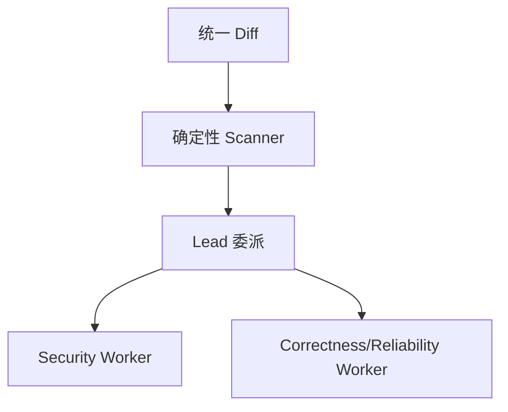

## 完整版项目简历（LaTeX）

以下为当前确认的完整版项目简历，可直接复制到简历模板中。

```latex
\resumeSubheading
  {EvoAgent：自进化 Agent Runtime Harness 的 PR 研发治理智能体}{}
  {核心开发}{2026.04 -- 2026.07}

\item[] \small{\textbf{项目简介}：面向研发过程 PR 的自进化风险治理与安全修复智能体，构建可恢复的 Agent Runtime Harness，完成风险发现、证据复核、安全修复、结果验证、自动评测、反馈学习与版本回滚能力，实现研发风险治理的端到端闭环。}\vspace{-2pt}

\item[] \small{\textbf{技术栈}：Harness、Self-Evolution、Dynamic Skill、Multi-Agent、Redis Streams、PostgreSQL、SQLite、Docker}

\begin{itemize}[
  leftmargin=1.4em,
  label=\textendash,
  topsep=3pt,
  partopsep=0pt,
  itemsep=2pt,
  parsep=0pt
]
\small

\item \textbf{Agent Runtime Harness}统一管理任务状态、执行预算、节点重试、持久化 Checkpoint、任务取消与断点续跑；引入 Hook Pipeline、追加式 Run Journal 和语义副作用账本，支持危险操作持久化审批、已提交结果复用及独立 Goal Gate 完成校验。

\item \textbf{Agent 自进化}将误报、漏报、坏修复及执行异常回流为失败案例，基于证据诊断生成差量 Prompt/Skill 候选，统一候选状态机；通过 Validation/Holdout 质量与成本门禁、人工审批和独立 Shadow 后显式激活，结合数据库租约、版本并发校验与发布监控，实现评测防重、原子发布和退化回滚。

\item \textbf{多 Agent 协作}设计基于任务分派、协作对话和验证门禁的多 Agent 协作机制。系统根据变更范围、敏感路径和 Reviewer 生成任务计划，调度 Specialist 并行初审。再通过 Critic 质疑、Reflection 修订、Evidence 独立复核、Verifier 验证和 Arbiter 最终裁决，完成 Finding 的证据校验、置信度校准、去重与排序。

\item \textbf{Agent 端到端评测}建设基于 100 个受控 PR Diff 的端到端 Evaluation Harness，包含 40 个风险样本和 60 个干净样本，按仓库划分 Validation/Holdout。通过路径、行号区间和 CWE 类型进行一对一匹配。多 Agent 风险检测 F1 从 71.4\% 提升至 82.5\%，高风险召回率从 84.2\% 提升至 94.7\%，干净 PR 准确率达到 91.7\%。

\item \textbf{Agent Loop 与可观测 Trace}基于 Plan、Tool、Observe、Final 构建有界 Agent Loop，记录节点状态、Agent 消息、重试、Checkpoint 和门禁结果；按任务固定 Prompt/Skill 版本快照，关联候选差量、评测报告、审批与发布审计，支持执行链路回放、失败归因、评测复现和断点恢复。

\item \textbf{上下文压缩与 Memory 管理}构建大结果 Artifact 卸载、风险裁剪、观察压缩与可选摘要的四级上下文管理，保留原始证据引用；结合 Working、Episodic、Semantic、Procedural 分层记忆与 BM25/RRF 混合检索，实现按需读取、租户与仓库隔离，并按实际读取记录关联任务反馈，支持反馈去重、冲突晋升拦截与过期清理。

\end{itemize}

\resumeSubHeadingListEnd
\vspace{-7mm}
```

---

<!-- 原 PDF 第 1 页 -->

# EvoAgent：自进化Harness智能体

#### 🍇 代码有做更新，大家记得下载下新的

完整可运行代码：

通过网盘分享的文件：EvoAgent.zip

[链接: https://pan.baidu.com/s/151Nx4KMz3-7cRX5SuGCMDQ](https://pan.baidu.com/s/151Nx4KMz3-7cRX5SuGCMDQ) 提取码: LRU1

评测数据：

通过网盘分享的文件：pr_diff.jsonl

[链接: https://pan.baidu.com/s/1P8y2eCsl6secFxrWxM17Vg](https://pan.baidu.com/s/1P8y2eCsl6secFxrWxM17Vg) 提取码: KMP9

### 🍅

- 对于代码和文档有任何问题大家可以随时小红书私聊我

- 代码会一直更新迭代，大家使用过程中遇到任何问题，都可以直接反馈我我就会修改

- 同时欢迎大家多多向我反馈意见，主包看到就一定会有反馈

## 更新汇总

2026.08.20 多agent协作部分更新

2026.08.28 工作日在上班，周末两天继续完善大家的反馈

2026.08.30 Runtime Harness 第一项优化同步：新增 Hook Pipeline、Run Journal、Effect Ledger、持久化审批、Artifact Offload、独立 Goal Gate、四张 Runtime 表、专项故障注入与性能基准；同步更新项目简介、运行流程、Runtime/Harness、Tool Calling、持久化、代码解读、高频问答和项目面经。

2026.08.30 Context/Memory 第二项优化同步：新增不可损 Evidence、Full Diff/Tool Result Artifact、四级上下文压缩、Memory 六状态生命周期、BM25+RRF 混合检索、渐进披露、SQLite/PostgreSQL 对等迁移和独立压缩/检索基准；同步更新项目流程、Agent Loop、Context、Tool Calling、Memory、存储、指标、测试、问答和面经。

2026.09.19 自进化治理同步进行中：候选统一状态机、人工审批、独立 Shadow、原子发布/回滚、评测租约与实际使用 Memory 反馈已接入，相关机制已有专项测试。部署和 API 以 [自进化治理使用说明](<../design/Self_Evolution_治理使用说明.md>) 为准；逐项实测结果及未完成验收见 [实施记录](<../design/Self_Evolution_优化实施记录.md>)。下文保留的历史代码和问答仍待逐章校对，不能把历史自动激活说明当作当前接口行为。

当前四方向路线状态：第一项 Runtime Harness v2 已完成；第二项 Context/Memory v2 已完成；第三项自进化治理正在实施与验收，之后进入动态多 Agent Harness。后两项尚未完成的能力不得在正文中表述为已上线。

1、对于小diff和普通任务不走agentic，采用一个小LLM进行路由。小diff和普通任务就直接通过单 agent进行处理，高风险用主子多Agent协作。

2、对于critic耗时，消融验证critic必要性，必要时可不用critic，只用worker

3、对于工具调用

<!-- 原 PDF 第 2 页 -->

## 一、项目简介

EvoAgent 是一个面向研发过程 Pull Request 的自进化Harness风险治理与安全修复 Agent。它接收 PR Diff，分析本次变更可能引入的安全、可靠性、正确性和回归风险，复核问题证据，并对部分规则生成保守修复。整个过程不是一次模型调用，而是一条可以恢复、重试、追踪和评测的 Agent 执行链路。

项目采用自研 Agent Runtime Harness v2。Runtime 在节点调度、执行预算、超时、重试、任务取消和 Checkpoint 之外，新增统一 Hook Pipeline、只追加 Run Journal、语义副作用账本、持久化审批、Artifact Offload 与独立 Goal Gate。任务中途失败后可从最近完成节点恢复；模型、工具和外部写操作具有结构化事件与语义键，恢复或重复请求时可复用已提交结果，避免重复评论或重复创建修复 PR。

除了diff审查，项目还实现了 PR Webhook、评论 Upsert、独立修复分支、Redis Streams 消费、Worker 租约、ACK、失败重试和死信队列。生产侧接入了 RBAC、多租户隔离、OpenTelemetry、Prometheus、灰度发布和影子流量。

系统还建设了基于 100 个受控 PR Diff 的 Evaluation Harness。评测按照仓库划分 Validation 和 Holdout，通过文件路径、行号区间和 CWE 类型进行一对一匹配，用于开发回归和受控效果对比。当前候选治理不能仅凭这 100 个受控样本授权生产上线：还要求独立数据、结果/过程/成本门禁、人工审批与 Shadow；真实 PR 收益不能直接沿用受控样本指标。

Context/Memory v2 将 Artifact、Evidence、Context 和 Memory 分层：原始大结果先按内容寻址持久化，事实工具结果再生成包含路径、Added Line、哈希与来源的 Evidence Record；模型只接收有预算的 Context 视图和 Memory Catalog，并通过租户/仓库受限的 `read_artifact`、`read_memory` 按需读取全文。Memory 具备六状态生命周期、版本、来源证据、冲突/替代和反馈治理。

#### 🎖️ 自进化演进会通过 Validation、Holdout 和非回归门禁

多Agent协作由主-子Agent架构组成：

- Lead：负责拆解任务、把审查目标委派给 Worker、检查 Worker 结果、发起返工并完成最终综合。

- Security：检查输入边界、权限控制、敏感数据和危险调用链。

- Correctness/Reliability：检查状态变化、异常处理、并发、资源生命周期、兼容性和相关测试。

- Critic：在隐藏候选来源身份后进行独立质疑，寻找错误位置、缺少前置条件、证据不足和严重度不合理等问题。

Worker 之间不直接通信，所有任务分派、返工和最终决定都经过 Lead。

```text
Lead 主 Agent
  ├─ 委派 Security Worker
  ├─ 委派 Reliability Worker
  ├─ 评估结果并要求返工（最多 2 轮）
  ├─ 委派 Critic Worker 盲审
  └─ 综合最终 findings
```

<!-- 原 PDF 第 3 页 -->

主-子agent模式怎么协作

```text
Lead Agent ReAct
   │
   ├─ delegate(Security)
   ├─ delegate(Reliability)
   │          并行执行
   ▼
收集 WorkerResult
   │
   ├─ 证据不足 → request_revision(Security)
   ├─ 结论冲突 → delegate(Critic)
   ├─ 需要反证 → delegate(Critic)
   └─ 发现新风险 → 创建新的子任务
   │
   ▼
Lead 综合、去重、调整严重度
   │
   ▼
FindingGate
```

从 Agent 不直接互相通信：

```text
Security ──结果/问题──→ Lead
Reliability ─结果/问题→ Lead
Critic ──裁决/反证────→ Lead
```

同时，每个Agent仍然是React，其中包含2层循环

外层：Lead 调度循环

```text
Lead 读取任务状态
   │
   ├─ delegate
   ├─ request_revision
   ├─ invoke_critic
   ├─ cancel_task
   ├─ accept_finding
   └─ final
```

<!-- 原 PDF 第 4 页 -->

内层：每个 Agent 的工具 ReAct

```text
Agent
  → tool
  → observation
  → tool
  → observation
  → report/final
```

整体结构：

```text
Lead Agent Loop
    │
    ├─ Security BoundedRole ReAct
    ├─ Reliability BoundedRole ReAct
    └─ Critic BoundedRole ReAct
```

Lead 本身也可以是 BoundedRole，但它除了工具动作，还需要支持调度动作。

## 二、简历写法（后续会写多套简历写法，解决大家撞项目的顾 虑～）

项目简历描述1：

EvoAgent：自进化Agent Runtime Harness的PR研发治理智能体

技术栈： Python、Harness Engineering、Self-Evolution、Skill、Multi-Agent、Redis Streams、PostgreSQL、SQLite、Docker、Prometheus

项目简介：

面向研发过程PR的自进化风险治理与安全修复智能体，构建可恢复的 Agent Runtime Harness，完成风险发现、证据复核、安全修复、结果验证、自动评测、反馈学习与版本回滚能力，实现研发风险治理的端到端闭环。

<!-- 原 PDF 第 5 页 -->

项目亮点：

1. Agent Runtime Harness，构建 `planning → executing → reviewing → goal-gate` 确定性工作流，统一管理 Hook、执行预算、节点重试、Checkpoint、只追加 Journal、结构化审批、Artifact 句柄、语义副作用去重及断点续跑；微基准中新增框架开销 P95 为 15.42 ms/节点，200 次已提交副作用重放的重复 Handler 调用为 0。

2. Agent 自进化，Prompt 与 Agent Skill 共用受治理候选生命周期。将误报、漏报、坏修复及执行异常回流为失败案例，核对证据后生成少量差量候选；候选通过静态安全校验、Validation 提升与 Holdout 非退化门禁后，仍需人工审批、独立 Shadow 和显式激活，不再直接自动激活。支持候选去重、版本审计、任务快照、发布反馈监控与原子回滚；完整优化验收仍在进行中。

3. 多 Agent 协作，设计 Lead/Worker/Critic主-子Agent 协作机制。Lead 负责动态委派、Worker 结果评估、最多两轮返工和最终综合。Security 与 Correctness/Reliability 并行执行有界工具循环，Critic 在隐藏候选来源后进行独立质疑

4. Agent端到端评测，建设基于 100 个受控PR Diff 的端到端 Evaluation Harness，包含 40 个风险样本和 60 个干净样本，按仓库划分 Validation/Holdout。通过路径、行号区间和 CWE 类型进行一对一匹配。多 Agent 风险检测 F1 从 81.9% 提升至 91.3%，高风险召回率从 84.2% 提升至94.7%，干净 PR 准确率达到 91.7%。

5. Agent Loop与可观测 Trace，基于 Plan、Tool、Observe、Final 构建有界 Agent Loop，并通过 NODE、MODEL、TOOL、CHECKPOINT、GOAL 等 Runtime 事件记录节点状态、Agent 消息、重试、Checkpoint、Hook 降级和门禁结果，支持执行链路回放、失败归因、评测复现和断点恢复。

6. 上下文压缩与 Memory 管理，构建 Artifact、Evidence、Context、Memory 四层数据面：通过内容寻址 Artifact 与不可损 Evidence 保留原始事实，采用风险 Hunk 裁剪、Observation 微压缩和渐进式 Memory Catalog 控制 Token；Memory 引入六状态生命周期、BM25+RRF 混合检索、版本/冲突治理与租户隔离。受控长上下文压力基准中 Token 降幅 94.61%，必需风险路径和 Evidence/Artifact 引用保留率均为 100%。

项目简历描述2：


> 上图是原 PDF 中的优化前简历截图，作为历史素材保留。当前简历中的 Runtime Harness 卖点应以本节“项目亮点”第 1、5 条和第九章 Runtime Harness v2 的实测数据为准。

<!-- 原 PDF 第 6 页 -->

## 三、前置知识

#### 1. Pull Request 和 unified diff

Pull Request 是代码托管平台上的变更评审单。EvoAgent 不拉取整个仓库做全量扫描，核心输入是一段 unified diff。

一个最小 diff 长这样：

```diff
--- a/app.py
+++ b/app.py
@@ -1 +1,2 @@
-safe_call()
+password = "secret-value"
+eval(user_input)
```

几个符号的含义：

- --- 表示旧文件。

- +++ 表示新文件。

- @@ -1 +1,2 @@ 是 hunk 头，记录旧文件和新文件的起始位置。

- - 开头是删除行。

- + 开头是新增行。

- 其他行是上下文。

#### 🌔 EvoAgent 只把新增行交给规则审查。这样可以把结论限定在"本次 PR 引入的问题"，不会把仓库原本就存在的旧问题全翻出来。

#### 2.Lead/Worker 主-子agent协作

Lead 是整个会话的控制者。它先产生 Delegation，随后接收 Worker 报告，必要时发出 Revision Request。Security 和 Correctness/Reliability 可以并行执行，但互不直接通信。Critic 看到的是去除来源身份后的候选 Finding，用于减少对某个角色的先验偏好。最终发布索引仍由 Lead 给出，再经过确定性 Finding Gate。

#### 3.Webhook 和 HMAC-SHA256

<!-- 原 PDF 第 7 页 -->

Webhook 是 GitHub 主动调用 EvoAgent 的 HTTP 地址。PR 创建、重新打开或推送新提交时，GitHub 把事件 payload 发到：

```http
POST /webhooks/github
```

只判断请求头来自 GitHub 不够，因为请求头可以伪造。项目用 Webhook Secret 对原始请求体计算 HMAC-SHA256：

```text
expected = "sha256=" + HMAC_SHA256(secret, raw_body)
```

然后用常量时间比较 hmac.compare_digest() 对比 GitHub 发来的 X-Hub-Signature-256。常量时间比较可以减少普通字符串逐字节比较带来的时序侧信道。

#### 4. 同步任务和异步任务

同步审查：

```http
POST /v1/reviews
```

HTTP 请求会等到审查完成，再返回报告。它适合本地调试和短 diff。

异步审查：

```http
POST /v1/reviews?async=true
```

服务先创建 PENDING 任务，然后把 payload 交给线程池或 Redis，立即返回任务 ID。调用方之后查询：

```http
GET /v1/tasks/{task_id}
```

GitHub Webhook 默认走异步链路，因为 Webhook 不适合一直等待 LLM 或多个 Reviewer 完成。

<!-- 原 PDF 第 8 页 -->

#### 5. Agent Loop 与 Runtime Harness

- AgentRuntime：执行 `planning`、`executing`、`reviewing` 和不消耗 Agent 步骤预算的 `goal-gate`，负责 Checkpoint、节点重试、取消和总体预算。
- Hook Pipeline：在 Run、Node、Model、Tool、Checkpoint 和 Goal 检查前后执行权限、审批、Artifact 卸载与审计策略。
- BoundedRole：执行每个 LLM 角色的 tool/final 循环，默认最多 4 步，并检查该角色的 Token 和时间预算。
- Goal Gate：模型返回 Final 后再次检查报告、Added Line、证据、高风险修复/测试建议和前序节点完成状态，防止“模型停止”被误当成“任务完成”。

#### 6. Checkpoint、Journal 与幂等

Checkpoint 回答“从哪里继续”，Run Journal 回答“实际发生了什么”，Effect Ledger 回答“这个外部副作用是否已经提交”。三者不能互相替代。

- 外层 Checkpoint 保存 planning、executing、reviewing 和 goal-gate 的节点状态；内层 `agentic-lead-session` 保存委派、Worker、返工、Critic、Lead Final 与 Execution Ledger。
- Run Journal 以任务内单调 sequence 追加 NODE、MODEL、TOOL、CHECKPOINT、GOAL 等事件，SQLite/PostgreSQL 在数据库层禁止更新或删除。
- 模型、工具、评论与修复 PR 使用由 task、action、arguments、node、role、version 计算的稳定语义键；重试 attempt 不参与计算。
- Effect Ledger 使用 `INTENT → COMMITTED / FAILED` 状态机。命中 COMMITTED 时直接复用结果，不再次调用 Handler。
- Webhook Delivery ID 与请求体 SHA-256 仍用于入口幂等；GitHub 评论继续使用隐藏 Marker 处理远端提交间隙。

#### 7. Scanner、Agent 与 Gate

|类型|是否调用模型|当前职责|
|---|---|---|
|Scanner|否|通过正则、声明式规则、AST或静态检查产生事实和候选 Finding|
|LLM Agent|是|根据目标自主选择工具或结束，完成委派、审查、质疑与综合|
|Gate|否|检查格式、位置、证据、置信度和发布资格|

#### 8. OpenAI 兼容接口

OpenAI 兼容接口通常指和 Chat Completions 请求结构接近的 HTTP API。EvoAgent 调用：

```text
{base_url}/chat/completions
```

请求里包含 model、messages、temperature 和 response_format。项目不依赖官方 OpenAI SDK， 而是用 Python 标准库 urllib.request 发请求。

这样做的好处是依赖少，也能接 DeepSeek、OpenRouter 或其他兼容服务。代价是重试、连接池、流式解析、错误分类和观测都要自己补。

#### 9. Precision、Recall 和 F1

评测不能只看"模型说得像不像"。EvoAgent 使用位置级的客观指标。

<!-- 原 PDF 第 9 页 -->

```dotenv
代码块Precision = TP / (TP + FP)
    Recall    = TP / (TP + FN)
    F1        = 2 * Precision * Recall / (Precision + Recall)
```

TP 是正确命中的问题，FP 是误报，FN 是漏报。

举个例子。验证集有 4 个真实问题，模型报了 5 个，其中 3 个正确：

```dotenv
TP = 3
FP = 2
FN = 1
Precision = 3 / 5 = 0.6
Recall = 3 / 4 = 0.75
F1 ≈ 0.6667
```

只看 Recall 容易鼓励模型多报问题，只看 Precision 又可能让模型过于保守。F1 用来平衡两者。

#### 10. Validation 和 holdout

Validation 用来判断候选提示词是否比基线更好。Holdout 是隐藏回归集，用来检查候选有没有针对公开验证样本过拟合。

#### 11. SQLite、PostgreSQL 和 Redis

1. SQLite 是单文件数据库，适合本地运行和测试。EvoAgent 默认把数据写到 evoagent.db。

2. PostgreSQL 适合多进程或多实例共享数据。设置 EVOAGENT_DATABASE_URL 后，服务会选择 PostgresTaskStore。

3. Redis 在这里不是数据库主存储，而是异步任务队列适配。Worker 用 BRPOP 等待任务。

#### 12. GitHub PAT

PAT 是用户或机器人账号的访问令牌。配置 EVOAGENT_GITHUB_TOKEN 后，GitHub API 请求使用这个 token。

#### 13.Harness Engineering

harness本来有安全带、马具、约束装置的意思。不要只让 Agent 自由发挥，而是给它一套运行框架。

如果说 Prompt Engineering 是写好指令，Context Engineering 是管理信息，Harness Engineering 就是设计执行系统。

<!-- 原 PDF 第 10 页 -->

#### 🐩 流程：

人类设定目标与边界 → Agent 生成计划与代码、动作 → 机器执行 → 环境反馈 → Agent 修正 → 最终交付。

#### 🐩 工程师角色变化：

不再只是直接写代码，而是设计 Agent 的运行环境、工具权限、反馈机制、失败恢复和验证流程。

举个🌰：比如一个写代码 Agent，不应该只是让模型说我来改。它需要能读文件、能搜索代码、能编辑文件、能跑测试、能看到报错、能根据报错修复、能避免删除用户代码、能向用户报告改了什么， 这整套执行轨道就是 Harness。

#### 14.自进化

自进化 Agent 是指能够从执行结果中提取经验，并把这些经验持久化为可复用资产的 Agent。下一次遇到相似任务时，它使用更新后的 Prompt、Memory、Skill、Policy，必要时也可以使用经过训练的新模型。

这里的"进化"通常是工程意义上的持续改进，并不等于 Agent 可以任意重写自己的代码或模型参数。


<!-- 原 PDF 第 11 页 -->


## 四、项目背景

#### 1. github PR 审查通常有几个现实问题

第一，直接让单个大模型读取完整 PR，容易出现行号错误、风格类误报和缺少测试建议的泛泛结论， 模型输出也需要本地规则和证据复核兜底。

第二，不同 Reviewer 的关注点不一样。有人更关注注入，有人更关注异常处理，有人只看业务逻辑。没有统一输出格式时，结果很难沉淀。

第三，审查工具如果只给一句结论，后续很难回答"谁发现的、依据是什么、当时用了哪个提示词、为什么这个版本被激活"。

第四，审查和修复如果直接写用户分支，风险很高。自动修复必须限制规则范围，并写到独立分支。

#### 2. EvoAgent 解决什么

<!-- 原 PDF 第 12 页 -->

#### 🌔 EvoAgent 把这几个问题拆开处理：


- DiffParser 只提取新增行，保证位置范围可控。

- 本地规则提供确定性底线，不配置模型也能工作。

- 多 Reviewer 并行执行，不把所有职责塞进一个 prompt。

- Coordinator 按位置和规则去重，并过滤没有修复或测试建议的结论。

- Harness 保存每一步状态和消息。

- GitHub Webhook 把 PR 事件接进审查链路。

- SafeFixer 只允许少量确定性文本修复，并创建新分支。

- 反馈案例进入提示词回放评测，不接受调用方自己给的回归分数。

## 五、项目运行

### 1. 环境要求

项目可以直接docker一键运行，具体大家可以看readme。如果是windows系统且不想搞WSL、docker项目使用 Python 3.11。进入包含 requirements.txt 的项目目录后安装依赖：

```powershell
python -m pip install -r requirements.txt
```

### 2. 配置管理员与登录密钥

推荐先启用认证并创建本地管理员：

```text
$bytes = New-Object byte[] 32
[Security.Cryptography.RandomNumberGenerator]::Create().GetBytes($bytes)
$env:EVOAGENT_AUTH_REQUIRED = 'true'
$env:EVOAGENT_AUTH_SECRET = [Convert]::ToBase64String($bytes)
$env:EVOAGENT_BOOTSTRAP_ADMIN_USERNAME = 'admin'
$env:EVOAGENT_BOOTSTRAP_ADMIN_PASSWORD = '<至少 10 个字符的强密码>'
```

<!-- 原 PDF 第 13 页 -->

EVOAGENT_AUTH_SECRET 在启用认证时至少需要 32 字节。Bootstrap 管理员只在用户名不存在时创建，重启不会覆盖已有用户密码。

当前角色是

- admin：read、review、fix、manage、audit。

- maintainer：read、review、fix。

- auditor：read、audit。 3. 配置模型

#### DeepSeek 官方兼容端点

```text
$env:EVOAGENT_LLM_PROVIDER = 'deepseek'
$env:EVOAGENT_DEEPSEEK_API_KEY = '<API Key>'
```

#### OpenRouter 免费路由

```text
$env:EVOAGENT_LLM_PROVIDER = 'openrouter-free'
$env:EVOAGENT_OPENROUTER_API_KEY = '<API Key>'
```

也可以使用 openrouter-deepseek-free。免费模型的名称和可用性由供应商决定，必要时通过 EVOAGENT_LLM_MODEL 显式覆盖。

#### 自定义 OpenAI Chat Completions 兼容端点

```text
$env:EVOAGENT_LLM_PROVIDER = 'custom'
$env:EVOAGENT_LLM_BASE_URL = 'https://example.com/v1'
$env:EVOAGENT_LLM_API_KEY = '<token>'
$env:EVOAGENT_LLM_MODEL = '<model-name>'
```

项目会自动读取根目录 .env 和 evoagent/.env，真实进程环境变量优先。不要把密钥提交到仓库。

### 4. 启动服务

<!-- 原 PDF 第 14 页 -->

```text
http://127.0.0.1:8080/
```

健康检查不要求 Bearer Token：

```text
Invoke-RestMethod http://127.0.0.1:8080/health
```

返回结果会包含队列后端、模型 Provider/Model、当前 agentic 模式和组件分类。

### 5. 登录并提交同步审查

```text
$session = Invoke-RestMethod -Method Post `
  -Uri http://127.0.0.1:8080/v1/auth/login `
  -ContentType 'application/json' `
  -Body (@{
    username = 'admin'
    password = '<你的管理员密码>'
  } | ConvertTo-Json)

$headers = @{ Authorization = "Bearer $($session.access_token)" }

Invoke-RestMethod -Method Post `
  -Uri http://127.0.0.1:8080/v1/reviews `
  -Headers $headers `
  -ContentType 'application/json' `
  -Body (@{
    repository = 'demo/api'
    pull_request = 12
    mode = 'agentic'
    diff = "diff --git a/app.py b/app.py`n--- a/app.py`n+++ b/app.py`n@@ -1,0
+1,1 @@`n+eval(user_input)"
  } | ConvertTo-Json)
```

<!-- 原 PDF 第 15 页 -->

仓库搜索、符号、测试、AST、Git 和静态检查工具。该路径必须是服务主机上已经存在的绝对目录。

### 6. 异步审查与查询

把地址改为：

```http
POST /v1/reviews?async=true
```

```text
Invoke-RestMethod -Headers $headers http://127.0.0.1:8080/v1/tasks/<task-id>
Invoke-WebRequest -Headers $headers http://127.0.0.1:8080/v1/tasks/<task-
id>/repor
```

取消和恢复接口分别是：

```http
POST /v1/tasks/{task_id}/cancel
POST /v1/tasks/{task_id}/resume
```

取消是协作式取消，在 Runtime 节点边界检查；恢复会重新入队，并从持久化 checkpoint 继续。

Runtime v2 还提供危险工具审批接口：

```http
GET /v1/tasks/{task_id}/approvals
POST /v1/tasks/{task_id}/approvals/{semantic_key}
POST /v1/tasks/{task_id}/resume
```

未审批的 `requires_approval=True` 工具不会执行 Handler，任务进入 `WAITING_APPROVAL`。管理员批准后调用 resume，从已有 Checkpoint 继续；拒绝时 Hook fail-closed 阻断。接口要求 `manage` 权限并执行 tenant 隔离。

### 7. 生产依赖

```powershell
docker compose up --build
```

进程内队列适合本地演示，不具备跨进程持久恢复能力。Redis 模式使用 Streams、Consumer Group、ACK、租约回收、重试和死信流。

### 8. 运行参数边界

- EVOAGENT_MAX_DIFF_BYTES：Diff 最大字节数，默认 1 MiB。

<!-- 原 PDF 第 16 页 -->


- EVOAGENT_MAX_STEPS：外层 Runtime 最大节点尝试步数，默认 8。

- EVOAGENT_TIMEOUT_SECONDS：外层 Runtime 和模型 HTTP 的默认时间边界，默认 120 秒。

- EVOAGENT_AGENT_TOKEN_BUDGET：单角色默认 Token 预算，默认 8000。

- EVOAGENT_AGENT_TIME_BUDGET_SECONDS：单角色默认时间预算，默认 60 秒。

- EVOAGENT_ENABLED_AGENTS：默认 lead,security,correctness-reliability,critic。

- EVOAGENT_REPAIR_TEST_COMMAND：自动修复必须使用的仓库测试命令；未配置时只给修复建议。

- EVOAGENT_RUNTIME_ARTIFACT_THRESHOLD_BYTES：工具结果、测试日志、检索结果和 Full Diff 的卸载阈值，默认 32768 bytes，Runtime 内部下限为 1024 bytes。超过阈值的完整内容保存到 Artifact Store，模型只接收预览、SHA-256 与 `artifact://` 句柄。

- EVOAGENT_CONTEXT_MODEL_SUMMARY_ENABLED：是否启用第四级 prose-only 模型摘要，默认 `false`。前三层确定性压缩仍超预算时才会调用，Diff、Evidence、Artifact、路径、行号、Finding、CWE 和系统规则不会发送给摘要模型。

- Context Policy 默认建议分配为系统规则 15%、任务与 Diff 45%、Tool Observation 20%、Memory 10%、输出预留 10%；实际硬限制仍由 Agent 输入预算、Diff/Observation Budget 和模型窗口共同决定。

前端界面：

#### 🎖️ EvoAgent支持两种使用方式：

1. 手动审查

进入左侧“发起审查”，填写：


- PR编号：可以留空

- Diff：粘贴标准的 Git Diff 内容

然后提交，EvoAgent会直接运行本地规则、Qwen 和多 Agent 审查。结果保存在“任务中心”，不会发送到 GitHub。


<!-- 原 PDF 第 17 页 -->

标准 Diff 示例：

```python
--- a/example.py
+++ b/example.py
@@ -1,2 +1,3 @@
 def hello():
+    print("debug")
     return "hello"
```

2. GitHub自动审查

GitHub Webhook 负责自动取得 PR Diff、创建任务并把评论写回 PR。它只是自动化入口，不是 EvoAgent运行所必需的。

因此，如果只是本地测试自进化、多 Agent、评测和审查效果，可以暂时关闭 Cloudflare，也不需要 GitHub Token、Webhook 。只需保留 Qwen 的环境变量，然后启动：

```powershell
python -m evoagent
```

## 六、github连接说明

这个是代码仓库的diff能自动评测的基础，非常重要

连接github，使PR的diff可以上传到EvoAgent审查并将评论写回github 对于 GitHub Webhook 来说，必须有一个 GitHub 能访问的公网地址，但不一定要购买服务器或域名。可以用“HTTPS 隧道”把公网请求转发到本机：

```text
GitHub
  ↓ HTTPS
临时公网地址
  ↓ 隧道
http://127.0.0.1:8080/webhooks/github
```

<!-- 原 PDF 第 18 页 -->

1、下载 cloudflared

[使用Cloudflare Quick Tunnel，下载链接：Releases · cloudflare/cloudflared，下载cloudflared-](https://github.com/cloudflare/cloudflared/releases)

windows-amd64.exe。

下载好后检查

```text
cloudflared --version
```

新开一个PowerShell 窗口启动EvoAgent，设置 Qwen 和 GitHub 配置：

```powershell
cd D:\AgentProject
#配置大家有apikey的大模型
$env:EVOAGENT_LLM_PROVIDER = "custom"
$env:EVOAGENT_LLM_BASE_URL = ""
$env:EVOAGENT_LLM_API_KEY = "Qwen的Key"
$env:EVOAGENT_LLM_MODEL = "qwen3.7-max"

$env:EVOAGENT_GITHUB_WEBHOOK_SECRET = "自己设置一个足够长的随机字符串"
$env:EVOAGENT_GITHUB_TOKEN = "GitHub Fine-grained Token"
$env:EVOAGENT_AUTO_POST_REVIEW = "true"

python -m evoagent
```

做完启动EvoAgent后，确认 EvoAgent 正在另一个 PowerShell 窗口运行：

```text
Invoke-RestMethod http://127.0.0.1:8080/health
```

如果能返回 JSON，再启动隧道：

```text
cloudflared tunnel --url http://127.0.0.1:8080
```

成功后会出现类似日志

<!-- 原 PDF 第 19 页 -->

```text
Your quick Tunnel has been created!
https://novel-rob-sociology-tan.trycloudflare.com
```

[https://novel-rob-sociology-tan.trycloudflare.com类似这个需要填入github的webhook中](https://novel-rob-sociology-tan.trycloudflare.com/)

在 GitHub 仓库中进入：

```text
Settings → Webhooks → Add webhook
```

填写：

```yaml
Payload URL:
https://novel-rob-sociology-tan.trycloudflare.com/webhooks/github

Content type:
application/json

Secret:
与你启动 EvoAgent 时配置的 EVOAGENT_GITHUB_WEBHOOK_SECRET 完全相同
```

事件选择：

```text
Let me select individual events
→ Pull requests
```

如果还没配置 GitHub 环境变量，需要先停止并重新启动 EvoAgent：

```powershell
$env:EVOAGENT_GITHUB_WEBHOOK_SECRET = "自己设置的Webhook密钥"
$env:EVOAGENT_GITHUB_TOKEN = "GitHub Fine-grained Token"
$env:EVOAGENT_AUTO_POST_REVIEW = "true"

python -m evoagent
```

注意：这个随机网址下次重新启动 cloudflared 时会改变，需要同步修改 GitHub Webhook。

<!-- 原 PDF 第 20 页 -->

#### 🎖️ GitHub Webhook Secret、登录 Secret、PAT、LLM API Key 应分别配置，不能混用 GitHub Fine-grained Token 是给 EvoAgent 调用 GitHub API 的“专用密码”，不是 GitHub登录密码，也不是 Qwen API Key。

EvoAgent用它来：

- 读取 PR 的代码差异。

- 把审查报告写到 PR 评论区。

- 仅访问你指定的仓库，权限比传统 Token 更可控。

GitHub Fine-grained Token创建方法：

1. 打开 [GitHub 新建 Fine-grained Token。](https://github.com/settings/personal-access-tokens/new)

2. 填写：
### ◦ Token name：EvoAgent ◦ Expiration：建议 30 或 90 天 ◦ Resource owner：HarryAnse ◦ Repository access：选择 Only select repositories ◦ 选择仓库：codep

3. 在 Repository permissions 中设置：
### ◦ Contents → Read-only ◦ Pull requests → Read and write ◦ Issues → Read and write

4. 点击最下面的 Generate token。

5. 复制生成的、通常以 github_pat_ 开头的字符串。

然后在启动 EvoAgent 的 PowerShell 中执行：

```powershell
$env:EVOAGENT_GITHUB_TOKEN = "这里粘贴github_pat_开头的Token"
$env:EVOAGENT_AUTO_POST_REVIEW = "true"

python -m evoagent
```

在 GitHub 创建测试 PR

<!-- 原 PDF 第 21 页 -->

不能只向默认分支直接推送，因为当前监听的是 pull_request 事件。

最简单的 GitHub 网页测试方式：

1. 在目标仓库创建分支：

```text
evoagent-webhook-test
```

2. 在这个分支创建文件 webhook_test.py：

```python
def webhook_test():
    print("EvoAgent webhook test")
```

3. Commit changes。

4. 点击 Compare & pull request。

5. 创建 PR，但不要合并。

新增的 print() 会被本地可靠性 Agent 检测，方便确认审查确实执行了。

查看 Webhook 是否送达

进入 GitHub：

```text
Settings → Webhooks → 你的 Webhook → Recent Deliveries
```

找到 pull_request.opened：

- 绿色、HTTP 202：EvoAgent 已接收。

- 401：GitHub Secret 与 EVOAGENT_GITHUB_WEBHOOK_SECRET 不一致。

- 503：启动 EvoAgent 时没有设置 Webhook Secret。

- 500：通常是 GitHub Token、仓库权限或下载 Diff 失败。

查看审查结果

查看以下位置：

<!-- 原 PDF 第 22 页 -->


- EvoAgent：http://127.0.0.1:8080

- Dashboard 的任务中心

- 启动 EvoAgent 的 PowerShell 日志

- GitHub PR 评论区

如果配置了：

```text
$env:EVOAGENT_AUTO_POST_REVIEW = "true"
```

并且 GitHub Token 有权限，审查报告会自动发到 PR 评论区。

成功界面，个人信息已打码


<!-- 原 PDF 第 23 页 -->


## 七、项目流程

### 1. 整体链路

```text
API / GitHub Webhook
  → 鉴权、租户与仓库授权、大小校验
  → 创建任务并保存原始 Diff payload
  → 同步执行或提交 Memory/Redis Streams 队列
  → ReviewHarness
      → planning：解析 unified diff，并在超阈值时保存 Full Diff Artifact
      → executing：运行 agentic Lead/Worker 会话
          → Tool Result → EvidenceCaptureHook → ArtifactOffloadHook → Observation
          → 风险 Diff + Evidence Ref + Memory Catalog 组装 Managed Context
          → Agent 按需调用 read_memory / read_artifact
      → reviewing：形成报告
```

<!-- 原 PDF 第 24 页 -->

```text
  → 成功/失败/取消落库
  → 可选评论 Upsert、反馈、自进化或修复 Draft PR
```

Runtime v2 在原流程后补充了不可省略的完成与副作用控制链：

```text
planning → executing → reviewing → goal-gate
                 │            │          │
                 │            │          └─ 完成条件、证据与高风险字段检查
                 │            └─ 组装 ReviewReport
                 └─ MODEL/TOOL Hook、Journal、Approval、Artifact、Effect Ledger

报告持久化 → EffectExecutor → GitHub 评论 / 修复 Draft PR
```

### 3. Plannin

parse_unified_diff() 解析文件列表和新增行。如果没有有效文件或新增行，任务失败并记录 execution_error 失败案例。

Planning 的输出会写入节点 checkpoint：

```json
{
  "files": ["app.py"],
  "added_lines": [
    {"path": "app.py", "line": 12, "content": "eval(user_input)"}
  ]
}
```

### 4. Executing：Scanner

Executing 进入 ModeRouterReviewer.review_with_context()。系统先执行本地六条规则、注册的动态 Scanner 和当前租户已激活的 evolved Skill。重复结果按 (path, line, rule_id) 合并，保留置信度更高的版本。

高风险 Python 单行会尝试做 AST 解析并附加证据，但单行 AST 不能代替完整函数或跨文件分析。

### 5. Executing：Lead 委派

Lead 收到 Diff、变更文件、可用 Worker 和 Scanner 结果，生成最多 12 个 Delegation：

```json
{
  "assignment_id": "security-auth",
  "worker": "security",
  "objective": "检查认证与输入边界",
  "files": ["app.py"],
  "risk_domains": ["authorization"],
  "required_evidence": ["changed-line evidence"]
}
```

如果 Lead 没有覆盖已启用 Worker，系统会为缺失 Worker 补一个默认任务，避免模型意外跳过整个风险域。

<!-- 原 PDF 第 25 页 -->

### 6. Executing：Worker 并发与返工

Security 和 Correctness/Reliability 的待执行 Assignment 使用线程池并发运行。每个 Worker 使用独立工具权限和 BoundedRole 循环。

Worker 失败不会立即抛出整个会话，而是以 status=failed 写入会话。Lead 评估所有 Worker 结果后，可以发出返工请求；最多进行两轮返工。返工仍交给原 Worker，并携带 Lead 指导和需要补充的证据。

当前实现没有旧版 Planner 的替补 Agent/Assignment handoff 机制。某个 Worker 失败后，Lead 可以基于剩余结果继续综合，但不会自动切换到另一个同职责 Agent。

### 7. Executing：Critic 与最终综合

如果启用了 Critic 且存在候选 Finding，系统会删除候选的来源身份，只保留事实字段交给 Critic。

Critic 不能创建新 Finding，只能逐条给出接受/拒绝、异议、置信度调整和支持证据。

Lead 最后返回要发布的候选索引和可选置信度调整。Lead 的结果并不是最终输出，还要经过 Finding Gate。

### 8. Finding Gate

Gate 依次检查：

- 格式：位置必须是新增行，规则、标题和解释不能为空。

- 证据：需要精确代码、工具证据或调用链；High/Critical 必须有强工具证据或调用链。

- 置信度：默认不低于 0.55。

- 发布资格：High/Critical 必须包含修复和测试建议。

被拒绝项及原因会进入报告的 execution.rejected_findings，不会作为正式 Finding 发布。

### 9. Reviewing 与报告

Reviewing 根据最终 Finding 计算整体风险，组合协作摘要、运行模式、组件清单、模型/工具调用、Token、成本、延迟、Gate 结果和仓库上下文状态，生成同一份 ReviewReport。JSON API、管理台和 Markdown 报告都基于它。

Reviewing 完成后任务不会立即进入 SUCCESS。Runtime 继续执行独立 `goal-gate`：检查前三个业务 Checkpoint、ParsedDiff、报告归属、Finding 字段、Added Line、证据、高风险修复与测试建议，以及已有 Finding Gate 结果。失败时抛出 `RuntimeGoalNotMet` 并阻止伪成功；通过结果写入 `report.execution.runtime_harness.goal_gate`。

### 10. Checkpoint 与恢复

系统保存两级业务 Checkpoint，并由 Run Journal 记录更细粒度的执行事实：

- planning、executing、reviewing、goal-gate：外层 Runtime 节点输出。

- agentic-lead-session：Scanner、Delegation、Worker、返工、Critic、Lead Final 和 Execution Ledger。

恢复时，已完成节点直接合并 Checkpoint 输出并发送 `CHECKPOINT_RESTORED`；已完成 agentic 会话不会重复调用模型。正在进行的内层会话可以从已保存阶段继续。工具和外部写操作还会查询语义 Effect Ledger：已 COMMITTED 的动作直接复用结果，FAILED 可重新认领，未过期 INTENT 会阻止并发重复执行。

<!-- 原 PDF 第 26 页 -->

### 11. 任务结束后的可选动作

- GitHub 评论 Upsert。

- 提交人工反馈。

- 触发 Prompt 或声明式 Skill 候选生成与回放。

- 对已验证 Finding 生成受限 unified patch。

- 在配置测试命令且前后测试通过后创建 Draft PR。

GitHub 评论和修复 Draft PR 均已接入 EffectExecutor。相同任务和相同语义键的重复请求不会再次执行 Handler；对于“远端成功、本地尚未 COMMITTED 就崩溃”的分布式提交间隙，仍依赖 GitHub Marker 或可查询的确定性资源名完成对账。

## 八、多Agent协作

### 1.总览

只支持 agentic模式。一次完整审查由四种 LLM 角色参与：

||是否默认启用|主要职责|
|---|---|---|
|Lead|是，且为必需角色|拆解任务、委派、评估 Worker、发起返工、确<br>定最终发布索引|
|Security|是|检查输入、权限、敏感数据和危险调用链|
|Correctness/Reliabilit<br>y<br>|是|检查状态、异常、并发、资源生命周期、兼容<br>性和测试|
|Critic<br>|是|对已有候选做去来源审查，寻找反例、错误位<br>置和证据缺口|

默认协作链路如下：



<!-- 原 PDF 第 27 页 -->

```text
    D1 --> E["Lead 评估"]
    D2 --> E
    E -->|"需要补证据"| F["原 Worker 返工"]
    F --> E
    E -->|"评估结束"| G["Critic 去来源审查"]
    G --> H["Lead 最终综合"]
    H --> I["Finding Gate"]
    I --> J["ReviewReport"]
```

### 2. 为什么采用主-子agent协作

代码审查同时包含任务拆解、风险域分析、证据核对和发布判断。如果把这些责任交给同一次模型调用，系统很难回答几个实际问题：某类风险是否被覆盖，结论来自哪个角色，失败发生在哪个阶段， 恢复时应该从哪里继续。

当前实现选择了层级式主从结构。Lead 持有控制流，两类领域 Worker 负责发现问题，Critic 负责独立质疑，Gate 负责机器可判定的最后检查。这种结构的直接收益是责任和状态都比较清楚

- 每个 Assignment 有明确的 Worker、目标、文件范围和证据要求。

- 每个角色只能使用分配给自己的工具。

- 每次模型调用、工具调用和角色事件都进入同一份 Execution Ledger。

- Lead 会话在关键边界保存 checkpoint，进程重启后可以跳过已完成阶段。

- 最终 Finding 必须通过新增行、证据、置信度和发布资格检查。 3. 相关模块及职责多 Agent 逻辑没有分散在大量抽象框架中，主要集中在以下文件：

|文件|职责|
|---|---|
|[evoagent/agents/agentic_core.py]<br>(../evoagent/agents/agentic_core.py)|角色 Prompt、权限表、BoundedRole、Lead会话、并发 <br>Worker、返工、Critic和最终综合|
|[evoagent/runtime/runtime.py]<br>(../evoagent/runtime/runtime.py)|外层节点 Runtime、步骤和墙钟预算、节点重试、取消检<br>查、Tool Registry|
|[evoagent/runtime/harness.py]<br>(../evoagent/runtime/harness.py)|业务状态机、Planning/Executing/Reviewing三节点、报告<br>组装和外层 checkpoint|
|[evoagent/agents/repository_tools.py]<br>(../evoagent/agents/repository_tools.py)|Diff、仓库、符号、AST、Git、Scanner和测试工具|
|[evoagent/agents/gates.py](<../../evoagent/agents/gates.py>)|Finding格式、证据、置信度和发布门禁|
|||

<!-- 原 PDF 第 28 页 -->

|[evoagent/infrastructure/telemetry.py]<br>(../evoagent/infrastructure/telemetry.py)|模型调用、工具调用、成本、延迟和 Agent Trace|
|---|---|
|[evoagent/application/service.py]<br>(../evoagent/application/service.py)|模型、Scanner、活动 Prompt、角色配置与 ModeRouter的<br>装配|
|[evoagent/core/models.py]<br>(../evoagent/core/models.py)|Finding、ReviewReport、Severity和组件分类|

外层 Runtime 和内层 Agent 循环是两套不同的控制结构：

```text
ReviewHarness
  AgentRuntime
    planning
    executing
      ModeRouterReviewer
        Lead/Worker/Critic session
          BoundedRole tool/final loop
    reviewing
```

AgentRuntime 不负责模型思考过程。它只运行三个业务节点。真正的模型循环位于 BoundedRole， 每个角色在循环中选择调用一个工具，或者返回当前阶段要求的 final JSON

### 4. 一次审查如何进入多 Agent 会话

#### 4.1 服务入口

执行，还是由进程内队列或 Redis Streams Worker 取出任务后执行。

创建任务前，Service 会检查：

- repository 和 Diff 是否有效。

- 模型是否已经配置。没有模型时请求直接失败，不会降级为本地规则审查。

- 当前租户是否有权访问目标仓库。

<!-- 原 PDF 第 29 页 -->

原始 Diff 会单独写入任务 payload，供异步执行和恢复使用。

#### 4.2 Harness 外层状态机

```text
PENDING -> PLANNING -> EXECUTING -> REVIEWING -> SUCCESS
```

|节点|输入|输出|
|---|---|---|
|planning|原始 unified diff|文件列表和新增行列表|
|executing|Diff、ParsedDiff、任务和仓<br>库上下文|通过多 Agent会话及 Gate的 <br>Finding|
|reviewing|Finding和协作汇总|ReviewReport|

多 Agent 协作发生在 executing 节点内部。ModeRouterReviewer.review_with_context() 会读取任务配置，创建 Execution Ledger 和 RepositoryToolSuite，然后进入 _agentic()。

### 5. Lead 的职责和权限

Lead 会在一次审查中被多次激活，但每次激活使用相同角色 Prompt 和不同阶段上下文：

|阶段|作用|主要输入|主要输出|
|---|---|---|---|
|`delegate` |拆解审查任务|Diff、变更文件、可用 <br>Worker、Scanner<br>Finding|Delegation列表|
|`assess-workers` |检查 Worker结果|Assignment、Worker结<br>果、当前候选、返工轮次|Revision Request、<br>Critic目标|
|`finalize` |决定发布哪些候选|Critic意见、Worker结<br>果、候选 Finding|接受索引、置信度调整、<br>综合说明|

Lead 的工具权限故意较窄：

<!-- 原 PDF 第 30 页 -->


- locate_tests

权限。它负责调度和综合，深入取证交给 Worker 与 Critic。

#### Delegation 协议

Lead 在 `delegate` 阶段返回如下结构：

```json
{
  "action": "final",
  "delegations": [
    {
      "assignment_id": "security-auth-flow",
      "worker": "security",
      "objective": "检查新增认证入口是否绕过权限校验",
      "files": ["app.py", "auth.py"],
      "risk_domains": ["authorization", "untrusted-input"],
      "required_evidence": ["changed-line evidence", "call-chain evidence"]
    }
  ],
  "risk_level": "high",
  "reasoning_summary": "认证入口和权限判断同时发生了变化"
}
```

模型输出不会直接进入线程池。系统先做确定性规范化：

- 忽略非对象条目。

- 忽略指向未启用 Worker 的任务。

- 自动生成缺失的 Assignment ID。

- 丢弃重复 ID。

- Assignment ID 最长 100 个字符。

- objective 最长 2000 个字符。

- files 最多 100 个，每项最多 500 个字符。

- risk_domains 和 required_evidence 各最多 20 项。

- 整个会话最多保留 12 个 Assignment。

<!-- 原 PDF 第 31 页 -->

如果 Lead 漏掉了某个已启用的领域 Worker，系统会补一个默认 Assignment。Security 的默认目标覆盖安全、权限、输入和敏感数据，Correctness/Reliability 的默认目标覆盖正确性、失败处理、并发、资源和兼容性。默认 Assignment 要求提供 changed-line evidence。

补默认任务解决的是风险域完全漏派问题，不保证文件拆分一定合理，也不检查多个 Assignment 是否有重复工作

### 6. Worker 如何执行 Assignment

#### 6.1 并发模型

Assignment 数量，至少为 1。由于 Delegation 最多 12 个，因此单批最多创建 12 个 Worker 任务。

后在线程池中运行。一个 Security 角色可以收到多个 Assignment，这些 Assignment 也可以并发执行。

并发只发生在同一批 pending Assignment 之间。Lead 委派、Lead 评估、Critic 和 Lead Final 仍按顺序执行。

#### 6.2 Security Worker

Security 关注以下问题：

- 不可信输入如何进入程序。

- 认证与授权边界是否被绕过。

- 敏感数据是否进入日志、响应或持久化介质。

- 危险 API 是否可以被外部输入影响。

- 跨函数、跨文件调用链是否支持高风险结论。

Prompt 要求它只报告本次变更新增的可操作缺陷，不把代码风格或旧问题写成 Finding。Critical 和 High 结论需要强工具证据或具体调用链。

#### 6.3 Correctness/Reliability Worker

Correctness/Reliability 关注：

- 状态迁移是否完整。

- 异常是否被吞掉或错误转换。

- 并发访问、锁和共享状态是否安全。

- 文件、连接、线程和子进程等资源是否正确释放。

- 行为是否破坏兼容性。

- 相关测试是否覆盖变化后的路径。

<!-- 原 PDF 第 32 页 -->

该角色也只能报告本次变更引入的问题。它与 Security 使用相同的 Finding 结构，但系统 Prompt 不同，工具权限也多了测试定位能力。

#### 6.4 Worker Final 协议

Worker 返回的 Finding 结构如下：

```json
{
  "action": "final",
  "findings": [
    {
      "rule_id": "SEC-AUTH-BYPASS",
      "severity": "high",
      "title": "新增入口绕过权限校验",
      "explanation": "请求参数在权限检查前进入敏感操作。",
      "path": "app.py",
      "line": 42,
      "evidence": "run_admin_action(request.args['name'])",
      "evidence_ids": ["symbol:1a2b3c4d"],
      "call_chain": [
        {"path": "app.py", "line": 42, "symbol": "run_admin_action"}
      ],
      "fix": "在调用敏感操作前执行授权检查。",
      "test": "加入未授权用户调用该入口并收到拒绝响应的测试。",
      "confidence": 0.91
    }
  ]
}
```

系统解析 Worker 结果时会继续收紧数据：


- confidence 无法解析时使用 0.7，并限制在 0 到 1。

- rule_id、title、explanation、evidence、fix 和 test 都有长度上限。

- call_chain 只保留对象条目，最多 20 项。

- evidence_ids 只能引用当前角色本次工具 Observation 中真实存在的 ID。

- Finding 的 source 由系统写成 Worker 角色名，而不是信任模型自报来源。

因此，模型返回合法 JSON 只是第一层要求。位置、枚举、长度和证据引用还要经过代码处理。

### 7. BoundedRole 的 tool/final 循环

<!-- 原 PDF 第 33 页 -->

一轮循环的实际顺序是：

```text
检查当前激活的时间和 Token 消耗
  -> 组装受管理上下文
  -> 调用 JsonChatClient.complete_json()
  -> action=tool 时校验并执行一个工具
  -> 把工具结果加入 observations
  -> 进入下一步

或

  -> action=final 时结束当前角色激活
```

发给模型的 managed context 包含：

```json
{
  "task": "当前阶段的 JSON 字符串",
  "available_tools": [],
  "observations": [],
  "remaining_token_budget": 8000,
  "remaining_time_seconds": 60
}
```

角色每一步只能选择一个工具。工具成功或失败都会形成 Observation，模型可以在下一步修正参数

#### 7.1 Token 预算的实际含义

角色新增的输入和输出 Token 判断当前激活已经使用多少预算。

这不是整个任务的统一 8000 Token 上限。Lead 每次 delegate、assess-workers 和 finalize 都会创建修改预算，但代码会把值限制在 256 到默认预算 4 倍之间。

Token 数依赖模型供应商响应中的 usage。如果供应商不返回 usage，系统按 0 记录，不会自行估算，此时 Token 预算无法形成可靠约束。

<!-- 原 PDF 第 34 页 -->

同一角色的并发 Assignment 共用一个按角色名统计的 Ledger。它不是严格的独立配额系统，也不是会话级全局成本上限。

#### 7.2 时间预算的实际含义

timeout 控制。

所以角色时间预算是协作式检查，不会在精确的第 60 秒强制杀掉线程。外层

`EVOAGENT_TIMEOUT_SECONDS` 也只在 Runtime 节点尝试开始前检查，不能中断正在运行的 executing 节点。

### 8. 角色工具权限

Registry。模型看不到未授权工具，也无法通过填写工具名绕过注册表。

|工具|Lead|Security|Correctness/Re<br>liability|Critic|作用|
|---|---|---|---|---|---|
|`list_reposi`<br>`tory` |是|否|否|否|列出仓库文件|
|`search_repo`<br>`sitory` |否|是|是|是|全仓库文本搜索|
|`search_diff` |是|是|是|是|搜索统一 Diff|
|`read_file` |否|是|是|是|读取最多 500行<br>的文件片段|
|`changed_lin`<br>`e` |否|是|是|是|读取指定新增行|
|`symbol` |否|是|是|是|查找 Python符<br>号、调用者和被<br>调用者|
|`locate_test`<br>`s` |是|否|是|是|按路径或符号寻<br>找测试|
|`read_projec`<br>`t_controls` |是|是|是|否|读取依赖、配置<br>和权限文件|
|`ast_analyze` |否|是|是|是|解析 Python<br>AST|

<!-- 原 PDF 第 35 页 -->

|git_context |否|是|是|是|获取 Git log 和<br>附近 blame|
|---|---|---|---|---|---|
|`run_scanner`<br>`s` |否|是|是|是|用固定参数运行<br>已安装的静态分<br>析器|
|`run_reposit`<br>`ory_checks` |否|是|是|是|在临时副本编译<br>或运行管理员配<br>置的测试|

#### 8.1 Tool Registry 校验

每个工具都声明名称、说明、参数定义和 Handler。调用前会检查：

- 参数必须是对象。

- 必填字段必须存在。

- 不允许未声明字段。

- 顶层 string、integer、number、boolean、object 和 array 类型。

- 数字的 minimum 和 maximum。

这是一套轻量的 JSON Schema 风格校验，不是完整 JSON Schema 实现。工具异常会被

#### 8.2仓库上下文是否可用

checkout。

也不会进入可搜索列表。

#### 8.3 执行型工具的边界

`run_scanners` 只运行代码内固定的 Semgrep、Bandit、ESLint、mypy 和 pyright 命令。没有安装的工具会记录为 unavailable。它使用受限环境变量，但在原仓库目录执行。

### 9. Lead 评估与返工

`run_repository_checks` 会先复制仓库到临时目录。`compile` 模式执行 Python `compileall`；`tests` 模式只执行管理员通过配置提供的测试命令。结果明确记录 `network_disabled: false`，因此临时副本和受限环境不能被描述成无网络安全沙箱。

<!-- 原 PDF 第 36 页 -->


- 原始 Diff。

- 所有 Delegation。

- Worker 成功或失败结果。

- 当前合并后的候选 Finding。

- 当前返工轮次。

- 剩余返工轮次。

Lead 可以返回空的 revision_requests，也可以要求某个 Assignment 返工：

```json
{
  "action": "final",
  "revision_requests": [
    {
      "assignment_id": "security-auth-flow",
      "worker": "security",
      "guidance": "补充入口到敏感操作之间的调用链，并核对权限检查顺序。",
      "required_evidence": ["symbol evidence", "changed-line evidence"]
    }
  ],
  "critic_objective": "重点检查权限前置条件和证据位置。",
  "reasoning_summary": "当前结论缺少跨函数证据。"
}
```

返工请求同样会被规范化：

- Assignment ID 必须来自原 Delegation。

- Worker 必须与原 Assignment 一致，不能把 Security 任务转给 Correctness/Reliability。

- guidance 不能为空，最长 2000 个字符。

- 同一轮同一 Assignment 只保留一个请求。

- required_evidence 最多 20 项。

在 `revision_results` 中用于协作摘要。

Lead 总共最多进行三次 assess-workers：初始 Worker 后一次，第一轮返工后一次，第二轮返工后一次。如果第二轮评估仍提出返工，系统不会继续执行，并把 stop_reason 记为 <mark>`revision-budget-`</mark>

<mark>`exhausted`</mark> 。

<!-- 原 PDF 第 37 页 -->

失败。Lead 可以基于剩余结果继续，也可以对失败 Assignment 发起返工。系统没有自动替补 Worker，也不会把任务转交给另一个同职责实例。

### 10. Critic 的去来源审查

Lead 评估结束后，系统合并 Scanner Finding 和最新 Worker Finding。如果启用了 Critic 且候选不为传给 Critic 的候选保留：

- finding_index

- rule_id

- severity

- title 和 explanation

- path 和 line

- evidence 和 evidence_refs

- call_chain

- fix 和 test

- confidence

source 身份，不是密码学意义上的完全匿名。

Critic 只能对已有索引返回 Decision，不能创建新 Finding：

```json
{
  "action": "final",
  "decisions": [
    {
      "finding_index": 0,
      "accepted": false,
      "objections": ["调用链没有证明该参数可以被外部用户控制"],
      "confidence_adjustment": -0.25,
      "supporting_evidence_ids": ["symbol:9f8e7d6c"]
    }
  ]
}
```

<!-- 原 PDF 第 38 页 -->

系统会把 confidence_adjustment 限制后的结果写回 Finding，并解析 Critic 自己调用工具得到的 supporting evidence。Critic 没有对某个索引给出明确 Decision 时，该项会记录为未接受，并附上默认异议。

选和 Decision，交给 Lead Final 一并判断。这样做保留了 Lead 的最终业务裁决权，也意味着不能把如果未启用 Critic，或者当前没有候选，系统不会调用 Critic。它会为现有候选生成默认接受 Decision，然后继续进入 Lead Final。

### 11. Lead Final 如何选择结果

Lead 的 `finalize` 阶段接收：

- 当前候选 Finding 及其索引。

- Critic Decisions。

- 最新 Worker Results。

- 要求显式处理 Critic 异议并优先使用新增行工具证据的指令。

Lead 返回：

```json
{
  "action": "final",
  "accepted_finding_indices": [0, 2],
  "confidence_adjustments": [
    {"finding_index": 2, "adjustment": -0.1}
  ],
  "resolution_summary": "保留有调用链和精确位置支持的两项。"
}
```

代码只接受合法范围内的数字索引，并按索引顺序输出 Finding。置信度调整后仍限制在 0 到 1。

Lead Final 不能修改 path、line、severity、explanation、fix 或 test，也不能凭空创建一个新 Finding。

如果 Lead Final 没有返回 accepted_finding_indices 字段，系统会退回到 Critic 明确接受的索引。若字段存在但值为空列表，则最终候选为空。

Lead Final 完成后，会话状态变为 completed，stop_reason 默认为 lead-final，内层 checkpoint 状态也写成 completed。

### 12. Finding Gate 是最终机器边界

<!-- 原 PDF 第 39 页 -->

#### 12.1 格式 Gate

以下任一条件不满足就拒绝：

- path 和 line 必须指向 PR 新增行。

- rule_id 不能为空。

- title 不能为空。

- explanation 不能为空。

#### 12.2 证据 Gate

普通 Finding 至少满足一项：

- evidence 是新增行内容中的精确子串。

- 存在带 evidence_id 和 tool 的工具证据。

- 存在 call_chain。

Critical 或 High 还必须有强证据工具引用或 call_chain。只有自然语言解释和普通精确行引用并不足以发布高风险结论。

#### 12.3 置信度 Gate

默认最低置信度为 0.55。Critic 和 Lead 的调整都会在这个检查之前生效。

#### 12.4 发布 Gate

Critical 或 High 必须同时给出 fix 和 test 建议。缺少任意一个都会被拒 ReviewReport 的正式 findings。

### 13. 会话状态和两级 checkpoint

EvoAgent 使用两级恢复结构。

#### 13.1 外层 checkpoint

AgentRuntime 为以下节点保存结果：

- planning

- executing

- reviewing

状态为 completed 的节点在恢复时直接读入共享 state，不再执行 Handler。

#### 13.2 内层 Lead 会话 checkpoint

<!-- 原 PDF 第 40 页 -->

`agentic-lead-session` 保存 executing 内部的细粒度状态：

```json
{
  "protocol": "lead-workers-v1",
  "session": {
    "phase": "workers-completed",
    "scanner_complete": true,
    "scanner_findings": [],
    "scanner_components": [],
    "delegations": [],
    "worker_results": {},
    "lead_assessments": [],
    "revision_results": {},
    "critic_decisions": [],
    "critic_candidates": [],
    "lead_final": {},
    "accepted_findings": []
  },
  "execution": {}
}
```

实际写入还会包含阶段需要的其他字段。协议版本必须是 lead-workers-v1，版本不匹配时系统不会恢复旧会话，避免把旧格式注入当前流程。

内层 checkpoint 的保存时机包括：

- Scanner 完成后。

- Lead Delegation 规范化后。

- 每个 Worker future 完成后。

- 每次 Lead Assessment 后。

- 每轮返工结果写回后。

- Critic 完成后。

- Lead Final 和 accepted findings 确定后。

每个 Worker 结果完成后会立即单独保存。因此，进程在两个 Worker 之间崩溃时，恢复只会重新提交尚未出现在 worker_results 中的 run ID。

Execution Ledger 也保存在内层 checkpoint 中。恢复会重建模型调用、工具调用和 Agent Trace，避免最终报告只统计重启后的部分。

测试 test_completed_session_resumes_without_repeating_agent_calls 验证了完整会话恢复后不会再次调用模型，同时仍能返回原 Finding 和调用统计。

<!-- 原 PDF 第 41 页 -->

### 14. 失败、重试和取消

不同失败发生在不同层，处理方式也不同。

|失败位置|当前处理|
|---|---|
|Worker模型、协议、工具循环或<br>预算失败|转成 status=failed的 Worker Result，Lead继续评估|
|Lead失败|executing抛错，交给外层节点重试|
|Critic失败|executing抛错，交给外层节点重试|
|Finding Gate拒绝|记录 rejected finding，不视为任务异常|
|planning输入无有效新增行|ValueError，任务失败且默认不重试|
|外层步骤或墙钟预算耗尽|RuntimeBudgetExceeded，任务失败且默认不重试|
|普通 executing异常|Harness默认允许节点重试 2次，总尝试最多 3次|

外层重试不会简单地从头调用所有角色。executing 再次进入时会读取最新的 <mark>`agentic-lead-`</mark><mark>`session`</mark> ，已经持久化的 Scanner、Delegation、Worker、返工或 Critic 阶段会被跳过。

取消同样是协作式的。API 先设置 cancel request，Runtime 在下一次节点尝试前检查。它不会立即终止正在运行的模型 HTTP 请求、Python 线程、Scanner 或测试子进程。

### 15. Execution Ledger 与报告

每次审查创建一份线程安全的 Execution Ledger。它记录三类信息。

#### 15.1 模型调用

每条模型调用包括：

- role

- provider

- model

- input_tokens 和 output_tokens

- cost_usd

- duration_ms

- ok 和 error

成本优先使用供应商返回的 usage.cost。如果没有该字段，就使用

EVOAGENT_LLM_INPUT_COST_PER_MILLION 和 EVOAGENT_LLM_OUTPUT_COST_PER_MILLION

<!-- 原 PDF 第 42 页 -->

计算。价格没有配置时成本为 0，系统不会猜测供应商价格。

#### 15.2 工具调用

每条工具调用包括角色、工具名、参数、成功状态、耗时、结果摘要和错误。结果摘要会截断，完整工具输出主要通过当前角色 Observation 在本轮上下文中使用。

#### 15.3 Agent Trace

Trace 按角色保存事件，例如：

- started

- autonomous_decision

- tool_observation

- finished

- budget_exhausted

- lead_activated

- lead_completed

- assignment_created

- worker_reported

- revision_completed

最终 ReviewReport 的 collaboration 部分包含角色、Lead 三阶段决定、Assignment、Worker 结果、返工结果、Critic Decisions、候选数量、接受数量和 stop_reason。execution 部分包含 Ledger、Gate 统计、被拒绝 Finding 和仓库上下文可用状态。

### 16. 默认调用次数如何计算

在默认四角色、两个领域 Worker、无返工且存在候选的情况下，模型调用最少通常是 6 次：

|调用|次数|
|---|---|
|Lead delegate|1|
|Security Worker|1|
|Correctness/Reliability<br>Worker|1|
|Lead assess-workers|1|
|Critic|1|
|||

<!-- 原 PDF 第 43 页 -->

|Lead finalize|1|
|---|---|
|合计|6|

仓库测试对这一拓扑有明确断言。实际调用数会因以下情况增加：

- Lead 创建多个 Assignment。

- 任一角色先调用工具，再返回 final。

- Lead 发起一轮或两轮返工。

- 某个角色在一次激活中使用多步工具循环。

没有候选时 Critic 不会调用。禁用 Critic 后，默认最小拓扑少一次 Critic 调用。评测模块正是用 multi llm-no-critic 和 full-agentic 两个 Arm 比较 Critic 的实际收益，不能仅凭架构直觉认定 Critic 一定改善结果。

### 17. 一个完整示例

假设 Diff 新增一行：

```text
+eval(user_input)
```

默认执行可能经过以下步骤。这里说明控制流，不假设真实模型一定返回相同文本。

3. 单行 Python AST 解析识别到 Call，给候选附加 `diff-ast-analyze` 强证据。

4. Lead 收到 Diff、Scanner 候选和两个可用领域 Worker，创建 Security 与 Correctness/Reliability Assignment。

证；Correctness/Reliability 检查异常和行为影响。

6. Lead 评估 Worker 报告。如果证据不足，可以要求 Security 补充调用链。

7. 返工后的 Security 结果替换该 Assignment 的当前结果，旧结果进入 revision_results。

8. Scanner 与 Worker 候选按路径、行号和 rule_id 去重并排序。

9. Critic 在没有 source 字段的情况下检查位置、前置条件、严重度和证据。

10. Lead 结合 Critic 意见选择发布索引。

11. Finding Gate 再检查新增行、强证据、0.55 置信度以及 fix/test。

12. 通过项进入 ReviewReport，协作过程和调用账本随报告保存。

<!-- 原 PDF 第 44 页 -->

这个例子也说明确定性规则和 LLM 不是互相替代的两条模式。Scanner 先给出候选，LLM 角色继续做委派、补证据、质疑和选择，Gate 再做确定性发布检查。

### 18. 源码阅读路线

建议按实际调用方向阅读：

1. [evoagent/application/service.py](<../../evoagent/application/service.py>)：看 ModeRouter 如何组装，以及角色和 Prompt

从哪里来。

2. [evoagent/runtime/harness.py](<../../evoagent/runtime/harness.py>)：看一次任务如何进入 executing。

3. [evoagent/agents/agentic_core.py](<../../evoagent/agents/agentic_core.py>)：先读四个 Prompt 和权限表，再读

BoundedRole，最后顺着 _agentic() 看完整会话。

4. [evoagent/agents/repository_tools.py](<../../evoagent/agents/repository_tools.py>)：核对每个工具返回什么证

据，哪些工具真的隔离执行。

5. [evoagent/agents/gates.py](<../../evoagent/agents/gates.py>)：确认 Lead 之后还有哪些确定性拒绝条件。

6. [evoagent/infrastructure/telemetry.py](<../../evoagent/infrastructure/telemetry.py>)：理解报告中的调用数、Token、成本和

Trace 从哪里来。

7. [tests/agents/test_lead_worker_collaboration.py](<../../tests/agents/test_lead_worker_collaboration.py>)：用一

个包含返工和恢复的最小案例核对理解。

阅读时要始终区分三类组件：LLM Agent 负责自主选择工具和结构化判断，Scanner 负责产生确定性候选或事实，Gate 负责决定一个候选是否具备发布资格。当前多 Agent 协作的控制权属于 Lead，但最终结果同时受 ParsedDiff 位置约束和 Finding Gate 约束。

## 九、Agent Runtime Harness v2（第一项优化已完成）

<!-- 原 PDF 第 45 页 -->

> 状态：已实现、已测试  
> Runtime schema：v2  
> 同步日期：2026-08-30  
> 适用后端：SQLite、PostgreSQL；队列支持内存 ACK 与 Redis Streams

### 1. Runtime Harness 的职责

Runtime Harness 是 EvoAgent 的确定性执行控制面。它不替代 Agent 推理，而是把一次 PR 审查约束为可暂停、可恢复、可审计、可验证的工程流程。

- 有界 Workflow：节点、重试、步骤预算、时间预算和取消检查。
- Hook Pipeline：在节点、模型、工具及完成检查前后执行不可绕过的策略。
- Checkpoint：保存各节点最新可恢复状态。
- Run Journal：只追加记录完整执行事实。
- Semantic Effect Ledger：避免恢复或重复请求造成外部副作用重复执行。
- Persistent Approval：危险工具执行前暂停，审批后从原任务继续。
- Artifact Store：大工具结果卸载为可校验句柄，避免占满模型上下文。
- Goal Gate：模型停止后独立验证任务是否真正完成。
- Metrics 与 Trace：输出结构化观测、排障和评测数据。

核心边界是：**模型决定如何分析，Runtime 决定哪些动作允许执行、何时可以完成以及失败后如何恢复。**

### 2. 总体架构

```text
ReviewService / Queue
        │
        ▼
ReviewHarness
        ├── HookPipeline
        │     ├── ToolPermissionHook  [fail-closed]
        │     ├── ApprovalHook        [pause / block]
        │     └── ArtifactOffloadHook [fail-open]
        ├── AgentRuntime
        │     ├── planning
        │     ├── executing ── Role-local Model/Tool Loop
        │     ├── reviewing
        │     └── goal-gate（不消耗 Agent 步骤预算）
        ├── Checkpoint ── 当前可恢复状态
        ├── Run Journal ── 不可变执行事实
        ├── Effect Ledger ── INTENT / COMMITTED / FAILED
        ├── Approval Store ── PENDING / APPROVED / DENIED
        └── Artifact Store ── SHA-256 / preview / artifact:// handle
```

确定性 Workflow 与开放 Agent Loop 分层：`planning → executing → reviewing → goal-gate` 的顺序由 Runtime 固定；Lead、Specialist 和 Critic 的模型/工具选择仍在 executing 内完成。

### 3. 启动、节点执行与恢复

1. `ReviewHarness.run()` 读取任务、旧 Trace 与 Checkpoint；SUCCESS 且已有报告时直接返回。
2. Runtime 发送 `RUN_START`，加载节点 Checkpoint。
3. 已完成节点恢复输出并发送 `CHECKPOINT_RESTORED`；未完成节点进入执行。
4. 每次节点尝试先检查取消、步骤和墙钟预算，生成与重试次数无关的语义键。
5. 执行 `NODE_BEFORE` Hook、节点 Handler、`NODE_AFTER` Hook，保存 Checkpoint 并记录 `CHECKPOINT_SAVED`。
6. 失败时记录 `NODE_ERROR`，再按节点策略重试或终止。

旧版 Checkpoint 没有 schema v2 字段也可继续读取。Goal Gate 不消耗 Agent 步骤预算，但仍受总时间预算约束。

预算与取消仍是协作式边界：如果节点 Handler 内部长期阻塞，Runtime 不会精确强杀线程；模型 HTTP、动态 Skill、仓库检查和修复测试分别使用自身超时。

### 4. Hook Pipeline

<!-- 原 PDF 第 46 页 -->

事件点包括：

| 类型 | 事件 |
|---|---|
| Run | `RUN_START`、`RUN_STOP` |
| Node | `NODE_BEFORE`、`NODE_AFTER`、`NODE_ERROR` |
| Model | `MODEL_BEFORE`、`MODEL_AFTER`、`MODEL_ERROR` |
| Tool | `TOOL_BEFORE`、`TOOL_AFTER`、`TOOL_ERROR` |
| Recovery | `CHECKPOINT_SAVED`、`CHECKPOINT_RESTORED` |
| Completion | `GOAL_CHECK_BEFORE`、`GOAL_CHECK_AFTER` |

Hook 可以返回 `continue`、`modify`、`block` 或 `pause_for_approval`，按 `priority → name` 稳定排序。Hook 修改工具参数后再次执行 Schema 校验，防止策略层生成不合法参数。

失败策略：

| Hook | 策略 | 原因 |
|---|---|---|
| ToolPermissionHook | fail-closed | 权限检查失败不能放行工具 |
| ApprovalHook | fail-closed | 审批不可用时不能执行危险动作 |
| ArtifactOffloadHook | fail-open | 只读卸载失败可以返回原始结果，但必须记录降级 |

### 5. 模型与工具调用边界

```text
MODEL_BEFORE → LLM → MODEL_AFTER
                       └─ error → MODEL_ERROR

TOOL_BEFORE → schema revalidation → effect claim → handler → TOOL_AFTER
                                                    └─ error → TOOL_ERROR
```

AgentTool 在原有名称、描述、Schema、Handler 之外增加：

- `side_effect`：是否修改外部状态；
- `requires_approval`：是否要求结构化审批；
- `version`：参与语义键计算，隔离新旧工具行为。

旧四参数构造方式保持兼容。Tool Registry 继续验证必填字段、额外字段、顶层类型和数字上下界；它是面向当前协议的轻量校验器，不是完整 JSON Schema 引擎。

### 6. Checkpoint、Run Journal 与 Trace

| 机制 | 回答的问题 | 是否允许覆盖 | 主要用途 |
|---|---|---:|---|
| Checkpoint | 从哪里继续？ | 是 | 快速恢复节点输出 |
| Run Journal | 实际发生了什么？ | 否 | 审计、回放、故障定位 |
| 业务 Trace | 任务状态怎样变化？ | 追加 | Dashboard 与用户可读状态 |
| Agent Trace | 角色怎样决策？ | 随会话持久化 | 工具 Observation、委派、返工与完成过程 |

`runtime_journal` 保存 task 内单调 sequence、kind、node、step、attempt、semantic_key、JSON detail 和 UTC 时间。SQLite 使用任务锁分配序号；PostgreSQL 使用基于 task id 的事务 advisory lock。两种后端均通过 Trigger 禁止 UPDATE/DELETE。

任务详情 API 直接返回 `runtime_journal`。旧 Trace 不再承担恢复真相源，Checkpoint 和 Journal 的职责保持分离。

### 7. 语义键与副作用幂等账本

语义键使用规范化 JSON 计算：

```text
SHA-256(task_id + action + arguments + node + role + version)
```

重试 attempt 不参与，因此同一语义动作在重试和进程恢复后得到相同键；工具版本参与，避免新版工具误复用旧结果。

```text
不存在 ──claim──> INTENT ──success──> COMMITTED
                     │
                     └─error──> FAILED ──retry──> INTENT

INTENT lease 过期 ──reclaim──> INTENT
COMMITTED replay ──> 直接返回已保存结果
```

EffectExecutor 在副作用前原子认领语义键。COMMITTED 重放不会再次调用 Handler；未过期 INTENT 会抛出 `RuntimeEffectInProgress`；FAILED 可以重新认领。当前已接入 GitHub 评论与自动修复 Draft PR。

本地账本不能单独消除“远端已成功、本地尚未 COMMITTED 就崩溃”的分布式提交间隙，因此外部 API 仍需 Marker、幂等键或可查询的确定性资源名。GitHub 评论已使用任务 Marker。

### 8. 持久化审批与暂停续跑

危险 AgentTool 设置 `requires_approval=True` 后，ApprovalHook 在 Handler 前检查批准状态。未审批时创建 PENDING 记录并抛出 `RuntimeApprovalRequired`，ReviewHarness 将任务置为 `WAITING_APPROVAL`，而不是 FAILED。

```http
GET /v1/tasks/{task_id}/approvals
POST /v1/tasks/{task_id}/approvals/{semantic_key}
POST /v1/tasks/{task_id}/resume
```

审批只允许从 PENDING 决策一次，记录语义键、工具、参数、审批人、原因和时间。接口要求 manage 权限并执行 tenant 隔离。WAITING_APPROVAL 不进入 DLQ；异步 Worker ACK 当前消息，批准后由 resume 重新投递。

### 9. Artifact Offload

工具结果的规范化 JSON 超过 `EVOAGENT_RUNTIME_ARTIFACT_THRESHOLD_BYTES` 时：

1. 保存完整 JSON 并计算 SHA-256；
2. 由任务、租户、类型和内容摘要生成确定性 artifact id；
3. 同一任务中的相同结果自动去重；
4. 模型只看到 `artifact://` 句柄、预览、大小和摘要；
5. 读取时重新计算 SHA-256，篡改后拒绝返回。

Evidence 协议中的 `evidence_id` 与 `tool` 会保留，只替换较大的 output。Artifact 按 tenant 隔离，任务详情只返回元数据。默认阈值为 32768 bytes，Runtime 下限为 1024 bytes。

### 10. 独立 Goal Gate

模型返回 Final 只表示角色停止，不表示治理任务已经完成。ReviewGoalGate 检查：

- planning、executing、reviewing 三个业务 Checkpoint 均完成；
- Diff 至少包含一个文件和一个 Added Line；
- 报告存在且 repository 与任务一致；
- Finding 包含规则、标题、解释、证据和合法 Added Line；
- High/Critical Finding 包含修复和测试建议；
- 已有 Finding Gate 结果必须为通过；
- Goal Hook 不能把失败结果篡改成成功。

失败时抛出 `RuntimeGoalNotMet`，任务进入 FAILED；成功结果写入 `report.execution.runtime_harness.goal_gate`，并保存独立 goal-gate Checkpoint。

### 11. 任务状态机与存储

```text
PENDING → PLANNING → EXECUTING → REVIEWING → SUCCESS
                   │
                   └─ approval → WAITING_APPROVAL ─ resume → 最近未完成节点

任一非终态 ─ cancel → CANCELLED
任一非终态 ─ unrecoverable error → FAILED
```

Runtime v2 新增四张 SQLite/PostgreSQL 对等表：

| 表 | 用途 | 核心约束 |
|---|---|---|
| `runtime_journal` | 执行事实 | `(task_id, sequence)` 唯一，数据库禁止更新/删除 |
| `runtime_effects` | 副作用账本 | `(task_id, semantic_key)` 主键，带 lease |
| `runtime_approvals` | 结构化审批 | `(task_id, semantic_key)` 主键，单次决策 |
| `runtime_artifacts` | 完整大结果 | artifact id 主键、SHA-256、tenant |

启动时自动执行兼容建表、索引和 Trigger，不要求人工迁移历史任务。PostgreSQL 16 Docker 环境已验证四表存在。

### 12. 可观测性

新增指标包括 Runtime 事件、Hook 降级、Checkpoint 恢复、Goal Gate 成败、审批暂停、副作用提交/复用/失败、Artifact 卸载数量与字节，以及 Runtime Harness duration summary。

报告的 `execution.runtime_harness` 记录 Runtime schema、Hook 列表、Journal、Checkpoint、Effect Ledger、Artifact 阈值与 Goal Gate 结果。fail-open Hook 的异常写入 `degraded_hooks`，不会静默丢失。

### 13. 测试、故障注入与性能结果

```powershell
.\.venv\Scripts\python.exe -m compileall -q evoagent tests scripts
.\.venv\Scripts\python.exe -m unittest discover -s tests -v
.\.venv\Scripts\python.exe scripts\benchmark_runtime_harness.py --runs 200
```

当前全量结果为 **76/76 通过**：在原 63 项回归和 9 项 Runtime v2 专项测试基础上，新增 4 项 Context/Memory v2 测试。Runtime 专项覆盖 Hook 顺序与失败策略、Journal 连续性和防篡改、Checkpoint 恢复、Effect 重放、审批暂停/批准、Artifact tenant 隔离与篡改检测、MODEL/TOOL 事件、Goal Gate 伪完成拦截；Context/Memory 专项覆盖 Evidence 完整性与位置验证、四级压缩与引用保真、Memory 生命周期/乐观锁/隔离，以及 Full/Compact 成对门禁。

| 指标 | 实测结果 |
|---|---:|
| 原 Checkpoint-only 三节点 P95 | 12.42 ms |
| Hook + Journal + Checkpoint 三节点 P95 | 58.69 ms |
| 平均新增框架开销 | 47.66 ms/任务，约 15.89 ms/节点 |
| P95 新增框架开销 | 15.42 ms/节点 |
| 三节点完整恢复 P95 | 22.38 ms |
| 已提交副作用重放 P95 | 0.90 ms，200 次重复 Handler 调用为 0 |
| 128 KiB Artifact 卸载 P95 | 10.83 ms |
| 模型可见结果缩减 | 98.16%，131072 bytes 降至 2415 bytes |

这些是 Windows、Python 3.10.11、SQLite 的框架微基准，不包含 LLM、GitHub、网络和业务扫描时间，不能解释为端到端任务变慢 5.16 倍。应关注约 47.66 ms/任务的绝对框架成本。

### 14. 已知边界

- Journal 当前同步耐久写，极高吞吐纯本地任务可能需要批量事务优化。
- Artifact 当前存业务数据库；大规模生产可替换为保留相同接口和 SHA 校验的对象存储。
- Goal Gate 只验证确定性字段和已有 Finding Gate 结果，不使用第二个 LLM Judge。
- Effect Ledger 不能提供跨 GitHub 与本地数据库的分布式原子提交，远端幂等策略仍不可省略。
- 当前生产 Agent 工具以只读为主；只有标记 side_effect 与 requires_approval 的新工具才触发审批。
- Runtime/BoundedRole 的超时仍是协作式检查，不能强杀所有阻塞线程。

### 15. 主要实现文件

新增 `evoagent/runtime/hooks.py`、`evoagent/runtime/journal.py`、`evoagent/runtime/artifacts.py`、`evoagent/runtime/goal_gate.py`、`tests/runtime/test_runtime_harness_v2.py`、`scripts/benchmarks/benchmark_runtime_harness.py` 与 `docs/benchmarks/runtime_harness_benchmark.json`。

主要修改 `runtime.py`、`harness.py`、`agentic_core.py`、`repository_tools.py`、`store.py`、`postgres_store.py`、`service.py`、`api.py`、`models.py` 和 `config.py`。完整实现说明仍保留在 `docs/design/Runtime_Harness_优化后完整说明.md`。

## 十、Agent Loop

### 1. 当前循环实现

循环由 `agentic_core.BoundedRole` 实现，服务于 Lead、Security、Correctness/Reliability、Critic 四种角色。

每个角色拥有：

- 固定系统 Prompt 与可选的已激活 Prompt Overlay。

- 角色专属 Tool Registry。

- Token 预算。

- 时间预算。

- 默认最多 4 步。

- 统一 Execution Ledger。 2. 一轮循环

```text
检查时间与 Token 预算
  → 组装 task、工具目录、历史 Observations、剩余预算
  → 调用 JsonChatClient.complete_json()
  → action=tool：校验并执行工具，追加 Observation
  → action=final：返回结构化结果
  → 达到 4 步仍未 final：抛出 RuntimeBudgetExceeded
```

### 3. Managed Context

每轮发送给模型的对象包含：

```json
{
  "task": "角色任务上下文",
  "available_tools": [],
  "observations": [],
  "remaining_token_budget": 8000,
  "remaining_time_seconds": 60
}
```

<!-- 原 PDF 第 47 页 -->

Context/Memory v2 不再把大型 Diff 直接塞入角色上下文。原始 Diff 先保存为内容寻址 Artifact，再由风险 Hunk Map-Reduce 形成 `semantic-diff-v1` 视图；Tool Result 在任何模型可见截断或摘要前，由 EvidenceCaptureHook 保存不可损 Evidence。Managed Context 只组合 Compact Diff、Evidence/Artifact Ref、Observation 微压缩结果和 Memory Catalog，并接受全局 Token 预检。

### 4. Tool 动作

```json
{
  "action": "tool",
  "tool": "symbol",
  "arguments": {"name": "authorize"},
  "reason": "需要确认调用关系"
}
```

未知工具、缺少参数、额外参数、类型错误、越界参数和 Handler 异常都会变成：

```json
{
  "step": 1,
  "tool": "symbol",
  "ok": false,
  "error": "..."
}
```

### 5. Final 动作不是统一结构

不同角色的 final Schema 不同：

- Lead/delegate：返回 Delegations。

- Lead/assess-workers：返回 Revision Requests 和 Critic Objective。

- Security、Correctness/Reliability：返回 Findings。

- Critic：返回逐条 Decision，不能新增 Finding。

- Lead/finalize：返回接受的 Finding 索引和置信度调整。

Worker Finding 必须落在 ParsedDiff 的新增行集合中。严重度、置信度、文本长度、证据引用和调用链会被规范化；格式正确仍不代表可发布，后面还有 Lead、Critic 与 Finding Gate。

<!-- 原 PDF 第 48 页 -->

### 6. Token 统计

循环使用 Execution Ledger 中该角色的模型调用输入/输出 Token 之和判断预算。Token 来自供应商响应的 usage；如果响应没有 Token 字段，当前客户端按 0 记录，并不会自行估算。成本来自供应商返回的 cost 或配置的每百万 Token 单价，未配置时为 0，不会猜测价格。也因此，供应商不返回 usage 时 Token 预算无法形成可靠的实际消耗约束，这是当前边界。

### 7. 时间与失败边界

socket timeout；一次正在执行的工具依赖工具自身的超时。角色失败后，Worker 分支会把错误记录为 failed 结果，Lead 可以继续；Lead 或 Critic 自身失败会向上抛出并由外层 Harness 节点重试。

### 8. 工具证据

Observation。High/Critical Finding 若没有 AST、Scanner、符号、Git、测试等强证据，也没有具体调用链，会被 Finding Gate 拒绝。

## 十一、Harness 详解（已同步 Runtime v2）

> 本章保留原项目的业务 Harness、两级业务 Checkpoint 和 Evaluation Harness 解读；Runtime v2 新增的 Hook、Journal、Effect Ledger、Approval、Artifact 与 Goal Gate 以第九章为准。下文已将与优化前实现冲突的描述更新为当前行为。

### 1. 项目里的 Harness 指什么

EvoAgent 里有三个带 Harness 的，它们解决的问题不同。

||文件|用途|
|---|---|---|
|ReviewHarness<br>|[evoagent/runtime/harness.py]<br>(../../evoagent/runtime/harness.py)|执行一次真实 PR 审查，管理业务状态、Hook、节点预算、重试、Checkpoint、审批暂停、Goal Gate、恢复和报告落库|
|EndToEndEvaluatio<br>nHarness|[evoagent/evaluation/evaluation_harness.py]<br>(../../evoagent/evaluation_harness.<br>py)|回放带人工真值的样本，计算 Precision、<br>Recall、F1、修复通过率等离线指标|
|ProductionEvaluatio<br>nHarness|[evoagent/evaluation/evaluation_v2.py]<br>(../../evoagent/evaluation/evaluation_v2.py)|在基础评测上增加模型调用、Token、成本、<br>延迟、精确位置和证据统计|

<!-- 原 PDF 第 49 页 -->

ReviewHarness它是线上任务的业务编排层。后两者属于评测系统，不负责维护线上任务的 PENDING、EXECUTING 等状态。

ReviewHarness 不负责亲自完成代码审查。真正产出候选 Finding 的是 Reviewer。当前主链中的 Reviewer 是 ModeRouterReviewer，它内部包含Lead、Worker、Critic 和 Finding Gate。Harness 负责把这套审查能力放进一个可以重试、恢复、取消并持久化的任务生命周期里。

### 2. 它在整体架构中的位置

```text
HTTP API / GitHub Webhook
          |
          v
    ReviewService
          |
          +---- TaskStore / PostgresTaskStore
          |
          +---- 同步直接调用
          |          |
          |          v
          +---- 异步队列 ---- ReviewHarness
                                 |
                                 v
                            AgentRuntime
                                 |
                 +---------------+---------------+
                 |               |               |
              planning        executing       reviewing
                 |               |               |
             DiffParser     ModeRouterReviewer  ReviewReport
                                 |
                 +---------------+----------------+
                 |               |                |
              Scanner       Lead / Worker       FindingGate
                              / Critic
```

ReviewService 是组合根。它创建 Store、模型客户端、ModeRouterReviewer 和 ReviewHarness， 再把 API、队列和 GitHub Webhook 收到的任务交给同一个 Harness。相关代码在

[evoagent/application/service.py](<../../evoagent/application/service.py>)。

同步和异步路径的区别只在 Harness 之前：

- POST /v1/reviews 默认在当前 HTTP 请求中调用 create_review()，随后直接进入 Harness。

- POST /v1/reviews?async=true 先创建 PENDING 任务，再由任务队列调用 _process_queued()， 最后进入同一个 _run_review()。

<!-- 原 PDF 第 50 页 -->


- GitHub Webhook 会先做签名、时效和幂等检查，再把任务放进队列。Worker 获取 Diff 后仍然走 _run_review()。

- POST /v1/tasks/{id}/resume 不直接在请求线程中继续执行。它把已有任务重新提交到队列，Worker 再调用 Harness。

因此，同步和异步不是两套审查实现。它们共享状态机、Reviewer、Checkpoint、Run Journal、Effect Ledger、Hook Pipeline 和报告结构。

### 3. ReviewHarness 的构造

ReviewService 创建 Harness 时传入五个主要依赖或参数：

```python
self.harness = ReviewHarness(
    self.store,
    self.reviewer,
    settings.max_steps,
    settings.timeout_seconds,
    observability=self.observability,
)
```

构造参数的含义如下。

|参数|默认值|含义|
|---|---|---|
|store|无|保存任务、Trace、Diff payload、失败案例、Checkpoint、Runtime Journal、Effect、Approval 和 Artifact|
|reviewer|无|在 executing节点中产生 Finding，生产环境使用 <br>ModeRouterReviewer|
|max_steps|8|一次 AgentRuntime.execute()最多开始多少次节点尝试|
|timeout_seconds|120|外层 Runtime的墙钟时间预算|
|node_retries|2|每个节点在普通异常后最多重试两次，即单节点最多尝试三次|
|observability|None|为节点创建 runtime.<node> span|
|hooks|默认 HookPipeline|执行权限、审批、Artifact 卸载和审计策略|
|goal_gate|ReviewGoalGate|在报告生成后独立检查任务是否真正完成|

EVOAGENT_MAX_STEPS 和 EVOAGENT_TIMEOUT_SECONDS 分别控制前两个预算。

ReviewService 没有显式传 node_retries，所以线上使用构造函数默认值 2。

Harness 内部还创建了：

<!-- 原 PDF 第 51 页 -->

Harness 和 Runtime 不是同一个概念。AgentRuntime 是通用的有界节点执行器并承载 Hook/Journal 事件；ReviewHarness 知道 PR 审查状态、各节点业务、审批暂停、Goal Gate 和 ReviewReport 组装。

### 4. 两层状态

#### 4.1 业务状态

业务状态保存在任务表中，也会写入 trace_events：

Runtime v2 的正常链路为 `PENDING → PLANNING → EXECUTING → REVIEWING → SUCCESS`。任一运行态遇到未审批危险工具可进入 `WAITING_APPROVAL`；批准后 resume 到最近未完成节点，拒绝时 fail-closed。WAITING_APPROVAL 不进入 DLQ。

允许关系由 harness.py 中的 ALLOWED 常量明确列出。_transition() 会检查当前状态和目标状态。非法跳转会抛出 RuntimeError，不会悄悄修改任务。

#### 4.2 Runtime 工作状态

。它可能包含这些字段：

```text
task_id
repository
pull_request
tenant_id
diff
parsed
findings
report
```

```text
planning  输出 parsed
executing 输出 findings
reviewing 输出 report
```

Runtime 每完成一个节点，就把该节点的输出合并到总状态。checkpoint 保存的也是该节点的输出， 而不是整个进程内对象。恢复时 Runtime 按节点顺序读取已完成输出，再逐个合并，最终重建出后续节点需要的状态。

这种做法让 checkpoint 内容保持简单，也带来一个要求：后续节点依赖的数据必须出现在前序节点的返回字典中。只放在局部变量里的内容无法在重启后恢复。

<!-- 原 PDF 第 52 页 -->

### 5. run() 从开始到结束做了什么

ReviewHarness.run() 可以按下面的顺序理解。

#### 5.1 成功任务直接返回

Harness 先读取任务。如果任务已经是 SUCCESS，并且持久化报告存在，它会把字典还原成 ReviewReport 后直接返回。模型、Scanner 和三个业务节点都不会再次执行。

这提供了任务级幂等性，但条件很具体：状态必须是 SUCCESS，而且 report 不能为空。

#### 5.2 构造初始状态

Harness 把调用参数放入 RuntimeState。Diff 本身从调用参数进入 Runtime，异步任务的 Diff 则由 ReviewService 事先从 task_payloads 读取。

Harness 使用 threading.local() 保存当前线程的三个字段：

- _ctx.task_id，当前任务 ID。

- _ctx.step，业务 Trace 的下一步序号基准。

- _ctx.state，当前业务状态。

step 从已有 Trace 中的最大值继续递增。线程局部状态可以避免同一个 Harness 实例被多个队列线程使用时，任务 ID、状态和步号直接串到另一个线程。

#### 5.3 从 checkpoint 推断恢复位置

Harness 加载任务的全部 checkpoint，并按以下规则恢复 _ctx.state：

```text
planning completed  -> PLANNING
executing completed -> EXECUTING
reviewing completed -> REVIEWING
```

检查按顺序执行，所以越靠后的已完成 checkpoint 会覆盖前面的推断结果。这里不直接采用任务表中当作下一次执行的起点。

#### 5.4 交给 AgentRuntime

Harness 构造 planning、executing、reviewing 三个计步业务节点，并追加一个不消耗 Agent 步骤预算的 goal-gate 安全节点：

```text
RuntimeNode("planning", self._planning)
RuntimeNode("executing", self._executing)
```

<!-- 原 PDF 第 53 页 -->

同时传入：

- checkpoint_store=self.store

- cancel_check=lambda: self.store.is_cancelled(task_id)

- span_factory=self._span

Runtime 完成后，Harness 从最终状态取出 report，写入 SUCCESS 和最终 Trace，然后返回 ReviewReport。

#### 5.5 异常收尾

取消和其他异常分开处理：

- RuntimeCancelled 会写入 CANCELLED Trace，并继续向上抛出。

- 其他异常会写入 FAILED、保存最多 2000 个字符的错误信息，并尝试记录一个 execution_error 失败案例。

- 记录失败案例本身如果出错，Harness 会忽略这个次要错误，保留原始异常。

异常继续向上抛出后，同步 API 可以返回失败，异步队列也能据此决定重试或进入死信队列。

resume() 本身没有另一套算法，它只是再次调用 run()。

### 6. AgentRuntime 怎样执行

[AgentRuntime](<../../evoagent/runtime/runtime.py>) 是一个不依赖第三方工作流框架的顺序节点执行器。核

心算法可以简化为：

```text
复制 initial_state
读取此 task_id 的 checkpoints

for node in nodes:
    如果 node 的 checkpoint 已 completed:
        合并 checkpoint.state
        跳过 handler
        continue

    根据 node.retries 或全局 node_retries 计算尝试次数

    for 每次尝试:
        检查取消、总 step 和墙钟时间
        step += 1
        执行 node.handler(state)
```

<!-- 原 PDF 第 54 页 -->

```text
        成功:
            验证输出是 dict
            合并输出
            保存 completed checkpoint
            break

        不可重试异常:
            直接抛出

        普通异常:
            保存 failed checkpoint
            还有次数就重试，否则抛出最后一个异常
```

节点可以通过 RuntimeNode.retries 覆盖全局重试次数，也可以把 checkpoint 设为 False。

ReviewHarness 的 planning、executing、reviewing 三个业务节点使用默认重试策略并启用 Checkpoint；goal-gate 是不消耗 Agent 步骤预算的安全节点，也保存独立 Checkpoint。

#### 6.1 哪些异常不重试

默认不可重试类型是：

- ValueError

- RuntimeCancelled

- RuntimeBudgetExceeded

其他异常会按节点策略重试。例如模型供应商临时错误通常表现为普通异常，executing 可以自动重试。无效 Diff 是 ValueError，因此直接失败。

#### 6.2 全局 step 和节点重试的关系

默认有三个计步业务节点，每个节点允许一次初始尝试和两次重试，但全局只有八个 step。goal-gate 不计入 Agent step，但受总时间预算约束。全局 step 统计当前 Runtime 执行中新开始的业务节点尝试；从 Checkpoint 恢复并跳过的节点不占 step。

如果多个节点连续失败，理论上的九次节点尝试会被全局八步上限截断。开始第九次尝试前，

Runtime 会抛出 RuntimeBudgetExceeded。

checkpoint 中的 attempt 会跨恢复继续累加。比如 executing 第一次执行失败，恢复后的下一次尝试编号会从 2 开始，但新的 execute() 仍然拥有一份新的八步预算和 120 秒预算。

### 7. checkpoint 的两级恢复

一次 agentic 审查会使用六个主要 Checkpoint 名称：

<!-- 原 PDF 第 55 页 -->

|planning|序列化后的 parsed |避免重新解析已经完成的 Diff|
|---|---|---|
|executing|最终 `findings` |避免重复运行整套 Reviewer|
|reviewing|序列化后的 `report` |避免重新组装报告|
|goal-gate|完成条件与拒绝要求|阻止模型 Final 直接形成伪成功|
|agentic-lead-session|Lead session与 Execution<br>Ledger|executing内部的细粒度恢复|
|mode-router-summary|collaboration、run mode、<br>components、execution、<br>gates|进程重启后仍能组装完整报告|

前四个属于外层 Runtime。后两个由 ModeRouterReviewer 保存。

#### 7.1 外层 checkpoint

Store 使用 (task_id, node) 作为唯一键。每次保存会覆盖该节点旧记录，并保留：

- status

- attempt

- state

- error

- updated_at

节点成功时状态为 completed。普通异常时状态为 failed，状态内容是空字典，并记录截断后的错误。恢复只跳过 completed 节点，failed 节点会再次执行。

#### 7.2 内层 Lead session checkpoint

executing 可能包含多次模型调用和并行 Worker。如果只在 executing 结束时保存一次 checkpoint， 进程在 Critic 前崩溃就会重做 Scanner、Lead 委派和全部 Worker。

为避免这种浪费，ModeRouterReviewer 在这些边界保存 agentic-lead-session：

- Scanner 完成后

- Lead 完成委派后

- 每个 Worker 返回后

- 一轮 Worker 全部完成后

- Lead 评估后

- 每次返工完成后

- Critic 完成后

- Lead 最终裁决后

<!-- 原 PDF 第 56 页 -->

session 中保存委派、Worker 结果、返工结果、Critic 决定、最终 Finding 和当前 phase。未完成时 checkpoint 状态是 in_progress，最终完成后才是 completed。

加载内层 checkpoint 时不要求它已经 completed。只要协议版本是 lead-workers-v1，Reviewer 就会恢复 session，并跳过其中已经完成的阶段。

Execution Ledger 也和 session 一起保存。恢复后，之前的模型调用、工具调用和 Agent Trace 会重新装入 Ledger，所以最终报告不会只统计重启后的那一段执行。

#### 7.3 几个具体恢复场景

|中断位置|恢复行为|
|---|---|
|planning完成，executing失败|直接恢复 parsed，重新执行 executing，不再写第二条 PLANNING<br>Trace|
|Worker已完成，Critic前崩溃|恢复 Lead session，保留已有 Worker结果，从尚未完成的阶段继续|
|reviewing完成，写 SUCCESS前崩<br>溃|三个业务节点从 Checkpoint 恢复，继续执行或恢复 goal-gate，再完成成功落库|
|任务已经 SUCCESS且报告存在|直接返回持久化报告，不进入 Runtime|

这套恢复依赖任务 ID 和输入保持一致。Harness 不比较新旧 Diff 的哈希，也不会因调用方换了 Diff 自动清空旧 checkpoint。正常调用路径会把原 Diff 保存在 task_payloads，恢复接口也从那里读取，因此调用方不应绕过 Service，用同一个 task ID 配上另一份 Diff。

### 8. 取消、超时和重试的真实边界

#### 8.1 取消是协作式取消

取消接口只把任务的 cancel_requested 设为真。Runtime 在每次节点尝试开始前调用 is_cancelled(task_id)。

它不会杀掉正在运行的线程，也不会中断已经发出的 HTTP 请求或正在执行的工具。若取消发生在 executing 运行期间，通常要等 executing 返回，Runtime 准备开始 reviewing 时才会发现取消。

如果取消发生在最后一个节点已经开始之后，当前实现没有下一个 guard 点。该节点正常返回时，任务仍可能写成 SUCCESS。角色内部和工具内部各自的超时能减少长时间阻塞，但它们不是外层取消信号。

还有一个实现细节：resume_task() 不会清除 cancel_requested。因此已经进入取消状态的任务即使重新入队，Runtime 也会在下一个 guard 点再次取消。当前恢复能力主要面向失败或进程中断，不提供撤销取消。

#### 8.2 外层超时不是强制终止

<!-- 原 PDF 第 57 页 -->

timeout_seconds 通过 time.monotonic() 计算，并在节点尝试开始前检查。Runtime 不会在线程旁边启动计时器，也不会强杀超时节点。

一个节点如果在预算内开始，但单次调用耗时超过外层限制，只要它最终正常返回，而且后面没有新的 guard 点，就可能完成任务。模型客户端的 socket timeout、BoundedRole 的轮次检查、Scanner 或仓库检查自己的超时，才是活动调用期间更直接的限制。

#### 8.3 三层重试不要混淆

项目至少有三种不同粒度的重试或返工：

|层级|对象|默认行为|
|---|---|---|
|Harness节点重试|planning、executing、<br>reviewing|普通异常后最多重试两次|
|Lead返工|Worker assignment|最多两轮 revision|
|异步队列重试|整个队列消息|默认最大尝试次数由 <br>`EVOAGENT_QUEUE_MAX_ATT`<br>`EMPTS=3` 控制|

队列重试重新进入 Harness。Harness 再利用 checkpoint 跳过已经完成的工作。队列耗尽后会进入死信处理，仍处于非终态的任务会被标成失败。

### 9. 持久化和可观测性

SQLite 的 [TaskStore](<../../evoagent/storage/store.py>) 和 PostgreSQL 的 [PostgresTaskStore]

(../../evoagent/storage/postgres_store.py) 都提供 Harness 需要的同一组接口。

和 Harness 直接相关的持久化对象包括：

|数据|作用|
|---|---|
|tasks|当前业务状态、输入元数据、最终报告和错误|
|task_payloads|原始 Diff，用于异步执行和恢复|
|trace_events|PLANNING、EXECUTING、REVIEWING和终态的业务轨迹|
|checkpoints|外层节点状态、内层 Lead session和 ModeRouter汇总|
|runtime_journal|只追加的节点、模型、工具、恢复与 Goal 执行事实|
|runtime_effects|外部副作用的 INTENT、COMMITTED、FAILED 状态与租约|
|runtime_approvals|危险工具的 PENDING、APPROVED、DENIED 决策|
|runtime_artifacts|Full Diff/大工具结果、SHA-256、预览和 tenant 元数据|
|evidence_records|Artifact URI、SHA-256、excerpt hash、路径、Added Line 与来源证据|
|agent_memories|四类 scope、六状态、版本、来源证据、反馈、冲突/替代和 TTL|
|failure_cases|`execution_error` 及人工反馈样本|

项目里还有三类容易混淆的 Trace：

<!-- 原 PDF 第 58 页 -->


- 业务 TraceEvent：保存在 trace_events，记录业务状态变化。

- Runtime Journal：AgentRuntime 和 BoundedRole 已把 Run、Node、Model、Tool、Checkpoint 与 Goal 事件追加到 `runtime_journal`；它不等同于面向 Dashboard 的业务 TraceEvent。

- Agent Trace：ExecutionLedger 记录角色开始、工具 Observation、委派、返工和完成事件，保存在内层 checkpoint，并进入最终报告的 execution.agent_traces。

如果配置了 Observability，Harness 会为真正执行的业务节点创建 runtime span。由 Checkpoint 直接恢复的节点不会调用 Handler，但会写 `CHECKPOINT_RESTORED` Journal 事件。Runtime v2 还提供 Hook 降级、Goal Gate、审批、Effect 与 Artifact 指标；Context/Memory v2 额外记录 Evidence 捕获量、Full/Compact Token、节省量、Artifact 次数、Observation 压缩/丢弃以及 Memory 候选、结果和检索耗时。

### 10. 一个最小执行例子

测试使用过下面这份 Diff：

```diff
--- a/x.py
+++ b/x.py
@@ -1 +1 @@
-old
+eval(value)
```

用 LocalRuleReviewer 执行时，生命周期是：

1. Store 先创建状态为 PENDING 的任务。

2. planning 解析出文件 x.py 和新增行 eval(value)，保存 planning checkpoint。

3. executing 调用规则 Reviewer，得到高风险 Finding，保存 executing checkpoint。

4. reviewing 计算总体风险 high，生成报告，保存 reviewing checkpoint。

5. goal-gate 检查 Added Line、证据、报告归属和高风险修复/测试字段，保存 goal-gate Checkpoint。

6. Harness 把任务状态写成 SUCCESS。

测试断言最终 Trace 状态顺序为：

```text
PLANNING, EXECUTING, REVIEWING, SUCCESS
```

如果 Reviewer 在 executing 抛出临时异常，并把 node_retries 设为 0，结果会是：

```yaml
planning:  completed
executing: failed
```

<!-- 原 PDF 第 59 页 -->

换成可用 Reviewer 后调用 resume()，planning 会从 checkpoint 恢复，executing 和 reviewing 继续执行。PLANNING Trace 仍然只有一条。

### 11. 评测 Harness

生产 Harness 管任务能不能可靠跑完，评测 Harness 管 Reviewer 跑出来的结果好不好。两个问题相关，但数据结构和成功标准不同。

#### 11.1 EndToEndEvaluationHarness

run() 接收 case 字典列表。常用的 load_jsonl() 会从 JSONL 文件读取这些 case，逐条校验格式，并拒绝重复 ID。每个样本至少包含：

- id

- repository

- pull_request

- split

- diff

- expected_findings

通过 load_jsonl() 读取时，split 只能是 train、validation 或 holdout。真值 Finding 必须覆盖新增行，并包含路径、起止行号、CWE 和严重度。直接把列表传给 run() 不会自动调用这套 case 校验，调用方需要先保证数据有效。

评测时，Harness 对每个 case 调用 Reviewer，然后做一对一匹配。匹配依据是：

- 规范化后的文件路径相同。

- Reviewer 的 rule_id 映射到相同 CWE，或 rule_id 本身与 CWE 相同。

- 预测行位于真值范围内，或距离不超过默认容差 2 行。

匹配使用确定性的最大基数二分图算法。一个预测只能匹配一个真值，一个真值也只能匹配一个预测，所以重复报告同一问题不能虚增 Recall。

严重度不参与是否匹配。匹配完成后再单独统计 severity_accuracy。这样可以区分找对问题但严重度判断不准，以及根本没有找到问题。

基础指标包括：

- TP、FP、FN

- Precision、Recall、F1

- Severity Accuracy

<!-- 原 PDF 第 60 页 -->


- High Risk Recall

- Clean Accuracy

- Execution Success Rate

- Safe Fix Rate

- End to End Security Fix Rate

单个 case 抛异常时，评测会把错误写入该 case 的 error，并把 execution_success 保持为 false，然后继续跑后面的 case。它不会因为一个样本失败而中断整个数据集。

可选的 FixtureRepairer 只用于受控 benchmark。它按已知规则做确定性文本变换，再检查风险复现、补丁生成、编译、风险移除和回归模式。它不是生产修复器，也不应拿来修改真实仓库。

#### 11.2 ProductionEvaluationHarness

它继承基础评测流程，并为每个 case 增加：

- 每个 PR 的无效评论数

- 精确行命中率

- 证据命中率

- 评论接受率

- 平均成本和延迟

- LLM 调用数

- 输入、输出和总 Token

- 失败率

证据命中只检查匹配 Finding 是否带 evidence_refs、call_chain 或非空 evidence。它不是再次运行 Finding Gate。

#### 11.3 生产拓扑消融评测

ProductArmReviewer 直接复用 ModeRouterReviewer，比较两个拓扑：

|arm|角色|
|---|---|
|multi-llm-no-critic|Lead、Security、Correctness/Reliability|
|full-agentic|Lead、Security、Correctness/Reliability、Critic|

两组接收相同模型和相同的每 PR Token 预算参数。ProductArmReviewer 会按角色数拆分这个参数，但 BoundedRole 在每次角色激活时单独检查预算。由于 Lead 会被多次激活，当前实现并没有用一个聚合计数器把整条 PR 执行硬限制在该总数内。FairAblationSuite 在相同顺序的样本上做配对

<!-- 原 PDF 第 61 页 -->

bootstrap，比较 F1、Precision、Recall 和 High Risk Recall，并用隐藏 holdout 决定 Critic 是否得到数据支持。

ProductArmReviewer 复用了生产 Reviewer 引擎，但没有经过 ReviewHarness 的外层任务状态机。

它不会为每个评测 case 创建真实业务任务、写 PENDING 到 SUCCESS Trace，或者测试外层节点恢复。它评测的是审查拓扑和输出质量。

真实数据门禁要求至少 300 个样本，来源必须是公开 GitHub PR 或私有历史 PR，仓库不能跨 split 重叠，并且 train、validation、hidden holdout 都要存在。允许非生产数据运行调试时，评测报告仍会把生产证明门禁保持关闭。

### 12. 读代码建议

建议按这个顺序阅读：

1. [evoagent/runtime/harness.py](<../../evoagent/runtime/harness.py>)，先掌握三节点和业务状态。

2. [evoagent/runtime/runtime.py](<../../evoagent/runtime/runtime.py>)，看 checkpoint、预算、取消和重试算法。

3. [evoagent/application/service.py](<../../evoagent/application/service.py>)，看同步、异步、Webhook 和恢复怎样进入

Harness。

4. [evoagent/agents/agentic_core.py](<../../evoagent/agents/agentic_core.py>)，看 executing 内部的 Lead、

Worker、Critic 和 session checkpoint。

5. [evoagent/agents/gates.py](<../../evoagent/agents/gates.py>)，看最终 Finding 的硬门禁。

6. [evoagent/storage/store.py](<../../evoagent/storage/store.py>) 和 [evoagent/storage/postgres_store.py]

(../../evoagent/storage/postgres_store.py)，看任务、Trace 和 checkpoint 如何持久化。

7. [evoagent/evaluation/evaluation_harness.py](<../../evoagent/evaluation/evaluation_harness.py>) 和

[evoagent/evaluation/evaluation_v2.py](<../../evoagent/evaluation/evaluation_v2.py>)，最后区分生产执行与离线评

测。

对应测试也很直接：

- [tests/runtime/test_harness.py](<../../tests/runtime/test_harness.py>) 检查成功状态流和无效 Diff 失败。

- [tests/application/test_production_features.py](<../../tests/application/test_production_features.py>) 检查失败节点从最

后一个 checkpoint 恢复。

- [tests/runtime/test_runtime_memory_context.py](<../../tests/runtime/test_runtime_memory_context.py>) 检查

通用 Runtime 跳过已完成节点。

- [tests/agents/test_lead_worker_collaboration.py](<../../tests/agents/test_lead_worker_collaboration.py>) 检

查 Lead 返工、内层 checkpoint 和不重复模型调用。

- [tests/evaluation/test_evaluation_harness.py](<../../tests/evaluation/test_evaluation_harness.py>) 检查数据指纹和一

对一匹配。

- [tests/evaluation/test_agentic_evaluation.py](<../../tests/evaluation/test_agentic_evaluation.py>) 检查消融拓扑的真实

角色调用和非生产数据门禁。

<!-- 原 PDF 第 62 页 -->

## 十二、上下文压缩与 Evidence 详解（Context/Memory v2）

本章以已实现的 Context/Memory v2 为准。它不是简单截断字符串，也不是“只保留最近 N 条”，而是把四类数据明确分开：

- **Artifact**：保存不可损的大结果、Full Diff 和原始工具内容；
- **Evidence**：保存路径、Added Line、哈希、工具和来源等事实引用；
- **Context**：为当前模型调用组织有预算、可追溯的视图；
- **Memory**：保存可治理、可验证、可淘汰的跨步骤或跨任务经验。

核心原则是：原始事实先保存，之后才允许压缩；自然语言摘要可以缩短表述，但不能生成或改写 Evidence/Artifact 引用。

### 1. 总体链路

```text
Repository Tool Result
  → EvidenceCaptureHook（priority 150）
      → Content-addressed Artifact
      → Evidence Record
  → ArtifactOffloadHook（priority 200）
  → Model-facing Observation

Full Diff
  → Full Diff Artifact
  → Risk-ranked Hunk Map-Reduce
  → Compact Diff View

Compact Diff + Observation Micro Compression + Memory Catalog
  → Managed Context
  → Role-local Agent Loop
      ├─ read_memory(memory_id)
      └─ read_artifact(artifact_ref)
```

`EvidenceCaptureHook` 必须早于 `ArtifactOffloadHook`，否则长工具结果可能已经被替换成 Preview/Handle，无法建立可独立校验的原始事实记录。

<!-- 原 PDF 第 63 页 -->

### 2. Evidence 不可损层

新增 `evoagent/runtime/evidence.py`。带 `evidence_id` 的事实型 Tool Result 会生成结构化记录：

```json
{
  "evidence_id": "ev-4c9c...",
  "artifact_ref": "artifact://9e12...",
  "artifact_sha256": "...",
  "path": "src/auth.py",
  "added_lines": [72, 79],
  "excerpt_hash": "...",
  "tool": "changed_line",
  "created_by": "security",
  "verified_by": [],
  "source_evidence_id": "changed_line:legacy-id",
  "integrity": "content-addressed"
}
```

- `artifact_ref` 指向原始工具输入和结果；
- `artifact_sha256` 验证 Artifact 内容完整性；
- `excerpt_hash` 验证工具输出没有被重写；
- `path`、`added_lines` 用于与当前 Diff 重新匹配；
- `source_evidence_id` 兼容升级前的工具 Evidence ID；
- `created_by`、`verified_by` 区分证据生产者和验证者。

`EvidenceStore.verify()` 会重新验 Artifact SHA、原始 Tool Result 摘要哈希，并在记录包含路径和 Added Line 时重新解析当前 Diff。Goal Gate 还会检查 Artifact URI、SHA、excerpt hash 与 Finding 位置的一致性。旧式 Local Rule Evidence 继续兼容，但不会伪装成新式不可损 Evidence。

`read_memory` 和 `read_artifact` 是读取动作，不会再次递归生成 Evidence Artifact。

<!-- 原 PDF 第 64 页 -->

### 3. 四级上下文压缩

#### 3.1 第一级：Artifact 卸载

Tool Result、测试日志、大型检索结果和 Full Diff 超过 `EVOAGENT_RUNTIME_ARTIFACT_THRESHOLD_BYTES` 时，完整内容按内容寻址保存，模型只收到 Preview、URI、SHA-256 和大小。同一任务、同一内容产生确定性 Artifact ID，重复压缩不会生成不同副本。

```dotenv
EVOAGENT_RUNTIME_ARTIFACT_THRESHOLD_BYTES=32768
```

#### 3.2 第二级：确定性风险裁剪

Diff 使用可回读的 `semantic-diff-v1` Hunk Map-Reduce：

- 按文件和 Hunk 解析；
- 对敏感路径、角色关注文件、危险 API、认证、密钥、注入、并发、异常和依赖变更评分；
- 高风险 Hunk 优先保留完整内容；
- 超大 Hunk 只保留危险 Added Line 和附近上下文；
- 未入选 Hunk 保留结构化摘要；
- `source_sha256` 和 Full Diff Artifact 支持按需复核原文。

这些风险信号只决定上下文排序，不直接生成 Finding。因此误命中只会让某个 Hunk 更早展示，不会直接形成误报。

<!-- 原 PDF 第 65 页 -->

#### 3.3 第三级：Observation 微压缩

旧 Observation 被压缩时仍保留：

- step、tool、执行结果和错误；
- `evidence_id` 和完整 Evidence Ref；
- Artifact Ref、SHA-256、大小和 Preview；
- 输出对象 shape 和少量 salient text。

最近 Observation 优先保留。只有全部 Observation 都已微压缩后仍超预算，系统才从最旧记录开始丢弃，并在 Rollup 中记录丢弃数量。被移出模型视图的原始内容仍可通过 Artifact 回读。

#### 3.4 第四级：可选 prose-only 模型摘要

前三层仍无法满足预算，且显式启用以下配置时，Context Manager 才调用模型摘要：

```dotenv
EVOAGENT_CONTEXT_MODEL_SUMMARY_ENABLED=false
```

默认关闭，以避免额外模型调用、费用和延迟。启用后也只允许发送 `conversation`、`instruction`、`objective`、`lead_feedback`、`summary` 等对话性文本。Diff、代码、Evidence/Artifact、路径、行号、Finding、CWE、Gate 结果、工具权限和系统规则不会交给摘要模型。摘要结果最后与确定性 Manifest 和事实引用重新组合。

<!-- 原 PDF 第 66 页 -->

### 4. Token 预算与降级顺序

Context Policy 默认建议：

| 分类 | 默认比例 |
|---|---:|
| 系统规则 | 15% |
| 任务与 Diff | 45% |
| Tool Observation | 20% |
| Memory | 10% |
| 输出预留 | 10% |

实际硬限制由 `EVOAGENT_AGENT_CONTEXT_INPUT_TOKENS`、Diff Budget、Observation Budget 和模型窗口共同决定。降级顺序固定为 Artifact 卸载、风险裁剪、Observation 微压缩、可选 prose-only 摘要；不会为了满足预算先删除 Evidence ID 或 SHA。

Token 使用 `estimate_tokens()` 做无依赖保守估算，不是百炼/Qwen 或其他供应商的精确 tokenizer。生产接入固定模型后应使用对应 tokenizer 重新校准。

<!-- 原 PDF 第 67 页 -->

### 5. Memory 如何进入 Context

Memory 不是当前上下文压缩算法，也不能充当本次 PR 的事实证据。检索先做 tenant、repository、scope 和 status 精确过滤，再把 Top-N Catalog 注入 Context：

```json
{
  "memory_id": "...",
  "memory_ref": "memory://...",
  "scope": "semantic",
  "kind": "confirmed_rule",
  "status": "PROMOTED",
  "content": "320 字符以内预览",
  "content_sha256": "...",
  "source_evidence": ["ev-..."],
  "recall_score": 0.03
}
```

Agent 确认相关后再调用 `read_memory` 读取完整内容。Memory 只能提示“历史上可能发生过什么”，最终 Finding 仍必须引用当前任务的 Diff 或 Tool Evidence。

<!-- 原 PDF 第 68 页 -->

### 6. 可观测性与成对评测

新增指标：

```text
evoagent_evidence_records_captured_total
evoagent_context_compression_calls_total
evoagent_context_input_estimated_tokens_total
evoagent_context_compact_estimated_tokens_total
evoagent_context_estimated_tokens_saved_total
evoagent_context_full_diff_artifacts_total
evoagent_context_observations_summarized_total
evoagent_context_observations_dropped_total
```

报告中的 `context_management` 记录压缩调用、估算 Token、降幅、Artifact 卸载和 Memory recall 摘要。`evoagent/evaluation/compression_eval.py` 对同一输入生成 Full/Compact Context，检查 Token、必需风险路径、Evidence/Artifact 引用和本地耗时。

受控长上下文压力基准从 100 条 PR-like Diff 中选择 20 个风险目标，每个目标与 11 个干净 Diff 和 4 条大型 Tool Observation 组合，并重复 5 次：

| 指标 | 实测结果 | 门禁 |
|---|---:|---:|
| Full Context 估算 Token | 562,312 | 记录值 |
| Compact Context 估算 Token | 30,313 | 记录值 |
| Token 降幅 | **94.61%** | ≥30% |
| 必需风险路径召回 | **100%** | 100% |
| Evidence/Artifact 引用保留 | **100%** | 100% |
| Compact 平均耗时 | **7.189 ms/样例** | 记录值 |
| Compact P50 | **7.183 ms/样例** | 记录值 |
| Compact 最大耗时 | **7.443 ms/样例** | 记录值 |

94.61% 是刻意构造的长日志/大 Diff 压力场景结果，不代表所有真实 PR 都能节省同样 Token；小 Diff 不强制压缩，实际收益随输入和模型窗口变化。

<!-- 原 PDF 第 69 页 -->

### 7. Context/Evidence 的实现边界

- Artifact 当前存业务数据库；大规模生产可替换为保持相同 URI 和 SHA 校验的对象存储。
- 模型摘要默认关闭，启用后必须结合固定模型重新评测费用、延迟和保真。
- `estimate_tokens()` 不是供应商精确 tokenizer。
- 受控基准验证压缩保真、隔离和本地开销，不是生产风险检测质量结论。
- 默认混合检索未引入 Milvus；只有真实开放查询评测证明有收益时，才需要启用可插拔 Embedding Scorer。

主要新增文件为 `evoagent/runtime/evidence.py`、`evoagent/evaluation/compression_eval.py`、`tests/memory/test_context_memory_v2.py` 和 `scripts/benchmarks/benchmark_context_memory.py`；主要修改 `context_manager.py`、`runtime.py`、`harness.py`、`agentic_core.py`、`goal_gate.py`、`config.py` 与 `service.py`。完整说明见 `docs/design/Context_Memory_优化后完整说明.md`，原始基准见 `docs/benchmarks/context_memory_benchmark.json`。

<!-- 原 PDF 第 70 页 -->

## 十三、Tool Calling详解

### 1. 工具调用怎么做的？

这个项目的工具调用是“Agent 发结构化意图 → 权限化工具注册表校验 → 本地执行 → 证据与审计回流”的闭环，不允许模型任意执行 Shell。

流程是：

```text
LLM 输出 JSON action
  → BoundedRole 校验 action 类型
  → ToolRegistry 校验工具名与参数 Schema
  → RepositoryToolSuite 执行受限处理器
  → 返回带 evidence_id 的事实结果
  → 写入本轮 Observation、审计日志和 Working Memory
  → 下一轮 Agent 调用可参考结果
  → Finding Gate 校验证据后才接受结论
```

1. Agent 如何发起调用

Lead、Security、Correctness/Reliability、Critic 的提示词中都约定了统一协议：

```json
{
  "action": "tool",
  "tool": "symbol",
  "arguments": { "name": "authenticate" },
  "reason": "确认调用链和鉴权边界"
}
```

或者结束：

```json
{ "action": "final", "findings": [] }
```

BoundedRole 每一步只接受 tool 或 final；其他 action 会报错。每个角色还有步数、时间和 Token 预算，默认最多 4 次工具/推理循环。

2. 工具如何注册与校验

<!-- 原 PDF 第 71 页 -->

每个工具是一个 AgentTool(name, description, parameters, handler)。模型能看到的只是工具目录及 JSON Schema；实际调用必须经过 ToolRegistry：

- 工具必须已注册；

- 必填参数必须存在；

- 不允许额外参数；

- 校验字符串、数字、对象等类型与数值范围；

- 校验通过后才会调用 Python handler。

因此模型无法通过伪造字段调用未授权函数。

3. 有哪些工具

RepositoryToolSuite 负责提供面向代码审查的事实型工具：

- 读取与检索：list_repository、search_repository、search_diff、read_file、changed_line

- 代码理解：symbol（定义、调用者、被调者）、ast_analyze

- 辅助判断：locate_tests、read_project_controls、git_context

- 执行检查：run_scanners、run_repository_checks

每次成功返回都带稳定的 evidence_id，例如 symbol:<hash>，以及实际输出。模型必须引用这些 ID，才能让其结论通过证据检查。

4. 权限不是所有角色共享

工具集按角色最小授权生成：

- Lead 只能浏览仓库、搜索 Diff、看项目控制文件和定位测试；

- Security / Correctness 可读取文件、追踪符号、AST、Git 上下文、扫描器和受控检查；

- Critic 也有独立的调查工具，但不直接接收其他 Worker 的原始 Observation。

注册时会取“角色默认权限”和“本次启用 Agent Skill 的工具白名单”的交集，Skill 不能扩大角色权限。

5. 执行安全边界

### ◦ run_scanners 只运行内置的固定命令，不把模型输入拼进命令行。

和受限环境变量中运行。

需要注意：当前测试工具虽在临时副本中执行，但返回中明确标记 <mark>`network_disabled:`</mark>

<mark>`false`</mark> ；它不是完整沙箱，生产部署仍应在容器/沙箱层额外限制网络与权限。

6. 结果如何进入上下文和 Memory

<!-- 原 PDF 第 72 页 -->


- 带 `evidence_id` 的事实结果先由 EvidenceCaptureHook 保存为 Artifact 和 Evidence Record；

- 超阈值结果再由 ArtifactOffloadHook 替换成 Preview、SHA-256 和 Handle；

- 当前角色下一轮只看到受预算管理的 Observation，完整内容可通过 `read_artifact` 回读；

- 同时写入 task-scoped `PROVISIONAL` Working Memory；Lead 可汇总本任务各角色的临时工具事实，其他角色只读取自己的；

- 任务完成后 Working Memory 到期物理清理，经过 Gate 或人工确认的任务摘要、Finding 和反馈可以进入长期治理流程。

Finding 的证据必须从当前角色本轮真实 Observation/Evidence Ref 中解析，不能仅凭 Memory 伪造。

7. 可观测性

工具包装器会记录角色、工具、参数、是否成功、耗时、结果预览或错误；运行摘要包含工具调用数与失败数，供报告、排障和审计使用。

### 2. 调用工具的方式是什么

本质上是 Tool Calling，具体实现形态是项目自定义的 JSON Function Calling 协议。

型输出统一 JSON：

```json
{
  "action": "tool",
  "tool": "read_file",
  "arguments": {
    "path": "evoagent/agents/agentic_core.py",
    "start_line": 1,
    "end_line": 80
  }
}
```

然后项目自己完成：

```text
模型 JSON 输出
→ BoundedRole 识别 action="tool"
→ ToolRegistry 校验工具名和参数 Schema
→ Python handler 执行
→ Observation / evidence_id 返回给模型
```

因此：

<!-- 原 PDF 第 73 页 -->


- 概念上：Tool Calling / Function Calling 都可以称呼；

- 工程上：这是“应用层自定义 Tool Calling 协议”；

- 接口上：不是绑定 OpenAI、Anthropic 等厂商的原生 function-call 格式；

它的优势是模型供应商可替换、权限和审计统一；代价是模型必须稳定遵循 JSON 输出协议，原生 Tool Calling 通常会有更强的结构化约束。

### 3. 一次工具调用怎样运行

单个角色由 BoundedRole 驱动。每一轮，模型只能返回两种动作之一。

工具动作示例：

```json
{
  "action": "tool",
  "tool": "changed_line",
  "arguments": {
    "path": "app.py",
    "line": 12
  },
  "reason": "核对该行是否确实由本次 PR 新增"
}
```

接受或反对意见，Lead 返回委派、返工或综合结果。

一次正常调用会经过以下过程：

合。

3. 工具名称、说明和参数 Schema 被放进模型上下文。模型看不到未注册工具。

6. Handler 执行实际查询或检查。

7. 返回值被包装成 Observation，并在下一轮交给模型。

成功 Observation 大致是：

<!-- 原 PDF 第 74 页 -->

```json
{
  "step": 1,
  "tool": "changed_line",
  "ok": true,
  "result": {
    "evidence_id": "changed_line:内容哈希",
    "tool": "changed_line",
    "output": {
      "found": true,
      "path": "app.py",
      "line": 12,
      "content": "eval(user_input)"
    }
  }
}
```

如果工具名不存在、参数错误或 Handler 抛出异常，系统不会立刻结束这个角色，而是生成 <mark>`ok:`</mark>

错误和预算耗尽则会离开当前角色循环，交给外层重试机制处理。

默认每个角色最多执行 4 步，最终回答也占一步。因此，一个成功完成的角色通常最多先调用 3 次工而失败。角色还受到 Token 和时间预算限制。

### 4. Tool Registry 做了什么

- 名称

- 给模型看的用途说明

- 参数 Schema

- 实际 Handler

注册时，工具名不能为空，也不能重复。调用前会检查：


- 必填参数不能缺失。

- 不允许传入 Schema 未声明的额外字段。

- 支持检查 string、integer、number、boolean、object 和 array。

- 数字可以设置 minimum 和 maximum。

<!-- 原 PDF 第 75 页 -->

这是一套顶层、轻量的 JSON Schema 风格校验，不是完整 JSON Schema 引擎。它没有实现字符

### 5. 不同角色能使用哪些工具

Lead 只有四个工具：

- list_repository

- search_diff

- read_project_controls

- locate_tests

Lead 负责规划、委派和综合，所以权限偏向了解项目轮廓，不直接读取任意源码，也不执行扫描器或测试。

Security 可以使用：

- search_repository

- search_diff

- read_file

- changed_line

- symbol

- read_project_controls

- ast_analyze

- git_context

- run_scanners

- run_repository_checks

它没有 list_repository 和 locate_tests，主要围绕输入、权限、敏感数据和危险调用链取证。

Correctness/Reliability 比 Security 多一个 locate_tests。它要检查异常、状态、并发、资源生命周期、兼容性和相关测试，因此需要更直接地寻找测试文件。

<mark>`agent tool`</mark> ，无法绕过白名单。

### 6. repository_root 决定了工具能看到多少

<!-- 原 PDF 第 76 页 -->

调用方只提交 Diff 时，系统仍然可以使用：

- search_diff

- changed_line

其他依赖仓库的工具可能返回空结果、不可用结果或错误。

如果要启用全文搜索、文件读取、符号、AST、Git、扫描器和测试，调用方需要提供服务主机上已经存在的绝对 repository_root。服务层会检查它必须是绝对路径且确实是目录。

工具收到文件路径后，会把路径解析到该根目录，并检查结果仍在根目录内，以阻止

`../../secret.txt` 一类路径逃逸。这个保护只约束模型从哪个根目录向下访问。运维人员如果

### 7. 工具结果怎样变成证据

```json
{
  "evidence_id": "symbol:16位内容哈希",
  "tool": "symbol",
  "output": {}
}
```

哈希来自工具输出的稳定 JSON 表示。相同工具得到相同内容时，通常会生成相同的证据 ID。

其中保留工具名和最多 2000 个字符的结果摘要。

普通 Finding 可以依靠精确新增行、工具证据或调用链通过证据门禁。High 和 Critical Finding 的要求当前强证据工具包括：


- run_scanners

<!-- 原 PDF 第 77 页 -->


- test

- diff-ast-analyze

撑高风险结论。

### 8. 工具调用怎样被记录

每次工具调用都会进入 ExecutionLedger，记录：

- 角色

- 工具名

- 参数

- 成功或失败

- 执行耗时

- 结果摘要

- 错误信息

Agent Trace 还会记录模型在哪一步选择了什么工具、工具是否成功、何时用尽预算。最终报告会统计总工具调用数和失败调用数，并保留调用日志。

Observation 也会写入当前任务的 `PROVISIONAL` Working Memory。普通 Worker 和 Critic 只能读取自己的临时 Observation，Lead 可以读取各 Worker 的 Observation；Critic 不读取其他角色的 Working Memory，以保留独立复核边界。

工具结果不会无限堆进模型上下文。EvidenceCaptureHook 先保存原文和事实引用，ArtifactOffloadHook 再卸载大结果；ContextManager 对旧 Observation 做保留 Evidence/Artifact 引用的微压缩，只有全部记录都已压缩后仍超预算才丢弃最旧视图，并记录 dropped 数量。

### 9. Runtime v2 如何约束工具调用

每次工具调用都经过 `TOOL_BEFORE → Schema 重校验 → Effect claim → Handler → TOOL_AFTER`。异常形成 `TOOL_ERROR`。ToolPermissionHook 与 ApprovalHook 采用 fail-closed：权限或审批系统异常时，危险操作不能执行。

AgentTool 除名称、描述、Schema 和 Handler 外，还声明 `side_effect`、`requires_approval` 与 `version`。只读工具可以直接执行；写操作先计算稳定语义键并查询 Effect Ledger。已 COMMITTED 的调用直接复用结果，未过期 INTENT 阻止并发重复执行，FAILED 可以在租约规则下重试。

### 10. 大结果为什么返回 Artifact 句柄

规范化工具结果超过 `EVOAGENT_RUNTIME_ARTIFACT_THRESHOLD_BYTES` 时，ArtifactOffloadHook 保存完整 JSON、SHA-256 与 tenant 元数据，只把预览、大小和 `artifact://` 句柄交给模型。读取时重新计算哈希，内容被篡改就拒绝作为证据。

这一机制不是普通文本摘要：`EvidenceCaptureHook` 先于卸载保存 Artifact、路径、Added Line、excerpt hash 和来源 Evidence ID，完整结果可追溯。模型需要全文时只能调用任务级授权的 `read_artifact`；需要长期经验全文时调用 `read_memory`，两者都不能通过参数切换 tenant/repository。128 KiB Runtime 微基准中模型可见内容从 131072 bytes 降至 2415 bytes，缩减 98.16%。

## 十四、Memory 记忆管理（Context/Memory v2）

Memory v2 不等于保存全部历史对话。它只保存可治理、可验证、可淘汰的跨步骤或跨任务经验，并与当前任务 Evidence 严格分离。

### 1. 四类 Memory 与六状态生命周期

四个 scope 保持兼容：

- `working`：当前任务和角色的短期 Observation；
- `episodic`：历史任务、Finding、Gate 决策和执行结果；
- `semantic`：经过确认的规则、仓库约定和人工反馈；
- `procedural`：可复用的操作过程、工具顺序或排障步骤。

每条 Memory 具有以下状态：

```text
PROVISIONAL
  ├─→ VERIFIED ─→ PROMOTED
  ├─→ REJECTED      ├─→ REJECTED
  └─→ EXPIRED       ├─→ SUPERSEDED
                    └─→ EXPIRED

VERIFIED ─→ REJECTED / SUPERSEDED / EXPIRED
REJECTED / SUPERSEDED / EXPIRED 为终态
```

- `PROVISIONAL`：刚写入的 Working Observation 或反馈候选；
- `VERIFIED`：已由 Gate、规则或人工确认，可参与普通召回；
- `PROMOTED`：多次独立成功且有来源证据的稳定经验；
- `REJECTED`：被反证或审查拒绝；
- `SUPERSEDED`：被更新记录替代；
- `EXPIRED`：超过生命周期。

Working Memory 到期后物理删除；非 Working Memory 到期后保留记录并进入 `EXPIRED`，便于审计。终态记录不参与召回。

<!-- 原 PDF 第 78 页 -->

### 2. 一条 Memory 记录包含什么

除 tenant、repository、scope、kind、content、importance 和 TTL 外，SQLite/PostgreSQL 的 `agent_memories` 还保存：

```text
status
version
content_sha256
source_evidence_json
supersedes
conflicts_json
success_count
failure_count
use_count
last_used_at
updated_at
```

`content_sha256` 证明状态变化没有偷偷改写内容；`version` 支持乐观锁；`source_evidence_json` 记录经验来源；`conflicts_with` 和 `supersedes` 保留冲突与替代关系；正负反馈和使用次数进入可信度评分。

旧数据库启动时自动迁移，旧 Memory 默认解释为 `VERIFIED`。PostgreSQL 真实迁移验证确认 `agent_memories` 为 24 列，并通过 CRUD smoke test。

<!-- 原 PDF 第 79 页 -->

### 3. 写入、验证、晋升和淘汰

典型写入来源包括：

- 工具 Observation：先写为 task-scoped `PROVISIONAL` Working Memory；
- 最终 Finding、Gate 决策和任务摘要：写入 Episodic 候选；
- 人工 accepted、false positive、missed issue 等反馈：形成 Semantic 候选；
- 稳定排障步骤：可形成 Procedural 候选。

`VERIFIED → PROMOTED` 必须同时满足：

1. 至少两次成功使用；
2. 负反馈为 0；
3. 存在 `source_evidence`，或元数据有明确人工验证；
4. 调用者传入的 `expected_version` 通过乐观锁。

一次明确反证可以把 `VERIFIED` 或 `PROMOTED` 冻结为 `REJECTED`。状态变化保存 actor、reason 和最近 50 条 lifecycle history。系统不会把一次未验证 Observation 自动晋升为长期规则。

<!-- 原 PDF 第 80 页 -->

### 4. 冲突、替代与隔离

冲突知识不会直接覆盖旧内容：

- `conflicts_with` 记录相互冲突的 Memory ID；
- `supersedes` 指向被当前记录替代的旧版本；
- `version` 在状态或治理字段变化时递增；
- `content_sha256` 保持内容可验证。

跨 tenant 或 repository 禁止建立冲突与替代关系。读写、治理和检索都先绑定当前任务的 tenant/repository，不能依靠 Prompt 约束模型自觉隔离。

<!-- 原 PDF 第 81 页 -->

### 5. 混合检索

检索顺序固定为：

```text
tenant + repository + scope 精确过滤
        ↓
排除 REJECTED / SUPERSEDED / EXPIRED
        ↓
BM25：路径、CWE、规则名、错误字符串
        +
Token overlap + importance + freshness
        +
status + success/failure trust
        ↓
RRF 融合
        ↓
Top-N Memory Catalog
```

Embedding Scorer 已预留可插拔接口，但默认没有引入 Milvus 或独立向量数据库。当前规模下，BM25、语义 token 重合、时效、重要度、反馈可信度与 RRF 的组合零新增运行依赖，也更容易做确定性回归。只有开放式自然语言真实数据证明关键词覆盖不足且向量检索有稳定增益时，才建议接入 Embedding。

<!-- 原 PDF 第 82 页 -->

### 6. 渐进披露与工具授权

模型默认只接收 320 字符以内的 Memory Catalog Preview、状态、内容 SHA、来源证据和 recall score，不直接注入全文。确认相关后，角色可调用：

- `read_memory(memory_id)`：只读当前任务 tenant/repository 的完整 Memory；
- `read_artifact(artifact_ref)`：只读当前 tenant 的完整 Artifact，并重新验证 SHA-256。

权限由当前任务闭包绑定，模型不能传入另一个 tenant 或 repository。Memory 是不可信历史数据，不会扩大角色工具权限、改变系统 Prompt 或绕过 Finding/Goal Gate。

<!-- 原 PDF 第 83 页 -->

### 7. Memory 可观测性与检索评测

新增指标：

```text
evoagent_memory_retrieval_calls_total
evoagent_memory_retrieval_candidates_total
evoagent_memory_retrieval_results_total
evoagent_memory_retrieval_seconds_sum
evoagent_memory_retrieval_seconds_count
```

受控检索基准构建 40 条 Memory，对 20 个目标执行 5 轮、共 100 次查询，并加入 exact-match 的 REJECTED 干扰项和跨租户 PROMOTED 干扰项：

| 指标 | 实测结果 | 门禁 |
|---|---:|---:|
| Top-1 Accuracy | **100%** | ≥95% |
| MRR@3 | **1.0000** | ≥0.95 |
| 跨租户或终态泄漏 | **0** | 0 |
| 平均检索耗时 | **5.918 ms/查询** | 记录值 |
| P95 检索耗时 | **6.557 ms/查询** | 记录值 |

这证明受控路径/CWE/规则查询和隔离门禁正常，不代表开放式自然语言生产查询已经达到 100% 准确率。

<!-- 原 PDF 第 84 页 -->

### 8. 持久化、兼容性与治理边界

- SQLite 与 PostgreSQL 使用对等字段和公开方法；旧 Memory 自动迁移为 `VERIFIED`。
- 原有 `remember()`、`recall()`、`recall_working()` 调用保持兼容。
- Runtime Harness v2 的 Hook、Journal、Checkpoint、Approval、Effect Ledger 和 Goal Gate 保持通过。
- Memory 正负结果可以通过治理接口记录，但基于线上结果自动打分仍留给下一项“自进化治理”。
- 管理台尚未提供完整的 Memory 审批、冲突解决和晋升页面。
- 当前受控查询由规则名、CWE 和路径组成，开放式自然语言检索仍需真实数据评测。

主要新增 `evoagent/memory/memory_governance.py`、`evoagent/memory/memory_retrieval.py`；主要修改 `memory.py`、`store.py`、`postgres_store.py`、`agentic_core.py`、`context_manager.py` 和 `service.py`。

<!-- 原 PDF 第 85 页 -->

### 9. 测试与验收

全量命令：

```powershell
python -m unittest discover -s tests -v
python scripts/benchmarks/benchmark_context_memory.py
```

当前结果为 **76/76 tests passed**。新增 4 项专项测试覆盖 Evidence/Artifact 完整性与租户拒绝、四级压缩与引用保真、Memory 晋升/乐观锁/反证/隔离，以及 Context/Memory 量化门禁。Docker PostgreSQL 迁移和 24 列 CRUD 已验证。

验收状态：大结果句柄化、Evidence 不可损、四级压缩、六状态生命周期、来源/版本、冲突/淘汰、混合检索、渐进披露、租户隔离、SQLite/PostgreSQL 对等和全量回归均已完成。

<!-- 原 PDF 第 86 页 -->
<!-- 原 PDF 第 87 页 -->
<!-- 原 PDF 第 88 页 -->
<!-- 原 PDF 第 89 页 -->
<!-- 原 PDF 第 90 页 -->

## 十五、 Skill

Skill 被选中后，会改变 worker 如何检查代码、使用哪些工具、需要什么证据，以及什么情况下应该提交 Finding。

### 1. 先分清三个容易混在一起的概念

|概念|存放位置|实际作用|
|---|---|---|
|Agent Skill|`skills/<name>/SKILL.m`<br>`d` |给 LLM worker注入领域审查指令|
|Scanner|Python`Reviewer` 实现|直接、确定性地扫描 Diff并产生候选 Finding|
|`llm-review` Prompt<br>版本|数据库 `skill_versions` <br>表|覆盖 Agent的基础 Prompt，属于另一条 Prompt<br>进化链|

项目把 Scanner 和 Agent Skill 都放在 SkillRegistry 中管理和展示，但两者的运行方式完全不同。

Scanner 会直接执行。例如服务启动时注册的 SecurityRuleReviewer 和 ReliabilityRuleReviewer， 它们会遍历 Diff 并返回结果。

Agent Skill 不直接检查代码。它先提供名称和描述给 Lead，Lead 判断哪些 Skill 与本次变更有关，然后系统才把完整指令交给相应 worker。

llm-review 则更接近全局 Prompt 配置。它虽然使用了 skill_versions 这张历史命名的数据表，但不是标准的 SKILL.md Skill。

### 2. Agent Skill 的目录结构

标准结构是：

```text
skills/<name>/
```

<!-- 原 PDF 第 91 页 -->

```text
  SKILL.md
  references/       可选
  scripts/          可选
  assets/           可选
  其他 UTF-8 文本   可选
```

SKILL.md 是唯一入口，例如：

```yaml
---
name: code-quality
description: Review added production code for TODO or FIXME markers.
allowed-tools:
  - search_diff
  - changed_line
---

# Review unfinished production behavior

Inspect added production lines for TODO or FIXME.
Ignore files under tests/.
```

文件分成两部分：

1. YAML frontmatter，保存名称、描述和工具限制。

2. Markdown 正文，保存真正交给 worker 的审查方法。

项目不会导入 skill.py，不会执行 scripts/，也不会把 Markdown 当命令运行。即使 Skill 目录中存在 Python 文件，它最多被当成普通文本资源读取。测试中专门放置了一个执行后会抛异常的 skill.py， 以证明注册过程不会导入它。

### 3. Skill 的数据模型

AgentSkill 是一个不可变 dataclass，主要字段包括：

- name：Skill 的唯一名称。

- description：给 Lead 看的能力说明。

- instructions：去掉 frontmatter 后的正文。

- content：规范化后的完整 SKILL.md。

- source：来源，目前主要是 disk、memory 或 evolved-db。

- version：数据库演化版本号，磁盘版本默认为 1。

<!-- 原 PDF 第 92 页 -->


- resource_paths：包内可读取资源路径。

- resource_contents：已经加载的 UTF-8 资源内容。

- allowed_tools：该 Skill 允许 worker 使用的工具。

- content_sha256：整个 Skill 包的内容摘要。

这里有两个不同层次的哈希：

- content_sha256 根据规范化后的 SKILL.md、资源路径和资源内容计算。

- 数据库存储的 artifact_sha256 根据完整 artifact 的规范 JSON 计算。

前者适合判断 Skill 包内容，后者适合追踪数据库中的完整版本快照。

### 4. 加载时会做哪些校验

SkillRegistry.reload() 只扫描 skills 下的一级子目录，并寻找其中的 SKILL.md。解析时有一组明确限制：

- SKILL.md 必须以 YAML frontmatter 开头。

- frontmatter 必须正常结束并解析为对象。

- name 和 description 必须存在。

- 名称只能使用小写字母、数字和连字符。

- 名称长度最多 64 个字符。

- 名称必须和 Skill 目录名匹配。

- 描述长度为 1 到 1536 个字符。

- Markdown 指令正文不能为空。

- SKILL.md 最大为 128 KiB。

- allowed-tools 可以是字符串，也可以是字符串数组。

- supporting file 最多 100 个。

- 每个 supporting file 最大为 1 MiB。

- 数据库版本中的 supporting file 必须是 UTF-8 文本。

- .、..、空路径和伪造的 SKILL.md 资源路径会被拒绝。

- SKILL.md 和资源文件不允许使用符号链接。

- 磁盘中的非 UTF-8 文件会被跳过，不会交给 Agent。

reload 会先完成整个目录扫描，最后才用新字典替换旧的 Agent Skill 集合。如果其中一个 Skill 校验失败，替换操作不会发生，原来的集合仍然保留。这使 reload 在注册表层面具有原子性。

有一点值得注意：supporting file 在 reload 时已经被读入进程内存。所谓按需加载，主要是指模型上下文按需加载，并不是磁盘读取延迟到 worker 调用时才进行。

<!-- 原 PDF 第 93 页 -->

### 5. 仓库内置的九个 Agent Skill

当前 skills 目录全部只有 SKILL.md，没有额外 supporting file。

- security-review：检查鉴权缺失、注入、敏感信息泄露、不安全反序列化、SSRF、命令执行和危险数据流。要求高风险结论给出调用链或工具证据。

- correctness-review：检查状态转换、边界条件、异常处理、数据丢失和业务不变量。强调必须能构造出实际错误结果。

- reliability-review：检查超时、重试、并发、资源释放、幂等性和外部 I/O 失败路径。

- api-compatibility：检查 API、CLI、配置、事件、序列化格式和默认值的兼容性。

- test-quality：检查测试是否真正验证了改动效果，是否漏掉鉴权、错误处理、持久化和并发等重要路径。

- database-review：检查事务、锁、迁移、约束、N+1、回填和回滚安全。

- performance-review：检查无界循环、重复远程调用、阻塞 I/O、过量内存、重复序列化和热路径放大。

- observability-review：检查日志、指标、追踪和错误上下文是否足以诊断新引入的重要失败。

- code-quality：专门检查生产代码中代表未完成行为的 TODO 和 FIXME，并忽略 tests/ 下的标记。

这些 Skill 的重点不是列举所有可能问题，而是约束模型只报告有上下文证据、由当前改动引入、能够给出修复和测试建议的问题。

### 6. 一次审查中 Skill 如何运行

完整链路如下：

1. ReviewService 创建 SkillRegistry。

2. 服务注册内置 Scanner，然后扫描磁盘上的九个 Agent Skill。

3. 服务读取当前租户的活动数据库 Skill 版本。

4. 数据库版本与磁盘版本同名时，数据库版本覆盖磁盘版本。

5. 本地 Scanner 先运行，生成确定性的候选 Finding。

6. Lead 收到 Diff、变更文件、Scanner 结果，以及所有 Agent Skill 的名称和描述。

7. Lead 在 delegation 的 skills 字段中选择相关 Skill。

8. 系统过滤不存在的名称，然后把所选 Skill 的完整正文注入对应 worker。

9. worker 使用 Skill 指令和受限工具完成审查。

10. Lead 可以要求 worker 最多返工两轮。

11. Critic 独立检查候选 Finding，但不会获得这些 Skill 的正文，也不能创建新的 Finding。

12. Lead 决定发布哪些候选。

<!-- 原 PDF 第 94 页 -->

13. Finding 还要通过格式、证据、置信度和发布资格 Gate。

这是一种渐进式上下文加载。Lead 只看 catalog，不会一开始就接收九份完整指令。完整正文只进入被选中的 worker，降低了上下文占用，也减少了不相关指令互相干扰。

协作结果会记录本次真正使用过的 agent_skills，因此可以从报告中追踪某个 Finding 是在哪些 Skill 参与下产生的。

### 7. enabled_skills 的含义

调用审查接口时可以显式传入：

```json
{
  "repository": "org/repo",
  "diff": "...",
  "enabled_skills": [
    "security-review",
    "database-review"
  ]
}
```

服务会在任务创建前验证这些名称。不存在的名称会直接导致请求失败，不会静默忽略。

显式指定与 Lead 自动选择有一点区别：

- Lead 自动选择的 Skill 只进入 Lead 指定的 assignment。

- enabled_skills 中的 Skill 会被加入每一个有效 worker assignment，包括系统自动补齐的默认 assignment。

所以 enabled_skills 更接近强制启用，不只是缩小候选范围。

### 8. Skill 怎样限制工具

每个角色本身有一组平台级工具权限。例如 Security worker 可以使用代码搜索、读取文件、AST 分析、Git 上下文和 Scanner 等工具。

Skill 的 allowed-tools 不能赋予角色原来没有的权限。最终权限计算方式是：

```text
角色基础权限 ∩ 所选 Skill 声明的工具集合
```

当前代码在同时选择多个受限 Skill 时，会先对这些 Skill 的工具声明取并集，再和角色基础权限取交集。因此多个 Skill 一起使用时，最终工具范围可能比单个 Skill 更宽，但永远不会超出角色原有权

<!-- 原 PDF 第 95 页 -->

限。

如果所有选中 Skill 都没有声明 allowed-tools，worker 保留完整角色权限。

只要所选 Skill 包含 supporting file，系统还会额外注册 read_skill_resource。该工具只能读取当前 assignment 已选择的 Skill，不能借此读取其他 Skill。

### 9. 磁盘版本、租户版本和覆盖关系

磁盘 Skill 是所有租户共享的基础版本。数据库中的活动 artifact 按 tenant_id + skill_name 隔离。

运行时的合并方式是：

```text
所有磁盘 Skill
  + 当前租户的活动数据库 Skill
  = 当前租户可用 Skill 集合
```

同名时，数据库版本覆盖磁盘版本。不同租户可以同时使用同一个 Skill 的不同版本。

主要有两张表：

- skill_artifact_versions：保存完整 artifact、版本号、父版本、分数、活动状态、哈希和租户。

- skill_evolution_runs：保存 baseline、candidate、门禁决定、指标和复现信息。

需要注意，Agent Skill artifact 和进化运行按租户隔离，但 Validation、Holdout 评测样本目前仍来自共享的 evaluation_cases，没有按租户划分。

### 10. Skill 自进化究竟做了什么

这里的自进化不训练模型权重，也不允许模型修改 Python 源码。它修改的是完整的 SKILL.md artifact。

artifact 格式为：

```json
{
  "schema_version": 2,
  "format": "agent-skill",
  "name": "review-dangerous-calls",
  "description": "...",
  "files": {
    "SKILL.md": "...",
    "references/policy.md": "..."
  },
  "content_sha256": "..."
```

<!-- 原 PDF 第 96 页 -->

候选有两种来源。

人工候选通过 POST /v1/skill-evolution/propose 提交，可以直接提供 skill_md 和 supporting files。

自动候选通过 POST /v1/skill-evolution/auto 从当前租户未解决的反馈生成。它只处理两种反馈：

- missed_issue：在 SKILL.md 末尾增加一段 learned guidance。

- false_positive：删除同一 rule_id 对应的 learned guidance。

accepted 和 bad_fix 不会直接修改 Agent Skill。

自动添加的内容带有稳定注释标记：

```text
<!-- evoagent:learned:SEC-DANGEROUS-CALL:start -->
## Confirmed SEC-DANGEROUS-CALL guidance

Inspect added behavior equivalent to `dangerous_call(data)`.
...
<!-- evoagent:learned:SEC-DANGEROUS-CALL:end -->
```

这些标记让误报反馈能够精确删除先前学到的规则，不必对整份 Markdown 做模糊编辑。

自动演化要求 rule_id 符合大写规则标识格式。证据优先取反馈中的 finding.evidence；如果没有，就根据 path 和 line 从原任务 Diff 的新增行中查找。证据不能包含换行，长度不能超过 240 个字符。反馈中的自由文本 note 不会进入 Skill 指令。

不过当前代码没有把 severity 严格限制为 low、medium、high 或 critical，只是转成小写后写入 Markdown。这一点比文档描述的格式校验更宽松。

### 11. 候选为什么不会直接上线

候选必须和当前基线分别经过四次真实回放：

```text
Baseline  × Validation
Candidate × Validation
Baseline  × Holdout
Candidate × Holdout
```

回放使用真实的 Lead、Skill 选择、worker、Critic 和 Finding Gate 链路，不是简单做字符串匹配。

<!-- 原 PDF 第 97 页 -->

评测按 (path, line, rule_id) 匹配预期 Finding，计算：

- Precision

- Recall

- F1

- Severity Accuracy

- High Severity Recall

- Clean Accuracy

- Success Rate

- 综合 Score

存在正样本时，综合分主要由 F1 和严重级别准确率构成；存在干净样本时还会计入 Clean Accuracy。

最后再乘以执行成功率，因此模型调用失败不会被当成没有误报的成功结果。

服务默认配置是：

- Validation 最少 3 条。

- Holdout 最少 2 条。

- 每个分区最多回放 5 条。

- Validation 综合分至少提升 0.01。

- 受保护指标默认不允许退化。

只有以下条件同时满足，候选才会变成 activated：

- 四组评测没有执行错误。

- Validation 达到最小提升。

- Validation 的受保护指标不退化。

- Holdout 的受保护指标不退化。

没有配置模型、样本不足或者候选与活动版本相同时，结果是 deferred。评测完成但没有通过门禁时，结果是 rejected。

除完全相同的候选外，deferred 和 rejected 版本也会保存，便于审计，但不会进入运行时。自动候选只有成功激活后，才会把本次使用的反馈标记为已解决。

Holdout 的聚合指标会保留，但逐案例结果和错误细节会从进化记录中移除，避免直接暴露隐藏集内容。

### 12. 激活和回滚

激活成功后，数据库会先把该租户同名 Skill 的旧版本设为非活动，再启用新版本。API 随后调用 reload_skills() 重建运行路由，新任务开始使用新版本。

<!-- 原 PDF 第 98 页 -->

回滚接口是：

```http
POST /v1/skill-evolution/{name}/versions/{version}/activate
```

它不是任意版本强制上线。目标版本必须当前已经活动，或者曾经在 skill_evolution_runs 中获得过 activated 决定。被拒绝或仅保存为 deferred 的候选不能绕过门禁手工激活。

### 13. 当前管理台能做什么

Skills 页面可以：

- 查看 Scanner 和 Agent Skill。

- 查看名称、描述、版本和来源。

- 重新扫描磁盘 Skill。

当前页面会把 Scanner 和 Agent Skill 放在同一组卡片中，而且没有显示 kind。由于 Scanner 和磁盘 Agent Skill 都存在 security-review、reliability-review 这两个名称，界面上可能看到同名卡片。

管理台中的演进实验室目前调用的是 /v1/evolution/*，操作对象是 llm-review Prompt。Agent Skill artifact 的自动演化、人工候选、版本查询和回滚已经有 API，但还没有对应的完整前端表单。

## 十六、任务队列与持久化

### 1. 本地队列

未配置 Redis 时，TaskQueue 使用进程内 ThreadPoolExecutor。提交后立即把 Envelope 交给 Worker，失败时使用 1、2、4 秒等指数退避，最长 10 秒；达到最大尝试次数进入内存死信列表。

### 2. Redis Streams

配置 EVOAGENT_REDIS_URL 后使用：

```yaml
Stream: evoagent:review:stream
Group:  evoagent-workers
DLQ:    evoagent:review:dlq
```

Worker 通过 XREADGROUP 消费，只在任务完成、已经安全重入队或进入 DLQ 后 ACK。基础设施异常时不 ACK，让 Pending Entry 由租约恢复。XAUTOCLAIM 按

<!-- 原 PDF 第 99 页 -->

EVOAGENT_QUEUE_LEASE_SECONDS 回收超时消息。

当前重试是“新 XADD + ACK 旧消息”，Envelope 中 attempt 递增。死信可以查询并按 message_id 重新提交。

### 3. 两层重试

- 队列重试：处理 Worker 投递与任务执行整体失败。

- Harness 节点重试：处理 planning/executing/reviewing 某个节点的普通异常。

两层可能叠加，因此外部副作用必须单独做幂等。Runtime v2 使用 Effect Ledger 对 GitHub 评论与修复 Draft PR 做语义去重，Webhook 继续使用 Delivery claim，GitHub 评论同时保留远端 Marker Upsert。

`WAITING_APPROVAL` 不是失败状态，不进入 DLQ。异步 Worker 在写入持久化审批后 ACK 当前消息；管理员批准并调用 resume 后，任务重新投递并从最近未完成 Checkpoint 继续。

### 4. SQLite 与 PostgreSQL

主要持久化对象包括：

- tasks、trace_events、task_payloads、checkpoints。

- agent_messages、agent_memories。

- failure_cases。

- evaluation_cases、evolution_runs、skill_versions。

- skill_artifact_versions、skill_evolution_runs。

- webhook_deliveries、installations。

- users、memberships、repository_grants、audit_log。

- deployments、release_observations、alerts。

- runtime_journal、runtime_effects、runtime_approvals、runtime_artifacts。

PostgreSQL 版本使用 JSONB 保存结构化输入、报告与指标，并在分配 Prompt/Skill 版本以及 Runtime Journal 任务内 sequence 时使用事务级 advisory lock。SQLite/PostgreSQL 均通过 Trigger 禁止 Runtime Journal UPDATE/DELETE。

### 5. 租户隔离

任务查询、反馈、Memory、evolved Skill、仓库授权、审计、告警和部署记录带 tenant_id。API Principal 从签名 Token 中取得 tenant 与 role，任务和仓库访问会再次检查租户。

Prompt skill_versions 和部分 Prompt evolution 查询仍以全局 skill_name 为主，不具备与声明式 Skill 完全相同的租户隔离强度。讲解时不要笼统声称所有版本资产都已严格多租户隔离。

### 6. Schema 演进

SQLite 初始化包含 _ensure_column() 兼容部分新增列，但项目没有 Alembic 等正式 Migration 版本链。Runtime v2 的四张新表、兼容索引和 Journal 防篡改 Trigger 会在启动时自动创建，历史 Checkpoint 也可兼容读取；不过 CREATE TABLE IF NOT EXISTS 不能处理任意约束、索引或类型变更，正式长期部署仍需要补独立

<!-- 原 PDF 第 100 页 -->

数据库迁移流程。

### 7. 评测样本不可覆盖

同名 evaluation case 如果内容完全相同则幂等返回；内容不同会拒绝，要求使用新名称。这样历史数据指纹和运行记录不会悄悄指向被修改的真值。

## 十八、评测

### 1、diff审查准确率

数据集已提供给大家

实验框架：evaluation_experiments.py

配置好后终端运行

```powershell
python scripts/run_accuracy_experiment.py
```

大家可根据自己有api key的模型跑，gpt、deepseek这些都可以，我自己是本地用gpt跑的大家可以参考一下结果：

F1：0.925

高风险召回率：0.9474

干净样本准确率：0.973

### 2、四臂消融

此实验用于证明多agent的必要性和有效性，以及Critic 是否带来增量

一共是四组实验：

single-llm

multi-llm-no-critic

<!-- 原 PDF 第 101 页 -->

full-agentic

full-agentic-evolved-skill

每个实验使用相同GPT模型，同一数据集，同一 token budget，同一 time budget 同一案例顺序，相同随机种子

|实验臂|LLM角色|F1|
|---|---|---|
|single-llm|||
|multi-llm-no-critic|||
|full-agentic|||
|full-agentic-evolved-skill|||

这四个实验能证明：

- full-agentic − single-llm：多 Agent 架构整体是否优于单 Agent。

- full-agentic − multi-llm-no-critic：Critic 是否带来增量。 2. 端到端 PR Diff 评测

#### 2.1 从哪里启动

项目根目录下执行：

```powershell
python scripts\run_agentic_evaluation.py data/benchmarks/pr_diff_100.jsonl --allow-non-production-data
```

当前入口使用 `FairAblationSuite` 在相同数据、模型、Token/时间预算和随机种子下比较完整 Agentic 拓扑与 no-critic 拓扑，并核对 Execution Ledger 中真实发生的角色调用。`--allow-non-production-data` 只允许受控数据用于 Harness 调试，所有生产证明和上线门禁保持关闭。

默认输出文件是：

<!-- 原 PDF 第 102 页 -->

```text
data/benchmarks/pr_diff_100.jsonl
output/agentic-evaluation/evaluation.json
```

脚本必须配置 LLM 的 base URL、API Key 和 model。生产结论必须改用人工标注的公开/历史 PR 数据，并移除 `--allow-non-production-data`；仓库内 100 条受控样本只用于回归、流程复现和 Context/Memory 压力基准。

相关代码：

- [scripts/evaluation/run_agentic_evaluation.py](<../../scripts/evaluation/run_agentic_evaluation.py>)

- [evoagent/evaluation/evaluation_harness.py](<../../evoagent/evaluation/evaluation_harness.py>)

- [Context/Memory v2 基准报告](<../benchmarks/context_memory_benchmark.json>)

#### 2.2 默认数据集

|项目|数量或划分|
|---|---|
|总样本|100|
|风险样本|40|
|干净样本|60|
|仓库|10个|
|Validation|8 个仓库，共 80条|
|Holdout|2 个仓库，共 20条|

划分按仓库进行。acme/service-01 到 acme/service-08 属于 Validation，acme/service-09 和 acme/service-10 属于 Holdout。同一个仓库不会同时出现在两个分区里，这比随机逐条切分更能防止相似项目代码泄漏到 Holdout。

40 条风险样本来自固定的风险场景，例如：

- SEC-EVAL，对应 CWE-95；

<!-- 原 PDF 第 103 页 -->


- SEC-SUBPROCESS-SHELL，对应 CWE-78；

- SEC-HARDCODED-SECRET，对应 CWE-798；

- SEC-SQL-CONCAT，对应 CWE-89；

- 路径穿越、危险 YAML 加载、弱哈希、不安全临时文件、弱随机数、无限重试、断言鉴权等。

60 条干净样本包含安全的参数化 SQL、环境变量读取、SHA-256、输入范围限制和安全 Cookie 等情况，也包含一部分刻意保留的风险模式，用来检查误报能力。它们不是"什么都没有改"的空样本，而是包含代码变化、但不应被报告为问题的 Diff。

当前数据集的每条记录都带有：

```json
{
  "id": "pr-0001",
  "repository": "acme/service-01",
  "pull_request": 1001,
  "split": "validation",
  "source": {
    "kind": "synthetic-controlled",
    "generator": "evoagent-e2e-v1",
    "public_url": null
  },
  "diff": "... unified diff ...",
  "after_files": {
    "src/change_01.py": "... repaired or original file content ..."
  },
  "expected_findings": [
    {
      "path": "src/change_01.py",
      "start_line": 3,
      "end_line": 3,
      "cwe": "CWE-95",
      "rule_id": "SEC-EVAL",
      "severity": "critical"
    }
  ],
  "repair_validation": {
    "auto_fixable": true,
    "risk_pattern": "\\beval\\s*\\(",
    "required_after_patterns": ["json\\.loads"]
  }
}
```

字段的作用如下：

<!-- 原 PDF 第 104 页 -->

|字段|作用|
|---|---|
|id|样本唯一标识，加载时禁止重复|
|repository、pull_request|保留 PR语义，并用于按仓库划分数据|
|split|只能是 validation或 holdout，端到端基准不使用 train|
|diff|被 Reviewer实际审查的 unified diff|
|expected_findings|人工或受控生成的真值，不是 Agent自己推出来的结果|
|cwe|跨 Reviewer规则名称的稳定问题类别|
|rule_id|项目内部规则名称，用于报告和修复分派|
|severity|真值严重等级，取 low、medium、high、critical|
|after_files|修复器使用的文件内容，受控基准中用来模拟工作区|
|repair_validation|风险复现、风险消除和回归断言|
|source.kind|数据来源类型，决定能否通过生产来源门禁|

#### 2.3 数据校验先于评分

load_jsonl() 会逐行读取 JSON，并调用 validate_case()。在评分前，系统会检查：

1. 必须存在 id、repository、pull_request、split、diff 和 expected_findings。

2. split 必须是 validation 或 holdout。

3. Diff 必须能解析出文件和新增行。

4. expected_findings 必须是数组。

5. 每个真值项必须包含路径、起止行、CWE 和严重等级。

6. 真值行范围不能反向，并且至少覆盖一条 Diff 新增行。

7. 样本 ID 不能重复。

这一步解决了一个常见问题：如果真值指向了 Diff 中根本不存在的行，评测结果看起来可能很精确， 实际上却没有可验证的标注。

#### 2.4 基线和候选到底是什么

脚本中的三条调用是：

```text
legacy = EndToEndEvaluationHarness().run(
```

<!-- 原 PDF 第 105 页 -->

```text
    legacy_reference_reviewer(), cases, "legacy-local-reference"
)

baseline = EndToEndEvaluationHarness().run(
    baseline_reviewer(), cases, "single-agent-rule-parity-baseline"
)

candidate = EndToEndEvaluationHarness(repairer=FixtureRepairer()).run(
    candidate_reviewer(), cases, "multi-agent-candidate"
)
```

Legacy reference 返回原始 LocalRuleReviewer，只覆盖 6 条规则。公平基线 baseline_reviewer() 返回 SingleAgentRuleParityReviewer。候选 candidate_reviewer() 返回 MultiAgentCoordinator。公平基线和候选都覆盖：

- LocalRuleReviewer，负责项目已有的本地规则；

- ContextRuleReviewer 的 8 条补充安全和可靠性规则。

ContextRuleReviewer 这个名称是历史兼容名称；当前实现仍是逐新增行正则匹配，不能视为跨文件上下文推理。主比较只在相同规则覆盖下比较单 Reviewer 与多 Agent 编排；legacy 结果单独说明增加规则本身带来的变化。它不是两个不同大模型权重的盲测，也不是线上真实请求的 A/B 流量实验。

#### 2.5 每条样本怎样跑

EndToEndEvaluationHarness._run_case() 对每条样本按以下顺序处理：

1. 从 expected_findings 取出真值。

2. 解析 unified diff。

3. 调用 Reviewer 的 review() 得到预测 findings。

4. 使用 one_to_one_match() 将预测和真值匹配。

5. 计算这一条样本的 TP、FP、FN、严重等级命中和高风险命中。

6. 如果配置了修复器，则只对已经匹配的预测尝试修复。

7. 汇总整批数据，并分别计算 Validation 和 Holdout 指标。

如果 Reviewer 抛出异常，当前样本会保存错误字符串，execution_success 记为 false。异常不会被当作"没有发现问题"来奖励。

#### 2.6 匹配规则

匹配代码在 one_to_one_match()，它不是简单地比较数量。一个预测 finding 必须满足以下条件，才能成为某个真值的候选：

1. 归一化后的文件路径相同。a/src/a.py 和 src/a.py 会被视为同一条路径。

<!-- 原 PDF 第 106 页 -->

2. CWE 相同。预测结果里的项目规则名会先通过 RULE_TO_CWE 映射成 CWE，再比较。

3. 预测行位于真值起止行范围内，或者距离这个范围不超过 2 行。

例如，真值是 src/a.py 的第 10 到 12 行，预测在第 11 行，那么位置距离是 0，可以匹配。预测在第 14 行，距离是 2，仍然可以匹配。预测在第 15 行，距离是 3，不能匹配。

之后系统执行最大基数二分图匹配。这个细节处理了多预测、多真值和重叠行范围的情况

- 一个真值只能被一个预测匹配；

- 一个预测只能匹配一个真值；

- 先处理候选边更少的真值，减少灵活范围抢走唯一匹配的情况；

- 同一问题被重复报告时，只有一条能获得 TP，剩余预测计为 FP。

因此，"报得越多越好"不适用于这个评测。多报会降低 Precision，重复报告也不会重复获得 TP。

#### 2.7 严重等级和高风险召回

匹配到之后，系统还会单独判断严重等级：

```text
severity_hit = finding.severity.value == truth["severity"].lower()
```

端到端基准要求等级完全相同，high 不能自动算作 critical 的准确等级命中。另有一个高风险指标， 把 high 和 critical 真值放在同一组，计算它们有没有被召回。这两个指标分别回答：

- severity_accuracy：报中了以后，严重等级标得准不准？

- high_risk_recall：真正高风险的问题有没有漏掉？

#### 2.8 指标怎么算

端到端基准使用以下口径：

#### 🎖️ Precision = TP / (TP + FP)

Recall = TP / (TP + FN)

F1 = 2 × Precision × Recall / (Precision + Recall)Severity Accuracy = 严重等级完全一致的 TP / TP High Risk Recall = 命中的 HIGH 或 CRITICAL 真值 / 全部 HIGH 或 CRITICAL 真值 Clean Accuracy = 没有任何报告的干净 PR / 全部干净 PR Execution Success Rate = 正常完成回放的样本 / 全部样本 Safe Fix Rate = 通过全部修复门禁的补丁 / 所有已尝试补丁 E2E Security Fix Rate = 检测正确且修复验证通过的风险 PR / 全部风险 P

<!-- 原 PDF 第 107 页 -->

代码对分母为 0 的情况有明确处理。例如，没有任何高风险真值时，高风险召回率默认是 1；没有任何修复尝试时，safe_fix_rate 默认是 0。这样做避免了除零，但阅读小分区结果时仍要看分母数量，不能只看百分比。

#### 2.9 修复评测不是只看字符串替换

受控基准的 FixtureRepairer 只是一个确定性的演示修复器。它不是生产修复器，但它展示了端到端修复需要通过的五个检查：

1. risk-reproduction：原始文件里仍能复现风险模式。

2. patch-generated：修复前后内容确实发生了变化。

3. compile：通过 RepairVerifier 的文件验证。

4. risk-removed：修复后风险模式不再匹配。

5. regression-tests：所有 required_after_patterns 都能匹配。

五个检查必须全部通过，当前 finding 才算 repair_passed。此外，e2e_success 还要求：

- 该风险样本的所有真值都被匹配；

- 每个真值都尝试了修复；

- 每个修复都通过五个检查。

因此 Safe Fix Rate 和 E2E Security Fix Rate 的分母不同：前者是所有已尝试的补丁，后者是全部风险 PR。一个 PR 可能检测到了风险，但没有生成安全补丁，这时它可以贡献检测 TP，却不能贡献端到端修复成功。

### 3. Prompt 回放评测和自动进化

端到端基准比较的是 Reviewer 组合。另一条评测链比较的是同一个 Reviewer 工厂在不同 Prompt 下的行为。这部分由 RegressionEvaluator 和 EvolutionEngine 实现。

#### 3.1 两种样本格式不要混用

端到端 JSONL 使用 expected_findings，字段是 start_line、end_line、cwe 和 severity。Prompt 进化使用数据库里的版本化样本，内部格式更简化：

```json
{
  "name": "security-dynamic-execution",
  "split": "validation",
  "diff": "... unified diff ...",
  "expected": [
    {
      "path": "app.py",
      "line": 1,
```

<!-- 原 PDF 第 108 页 -->

```text
      "rule_id": "SEC-EVAL",
      "min_severity": "high"
    }
  ],
  "source": "builtin"
}
```

其中

- line 是精确匹配行；

- rule_id 可选。填写后，同一行但错误类别的 finding 不算命中；

- min_severity 表示最低允许严重等级，预测等级可以高于它；

- split 可以是 train、validation 或 holdout，但进化门禁实际读取 Validation 和 Holdout。

服务启动时，EvolutionEngine 会写入一组基础验证样本。通过 POST /v1/evaluation/cases 可以添加新样本。样本名称和内容不可覆盖，同名同内容的重复提交保持幂等，修改内容必须换新名称。这让历史评测运行仍然可以追溯到原始样本。

#### 3.2 RegressionEvaluator 怎样计算综合得分

RegressionEvaluator.run(prompt, cases) 先根据 Prompt 创建 Reviewer，然后逐条回放：

1. 解析 Diff。

2. 调用 Reviewer。

3. 按 (path, line, rule_id) 去重预测结果，同一位置同一规则保留严重等级更高的版本。

4. 按路径、行号和可选 rule_id 匹配真值。

5. 检查预测严重等级是否达到 min_severity。

6. 记录错误、成功样本数和逐样本结果。

与端到端基准相比，这里是精确行匹配，不使用两行容差。它更适合 Prompt 版本之间的回归对照， 因为版本进化需要更严格地知道新 Prompt 报到了哪里。

综合得分按以下权重计算：

```text
有风险样本时：
  F1                 权重 0.65
  严重等级准确率      权重 0.15

有干净样本时：
  干净样本准确率      权重 0.20
```

<!-- 原 PDF 第 109 页 -->

执行异常会被记录为错误。风险样本异常时增加漏报，干净样本异常时不会被当作正确的空结果。执行成功率下降还会直接乘低综合得分，因此服务不可用不能通过"少报问题"掩盖。

#### 3.3 Prompt 候选的激活流程

EvolutionEngine.propose() 的完整判断可以分成六步

1. 检查候选 Prompt 非空、长度不超过 12000，并且不包含禁止词。

2. 检查 Prompt 是否包含 diff、severity、fix、test、json 这些最小结构要求。

3. 读取当前激活版本作为 baseline，读取 Validation 和 Holdout 样本。

4. 对 baseline 和 candidate 分别在两套数据上回放。

5. 判断是否有执行错误、Validation 是否达到最小提升、受保护指标是否退化、Holdout 是否退化。

6. 保存候选版本和 evolution_runs 记录。只有所有必要门禁通过时才把候选设为 active。

调用方传入的 regression_score 不作为上线依据。代码会在审计记录中把它标记为 external_regression_score_ignored，真正的依据是系统自己回放得出的结果。

Prompt 版本可以有三种状态：

- activated：评测通过并进入激活链路；

- rejected：候选已保存，但至少一个门禁失败；

- deferred：例如没有配置模型、样本数量不足，或者候选和当前激活版本完全相同。

Holdout 的逐样本 case_results 和错误明细会被脱敏，只持久化聚合指标和错误数量。这样可以减少把隐藏集样本细节暴露给候选生成逻辑的机会。

#### 3.4 Prompt 进化的配置项

.env.example 中与这条链路直接相关的默认值是：

```dotenv
EVOAGENT_EVAL_MAX_CASES=5
EVOAGENT_EVAL_MIN_CASES=3
EVOAGENT_EVAL_MIN_HOLDOUT_CASES=2
EVOAGENT_EVAL_MIN_IMPROVEMENT=0.01
EVOAGENT_EVAL_MAX_METRIC_REGRESSION=0
```

含义如下：

<!-- 原 PDF 第 110 页 -->

|EVOAGENT_EVAL_MAX_CASES|每次进化回放每个分区最多读取多少条样本|
|---|---|
|EVOAGENT_EVAL_MIN_CASES|Validation至少需要多少条样本|
|EVOAGENT_EVAL_MIN_HOLDOUT_CASES|Holdout至少需要多少条样本|
|EVOAGENT_EVAL_MIN_IMPROVEMENT|候选 score相对基线的最小提升|
|EVOAGENT_EVAL_MAX_METRIC_REGRESSION|受保护指标允许的最大退化，默认是 0|

进化链路的"最小提升"默认是 0.01，而离线 100 条端到端报告的 Validation F1 发布门禁默认是

0.02。它们属于两套调用场景，不能看到一个阈值就推断另一个也相同。

#### 3.5 可复现的 Prompt 进化证明

项目还提供：

```powershell
python scripts\run_prompt_evolution_proof.py
```

它在新数据库中完成一轮受控实验：

1. 生成 130 条样本，Validation 104 条，Holdout 26 条，来自 10 个仓库。

2. 使用 Prompt v1 回放 Validation。

3. 收集 Validation 中确认的漏报反馈。

4. 只提取格式合法的 rule_id，生成 Prompt v2 的关注规则。

5. 在完全隔离的 Holdout 上比较 v1 和 v2。

6. 保存版本链、Prompt SHA-256、数据集指纹、反馈使用数量和门禁结果。

当前证明报告给出的结果是：

|指标|Prompt v1|Prompt v2|变化|
|---|---|---|---|
|Validation Precision|100.00%|100.00%|+0.00 pp|
|Validation Recall|50.00%|100.00%|+50.00 pp|
|Validation F1|66.67%|100.00%|+33.33 pp|
|Holdout Precision|100.00%|100.00%|+0.00 pp|
|Holdout Recall|50.00%|100.00%|+50.00 pp|
|||||

<!-- 原 PDF 第 111 页 -->

Holdout F1 66.67% 100.00% +33.33 pp

自动学习到的规则包括 REL-UNBOUNDED-RETRY、SEC-INSECURE-COOKIE、SEC-PATH
TRAVERSAL 和 SEC-WEAK-HASH。这证明的是受控环境中"反馈、Prompt 版本、回放、Holdout、激活"这条机制确实能改变 Reviewer 行为，不证明外部 LLM 权重变好了，也不证明真实 GitHub PR 的生产效果。报告仍然因为 synthetic-controlled 来源而阻止生产激活。

### 4. Skill 自进化评测

Skill 自进化与 Prompt 进化是两套独立的版本链。区别在于，Prompt 进化保存一段文本 Prompt，Skill 进化保存结构化的声明式 artifact。

#### 4.1 Skill artifact 的安全边界

validate_artifact() 会把候选 Skill 限制为结构化规则：

- Skill 名称必须以 evolved- 开头；

- 规则 ID 必须符合大写字母、数字、下划线和连字符的限制；

- match 必须是单行、非空、长度受限的字面匹配字符串；

- severity、路径过滤、标题、解释、修复和测试字段都会被校验；

- artifact 的 permissions 固定为空数组。

DeclarativeSkillReviewer 只在 Diff 新增行上做受限的字面匹配，不加载 Python、不执行 eval、不调用 subprocess，也不获取主机权限。这样，反馈可以改变规则匹配行为，但不能直接把任意代码注入评测或生产进程。

#### 4.2 Skill 的回放和激活

SkillEvolutionEngine.propose() 仍然是 baseline 对 candidate 的双数据集回放：

1. 校验 artifact。

2. 读取当前租户的 active artifact，或者使用空 artifact 作为 baseline。

3. 在 Validation 和 Holdout 分别计算 RegressionEvaluator 指标。

4. 要求 Validation 有最小提升，且受保护指标不退化。

5. 要求 Holdout 不退化。

6. 保存 artifact 内容 SHA-256、父版本、分数和激活状态。

Skill 的受保护指标包括 score、Precision、Recall、高严重等级召回率、执行成功率，以及在有对应样本时的严重等级准确率和干净样本准确率。允许退化多少由 EVOAGENT_EVAL_MAX_METRIC_REGRESSION 控制

#### 4.3 从反馈自动产生 Skill 候选

<!-- 原 PDF 第 112 页 -->

SkillEvolutionEngine.auto_propose() 只处理未解决的反馈：

- missed_issue 可以新增一条确认规则；

- false_positive 可以移除已有规则；

- 规则必须带合法的 finding.rule_id；

- 优先使用反馈里的 finding.evidence；

- 如果没有 evidence，就从原任务 Diff 对应的新增行提取字面内容；

- evidence 不能包含换行，也有长度上限；

- 只有候选最终通过 Validation 和 Holdout 门禁，使用过的反馈才会被标记为 resolved。

被拒绝的候选仍然会保存，便于审计，但不会进入当前审查链路。Skill artifact 还按租户隔离，某个租户激活的版本不会直接成为另一个租户的版本。

### 5. 评测结果怎样保存

SQLite 初始化时会建立几张与评测直接相关的表：

|表|保存内容|
|---|---|
|evaluation_cases|版本化样本、split、Diff、expected真值、来源和 active状态|
|evolution_runs|Prompt版本的 baseline、candidate、decision、分数和聚合指标|
|skill_artifact_versions|声明式 Skill artifact、父版本、SHA-256、分数和 active状态|
|skill_evolution_runs|Skill版本的回放结果和门禁结果|
|failure_cases|误报、漏报、坏修复和执行错误反馈|

顶层结构包括：

```text
legacy_reference
baseline
candidate
comparison
attribution
```

其中 legacy_reference 保存 6 条规则的历史参考，baseline 保存 14 条规则的公平单 Agent 结果，candidate 保存 14 条规则的多 Agent 结果。comparison 只比较公平基线和候选，attribution 再把规

<!-- 原 PDF 第 113 页 -->

则扩充、编排和修复拆开。JSON 还包含逐样本匹配、修复检查、错误信息、整体指标和分区指标。

Markdown 保留适合人工阅读的摘要。

数据指纹的计算方式不是直接对 JSONL 原始文本做哈希。dataset_fingerprint() 会按样本 ID 排序， 对每个样本做稳定 JSON 序列化，再用 SHA-256 计算。因此 JSONL 的字段顺序或空白变化不会改变指纹，但样本内容、真值、Diff 或来源变化都会改变指纹。

### 6. 真实 GitHub PR 怎样接入

真实 PR 数据需要先准备一个 JSONL 清单，并为每条记录提供至少：

- PR 标识、仓库和编号；

- validation 或 holdout 分区；

- 人工审核过的 expected_findings；

- 可修复样本的 repair_validation，包括风险复现、修复后必须出现的模式和必要回归条件。

导入命令示例：

```powershell
$env:GITHUB_TOKEN = '<fine-grained-read-token>'
python scripts\import_github_pr_dataset.py .\labels\github-prs.jsonl `
  .\evaluation_data\github_pr_100.jsonl --limit 100
```

导入器会下载真实 Diff，并拒绝缺少 expected_findings 的记录。真值不能由待评测 Agent 自己生成，否则评测集会发生标签泄漏。对真实仓库运行修复时，也不能继续使用受控基准的 FixtureRepairer，而应替换为基于临时 worktree、真实编译命令和真实测试命令的修复执行器。

### 7. API 入口

与评测和版本进化直接相关的 API 包括：

|方法|路径|作用|
|---|---|---|
|GET/POST|/v1/evaluation/cases|查询或增加版本化评测样本|
|GET|/v1/evolution/status|查看模型、Validation、Holdout和门禁<br>是否就绪|
|POST|/v1/evolution/propose|评估指定 Prompt候选|
|POST|/v1/evolution/auto|从未解决反馈生成 Prompt候选并评估|
|GET|/v1/evolution/runs|查看持久化的 Prompt版本评测记录|
||||

<!-- 原 PDF 第 114 页 -->

|POST|/v1/skills/{name}/versions/{version}/activate|激活或回滚 Prompt Skill 版本|
|---|---|---|
|GET|/v1/skill-evolution/status|查看 Skill评测就绪状态|
|GET|/v1/skill-evolution/runs|查看 Skill评测运行记录|
|POST|/v1/skill-evolution/propose|评估指定声明式 Skill artifact|
|POST|/v1/skill-evolution/auto|从确认反馈生成并评估 Skill候选|
|GET|/v1/skill-evolution/{name}/versions|查看 Skill artifact版本链|
|POST|/v1/skill-<br>evolution/{name}/versions/{version}/activate|激活或回滚 Skill artifact|

### 8. 代码测试覆盖了什么

与评测直接相关的测试在：


- [tests/evaluation/test_evaluation_harness.py](<../../tests/evaluation/test_evaluation_harness.py>)

- [tests/application/test_advanced.py](<../../tests/application/test_advanced.py>)

- [tests/skills/test_skill_evolution.py](<../../tests/skills/test_skill_evolution.py>)

- [tests/evolution/test_evolution_proof.py](<../../tests/evolution/test_evolution_proof.py>)

重点覆盖包括：

1. 100 条基准数据的数量和仓库级划分。

2. 三臂受控基准的目标 TP、FP、FN 和主要指标。

3. 重复预测只能匹配一次。

4. JSONL 往返后数据集指纹稳定。

5. 评测异常会降低分数，而不是被当成空结果。

6. 同一行但错误 rule_id 不算命中。

7. Holdout 退化会阻止 Prompt 激活，并且不会泄露 Holdout 案例细节。

8. 没有新反馈时不会重复创建无效版本。

9. Skill artifact 的声明式限制、回放激活、回滚和租户隔离。

10. Prompt 进化在仓库隔离的 Holdout 上改善，并且生产来源门禁仍然失败。

```powershell
python -m unittest tests.evaluation.test_evaluation_harness -v
python -m unittest tests.evolution.test_evolution_proof -v
python -m unittest tests.skills.test_skill_evolution -v
```

<!-- 原 PDF 第 115 页 -->

端到端回放命令也成功生成了当前报告，输出摘要为：

```text
legacy F1=71.4% fair-baseline F1=82.5% multi-agent F1=82.5% high-risk
recall=94.7%
safe fix=78.8% e2e fix=65.0%
```

## 十九、EvoAgent 代码解读

### 1. 项目是做什么的

EvoAgent 是一个面向 Pull Request 的自动代码审查服务。它接收 unified diff，检查新增代码中的安全性、正确性和可靠性问题，最后输出结构化 Finding、JSON 报告或 Markdown 报告。

它不只是一个大模型接口，项目中还包括：

- 本地规则扫描和动态 Skill。

- 单 LLM 与四角色 LLM 审查。

- 工具调用、证据校验和发布门禁。

- 同步任务、异步队列、断点恢复和持久化。

- GitHub Webhook、评论回写和修复 Draft PR。

- Prompt/Skill 进化、离线评测和灰度发布。

- 登录、RBAC、租户隔离、管理台和监控。

系统最重要的设计原则是“如实记录实际执行”。没有配置模型时，hybrid 和 agentic 会明确降级为 rules-only，报告不会虚构 Agent 协作或模型调用。

### 2. 核心目录

|位置|作用|
|---|---|
|evoagent/application/api.py|HTTP路由、认证入口和静态文件服务|

<!-- 原 PDF 第 116 页 -->

|evoagent/application/service.py|装配依赖并编排主要业务|
|evoagent/runtime/harness.py|审查任务状态机和报告生成|
|evoagent/agents/agentic_core.py|三种审查模式和四角色 LLM主链|
|evoagent/agents/reviewer.py|Reviewer抽象、本地规则和兼容模型 Reviewer|
|evoagent/runtime/runtime.py|节点 Runtime、Checkpoint、Hook/Journal 接入、工具注册和 Agent Loop|
|evoagent/runtime/hooks.py|Run/Node/Model/Tool/Goal Hook Pipeline、权限和审批策略|
|evoagent/runtime/journal.py|语义键、EffectExecutor 和副作用状态模型|
|evoagent/runtime/artifacts.py|大结果卸载、SHA-256 完整性校验和 tenant 隔离|
|evoagent/runtime/evidence.py|Evidence Record、Artifact 捕获、完整性和 Diff 位置验证|
|evoagent/memory/context_manager.py|四级压缩、Full Diff Artifact、引用保真和预算管理|
|evoagent/memory/memory.py|四类 Memory、Catalog 召回和渐进读取入口|
|evoagent/memory/memory_governance.py|六状态生命周期、晋升门禁、反证、冲突和乐观锁|
|evoagent/memory/memory_retrieval.py|BM25、时效/可信度评分、RRF 和可选 Embedding 接口|
|evoagent/evaluation/compression_eval.py|Full/Compact Context 成对评测|
|evoagent/runtime/goal_gate.py|独立完成条件检查与 RuntimeGoalNotMet|
|evoagent/agents/repository_tools.py|仓库搜索、AST、Git、Scanner和测试工具|
|evoagent/storage/store.py、postgres_store.py|SQLite/PostgreSQL持久化|
|evoagent/infrastructure/task_queue.py|内存队列和 Redis Streams|
|evoagent/repair/patching.py、verifier.py|补丁生成与修复验证|
|evoagent/evolution/evolution.py、skill_evolution.py|Prompt和声明式 Skill进化|
|evoagent/evaluation/evaluation_harness.py、<br>evaluation_v2.py|数据集评测和四组消融实验|
|web/|原生 HTML、CSS、JavaScript管理台|
|scripts/|数据导入、评测和进化证明脚本|

ReviewService 是后端的组合根。数据库、Reviewer、任务队列、GitHub Client、修复器、评测器和演进组件都在这里建立联系。想快速理解系统如何组装，应该先读 service.py，而不是逐个孤立地看模块

### 3. 核心数据对象

项目的业务对象集中在 evoagent/core/models.py。

#### 3.1 Task

一次审查会先创建任务，再依次经过解析、规划、执行和报告阶段，最终进入成功、失败或取消状态。状态变化会持久化，异步 Worker 或进程重启后可以判断任务执行到了哪里。

#### 3.2 Finding

Finding 表示一条审查结论，主要字段包括：

- rule_id、severity 和标题。

- 文件路径与新增行号。

- 问题解释、证据、修复建议和测试建议。

<!-- 原 PDF 第 117 页 -->


- confidence、证据引用和调用链。

- 结论来源，例如本地 Scanner、动态 Skill 或某个 LLM 角色。

Finding 不是生成后就直接发布，它还要经过位置、证据、置信度和发布资格门禁。

#### 3.3 ReviewReport

ReviewReport 汇总任务状态、最终 Findings、实际运行模式、模型与工具调用统计、成本、Token、 耗时、协作摘要和降级原因。前端、JSON API 和 Markdown 报告使用的是同一份运行事实。

### 4. 一次审查如何运行

服务通过 python -m evoagent 启动。evoagent/__main__.py 调用 api.run()，后者加载配置、创建 ReviewService，再启动标准库 ThreadingHTTPServer。

同步审查的主调用链可以概括为：

```text
ApiHandler.do_POST
  -> ReviewService.create_review
  -> Store.create + save_task_payload
  -> ReviewHarness.run
  -> AgentRuntime.execute
  -> parse_unified_diff
  -> ModeRouterReviewer.review_with_context
  -> rules-only | hybrid | agentic
  -> FindingGate.apply
  -> ReviewReport
  -> Store.succeed
```

其中几个关键点是：

1. API 层处理认证、参数和仓库权限。

2. Service 校验 diff 大小、运行模式和租户上下文，然后创建任务。

3. Harness 驱动任务状态，并把解析、执行和报告拆成 Runtime 节点。

4. diff Parser 只保留新增行，Finding 的位置必须落在新增行上。

5. Mode Router 选择真正执行的审查策略。

6. 所有候选结论统一经过 Gate，最后才写入报告。

异步请求使用相同的审查主链，只是任务先进入内存队列或 Redis Streams，再由 Worker 执行。

### 5. 三种审查模式

ModeRouterReviewer 是当前审查策略的总入口。

<!-- 原 PDF 第 118 页 -->

|模式|执行内容|模型角色|
|---|---|---|
|rules-only|本地规则、动态 Scanner、evolved Skill|0|
|hybrid|rules-only结果加一个独立 LLM Reviewer|hybrid-reviewer|
|agentic|确定性扫描加 Planner、两个 Specialist和 Critic|最多 4个|

#### 5.1 rules-only

系统先运行 LocalRuleReviewer 的六条内置规则，再运行可用的动态 Scanner 和租户激活的 evolved Skill。结果按路径、行号和规则编号去重；高危 Python 命中会尽量补充 AST 证据。

内置规则主要覆盖 eval、危险反序列化、shell 执行、SQL 拼接、硬编码密钥、空异常处理和调试输出等常见问题。它们只扫描新增行，不等于完整的语法或数据流分析器。

#### 5.2 hybrid

hybrid 先完整运行 rules-only，再把 diff、变更文件和 scanner_findings 交给一个 LLM Reviewer。

模型可以直接给出结论，也可以调用仓库工具继续查找符号、调用关系、测试或 Git 上下文。

最终结果是 Scanner Finding 与 LLM Finding 的并集，再统一进入 Gate。这条路径也是生产评测中的 single-llm 实验臂。

#### 5.3 agentic

agentic 的四个角色各自承担明确职责：

- Planner：识别风险并给 Specialist 分派目标。

- Security：检查输入、权限、敏感数据和危险调用链。

- Correctness/Reliability：检查异常、状态、并发、资源和兼容性。

- Critic：盲审所有候选，拒绝证据不足或位置错误的结论。

实际执行顺序是：先跑确定性 Scanner，把结果共享给 Planner 和两个 Specialist；两个 Specialist 并行审查；规则与模型结论合并后交给 Critic；Critic 接受的候选再进入统一 Gate。候选为空时不会调用 Critic。

evoagent/agents.py 中还保留了一套较早的 MultiAgentCoordinator，主要用于兼容和部分测试。它包含更多确定性协作阶段，但不等于当前四个真实 LLM 角色，也不再用于四角色效果评测。

### 6. Runtime、工具、证据与 Gate

#### 6.1 Runtime 和 Agent Loop

AgentRuntime 按节点执行审查流程并保存 Checkpoint。外层可恢复 planning、executing、reviewing、goal-gate；内层 `agentic-lead-session` 可恢复 Scanner、委派、Worker、返工、Critic 与 Lead Final 阶段。它仍不能从某个 LLM HTTP 请求的半途中恢复，但模型/工具事件会进入 Journal，带副作用的工具可通过语义 Effect Ledger 安全复用或重试。

<!-- 原 PDF 第 119 页 -->

BoundedRole 使用有界 Agent Loop。模型每轮只能选择调用工具或返回最终 JSON，并受到最大步骤数、Token 和时间预算限制。ExecutionLedger 记录真实模型调用、工具调用、Token、成本、耗时和错误。

#### 6.2 仓库工具

RepositoryToolSuite 提供 diff 搜索、文件读取、符号定位、AST、Git 历史、Scanner、测试定位与测试执行等能力。不同角色使用不同工具白名单，ToolRegistry 还会校验参数 Schema。

文件访问被限制在指定仓库根目录内，路径会经过规范化检查。测试命令也有超时和允许列表，不过它仍不等同于完整的无网络安全沙箱；执行不可信仓库时最好使用容器隔离。

#### 6.3 Finding Gate

所有模式共用一套 Gate：

- 格式门禁：检查必要字段和结构。

- 位置门禁：只接受指向新增行的结论。

- 证据门禁：高危问题需要强证据或调用链。

- 置信度门禁：过滤低置信度结果。

- 发布门禁：决定结论能否成为正式评论。

这套设计把“模型提出候选”和“系统允许发布”分开。即使模型输出格式正确，也不代表结论一定会进入最终报告。

### 7. 任务、队列、存储与权限

项目支持 SQLite 和 PostgreSQL。SQLite 适合本地运行，PostgreSQL 用于生产部署。数据库保存任务、输入、状态事件、报告、Agent 消息、工具轨迹、反馈、评测数据、版本、审计记录和告警等信息。

异步任务可以使用本地内存队列或 Redis Streams。Redis 路径实现 ACK、Worker 租约、超时接管、 指数退避重试和死信队列。超过重试上限的任务会进入 DLQ，并同步标记为失败，避免长期停留在 pending 状态。

安全控制包括：

- Bearer Token 登录。

- admin、reviewer、viewer 等角色权限。

- tenant 级数据隔离。

- repository 访问授权。

- Webhook delivery 幂等和重放时间窗。

- 危险工具的持久化审批、tenant 隔离与 fail-closed。

- GitHub 评论和修复 Draft PR 的语义副作用账本。

- 管理操作审计。

<!-- 原 PDF 第 120 页 -->

需要持续关注 XSS 和 CSP。

### 8. GitHub 与自动修复

GitHub Webhook 入口会验证 HMAC-SHA256 签名，只处理受支持的 Pull Request 事件，并根据 delivery id 防止重复消费。如果请求没有携带 diff，服务会通过 GitHub API 延迟下载审查完成后可以回写 PR 评论。评论带稳定标记，重复执行时会更新原评论，而不是不断创建重复内容。

自动修复主链使用 LLM 生成 unified patch，但补丁不能直接发布：

1. 校验 patch 格式和目标路径。

2. 限制修改范围，禁止越过仓库根目录。

3. 在临时副本中应用补丁。

4. 执行 Python 编译、tokenize 和仓库测试。

5. 对比修复前后的测试结果。

6. 验证通过后才允许创建修复分支和 Draft PR。

口。

### 9. Skill、记忆与演进

动态 Skill 通过 manifest 加载，并进行名称、入口、签名和权限检查。Memory v2 支持 working、episodic、semantic 和 procedural 四类 scope，但只有通过六状态生命周期和来源证据门禁的记录才能进入长期召回。检索先按租户、仓库、scope 和状态精确过滤，再做 BM25、语义重合、重要度、时效、反馈可信度与 RRF 融合；模型默认只看 Catalog，并通过受限 `read_memory` 按需读取全文。

Prompt 进化和 Skill 进化是两条独立版本链：

- Prompt 进化根据失败案例生成候选 Prompt、few-shot、路由或工具策略。

- Skill 进化把确认的漏报或误报转换成声明式规则候选。

候选都不能直接替换线上版本。系统会在 validation 和隐藏 holdout 上回放，只有达到最低提升且受保护指标不退化时，才进入激活或 shadow-ready 状态。版本、数据指纹、指标、成本、门禁结论和回滚点都会持久化。

### 10. 生产评测

evaluation_harness.py 负责解析 JSONL 数据集、运行 Reviewer、做 Finding 一对一匹配并计算 precision、recall、F1、高危召回、clean accuracy 和执行成功率等指标。生产 Harness 还记录每 PR 无效评论、精确行与证据准确率、模型调用、Token、成本和延迟。

<!-- 原 PDF 第 121 页 -->

真实生产数据需要满足：

- 至少 300 条人工标注 PR。

- 来源是公开 GitHub PR 或私有历史 PR。

- train、validation、holdout 都存在。

- 仓库不能跨 split 重叠。

- Finding 标注包含 should_comment。

evaluation_v2.py 比较四条实验臂：

1. rules-only。

2. single-llm。

3. multi-llm-no-critic。

4. full-agentic。

四组都通过真正的 ModeRouterReviewer 执行，并共享相同的 14 条确定性规则、模型、数据和每 PR 总 Token/时间预算。评测会核对 Ledger 中的真实角色调用，避免配置写着四角色、实际却没有调用模型。

最终比较只使用隐藏 holdout，并通过配对 bootstrap 给出 95% 置信区间。full-agentic 相对 single
llm 需要达到 F1 提升 3 个百分点或高危召回提升 5 个百分点，无效评论不能恶化，而且统计区间必须支持正向收益。Critic 是否保留则通过 full-agentic 与无 Critic 组单独比较。

仓库自带的 100 条合成数据只用于回归测试，不能通过生产来源门禁。正式入口是：

```powershell
python scripts/evaluation/run_agentic_evaluation.py evaluation_data/public-pr-300.jsonl
```

### 11. API、前端与部署

HTTP 服务没有使用 FastAPI 或 Flask，路由、JSON 处理和静态文件返回都由 ApiHandler 完成。主要接口覆盖登录、创建审查、查询任务、读取报告、提交反馈、触发修复、管理 Skill、运行演进和查看指标。

管理台位于 web/，使用原生 HTML、CSS 和 JavaScript，没有前端构建步骤。它提供概览、审查提交、任务详情、Skill 和演进页面，并根据后端运行事实展示真实模式、模型角色和调用统计。

本地可以直接运行：

```powershell
python -m evoagent
```

<!-- 原 PDF 第 122 页 -->

生产部署可以使用 Docker Compose 启动 EvoAgent、PostgreSQL 和 Redis。示例密钥和管理员密码只适合本地演示，部署前必须替换。项目还提供 OpenTelemetry Trace、Prometheus 指标、灰度分桶、影子流量和错误预算回滚。Runtime Journal、Effect、Approval 与 Artifact 持久化到数据库；Prometheus 进程内计数器在重启后仍会清零。

### 12. 阅读顺序与实现边界

推荐按下面的顺序阅读源码：

1. models.py：认识 Task、Finding 和 ReviewReport。

2. diff_parser.py、reviewer.py：理解最小审查闭环。

3. harness.py、agentic_core.py：理解主状态机和三种模式。

4. runtime.py、repository_tools.py：理解 Agent Loop、工具和证据。

5. service.py、api.py：理解依赖装配和外部接口。

6. store.py、task_queue.py：理解持久化、恢复和异步执行。

7. patching.py、verifier.py、github.py：理解修复发布。

8. evolution.py、skill_evolution.py、evaluation_v2.py：理解演进与效果证明。

阅读时还要记住几个边界

- diff Parser 主要关注新增行，删除引起的回归需要额外上下文。

- Runtime timeout 不能强行终止所有阻塞中的 Python 或外部命令。

- Checkpoint 仍以外层节点和 Lead 会话阶段为主要恢复粒度；每次模型/工具调用另由 Run Journal 记录，副作用由 Effect Ledger 保证语义重放，而不是为每一步创建 Checkpoint。

- 本地规则是轻量扫描，不是完整静态分析器。

- 仓库测试临时副本不等于强安全沙箱。

- 合成数据和单元测试只能证明实现契约，不能代替真实生产评测。

当前测试命令为：

```powershell
python -m unittest discover -s tests -v
```

## 二十、高频面试问答

### 1. 为什么不是让一个大模型直接审整个 PR？

<!-- 原 PDF 第 123 页 -->

单模型同时承担任务拆解、安全、可靠性、反例验证和最终发布，责任边界不清，也难判断失败发生在哪里。当前实现让 Lead 管委派和综合，两个 Worker 管风险域，Critic 管独立质疑，Scanner 和 Gate 管确定性事实与发布约束。每个角色的调用和工具证据都进入 Execution Ledger。

### 2. 这是工作流还是 Agent？

两者都有。外层是固定的 `planning → executing → reviewing → goal-gate` Harness 工作流，保证状态、Hook、Checkpoint、Journal、审批和恢复；内层每个 LLM 角色可以根据当前证据自主选择工具或停止，因此是有界 Agent Loop。固定工作流解决生产可控性，开放循环负责推理灵活性。

### 4. 为什么 Worker 不能直接互相聊天？

主从结构让信息流、责任和 checkpoint 更清晰。Worker 只向 Lead 报告，Lead 决定是否返工；

Critic 独立读取去来源候选。代价是 Lead 可能成为瓶颈，因此代码限制委派数量和返工轮次，并保存阶段状态。

### 5. 如何防模型幻觉？

仅靠 JSON Schema 不够。系统还要求 Finding 指向新增行，鼓励工具 evidence_id 或调用链，高风险必须有强证据，Critic 独立质疑，Lead 只选择候选索引，最终 Gate 再检查格式、证据、置信度、修复和测试建议。

### 6. 本地规则和 LLM 如何分工？

本地规则低延迟、可复现，用于产生六类高确定性候选；LLM 负责跨行、跨文件、状态和意图相关判断。规则结果也要通过 Lead 和 Gate。没有模型时服务不会把本地规则当成正式审查结果返回。

### 7. Runtime、Harness 和 BoundedRole 各负责什么？

- Runtime：节点、预算、重试、取消、Hook、Journal、Checkpoint、Effect、Approval、Artifact 和 Goal Gate。

- Harness：PR 审查业务状态、节点内容与报告生命周期。

- BoundedRole：单个 LLM 角色的 tool/final 循环，并接入 MODEL/TOOL Hook。

### 8. 超时能否强制终止任何任务？

不能。Runtime 和 BoundedRole 都在边界检查预算，不会强杀正在阻塞的 Python 线程。HTTP、Skill 子进程和测试命令分别设置超时。更强隔离需要独立 Worker 进程或容器级终止。

### 9. 如何恢复到中断位置？

外层节点输出保存在 planning、executing、reviewing、goal-gate Checkpoint；内层 Lead 会话保存 Scanner、委派、Worker、返工、Critic、Final 与 Execution Ledger。恢复时先跳过已完成节点，Executing 内再跳过已完成角色阶段；模型/工具事件由 Run Journal 记录，已 COMMITTED 的副作用按语义键直接复用。

<!-- 原 PDF 第 124 页 -->

### 10. 为什么 Finding 必须落在新增行？

这样评论可以明确归因于本次 PR，减少对历史问题的噪声。代价是删除造成的回归和无新增行问题可能漏报，需要扩展 Parser 和仓库语义分析。

### 11. 如何保证工具安全？

Tool Registry 做白名单和参数校验，RepositoryToolSuite 做根目录约束，角色使用最小权限集合。TOOL_BEFORE Hook 再做权限、审批和参数重校验；危险工具未批准时进入 WAITING_APPROVAL，Handler 不会执行。

动态 Skill 还经过 Manifest、哈希/签名、AST 禁止导入、隔离子进程和可选 Docker 沙箱。

### 12. 自进化到底进化什么？

进化 Prompt Overlay、few-shot、Lead 委派规则、工具策略、角色预算和声明式新增行匹配规则， 不训练模型权重，也不让反馈直接修改 Python。候选必须真实回放并通过 Validation/Holdout 门禁。

### 13. Memory 已经怎样接入？

Context/Memory v2 已把四类 scope、六状态生命周期、工具 Working Memory、长期候选治理、自动 Catalog 召回和 `read_memory` 渐进读取接入审查链。检索先做 tenant/repository/scope/status 精确过滤，再做 BM25、语义重合、重要度、时效、反馈可信度与 RRF 融合。一次未验证 Observation 不会自动晋升；自动依据线上结果计分和管理台审批/冲突页面仍属于后续自进化治理。

### 14. 自动修复为什么必须有基线测试？

只看补丁后测试通过无法判断仓库原本是否已经失败。当前比较要求基线和补丁版本都实际运行测试且通过，并且存在前后测试证据，才允许创建 Draft PR。

### 15. 如何避免重复 GitHub 副作用？

Webhook 使用 Delivery ID 与 Payload SHA-256 claim；本地 Effect Ledger 以语义键原子认领，COMMITTED 重放直接返回旧结果；评论继续使用隐藏 Marker Upsert，修复 Draft PR 使用任务和报告指纹去重。远端成功、本地未 COMMITTED 的分布式间隙仍依赖 Marker 或确定性资源名对账。

### 16. 评测为什么要按仓库隔离？

同一仓库的代码风格和规则高度相关。随机按 PR 划分会把仓库特征泄露到 Holdout，虚高结果。真实评测要求 train、validation、holdout 仓库集合不重叠。

### 17. 当前如何证明 Critic 有价值？

使用同一模型、14 条相同规则、同一总预算比较 full-agentic 与 no-critic，并在 hidden holdout 上做配对 Bootstrap。只有统计区间、无效评论和 Recall 门禁同时满足，才得到“在该数据和模型下保留 Critic”的局部结论。

### 18. Checkpoint、Journal、Trace 有什么区别？

Checkpoint 保存可覆盖的恢复快照；Run Journal 保存数据库层不可修改的执行事实；业务 Trace 面向任务状态与 Dashboard；Agent Trace 保存角色委派、工具 Observation 和返工过程。恢复真相不能只依赖日志或 Trace。

### 19. 为什么还需要独立 Goal Gate？

模型 Final 只表示停止生成，不能证明 PR 治理完成。Goal Gate 独立检查前序节点、ParsedDiff、报告归属、Added Line、证据、高风险修复/测试字段和 Finding Gate 结果，失败时阻止 SUCCESS。

### 20. 大工具结果怎样避免占满上下文？

ArtifactOffloadHook 把超过阈值的完整 JSON 持久化，模型只收到预览、SHA-256 和 `artifact://` 句柄。读取时重新验哈希，Evidence ID 不丢失；128 KiB 基准中模型可见内容减少 98.16%。

### 21. 为什么审批必须是 Runtime 状态，而不能只写在 Prompt？

Prompt 约束可能被模型忽略，Runtime Hook 在 Handler 前不可绕过。未审批时任务持久化为 WAITING_APPROVAL，批准后 resume，拒绝后 fail-closed；审批人、参数、语义键和原因均可审计。

### 22. Runtime v2 的代价和边界是什么？

SQLite 微基准中平均新增 47.66 ms/任务、P95 新增 15.42 ms/节点。它仍不能强杀所有阻塞线程，Goal Gate 不替代语义评测，数据库 Artifact 未来可能需要对象存储，Effect Ledger 也不能单独解决跨 GitHub 与本地数据库的分布式原子提交。

### 23. 为什么要分开 Artifact、Evidence、Context 和 Memory？

Artifact 保存原始大结果，Evidence 保存可验证的事实引用，Context 只是一次模型调用的预算视图，Memory 保存跨步骤或跨任务经验。混在一起会导致摘要改写证据、历史经验冒充当前事实，或为了节省 Token 直接丢失原文。分层后，视图可以压缩，原始事实仍能按 URI 和 SHA 回读。

### 24. 四级压缩怎样避免关键证据丢失？

顺序固定为 Artifact 卸载、风险 Hunk 裁剪、Observation 微压缩、可选 prose-only 模型摘要。EvidenceCaptureHook 在卸载前保存原始工具结果；后续压缩必须保留 Evidence ID、Artifact URI、SHA、路径和 Added Line。模型摘要默认关闭，即使开启也不能接触 Diff、Evidence 或系统规则。

### 25. Memory 为什么需要六状态生命周期？

历史 Observation 和反馈并不天然正确。`PROVISIONAL` 先隔离候选，`VERIFIED` 表示已有 Gate/规则/人工确认，`PROMOTED` 还要求至少两次成功、零负反馈和来源证据；反证、替代和过期分别进入 `REJECTED`、`SUPERSEDED`、`EXPIRED`，终态不会继续召回。

### 26. Memory 怎样检索，为什么默认没有用 Milvus？

先精确过滤 tenant、repository、scope 和 status，再融合 BM25、token overlap、重要度、时效、状态和成功/失败反馈，最后用 RRF 排序。当前规模下该方案零新增依赖、结果确定且便于测试。Embedding Scorer 已留接口，但只有真实开放查询证明向量检索有稳定收益时才值得引入 Milvus。

### 27. 渐进披露怎样控制 Token 和越权？

上下文默认只注入 320 字符以内的 Memory Catalog。Agent 确认相关后调用 `read_memory` 或 `read_artifact` 读取全文；两个工具由当前任务闭包绑定 tenant/repository，模型不能靠参数切换数据域，读取动作也不能扩大角色权限。

### 28. Context/Memory v2 如何量化效果？

Full/Compact 成对基准同时检查 Token、必需路径、Evidence/Artifact 引用和耗时。受控压力场景中 Token 降幅 94.61%，必需风险路径与事实引用保留率均为 100%；受控 Memory 查询 Top-1 为 100%、MRR@3 为 1.0、跨租户/终态泄漏为 0。它们是工程门禁，不是生产准确率承诺。

### 29. Context/Memory v2 还有哪些边界？

Token 只是保守估算；模型摘要默认关闭；默认检索没有 Embedding；管理台尚缺完整 Memory 审批/冲突页面；自动线上反馈计分留给后续自进化治理；受控基准不能替代真实 PR 和开放式自然语言查询评测。

<!-- 原 PDF 第 125 页 -->

## 二十一、项目面经（持续更新ing)

这里已过滤面试中问的与本项目无关的面试问题，只写反馈的与本项目相关的

### 淘天AI Agent开发工程师一面（来自xhs裙awaa）

1. 四类 Memory 分别保存什么，怎样治理？

项目支持四种 scope：

- Working Memory 保存当前任务中的 Tool Observation、错误和短期事实，先处于 `PROVISIONAL`；到期后物理清理。

- Episodic Memory 保存一次具体经历，例如 Finding、Gate 决策和任务摘要。

- Semantic Memory 保存可复用的仓库规则、人工反馈和稳定知识。

- Procedural Memory 保存可复用的操作过程、工具顺序或排障步骤。

四类 scope 与六状态生命周期是两个维度。长期记录需要从 `PROVISIONAL` 经验证进入 `VERIFIED`，至少两次独立成功、零负反馈且有来源证据后才能 `PROMOTED`；`REJECTED`、`SUPERSEDED`、`EXPIRED` 不再召回。检索先按 tenant、repository、scope、status 精确过滤，再融合 BM25、语义重合、重要度、时效、反馈可信度和 RRF。默认只把 Catalog 注入 Context，全文通过 `read_memory` 按需读取。

2. Agent loop是怎样的，有设置最大步数和超时时间吗

项目中其实有三层循环边界：

- 外层 ReviewHarness：planning -> executing -> reviewing，默认最多 8 次节点尝试、120 秒。

- 中层协作 Runtime：planner -> specialists -> deliberation -> evidence -> verifier -> arbiter，也是最多 8 步、120 秒。

- 内层 AgentLoop：每个支持 agent_step() 的 LLM Reviewer 默认最多 4 个 action、45 秒。

其中45 秒是协作式检查，不是强制终止。它只在进入下一轮前检查时间。已经阻塞的 HTTP 请求或工具函数不会被 AgentLoop 杀掉，而且 LLM HTTP 请求本身默认可以等待 120 秒。

3. 为什么要设置这些，不设置行不行

主要是为了限制失控范围：

- 模型可能在几个工具之间反复查询。

- 工具错误可能让模型不断尝试修正参数。

- Prompt injection 可能诱导模型拖延或滥用工具。

<!-- 原 PDF 第 126 页 -->


- 每一步都会增加 token、API 成本和任务延迟。

- Worker 数量有限，一个不结束的任务会占住线程。

- 生产系统需要能预测最坏完成时间，并能进入重试、替补或失败处理。

当前实现不能把这些值设成 0 或关闭，构造时要求至少为 1。理论上可以写成无界循环，但不适合运行 LLM 和工具调用。

4. 为什么同时保留本地规则和 LLM Reviewer？

两者解决的问题不同。本地规则适合 eval()、shell=True、硬编码密钥等明确模式。它速度快、结果稳定、可离线运行，也不受模型服务故障和输出格式影响。LLM 更适合跨行语义、数据流、上下文相关回归，以及规则库没有覆盖的新问题。

项目把它们当成独立 specialist 并行运行，而不是让 LLM 覆盖规则结果。所有 finding 后面还要经过 Critic、证据复核、Verifier 和 Arbiter。重复项按 path + line + rule_id 合并，未通过证据检查的结果会被拒绝因此，本地规则提供稳定底线，LLM 扩大覆盖面。只保留其中一个都可以运行，但只用规则容易漏掉语义问题，只用 LLM 则会降低可复现性并增加外部依赖。

5. 这个项目好像没用 LangGraph 或 OpenAI Agents SDK是吧，用自研 AgentRuntime 和 AgentLoop 有什么好处对，项目的依赖表中没有 LangGraph，也没有 OpenAI Agents SDK 自研实现的直接收益是：

- Runtime 状态、重试和 checkpoint 格式完全由应用数据库控制。

- 不绑定某个模型供应商或 SDK 的消息对象。

- Agent Loop 很小，普通 Python 函数就能模拟模型，单元测试不需要联网。

- 工具白名单、参数校验、上下文预算和审计事件都能按代码审查场景定制。

- 固定的六节点协作流程不需要引入完整图编排框架。

6. 为什么 Agent 系统通常要求结构化输出？

因为模型输出不是只给人看，还要被程序执行。

这个项目需要根据 action 判断是调用工具还是结束，需要校验工具名和参数，需要把 findings 送入去重、验证、持久化、评测和报告流程。如果模型返回一段自然语言，系统就只能用正则或猜测去解析，错误边界会很模糊。

这里使用 response_format={"type":"json_object"}，但没有完全相信模型返回的 JSON。代码仍会校验 action 只能是 tool 或 final、校验工具参数类型、必填字段、取值范围和未知字段、把 finding 转成明确的数据模型、丢弃不指向新增代码行的 finding、限制文字长度和 confidence 范围。

所以结构化输出不是为了格式好看，而是为了让模型进入一个可验证的协议。

7. 我看你有用到ReAct，讲一下项目里怎么做ReAct有界循环的

<!-- 原 PDF 第 127 页 -->

这里实现的是一种受限的 ReAct，ContextManager 提供 assignment、Diff、记忆、Critic 反馈、工具 Schema 和已有 Observation，然后LLM 判断证据是否足够。证据不足时返回 tool action，然后 AgentLoop 校验参数并执行工具。工具结果被截断到最多 4000 字符，转成结构化 Observation。

下一轮重新构建上下文，模型根据 Observation 再选择工具或返回 final。

达到 4 步或时间预算后停止，异常交给外层重试和替补流程。

8. 超大 Diff 超过上下文窗口后怎么压缩内容？

系统先做两道限制：

Diff 超过 `EVOAGENT_MAX_DIFF_BYTES` 会拒绝；未超过字节限制但超出 Context 预算时，完整 Diff 先保存为 Artifact，再进行确定性 Hunk 风险裁剪。Context Policy 以系统规则 15%、任务与 Diff 45%、Observation 20%、Memory 10%、输出预留 10% 为建议比例，实际受模型窗口和各项硬预算约束：

1. 先按文件和 @@ hunk 拆分 Diff。

2. 根据安全词、任务目标、风险领域、历史记忆和新增行数量给 hunk 打分。

3. auth、security、payment、migration 等路径会加权。

4. 优先保留高风险 hunk。

5. 一个 hunk 放不下时，保留风险命中行、前后一行以及预算允许的新增行。

6. 被跳过的连续内容会加入省略标记。

7. 选完后恢复原始文件顺序，避免上下文变得难读。

每轮 Agent Loop 都重新组装 Context。Tool Result 在压缩前先形成不可损 Evidence 和 Artifact；旧 Observation 微压缩时保留 Evidence/Artifact 引用，只有全部已压缩后仍超预算才丢弃最旧视图。Memory 只注入 Catalog，全文按需读取。完整 Diff 和工具结果没有丢失，Agent 可通过 `search_diff`、`changed_line` 或 `read_artifact` 补查。风险词裁剪仍可能漏掉没有明显信号的业务漏洞，因此必须通过真实 PR 评测持续校准。

### 百度agent开发一面（来自群友yang)

1. 为什么把任务生命周期放在 Harness，把能力放在 Skill？

Harness 管的是运行问题，例如状态迁移、预算、超时、重试、checkpoint、取消和失败记录。这些逻辑不应该由每个 Reviewer 重复实现。

Skill 管的是审查能力。它只需要接收 diff 和解析结果，再返回统一的 Finding。这样我可以替换模型、增加安全规则或加载外部 Skill，而不用改任务系统。

如果全部写进一个 Agent，模型调用、业务状态和基础设施会缠在一起。到时很难单独评测某个审查器，也很难判断一次失败究竟来自模型、队列还是状态恢复。

2. 本地规则、LLM 和动态 Skill 怎么分工？

<!-- 原 PDF 第 128 页 -->

本地规则适合检查证据明确的问题，比如 eval、shell=True、硬编码密钥和调试输出。它速度快，也能在没有模型配置时运行。

LLM Reviewer 更适合处理需要语义和上下文的问题。动态 Skill 则提供扩展接口，允许系统从 manifest 加载额外 Reviewer。

当前结果由 Synthesizer 合并。它按路径、行号和规则 ID 去重，并结合 Critic 和 Test 的结果过滤。但这套裁决仍偏规则化，还不能解决两个 Reviewer 对业务语义产生根本分歧的情况

3. 一次完整审查经过哪些模块

GitHub webhook 先进入 API 层，系统校验 HMAC-SHA256 签名，再根据 installation 找到租户。

claim_webhook 用 delivery ID 做第一次幂等控制。

服务创建任务后，把消息写入内存队列或 Redis Streams。Worker 取到任务，下载并校验 diff，然后交给 ReviewHarness。Harness 依次执行 planning、executing 和 reviewing 三个节点。executing 节点调用 MultiAgentCoordinator，经过 Planner、Specialist、Critic、Test、Synthesizer、Fix 和 Verifier，得到最终 findings。

Harness 保存 checkpoint、状态轨迹和报告。异步任务成功后，系统使用带任务标记的评论进行 upsert，避免同一任务反复创建 GitHub 评论。

4. 怎么给动态 Skill 做隔离？

主服务只读取 manifest，不直接 import 第三方代码。Skill 在独立容器启动，通过受限 RPC 接收 ParsedDiff。

容器默认无网络、只读文件系统、有限 CPU 和内存，不挂载服务密钥。输出必须过 JSON schema 和位置门禁。

5. 怎么防止提示词评测过拟合？

Validation 用于开发，holdout 存在独立受控库，源码里不放案例内容。每次运行记录数据集版本和哈希。

还需要按语言、规则、仓库类型和难度分层，避免七个小样本决定上线。线上先做影子运行，再做小流量灰度。

6. 怎么评价 LLM Reviewer 的真实效果？

准备人工标注的历史 PR，包括真实缺陷和干净变更。位置、规则类别、严重程度都要有标签。

离线看 precision、recall、F1、严重等级准确率和行号准确率。修复还要看编译率、测试通过率和回归率。线上看开发者接受率、误报反馈和延迟成本。

7. 大 diff怎么处理呢？

API 仍保留字节上限。大 diff 按文件拆分，先做语言和风险分类，再按预算路由 Reviewer。

队列只传对象存储引用。模型调用按文件或 hunk 分批，并在最终合并阶段做跨文件去重。二进制文件、生成文件和锁文件提前过滤。

8. 为什么不直接扫描整个仓库？

<!-- 原 PDF 第 129 页 -->

PR 阶段需要快，先看 diff 能控制成本和噪声。全仓扫描适合定期安全任务。

如果需要理解调用关系，可以对默认分支建立代码索引，审查时按 diff 中的符号检索少量上下文，而不是每次把整个仓库发给模型。

### 字节Agent开发二面（来自xhs2群群友momo）

1. 这个项目的checkpoint 怎么避免复用过期结果

#### 🎖️ 1. checkpoint 以 (task_id, node) 为主键，只在同一个任务内复用。

2. 每次 API 审查和每次新的 Webhook delivery 都会创建新的 UUID 任务。PR 收到新的 synchronize 事件时会产生新任务，所以不会正常复用上一次提交对应的 checkpoint。

3. 任务输入里保存了 diff_sha256，原始 diff 单独保存在 task_payloads 中。

4. Runtime v2 的模型/工具副作用语义键还包含 action、规范化参数、node、role 和 tool version。工具行为升级后 version 改变，不会错误复用旧 COMMITTED 结果。

2. 自进化体现在哪里

系统会根据反馈更新可审计、可评测、可回滚的审查策略，而不是自己修改模型权重。自进化不是在线训练模型参数，而是反馈驱动的记忆、提示词和 Skill 版本演进。

第一层是记忆治理。工具 Observation 先进入 `PROVISIONAL` Working Memory；Finding、人工反馈和任务摘要形成带来源证据的长期候选。只有经过 Gate/规则/人工验证的记录可进入 `VERIFIED`，多次独立成功且无负反馈后才可 `PROMOTED`；反证、替代和过期记录进入终态并退出召回。后续任务先按租户、仓库、scope 和状态过滤，只注入 Catalog，需要时再调用 `read_memory`。

第二层是提示词进化。误报、漏报、坏修复和执行错误会生成受限的候选提示词修改。候选需要经过安全检查，并和当前版本在相同 validation、holdout 数据上回放。只有达到最小提升且受保护指标不退化时才会激活，失败版本仍会留存用于审计和回滚。

第三层是 Skill 进化。确认的漏报可以生成新的 evolved-* 字面匹配规则，确认的误报可以移除对应规则。生成的是声明式 artifact，不是任意 Python，也不允许正则和主机权限。它同样需要通过 validation 和 holdout 门禁，激活后才进入该租户的 Coordinator。

3. 为什么要采用多 Agent 代码审查，而不是让一个能力更强的模型一次性完成审查？

多 Agent 的价值不在于把同一个问题重复问几遍，而在于把不同职责拆开，并给关键结论增加独立门禁。

当前流程中，Security、Reliability 和可选 LLM Specialist 分别检查不同风险域。之后 Critic 检查证据、位置和建议是否完整，EvidenceAgent 重新读取新增行，Verifier 检查可信度和修复建议，Arbiter 再决定哪些 Finding 可以进入报告。

这种结构有几个实际用途：

- 一个 Specialist 失败时，可以重试或把 assignment 转给替代 Agent，不必让整个任务立即失败。

- 不同 Reviewer 可以并行运行，本地确定性规则和强模型也可以组合使用。

- 高风险结论不会仅凭一次模型输出进入报告。

<!-- 原 PDF 第 130 页 -->


- 每次 assignment、质疑、修订和裁决都会形成消息记录，比较容易解释一条问题为什么被接受或拒绝。

不过，同一个模型扮演多个角色并不等于真正独立，错误仍可能高度相关。

4. 从 GitHub pull_request Webhook 到最终生成审查报告，完整的数据流和状态流是怎样的？

GitHub pull_request Webhook

-> HTTP 层读取原始 body

-> 检查事件类型、HMAC 签名和重放时间窗

-> delivery ID 幂等认领

-> 解析租户、仓库、PR 编号和 diff_url

-> 校验仓库授权

-> 创建 deferred task

-> 投递异步队列

-> worker 下载并保存 diff

-> ReviewHarness

-> MultiAgentCoordinator

-> ReviewReport

-> ReviewGoalGate

-> 数据库

-> EffectExecutor 去重后的可选 GitHub 评论或修复 Draft PR

5. Harness、AgentRuntime分别负责什么？

Harness 负责一次代码审查的业务外壳，管理任务状态、Diff 解析、报告生成、失败收尾、审批暂停和 Goal Gate。AgentRuntime 是通用执行器，处理步骤/时间预算、取消、节点重试、Hook、Run Journal、Checkpoint 恢复、Artifact 与副作用语义重放；BoundedRole 则负责单个模型角色的 tool/final 循环。

### 百度agent开发二面（来自群友yang)

1. 如果模型输出的 JSON 语法正确，但内容完全是幻觉的话这个系统怎么发现

JSON 校验只能证明格式正确，不能证明结论正确。EvoAgent 后面还有几层业务校验：

- _parse_findings() 要求文件路径和行号确实对应 Diff 的新增行。模型编造的文件或行号会被直接丢弃。

- Critic 检查 evidence 是否真的出现在对应新增行中，同时检查解释、修复方案和测试建议是否足够具体。

- Evidence Agent 独立读取新增行。内置规则会重新匹配风险特征，其他规则至少要求证据文本与代码一致。

<!-- 原 PDF 第 131 页 -->


- Verifier 要求 Critic、证据复现、修复安全性和置信度同时通过。置信度低于 0.55 也会拒绝。

- Arbiter 最后只输出通过验证的 Finding。

2. 面对一个超过模型上下文窗口的大型 PR，EvoAgent 如何选择保留哪些 Diff？

ContextManager 使用无依赖的保守 Token 估算，并按系统规则 15%、任务与 Diff 45%、Tool Observation 20%、Memory 10%、输出预留 10% 组织预算；实际硬限制仍由模型窗口、输入预算和 Diff/Observation Budget 决定。完整 Diff 超阈值时先保存为 Artifact，Compact Context 只携带内容哈希和可回读句柄。

超过预算后，它按 hunk 做风险排序：

- 固定风险词包括 eval、exec、shell、password、auth、sql、payment、pickle 等。

- Specialist 的风险领域和任务目标会加入关键词。

- 仓库历史记忆中的关键词也会参与排序。

- auth、security、payment、migration 等路径会额外加分。

- 新增行越多，hunk 得分也会适当提高。

系统按分数从高到低装入完整 hunk。完整 hunk 放不下时，会优先保留 hunk 头、命中风险词的代码行、前后各一行，以及预算允许范围内的其他新增行。最终再恢复为原始文件顺序。压缩结果会记录原始 Diff 的 SHA-256、遗漏文件和遗漏 hunk 数量。

3. 多个 Specialist 并行审查同一份 Diff 时，怎样处理重复 Finding和共享状态竞争 Specialist 通过线程池并行运行，但各自先返回独立的 outcome。主线程等任务完成后再汇总结果， 所以 Specialist 通常不会同时修改 specialist_findings。

重复项使用下面的标识归并：

```text
SHA256(path + line + rule_id) 的前 16 位
```

同一标识的来源 Agent 会聚合到 finding_sources。最终 Arbiter 再按 (path, line, rule_id) 去重，并保留置信度较高的版本。

共享消息总线有线程锁，SQLite Store 的写操作也有锁，所以消息追加和数据库写入不会直接互相踩踏但当前实现有一个真实缺口：进入 Critic 和 Evidence 阶段前，重复 Finding 还没有先变成一个 canonical Finding。相同 key 的 critique、reproduction 和 decision 会覆盖同一个字典位置，而 Specialist 的完成顺序并不固定。如果两个 Specialist 对同一问题给出不同严重程度或不同解释，最后保留哪份文本可能受完成顺序影响。

更稳妥的处理是先稳定排序，再按 key 分组。每组保存所有原始提议和来源，然后只生成一个 canonical Finding 进入 Critic。严重程度冲突应交给 Arbiter 明确裁决，不能依赖最后一次字典赋值。

4. checkpoint 和普通日志有什么区别？

<!-- 原 PDF 第 132 页 -->

普通日志记录"发生过什么"，checkpoint 保存"恢复执行需要的状态"。

Runtime v2 增加了第三类对象 Run Journal：它也记录“发生过什么”，但不是普通文本日志，而是带 task 内单调 sequence、语义键和结构化 detail 的只追加事实表，数据库层禁止更新或删除。

EvoAgent 的 checkpoint 按 (task_id, node) 保存：

- 节点状态是 completed 还是 failed

- 尝试次数

- 节点输出状态

- 错误内容

- 更新时间

Runtime 发现某个节点已有 completed checkpoint 时，会加载其中的 state，跳过节点处理函数，继续执行后面的节点。

普通日志和 Agent Message 主要用于审计、排错和统计，不能直接恢复 Python 状态。Run Journal 能证明事件发生顺序，但是否可以安全复用副作用要查询独立 Effect Ledger 的 INTENT、COMMITTED、FAILED 状态。

当前外层 Checkpoint 粒度是 planning、executing、reviewing、goal-gate；内层 `agentic-lead-session` 会在 Scanner、委派、每个 Worker、返工、Critic 和 Lead Final 边界保存。单次 LLM HTTP 请求的半途中仍不能恢复，但已完成阶段不会重做，工具副作用也不会因为 executing 重入而盲目重复执行。

5. 如果任务在创建 GitHub 评论后、写入 ACK 前崩溃，你怎么避免产生重复评论当前流程使用任务 ID 生成隐藏标记：

```text
<!-- evoagent-review:<task_id> -->
```

重试时，Harness 看到任务已经是 SUCCESS，会直接读取持久化报告，不重新审查。Service 随后以任务和评论动作生成稳定语义键，由 EffectExecutor 原子认领；已 COMMITTED 时直接返回首次结果。真正访问 GitHub 时，upsert_comment() 仍查询隐藏 Marker，命中就 PATCH，未命中才 POST。

因此，在普通的串行重投场景中：

```text
评论已创建
进程在 ACK 前崩溃
Redis lease 到期后重新投递
重新查询评论
找到相同 marker
更新原评论
ACK
```

不过当前方案仍不是跨 GitHub 与本地数据库的严格 exactly-once：

- 只查询前 100 条评论。

<!-- 原 PDF 第 133 页 -->


- 两个 Worker 对同一语义键的并发执行会被本地 INTENT lease 阻断；不同任务或绕过 EffectExecutor 的写入仍可能竞争。

- POST 已被 GitHub 接收，但响应在网络中丢失时，底层请求可能直接重试 POST。

- 本地账本无法原子覆盖“GitHub 已成功、COMMITTED 尚未落库就崩溃”的窗口。

项目已新增 `runtime_effects` 表，以 `(task_id, semantic_key)` 为主键并带 lease，作用等价于语义副作用 outbox。遇到 POST 超时后仍不能盲目重试，必须先按 Marker 对账；创建成功后保存 GitHub 返回结果并写 COMMITTED。它实现可恢复的 effectively-once，但只靠本地账本或消息 ACK 无法把外部 GitHub API 变成真正的 exactly-once。

6. 项目有具体的评测集评测对吧，讲一下评测具体怎么做的呢

项目确实有一套可运行的评测，但当前默认数据是受控合成数据，不是 100 个真实公开 PR。

数据集包含：

- 100 条 PR-like Diff

- 10 个模拟仓库，每个仓库 10 条

- 40 条风险样本，60 条干净样本

- Validation 是 8 个仓库，共 80 条

- Holdout 是 2 个仓库，共 20 条

- 按仓库切分，避免同一仓库同时出现在 Validation 和 Holdout

- 每条风险样本带路径、行号范围、CWE、规则 ID、严重程度和可选的修复验证条件

评测分三组：

1. Legacy Local：原始 6 条规则。

2. 公平单 Agent 基线：14 条规则。

3. 多 Agent 候选：同样的 14 条规则，通过 MultiAgentCoordinator 执行。

这样可以把"增加规则覆盖"与"改成多 Agent 编排"分开归因。

预测结果通过一对一匹配计分。匹配要求：

- 文件路径一致

- CWE 一致

- 行号位于标注区间内，或者距离不超过 2 行

一条真值只能匹配一个预测，一条预测也只能匹配一个真值。重复 Finding 不能重复获得 TP，多出来的算 FP。匹配实现。主要指标包括 Precision、Recall、F1、严重程度准确率、高风险召回率、干净 PR 准确率、执行成功率、安全修复率和端到端安全修复率。自动修复还要依次通过风险复现、补丁生成、编译、风险消除和回归检查。

<!-- 原 PDF 第 134 页 -->

### Context/Memory v2 新增面试追问

1. 为什么 EvidenceCaptureHook 必须排在 ArtifactOffloadHook 之前？

2. Memory 从 PROVISIONAL 到 PROMOTED 需要哪些门禁，为什么要乐观锁？

3. BM25、可信度排序和 RRF 分别解决什么问题？

4. 如何证明压缩省 Token 的同时没有丢失关键风险路径和证据？

5. 为什么 94.61% Token 降幅和 100% Top-1 不能写成生产准确率？

6. `read_memory`、`read_artifact` 如何实现租户隔离和渐进披露？

7. Context/Memory v2 怎样为下一项自进化治理提供可信数据？

### 快手Agent开发实习一面，AI生产力中心

1. 多agent具体是怎么协作的，是主agent-子agent吗

2. 上下文怎么压缩的

3. 工具调用这块有多少工具呢？怎么调用的

4. 这个项目用的什么框架做的，langgraph吗

5. Agent 恢复执行时为什么要考虑确定性和幂等性

6. Critic 和 Reflection 为什么需要多轮交互

7. EvoAgent 的 Planner 与 Specialist 是哪种协作方式
